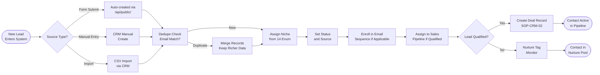

# SOP-CRM-01 — Contact Management

**Owner:** Sales Director / Operations Manager  
**Cadence:** Ongoing — daily hygiene, weekly audit  
**Last updated:** 2026-05-01  
**Related:** [02-deals.md](02-deals.md) · [05-reporting.md](05-reporting.md) · [email-marketing/02-email-send.md](../email-marketing/02-email-send.md)

---

## Overview

This SOP governs the lifecycle of contact records in `crm-vanilla/`: creation, enrichment, segmentation, deduplication, and archival. Contacts live in `webmed6_crm` and are managed via `crm-vanilla/api/handlers/contacts.php`.

**Multi-tenant architecture:** Every contact carries a `user_id`. Handlers filter via `tenancy_where()`. Legacy rows (`user_id IS NULL`) are visible to all tenants — do NOT delete these, they belong to user 1 (Carlos).

**Sources of new contacts:**
1. Audit form submit (`/api/public/audit`) — automatic enrollment
2. Newsletter subscribe (`/api/public/newsletter`)
3. WhatsApp opt-in (`/api/public/whatsapp/subscribe`)
4. Manual CRM entry (sales team)
5. HubSpot sync (if enabled) — NOT the primary CRM, supplementary only

**Success metrics:**
- Duplicate rate: <2% of active contacts
- Profile completeness: ≥80% of contacts have name + email + niche
- Bounce-tagged contacts removed from email sequences: same day
- Contact enrichment (company, website, LinkedIn stub): ≥50% of leads

---

## Workflow



---

## Procedures

### 1. New Contact Record Creation (5 min)

**Required fields for every contact:**
```json
{
  "first_name": "Maria",
  "last_name": "Gonzalez",
  "email": "maria@hotelpacifico.com",
  "phone": "+56912345678",
  "company": "Hotel Pacífico",
  "niche": "tourism",
  "source": "audit_form",
  "status": "lead",
  "subscribed": true
}
```

**Niche enum** — must be one of exactly 14 values:
`tourism`, `restaurants`, `health`, `beauty`, `smb`, `law_firms`, `real_estate`, `local_specialist`, `automotive`, `education`, `events_weddings`, `financial_services`, `home_services`, `wine_agriculture`

**Source enum:** `audit_form`, `newsletter`, `whatsapp_optin`, `referral`, `manual`, `partner`, `hubspot_sync`, `csv_import`

**Status enum:** `lead`, `prospect`, `client`, `churned`, `partner`, `unsubscribed`

---

### 2. Deduplication Check (Before every manual entry)

Before creating a new contact, search for existing records:

```bash
curl -H "X-Auth-Token: <token>" \
  "https://netwebmedia.com/crm-vanilla/api/?r=contacts&search=maria@hotelpacifico.com"
```

If a match exists:
1. Compare record completeness (fields filled)
2. Keep the richer record as primary
3. Merge any unique data from the secondary record into primary
4. Delete or archive the secondary record (do NOT delete if it has associated deals)
5. If the secondary has deals, re-assign deals to the primary contact ID

**Weekly deduplication sweep:**
```sql
-- Find email duplicates
SELECT email, COUNT(*) as cnt
FROM contacts
WHERE email IS NOT NULL
GROUP BY email
HAVING cnt > 1
ORDER BY cnt DESC;
```

---

### 3. Contact Enrichment (10 min per batch)

For leads who submitted the audit form, enrich the record with:
- **Website:** extracted from audit submission, verify it's accessible
- **Company size:** estimated from website analysis (solo, <10, 10–50, 50+)
- **Pain points:** from audit results (speed score, SEO gaps, schema missing)
- **Niche confirmation:** cross-check company type vs. niche enum
- **Language preference:** `es` or `en` based on website language

Update the contact record via CRM or API:
```bash
curl -X PATCH \
  -H "X-Auth-Token: <token>" \
  -H "Content-Type: application/json" \
  "https://netwebmedia.com/crm-vanilla/api/?r=contacts&id=123" \
  -d '{
    "website": "https://hotelpacifico.com",
    "company_size": "<10",
    "language": "es",
    "pain_points": ["slow_speed", "no_schema", "low_seo_score"],
    "notes": "Hotel 4★ in Viña del Mar, Spanish website, PageSpeed 42/100"
  }'
```

---

### 4. Segmentation & Tagging (5 min per contact)

Tags enable workflow triggers and email segmentation. Use standardized tag names:

**Lifecycle tags:** `new_lead`, `audit_completed`, `demo_scheduled`, `proposal_sent`, `client`, `churned`  
**Niche tags:** `niche_tourism`, `niche_health`, `niche_restaurants` (prefix niche_ to avoid collision)  
**Engagement tags:** `email_opener`, `link_clicker`, `bounced_email`, `whatsapp_subscriber`  
**Priority tags:** `hot_lead`, `nurture`, `not_qualified`

Add a tag:
```bash
curl -X POST \
  -H "X-Auth-Token: <token>" \
  -H "Content-Type: application/json" \
  "https://netwebmedia.com/crm-vanilla/api/?r=contacts&id=123&action=tag" \
  -d '{"tag": "audit_completed"}'
```

Adding the `audit_completed` tag automatically triggers the `audit_followup` email sequence if CRM workflow automation is configured (see [SOP-CRM-03](03-workflow-automation.md)).

---

### 5. Email Sequence Enrollment (5 min)

After contact is created and enriched:

**Audit form submitters:**
```php
seq_enroll($email, 'audit_followup', ['first_name' => $first_name, 'company_name' => $company, 'niche' => $niche]);
```

**Newsletter subscribers:**
```php
seq_enroll($email, 'welcome', ['first_name' => $first_name, 'niche' => $niche]);
```

**Manual/sales team:**
- Use CRM contact panel → "Enroll in sequence" button
- Or API: `POST /crm-vanilla/api/?r=contacts&id=123&action=enroll_sequence`

Do NOT enroll if:
- `subscribed = false`
- `email_status = 'bounced'`
- Contact is already enrolled in the same sequence

---

### 6. Weekly Contact Audit (Friday, 30 min)

Run these checks every Friday:

1. **New contacts this week:**
   ```sql
   SELECT source, niche, COUNT(*) as cnt
   FROM contacts
   WHERE created_at > DATE_SUB(NOW(), INTERVAL 7 DAY)
   GROUP BY source, niche;
   ```

2. **Incomplete profiles** (missing niche or email):
   ```sql
   SELECT id, first_name, last_name, source
   FROM contacts
   WHERE (niche IS NULL OR niche = '') OR (email IS NULL OR email = '')
   ORDER BY created_at DESC LIMIT 50;
   ```
   Enrich or remove incomplete records.

3. **Stale leads** (status = 'lead', no activity >30 days):
   ```sql
   SELECT id, first_name, email, created_at
   FROM contacts
   WHERE status = 'lead'
     AND last_activity_at < DATE_SUB(NOW(), INTERVAL 30 DAY)
   ORDER BY last_activity_at ASC LIMIT 20;
   ```
   Move to `nurture` status or mark `not_qualified`.

---

### 7. Contact Archival & Deletion (Monthly)

Contacts may be archived (not deleted) when:
- Status = `churned` AND last activity >180 days
- GDPR/right-to-erasure request received
- Clearly fake submissions (honeypot bypass, test data)

**Archive (soft delete):**
```bash
curl -X PATCH \
  -H "X-Auth-Token: <token>" \
  "https://netwebmedia.com/crm-vanilla/api/?r=contacts&id=123" \
  -d '{"status": "archived", "archived_at": "2026-05-01"}'
```

**Hard delete (GDPR):** Use CRM admin panel only — requires admin session. Never delete programmatically from scripts without explicit authorization.

---

## Technical Details

### Multi-Tenant Isolation

All contact queries in `crm-vanilla/api/handlers/contacts.php` use:
```php
[$tWhere, $tParams] = tenancy_where();
$stmt = $db->prepare("SELECT * FROM contacts WHERE $tWhere AND id = ?");
```

`tenancy_where()` returns either `user_id = ?` (tenant-scoped) or `1=1` (admin session sees all). Do NOT write contact queries that bypass this function.

### Contact Schema (Key Fields)

```sql
contacts (
  id           INT AUTO_INCREMENT,
  user_id      INT NULL,          -- tenant owner; NULL = all tenants see it
  first_name   VARCHAR(100),
  last_name    VARCHAR(100),
  email        VARCHAR(255) UNIQUE,
  phone        VARCHAR(50),
  company      VARCHAR(200),
  niche        VARCHAR(50),       -- one of 14 enum values
  source       VARCHAR(50),
  status       VARCHAR(50),
  subscribed   TINYINT DEFAULT 1,
  email_status VARCHAR(20) DEFAULT 'active',  -- active|bounced|unsubscribed
  tags         JSON,
  notes        TEXT,
  created_at   DATETIME,
  last_activity_at DATETIME
)
```

---

## Troubleshooting

| Issue | Likely cause | Fix |
|---|---|---|
| Contact not visible in CRM | Multi-tenant isolation filtering it out | Check if contact has a different `user_id`; use admin session to find it |
| Duplicate contacts accumulating | Automated form submits not deduplicating | Add email uniqueness check in form handler before insert; use `INSERT IGNORE` or `ON DUPLICATE KEY UPDATE` |
| Niche shows as NULL after import | CSV import missing niche column mapping | Re-import with explicit column mapping, or run SQL UPDATE to assign niche based on company type |
| Email sequence enrollment failing | `subscribed = false` or email already enrolled | Check `subscribed` field, check `email_sequence_queue` for existing pending rows |
| Contact tags not triggering workflow | Tag CRM workflow not configured | See SOP-CRM-03 for workflow setup; verify `tag_added` trigger matches tag name |

---

## Checklists

### New Contact Creation
- [ ] Deduplicate check run before creating
- [ ] Required fields: name, email, niche, source, status
- [ ] Niche is one of the 14 canonical values
- [ ] Email sequence enrolled (if applicable)
- [ ] Tags assigned (lifecycle + niche)

### Weekly Audit (Friday)
- [ ] New contacts this week counted by source and niche
- [ ] Incomplete profiles identified and enriched or removed
- [ ] Stale leads (>30 days no activity) reviewed and actioned
- [ ] Bounced emails cleaned from sequences
- [ ] Deduplication sweep run

---

## Related SOPs
- [02-deals.md](02-deals.md) — Deal pipeline from qualified contacts
- [03-workflow-automation.md](03-workflow-automation.md) — Tag-triggered automation
- [05-reporting.md](05-reporting.md) — Contact funnel metrics
- [email-marketing/02-email-send.md](../email-marketing/02-email-send.md) — Broadcast email to contact segments
