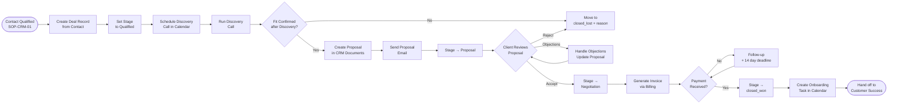

# SOP-CRM-02 — Deal Pipeline Management

**Owner:** Sales Director  
**Cadence:** Daily deal review, weekly pipeline review with Carlos  
**Last updated:** 2026-05-01  
**Related:** [01-contact-management.md](01-contact-management.md) · [03-workflow-automation.md](03-workflow-automation.md) · [05-reporting.md](05-reporting.md)

---

## Overview

This SOP governs the management of deal records in the CRM pipeline: creation from qualified contacts, stage progression, activity logging, forecasting, and closed-won/lost processing.

**Pipeline stages (in order):**
`lead` → `qualified` → `discovery` → `proposal` → `negotiation` → `closed_won` → `closed_lost`

**Deal handler:** `crm-vanilla/api/handlers/deals.php`  
**Stage change events** fire `wf_crm_trigger('deal_stage', ...)` — this may auto-trigger email sequences or team notifications (see [SOP-CRM-03](03-workflow-automation.md)).

**Success metrics:**
- Lead → Qualified conversion: ≥30%
- Qualified → Proposal conversion: ≥60%
- Proposal → Closed Won conversion: ≥40%
- Average deal cycle: <45 days from qualified to closed
- Deal value accuracy: within 10% of final invoice

---

## Workflow



---

## Procedures

### 1. Deal Creation from Qualified Contact (10 min)

When a contact is marked `hot_lead` or `qualified`, create a deal record:

**Required fields:**
```json
{
  "contact_id": 123,
  "name": "Hotel Pacífico — SEO + Schema Package",
  "stage": "qualified",
  "value": 1500,
  "currency": "USD",
  "niche": "tourism",
  "service_type": "seo_package",
  "source": "audit_form",
  "expected_close_date": "2026-06-15",
  "assigned_to": 1
}
```

**Service type enum:** `seo_package`, `web_design`, `content_cluster`, `cmo_package`, `crm_setup`, `social_management`, `custom`

**Value guidelines (2026 pricing):**
| Service | Min | Typical | Max |
|---|---|---|---|
| SEO audit + recommendations | $300 | $500 | $800 |
| SEO package (3-month) | $800 | $1,500 | $3,000 |
| CMO package (monthly retainer) | $1,500 | $2,500 | $5,000 |
| Web design | $1,200 | $2,500 | $8,000 |
| Content cluster (one-time) | $600 | $1,200 | $2,500 |

---

### 2. Discovery Stage — Call Prep & Execution (30 min prep)

Before discovery call:
1. Review contact enrichment data (website, niche, audit results)
2. Pull 3 pain points from audit results or contact notes
3. Prepare 5 discovery questions (not selling questions — understanding questions)
4. Log planned call in CRM calendar (see [SOP-CRM-04](04-tasks-calendar.md))

During discovery call:
1. Take notes directly in CRM deal record → Notes field
2. Confirm: budget range, timeline, decision-maker presence, current solution
3. Score the deal: `hot` / `warm` / `cold` based on BANT criteria:
   - **B**udget: confirmed and appropriate
   - **A**uthority: speaking with decision-maker
   - **N**eed: clear pain point matching our services
   - **T**imeline: <90 days to start

After call:
1. Update deal stage to `discovery` or `closed_lost` depending on outcome
2. Add call notes to deal record
3. Set `next_action` with due date (e.g., "Send proposal by May 5")

---

### 3. Proposal Creation & Send (1–2h)

For deals advancing past discovery:

1. Create proposal document in CRM → Documents (see [SOP-CS-02](../customer-success/renewal-expansion.md) for proposal template)
2. Proposal must include:
   - Problem summary (their pain point in their language)
   - Proposed solution (services + timeline)
   - Deliverables list (specific, measurable)
   - Pricing (line items + total)
   - Next steps (clear CTA: "Sign and return by X date")
3. Update deal stage to `proposal`
4. Send proposal via CRM email (tracked open)
5. Set follow-up task: 3 days after send if no response

**Deal stage change fires `deal_stage` workflow trigger** — this may auto-enroll the contact in a proposal follow-up sequence (check CRM workflow settings).

---

### 4. Negotiation Stage Management (Ongoing)

When client counter-proposes or requests changes:

1. Log every conversation in deal Notes field (date + summary)
2. Update proposal document with revision version (`v2`, `v3`)
3. For significant price changes (>15% reduction), flag to Carlos for approval before responding
4. Set stage to `negotiation` when price/scope is being actively discussed
5. Every negotiation should have a deadline: "This pricing is valid through [date]"

**Never:**
- Reduce price without Carlos approval if reduction >15%
- Agree to scope additions without updating the deal value
- Let a deal sit in `negotiation` >14 days without a check-in

---

### 5. Closed Won Processing (20 min)

When payment confirmed:

1. Update deal stage to `closed_won`
2. Record final deal value (may differ from estimate)
3. Log payment method and invoice number
4. Create onboarding task (see [SOP-CS-04](../customer-success/onboarding.md)):
   - Task: "Send welcome email + kickoff call" due in 24h
   - Task: "Create project workspace" due in 48h
   - Task: "Kickoff call completed" due in 7 days
5. Update contact status to `client`
6. Tag contact with `client` and niche-specific tag
7. Notify Carlos via CRM internal note

---

### 6. Closed Lost Processing (10 min)

When deal is not going forward:

1. Update deal stage to `closed_lost`
2. Record lost reason (mandatory):
   - `budget` — price was too high
   - `competitor` — went with a different agency
   - `timing` — not ready yet
   - `no_need` — problem solved or doesn't exist
   - `no_response` — ghost after proposal
3. For `timing` losses: schedule a 90-day follow-up task
4. For `competitor` losses: note which competitor in deal Notes
5. Do NOT delete closed_lost deals — they inform win/loss analysis

---

### 7. Weekly Pipeline Review (Monday, 30 min)

Review with Carlos every Monday:

**Prepare before meeting:**
```bash
curl -H "X-Auth-Token: <token>" \
  "https://netwebmedia.com/crm-vanilla/api/?r=deals&view=pipeline_summary"
```

Review:
- Deals by stage and total pipeline value
- Deals with overdue `next_action` dates
- Deals stalled in one stage >14 days
- Last week's closed_won and closed_lost with reasons
- This week's proposals scheduled

**Forecast calculation:**
```
Weighted pipeline value = 
  qualified × 0.2 +
  discovery × 0.4 +
  proposal × 0.6 +
  negotiation × 0.8
```

---

## Technical Details

### Deal Stage Change Workflow Trigger

Every PUT on a deal's `stage` field calls:
```php
wf_crm_trigger('deal_stage', ['stage' => $new_stage, 'niche' => $deal->niche], $context, $uid, $orgId);
```

This fires any CRM workflows with `trigger_type = 'deal_stage'` and matching `trigger_filter`. Use this to auto-send proposal emails or notify team on stage changes.

### Deal Schema (Key Fields)

```sql
deals (
  id                 INT AUTO_INCREMENT,
  contact_id         INT NOT NULL,
  user_id            INT NULL,
  name               VARCHAR(255),
  stage              VARCHAR(50),   -- lead|qualified|discovery|proposal|negotiation|closed_won|closed_lost
  value              DECIMAL(10,2),
  currency           VARCHAR(3) DEFAULT 'USD',
  niche              VARCHAR(50),
  service_type       VARCHAR(50),
  source             VARCHAR(50),
  expected_close_date DATE,
  actual_close_date  DATE,
  lost_reason        VARCHAR(50),
  assigned_to        INT,
  notes              TEXT,
  next_action        VARCHAR(255),
  next_action_due    DATE,
  created_at         DATETIME,
  updated_at         DATETIME
)
```

---

## Troubleshooting

| Issue | Likely cause | Fix |
|---|---|---|
| Deal not visible to sales team | `user_id` scoped to different tenant | Use admin session to find deal, re-assign to correct tenant |
| Stage change not triggering workflow | Workflow not configured for this stage | Check CRM Automation → workflow trigger filter matches stage name exactly |
| Deal value shows $0 | Value not set during creation | PATCH deal with correct value immediately |
| Multiple deals for same contact | Duplicate contact records | Merge contacts first (SOP-CRM-01), then re-assign deals |
| Proposal email not tracking opens | Email sent outside CRM (direct email app) | Send proposals through CRM email for tracking |

---

## Checklists

### Deal Creation
- [ ] Contact is marked qualified or hot_lead
- [ ] Deal record created with all required fields
- [ ] Niche confirmed (one of 14 values)
- [ ] Expected close date set
- [ ] Discovery call scheduled in CRM calendar

### Weekly Pipeline Review (Monday prep)
- [ ] Pipeline summary pulled from CRM API
- [ ] Overdue next_action items listed
- [ ] Stalled deals (>14 days in stage) identified
- [ ] Weighted forecast calculated
- [ ] Previous week's closed deals documented with reasons

### Closed Won
- [ ] Stage updated to closed_won
- [ ] Final deal value recorded
- [ ] Payment method and invoice logged
- [ ] Onboarding tasks created
- [ ] Contact status updated to 'client'
- [ ] Carlos notified

---

## Related SOPs
- [01-contact-management.md](01-contact-management.md) — Contact lifecycle before deal creation
- [03-workflow-automation.md](03-workflow-automation.md) — Deal stage triggers and auto-sequences
- [04-tasks-calendar.md](04-tasks-calendar.md) — Scheduling discovery and follow-up tasks
- [05-reporting.md](05-reporting.md) — Pipeline metrics and win/loss analysis
- [customer-success/04-onboarding.md](../customer-success/04-onboarding.md) — Post closed-won handoff
