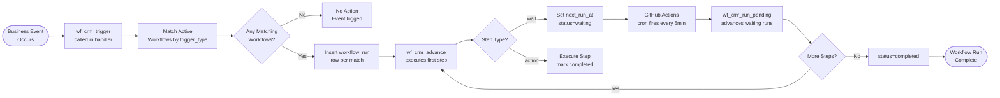

# SOP-CRM-03 — CRM Workflow Automation

**Owner:** Engineering Lead / Operations Manager  
**Cadence:** Per workflow creation; weekly monitoring  
**Last updated:** 2026-05-01  
**Related:** [01-contact-management.md](01-contact-management.md) · [02-deals.md](02-deals.md) · [04-tasks-calendar.md](04-tasks-calendar.md)

---

## Overview

This SOP governs creation, management, and monitoring of CRM workflow automations using the visual workflow builder (`crm-vanilla/js/automation.js`) and the underlying CRM workflow engine (`crm-vanilla/api/lib/wf_crm.php`).

**Architecture reminder:**
- `crm-vanilla/api/lib/wf_crm.php` → operates in `webmed6_crm` → CRM automation (this SOP)
- `api-php/lib/email-sequences.php` → operates in `webmed6_nwm` → public website drip sequences (SOP-EM-01)

These are entirely separate systems. Do NOT mix them.

**Workflow tables:**
- `workflows` — visual builder workflow definitions
- `workflow_runs` — execution queue (pending/running/waiting/completed/failed)

**Cron:** GitHub Actions `cron-workflows.yml` runs every 5 minutes — this advances waiting workflow runs. No manual cron setup needed.

**Success metrics:**
- Workflow execution success rate: ≥98%
- Failed runs resolved within 24h
- Cron heartbeat verified weekly
- Workflow coverage: all 5 key business events have automation

---

## Workflow



---

## Procedures

### 1. Workflow Design (Before Building)

Define the workflow in plain language before touching the builder:

**Required decisions:**
- **Trigger:** What event starts this workflow? (See trigger types below)
- **Filter:** What conditions narrow the trigger? (e.g., only `niche = 'tourism'`)
- **Steps:** What actions happen? (email, tag, move stage, wait, notify, if/else)
- **Exit:** What stops the workflow? (completion or manual cancel)

**Available trigger types:**
| Trigger | Fires when |
|---|---|
| `contact_created` | New contact added to CRM |
| `deal_stage` | Deal stage changes (filter by new stage) |
| `tag_added` | Specific tag added to contact |
| `tag_removed` | Tag removed from contact |
| `manual` | Admin manually fires via "Run Now" button |

**Available step types:**
`send_email`, `wait` (N days), `tag` / `untag`, `update_field`, `move_stage`, `create_task`, `webhook`, `send_whatsapp`, `if` (conditional), `notify_team`, `log`

---

### 2. Building a Workflow in the Visual Builder (30 min)

1. Navigate to `netwebmedia.com/crm-vanilla/` → Automation → Workflows
2. Click "New Workflow"
3. Set:
   - **Name:** descriptive (e.g., "Audit Lead → Follow-up Sequence")
   - **Trigger type:** select from dropdown
   - **Trigger filter:** JSON object narrowing the trigger (optional)
4. Add steps using the visual builder drag-and-drop interface
5. For `send_email` steps: select from existing CRM email templates
6. For `wait` steps: set delay in days
7. For `if` steps: set condition (field comparison, tag presence, etc.)
8. Save as draft → test with "Run Now" on a test contact → activate

**Example workflow definition (audit follow-up):**
```json
{
  "name": "Audit Lead → 3-Touch Follow-up",
  "trigger_type": "tag_added",
  "trigger_filter": {"tag": "audit_completed"},
  "steps": [
    {"type": "send_email", "template_id": 5, "delay_days": 0},
    {"type": "wait", "days": 2},
    {"type": "send_email", "template_id": 6, "delay_days": 0},
    {"type": "wait", "days": 3},
    {"type": "if",
     "condition": {"field": "stage", "operator": "!=", "value": "qualified"},
     "then": [{"type": "send_email", "template_id": 7}],
     "else": [{"type": "notify_team", "message": "Lead qualified — no further follow-up needed"}]
    }
  ],
  "status": "active"
}
```

---

### 3. Testing Workflows Before Activation

**Always test before activating a new workflow:**

1. Set workflow status to `draft` (not `active`)
2. Use "Run Now" (manual trigger) on a test contact:
   ```bash
   curl -X POST \
     -H "X-Auth-Token: <token>" \
     "https://netwebmedia.com/crm-vanilla/api/?r=workflows&id=N&action=run_now" \
     -d '{"context": {"contact_id": 999, "stage": "qualified"}}'
   ```
3. Check `workflow_runs` table for the test run:
   ```sql
   SELECT id, status, step_index, context_json, error
   FROM workflow_runs
   WHERE workflow_id = N
   ORDER BY created_at DESC
   LIMIT 5;
   ```
4. Verify each step executed correctly (check emails sent, tags added, etc.)
5. If passing: update workflow `status = 'active'`

---

### 4. Weekly Monitoring (Monday, 15 min)

Check workflow health weekly:

```sql
-- Execution summary for last 7 days
SELECT w.name, wr.status, COUNT(*) as cnt
FROM workflow_runs wr
JOIN workflows w ON w.id = wr.workflow_id
WHERE wr.created_at > DATE_SUB(NOW(), INTERVAL 7 DAY)
GROUP BY w.name, wr.status
ORDER BY w.name, wr.status;
```

**Healthy state:** High `completed` count, near-zero `failed`.

```sql
-- Failed runs details
SELECT wr.id, w.name, wr.error, wr.context_json, wr.created_at
FROM workflow_runs wr
JOIN workflows w ON w.id = wr.workflow_id
WHERE wr.status = 'failed'
  AND wr.created_at > DATE_SUB(NOW(), INTERVAL 7 DAY)
ORDER BY wr.created_at DESC;
```

For each failed run: read the `error` field, identify the failing step, fix the workflow definition, and optionally re-queue the run manually.

---

### 5. Cron Heartbeat Verification (Weekly)

The GitHub Actions cron is the only scheduler for CRM workflows:

1. Navigate to repo → Actions → `cron-workflows.yml`
2. Click the most recent run
3. Verify: last run <10 min ago, status = success
4. Check the log for the cron POST response: expect `{"ran": N, "skipped": M, "errors": []}`

If the cron is failing:
1. Check GitHub Actions logs for error message
2. Verify `MIGRATE_TOKEN` secret is set (Settings → Secrets → Actions)
3. Verify endpoint is reachable: `curl -H "..." https://netwebmedia.com/crm-vanilla/api/?r=cron_workflows&token=<MIGRATE_TOKEN>`
4. Check mod_security headers (User-Agent + Origin + Referer required — see CLAUDE.md)

---

### 6. Common Workflows to Maintain (Reference)

These workflows should always be active:

| Workflow | Trigger | Purpose |
|---|---|---|
| Audit Lead Follow-up | `tag_added: audit_completed` | 3-touch email sequence post-audit |
| Deal Stage: Proposal Sent | `deal_stage: proposal` | Notify team + start proposal follow-up |
| New Client Welcome | `deal_stage: closed_won` | Trigger onboarding tasks |
| Churned Client Win-Back | `tag_added: churned` | 60-day win-back sequence |
| Hot Lead Alert | `tag_added: hot_lead` | Notify Carlos immediately |

---

### 7. Workflow Deactivation & Archival

When a workflow is no longer needed:

1. Set `status = 'inactive'` (do NOT delete — historical runs reference it)
2. Cancel any pending runs:
   ```sql
   UPDATE workflow_runs
   SET status = 'cancelled'
   WHERE workflow_id = N
     AND status IN ('pending', 'waiting');
   ```
3. Add a note in workflow description: "Archived YYYY-MM-DD — reason"

---

## Technical Details

### wf_crm_trigger() Signature

```php
wf_crm_trigger(
    string $type,    // trigger_type enum
    array  $match,   // filter fields to match against trigger_filter
    array  $ctx,     // context passed to workflow run
    int    $uid,     // user_id
    int    $orgId    // organization_id
): int               // number of workflow runs created
```

Called from CRM event handlers:
- `contacts.php` POST → `wf_crm_trigger('contact_created', ...)`
- `deals.php` PUT → `wf_crm_trigger('deal_stage', ['stage' => $new_stage], ...)`
- Tag step in workflow → `wf_crm_trigger('tag_added', ['tag' => $tag_name], ...)`

### Mirror Backfill (Admin)

If the UI workflow list seems out of sync with the execution engine:
```bash
curl -X POST \
  -H "X-Auth-Token: <admin_token>" \
  "https://netwebmedia.com/crm-vanilla/api/?r=workflows&action=backfill_engine_mirror"
```
Idempotent — safe to run anytime. Does NOT affect execution.

---

## Troubleshooting

| Issue | Likely cause | Fix |
|---|---|---|
| Workflow not triggering | Trigger type mismatch or workflow inactive | Check `trigger_type` matches exactly, verify `status = 'active'` |
| Run stuck in 'waiting' | GitHub Actions cron not running | Check GitHub Actions schedule, manually trigger cron workflow |
| `send_email` step failing | Template ID doesn't exist or email not configured | Verify template_id in `email_templates` table, check Resend API key |
| Infinite loop in workflow | If/else condition always true, re-triggering | Add a tag check as guard condition, test with dry-run first |
| `notify_team` step not sending | Notification channel not configured | Check CRM notification settings, verify Slack or email channel |
| Workflow runs showing for wrong tenant | Missing tenancy_where in query | Report as bug in contacts.php or deals.php handler |

---

## Checklists

### New Workflow Creation
- [ ] Workflow designed in plain language (trigger, steps, exit)
- [ ] Visual builder used to create workflow definition
- [ ] Status set to `draft` before testing
- [ ] Test run executed on test contact
- [ ] `workflow_runs` table checked for successful test execution
- [ ] Activated (`status = 'active'`) after successful test

### Weekly Monitoring (Monday)
- [ ] Workflow execution summary pulled
- [ ] Failed runs reviewed and root causes identified
- [ ] GitHub Actions cron last run verified (<10 min ago)
- [ ] Pending runs for deactivated workflows cancelled

---

## Related SOPs
- [01-contact-management.md](01-contact-management.md) — Tags that trigger workflows
- [02-deals.md](02-deals.md) — Deal stage changes that trigger workflows
- [04-tasks-calendar.md](04-tasks-calendar.md) — Tasks created by workflow `create_task` steps
- [email-marketing/01-sequence-setup.md](../email-marketing/01-sequence-setup.md) — api-php sequences (separate engine)
- [operations-admin/monitoring.md](../operations-admin/monitoring.md) — GitHub Actions cron monitoring
