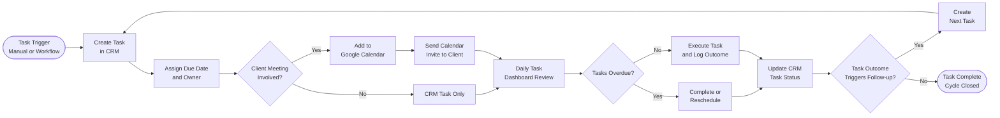

# SOP-CRM-04 — Tasks & Calendar Management

**Owner:** Operations Manager / Sales Director  
**Cadence:** Daily task review; weekly calendar audit  
**Last updated:** 2026-05-01  
**Related:** [02-deals.md](02-deals.md) · [03-workflow-automation.md](03-workflow-automation.md) · [customer-success/04-onboarding.md](../customer-success/04-onboarding.md)

---

## Overview

This SOP governs task creation, assignment, completion tracking, and calendar synchronization for NetWebMedia's CRM-based operations. Tasks are the primary mechanism for tracking follow-ups, deadlines, and project milestones.

**Dual calendar system:**
1. **CRM tasks** — stored in `webmed6_crm`, visible in CRM calendar view
2. **Google Calendar** — `carlos@netwebmedia.com`, timezone `America/Santiago` — external scheduling, client calls, and strategic events

**Rule:** When a date changes in any CRM task or plan document, also sync Google Calendar. Tasks follow "NWM - Area - Task" naming convention in Google Calendar.

**Success metrics:**
- Overdue tasks: zero (all tasks have a due date, all past-due tasks are either completed or rescheduled)
- Task completion rate: ≥90% on-time
- Calendar sync accuracy: 100% of client calls appear in both CRM and Google Calendar

---

## Workflow



---

## Procedures

### 1. Task Creation Standards (5 min per task)

Every task must have:
```json
{
  "title": "Send proposal to Hotel Pacífico",
  "description": "Follow up on discovery call. Send v2 proposal with updated timeline.",
  "deal_id": 42,
  "contact_id": 123,
  "assigned_to": 1,
  "due_date": "2026-05-05",
  "priority": "high",
  "status": "pending",
  "type": "follow_up"
}
```

**Task type enum:** `follow_up`, `call`, `email`, `proposal`, `onboarding`, `review`, `internal`, `admin`

**Priority enum:** `low`, `medium`, `high`, `urgent`

**Title format:** Start with a verb — "Send", "Call", "Review", "Create", "Schedule", "Confirm"

---

### 2. Daily Task Dashboard Review (Every morning, 10 min)

Start each working day with a task review:

1. Open CRM → Calendar / Tasks view
2. Filter: `due_date <= today AND status = 'pending'`
3. Review each overdue or due-today task:
   - **Can it be done today?** → work on it, mark completed when done
   - **Does it need a date change?** → reschedule with reason in task notes
   - **Is it blocked?** → add "BLOCKED: [reason]" note, flag to Carlos if urgent

4. Review this week's upcoming tasks (due in next 7 days) — anticipate workload

**API for daily task list:**
```bash
curl -H "X-Auth-Token: <token>" \
  "https://netwebmedia.com/crm-vanilla/api/?r=tasks&due_by=$(date +%Y-%m-%d)&status=pending"
```

---

### 3. Google Calendar Sync Protocol

Client-facing events must appear in Google Calendar:

**When to add to Google Calendar:**
- Any call or meeting with a client or prospect
- Proposal submission deadlines
- Project kickoff dates
- Quarterly business reviews (QBRs)
- Payment due dates

**Naming convention:** `NWM - [Area] - [Description]`

Examples:
- `NWM - Sales - Discovery Call: Hotel Pacífico`
- `NWM - Client - QBR: Restaurante La Mar`
- `NWM - Ops - Deploy: Schema update`
- `NWM - Content - Blog Publish: Tourism SEO guide`

**Calendar color coding (Google Calendar):**
| Color | Area |
|---|---|
| Blue | Sales / Prospecting |
| Green | Client / Customer Success |
| Orange | Content / Marketing |
| Red | Deadlines / Critical |
| Grey | Internal / Admin |

**Rule:** If you change a date in any SOP, plan doc, or CRM record, check if a Google Calendar event needs updating and update it immediately.

---

### 4. Creating Recurring Tasks for Operational Cadences

The following recurring tasks must always exist in the CRM task system:

| Task | Frequency | Owner |
|---|---|---|
| Weekly pipeline review with Carlos | Every Monday 9AM | Sales Director |
| Email queue health check | Every Monday | Ops Manager |
| Blog publication check | Every Tuesday (post-publish week) | Content Strategist |
| Social media performance review | Every Friday | Content Strategist |
| Monthly sequence audit | First Monday of month | Content Strategist |
| Quarterly content planning | Start of each quarter | Content Strategist + CMO |
| Monthly client QBR prep | Last week of each month | Customer Success |

Create these as recurring tasks in CRM (or add to Google Calendar as recurring events if CRM doesn't support recurrence).

---

### 5. Task Completion & Outcome Logging (5 min per task)

When completing a task:

1. Update `status = 'completed'`, `completed_at = NOW()`
2. Add outcome note:
   - "Call connected — client interested in SEO package, sending proposal by May 5"
   - "Proposal sent via CRM email — waiting for response"
   - "No response after 3 follow-ups — moving to nurture"
3. If outcome requires a next step: create the follow-up task immediately (don't rely on memory)
4. If outcome changes deal stage: update deal record (see SOP-CRM-02)

---

### 6. Workflow-Created Tasks

CRM workflows can auto-create tasks via `create_task` step. When you see CRM-auto-created tasks:

- They will appear in the task list with `source = 'workflow'` or `source = 'automation'`
- They are legitimate tasks requiring human action — don't delete them
- If a workflow is creating too many tasks (noise), review the workflow trigger filter

**Common auto-created tasks:**
- "Follow up: [contact] received proposal" (created by deal_stage workflow)
- "Schedule kickoff call: [client]" (created by closed_won workflow)
- "QBR prep: [client] — 30 days" (created by 90-day-post-close workflow)

---

### 7. Weekly Calendar Audit (Friday, 20 min)

Every Friday, review the week's completed and upcoming tasks:

1. Confirm all tasks due this week are either `completed` or rescheduled (no unexplained overdue tasks)
2. Review next week's calendar:
   - Client calls confirmed with Google Calendar invites
   - Deadlines clearly marked
   - No conflicts or double-bookings
3. Sync any task date changes to Google Calendar
4. Flag any tasks that have been rescheduled 3+ times to Carlos — these may need escalation or a decision to close

---

## Technical Details

### Task Schema (Key Fields)

```sql
tasks (
  id           INT AUTO_INCREMENT,
  title        VARCHAR(255),
  description  TEXT,
  deal_id      INT NULL,
  contact_id   INT NULL,
  assigned_to  INT,
  user_id      INT NULL,
  due_date     DATE,
  completed_at DATETIME NULL,
  status       ENUM('pending','in_progress','completed','cancelled'),
  priority     ENUM('low','medium','high','urgent'),
  type         VARCHAR(50),
  source       VARCHAR(50) DEFAULT 'manual',
  notes        TEXT,
  created_at   DATETIME
)
```

### CRM Calendar View

The CRM calendar view (`crm-vanilla/js/calendar.js`) displays tasks filtered by due_date. Uses `tenancy_where()` for multi-tenant isolation. All dates stored in ISO 8601 format in the database.

---

## Troubleshooting

| Issue | Likely cause | Fix |
|---|---|---|
| Tasks not showing in calendar view | `due_date` stored as string, not DATE | Verify date format on creation — must be `YYYY-MM-DD` |
| Workflow tasks not appearing | Workflow `create_task` step has wrong `assigned_to` | Edit workflow step to assign to correct user_id |
| Google Calendar and CRM out of sync | Date changed in one system but not the other | Run weekly calendar audit, update both systems |
| Overdue task count growing | Tasks being created without follow-through | Daily task review discipline required — assign specific person to each task |
| Can't find task for specific deal | Multi-tenant filtering | Check with admin session whether task exists under different user_id |

---

## Checklists

### Daily Task Review (Every morning)
- [ ] CRM task dashboard opened
- [ ] Overdue tasks reviewed — all completed or rescheduled with reason
- [ ] Due-today tasks confirmed and prioritized
- [ ] Next 7 days reviewed for workload anticipation

### New Task Creation
- [ ] Title starts with action verb
- [ ] Due date set (no tasks without due dates)
- [ ] Assigned to specific person
- [ ] Linked to deal and/or contact where applicable
- [ ] If client meeting: added to Google Calendar with NWM naming convention

### Weekly Calendar Audit (Friday)
- [ ] All due-this-week tasks completed or rescheduled
- [ ] Next week calendar reviewed — calls confirmed, no conflicts
- [ ] Google Calendar in sync with CRM dates
- [ ] Tasks rescheduled 3+ times flagged to Carlos

---

## Related SOPs
- [02-deals.md](02-deals.md) — Tasks created at deal stage transitions
- [03-workflow-automation.md](03-workflow-automation.md) — Auto-created tasks from CRM workflows
- [customer-success/04-onboarding.md](../customer-success/04-onboarding.md) — Onboarding tasks post-closed-won
- [operations-admin/monitoring.md](../operations-admin/monitoring.md) — Recurring ops monitoring tasks
