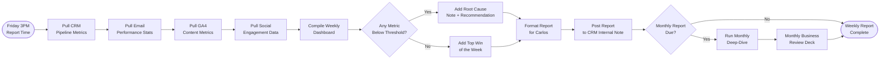

# SOP-CRM-05 — CRM Reporting & Analytics

**Owner:** Data Analyst / Operations Manager  
**Cadence:** Weekly (Friday) + Monthly (first Monday) + Quarterly  
**Last updated:** 2026-05-01  
**Related:** [01-contact-management.md](01-contact-management.md) · [02-deals.md](02-deals.md) · [customer-success/01-qbr.md](../customer-success/01-qbr.md)

---

## Overview

This SOP governs generation of CRM performance reports: contact funnel metrics, pipeline health, email performance, content analytics, and the consolidated weekly dashboard for Carlos.

**Data sources:**
- CRM API (`webmed6_crm`) — contacts, deals, tasks, workflows, email campaigns
- GA4 — website traffic, conversions, content performance
- Search Console — SEO impressions, CTR, indexing
- Resend — email delivery stats
- Instagram Insights — social performance

**Reports produced:**
1. Weekly Dashboard (Friday, Carlos + team)
2. Monthly Business Review (first Monday — Carlos only)
3. Quarterly Planning Report (start of Q2/Q3/Q4 — feeds into content planning SOP)

**Success metrics:**
- Report delivered on time: 100%
- Data accuracy: all figures sourced from live API (no manual spreadsheet estimates)
- Actionable insights: ≥3 recommendations per weekly report

---

## Workflow



---

## Procedures

### 1. Weekly Dashboard Compilation (Friday 3PM, 45 min)

**Section 1: Pipeline Health**
```bash
# Pipeline by stage
curl -H "X-Auth-Token: <token>" \
  "https://netwebmedia.com/crm-vanilla/api/?r=deals&view=pipeline_summary"

# New contacts this week
curl -H "X-Auth-Token: <token>" \
  "https://netwebmedia.com/crm-vanilla/api/?r=contacts&created_after=$(date -d '7 days ago' +%Y-%m-%d)&count=1"
```

Key metrics to capture:
- Total pipeline value (weighted forecast)
- New contacts this week (by source + niche)
- Deals moved to `closed_won` this week
- Deals moved to `closed_lost` this week (with reasons)
- Deals stalled >14 days (flag for follow-up)

**Section 2: Email Performance**
```bash
# Last 7-day email stats
curl -H "X-Auth-Token: <token>" \
  "https://netwebmedia.com/crm-vanilla/api/?r=campaigns&view=weekly_stats&days=7"
```

Key metrics: sends, open rate, CTR, unsubscribes, bounces

**Section 3: Content & SEO**
Pull from GA4 (manually or via GA4 API):
- Top 5 blog posts by sessions (last 7 days)
- Blog posts published this week
- New organic sessions vs. previous week

**Section 4: Social**
Pull from Instagram Insights:
- Reach, impressions, profile visits, website taps this week
- Best-performing carousel post

**Section 5: Actions Required**
Always end with 3 bullet recommendations — things that need Carlos's attention or decision.

---

### 2. Weekly Report Format

Template for the CRM internal note or email to Carlos:

```markdown
# NWM Weekly Report — [Date]

## Pipeline
- Total weighted pipeline: $X,XXX
- New contacts: XX (top source: audit_form, top niche: tourism)
- Closed Won: X deals ($X,XXX)
- Closed Lost: X deals (reasons: budget X, timing X)
- ⚠️ Stalled: X deals >14 days — [deal names]

## Email
- Sent: XXX | Open rate: XX% | CTR: X.X%
- Flags: [any open rate <15% or bounce spike]

## Content
- Blog published: [post title] (X organic sessions in 48h)
- Top post this week: [title] (XXX sessions)
- Search Console: [trend note]

## Social
- Instagram reach: X,XXX (carousel: [title])
- Engagement rate: X.X%

## Actions Required
1. [Specific action + deadline]
2. [Specific action + deadline]
3. [Specific action + deadline]
```

---

### 3. Monthly Business Review (First Monday, 2h)

The monthly report is deeper and is presented to Carlos directly:

**Funnel analysis:**
```sql
-- Monthly lead-to-client conversion
SELECT 
  DATE_FORMAT(created_at, '%Y-%m') as month,
  COUNT(*) as new_leads,
  SUM(status='client') as clients_acquired
FROM contacts
WHERE created_at > DATE_SUB(NOW(), INTERVAL 3 MONTH)
GROUP BY month;
```

**Revenue recognition:**
```sql
-- Monthly closed-won value
SELECT 
  DATE_FORMAT(actual_close_date, '%Y-%m') as month,
  COUNT(*) as deals,
  SUM(value) as revenue
FROM deals
WHERE stage = 'closed_won'
  AND actual_close_date > DATE_SUB(NOW(), INTERVAL 3 MONTH)
GROUP BY month;
```

**Niche performance:**
```sql
-- Which niches are converting?
SELECT niche, COUNT(*) as leads, SUM(stage='closed_won') as won
FROM deals
WHERE created_at > DATE_SUB(NOW(), INTERVAL 30 DAY)
GROUP BY niche
ORDER BY won DESC;
```

**Key metrics for monthly review:**
- MRR (monthly recurring revenue from retainer clients)
- One-time project revenue
- Lead-to-client conversion rate
- Average deal size
- Top niche by revenue
- Churn (clients lost this month)
- Net Revenue Retention (NRR)

---

### 4. Content Performance Report (Monthly, included in business review)

Pull from GA4 and Search Console:

**Blog performance (last 30 days):**
- Total organic sessions
- Top 5 posts by sessions
- Posts with high bounce rate (>70%) — flag for optimization
- Posts with declining traffic (vs. prior 30 days)

**AEO signal tracking:**
- Which blog posts are getting AI citations? (Track via branded searches in Search Console)
- Featured snippets won/lost
- FAQ rich results appearing in SERP

**Content gap analysis:**
- Which of the 14 niches have <2 blog posts?
- Which posts are >12 months old and need a refresh?

---

### 5. Quarterly Planning Report (Start of Q, 3h)

Feeds directly into SOP-MC-01 (Content Planning). This report should answer:

1. **What worked last quarter?** — Top performing content cluster by organic traffic + conversions
2. **What didn't?** — Lowest performing clusters, highest bounce rates
3. **Pipeline health by niche** — Which niches had most deals created?
4. **Email health** — Which sequences have degrading open rates?
5. **Social health** — Which carousel formats got highest engagement?
6. **Recommendations for next quarter:**
   - 3 priority niches for content clusters
   - 2 email sequences to rebuild
   - 1 social format to double down on

---

### 6. Report Delivery & Storage

**Weekly report:** Post as CRM internal note tagged `weekly_report` + send to Carlos via CRM email or Slack DM (per Carlos's preference).

**Monthly report:** Create a document in CRM Documents folder: `Reports/2026/Monthly-YYYY-MM.md`

**Quarterly report:** Stored as `plans/reports/Q<N>-<YEAR>-retrospective.html` — following the plans/ pattern for strategic docs.

---

## Technical Details

### GA4 API Queries (Reference)

For automated report generation, use GA4 Data API v1:
```bash
# Top pages last 7 days
curl "https://analyticsdata.googleapis.com/v1beta/properties/<GA4_PROPERTY_ID>:runReport" \
  -H "Authorization: Bearer <token>" \
  -d '{
    "dateRanges": [{"startDate": "7daysAgo", "endDate": "today"}],
    "dimensions": [{"name": "pagePath"}],
    "metrics": [{"name": "sessions"}, {"name": "bounceRate"}],
    "orderBys": [{"metric": {"metricName": "sessions"}, "desc": true}],
    "limit": 10
  }'
```

### CRM API Endpoints for Reporting

```bash
GET /crm-vanilla/api/?r=deals&view=pipeline_summary       # Stage counts + values
GET /crm-vanilla/api/?r=contacts&view=weekly_acquisition  # New contacts by source/niche
GET /crm-vanilla/api/?r=campaigns&view=weekly_stats       # Email metrics
GET /crm-vanilla/api/?r=workflows&view=execution_summary  # Workflow health
```

---

## Troubleshooting

| Issue | Likely cause | Fix |
|---|---|---|
| Pipeline value looks wrong | Deals missing value field | Query for `value IS NULL` deals, manually enrich |
| Email stats not matching Resend | CRM campaign stats not synced from Resend webhook | Check Resend webhook integration in CRM campaigns handler |
| GA4 data lag | GA4 has 24–48h reporting delay for some metrics | For same-day data, use Real-Time API; for historical use standard Data API |
| Monthly report calculation errors | SQL date range errors (timezone) | Use `DATE_SUB(NOW(), INTERVAL 30 DAY)` explicitly, not month name |
| Contacts counted twice in funnel | Duplicate contacts not cleaned | Run deduplication (SOP-CRM-01) before pulling funnel metrics |

---

## Checklists

### Weekly Report (Friday)
- [ ] Pipeline metrics pulled (contacts, deals, pipeline value)
- [ ] Email performance stats pulled
- [ ] GA4 content metrics pulled (top posts, organic sessions)
- [ ] Social engagement data pulled
- [ ] Weekly dashboard compiled using template
- [ ] 3 action items identified for Carlos
- [ ] Report posted to CRM internal notes

### Monthly Report (First Monday)
- [ ] Funnel analysis query run
- [ ] Revenue recognition calculated
- [ ] Niche performance breakdown included
- [ ] MRR and NRR calculated
- [ ] Content performance (GA4 + Search Console) included
- [ ] Report saved to CRM Documents/Reports/2026/

---

## Related SOPs
- [01-contact-management.md](01-contact-management.md) — Contact data accuracy for reports
- [02-deals.md](02-deals.md) — Deal data accuracy for pipeline reports
- [customer-success/01-qbr.md](../customer-success/01-qbr.md) — QBR preparation uses these reports
- [marketing-content/01-content-planning.md](../marketing-content/01-content-planning.md) — Quarterly report feeds next quarter's content planning
