# SOP-CS-01 — Quarterly Business Review (QBR)

**Owner:** Customer Success Manager  
**Cadence:** Quarterly (Q1: April, Q2: July, Q3: October, Q4: January)  
**Last updated:** 2026-05-01  
**Related:** [02-renewal-expansion.md](02-renewal-expansion.md) · [crm-operations/05-reporting.md](../crm-operations/05-reporting.md) · [crm-operations/01-contact-management.md](../crm-operations/01-contact-management.md)

---

## Overview

This SOP governs preparation, execution, and follow-up for Quarterly Business Reviews with NetWebMedia retainer clients. QBRs are the primary retention and expansion touchpoint for clients on monthly packages.

**QBR format:** 45–60 min video call with client decision-maker(s). Structured review of results, obstacles, and next quarter goals.

**Eligibility:** All retainer clients (CMO package, SEO retainer, social management) on 3+ month engagement. One-time project clients are not eligible for QBR.

**Success metrics:**
- QBR completion rate: ≥90% of eligible clients per quarter
- Net Promoter Score collected: 100% of QBR clients
- Renewal rate for QBR clients: ≥85%
- Expansion revenue from QBR upsells: ≥20% of QBR clients add a service

---

## Workflow

```mermaid
graph LR
    A([30 Days Before\nQuarter End]) --> B[Identify Eligible\nRetainer Clients]
    B --> C[Pull Performance\nData from CRM + GA4]
    C --> D[Prepare QBR\nDeck per Client]
    D --> E[Schedule QBR Call\nvia Google Calendar]
    E --> F[Send Pre-Call\nBrief to Client]
    F --> G[Conduct QBR\nCall]
    G --> H[Collect NPS\nScore]
    H --> I[Log Outcomes\nin CRM]
    I --> J{Expansion\nOpportunity?}
    J -- Yes --> K[Create Deal\nRecord SOP-CRM-02]
    J -- No --> L{Renewal\nRisk?}
    K --> L
    L -- Yes --> M[Escalate to\nCarlos Immediately]
    L -- No --> N[Send Follow-Up\nEmail Summary]
    M --> N
    N --> O([QBR Complete\nSchedule Next Quarter])
```



---

## Procedures

### 1. Eligible Client Identification (30 days before quarter end)

Pull the list of retainer clients due for a QBR:

```bash
curl -H "X-Auth-Token: <token>" \
  "https://netwebmedia.com/crm-vanilla/api/?r=contacts&status=client&service_type=retainer"
```

Eligibility criteria:
- Contract start date >3 months ago
- Status: `client` (not `churned`)
- Service type: CMO package, SEO retainer, or social management (not one-time project)
- Last QBR: >3 months ago (or never had one)

Create a task in CRM for each eligible client: "Schedule Q2 QBR: [Client Name]" due in 2 weeks.

---

### 2. Performance Data Preparation (2h per client)

For each QBR client, pull their performance data from the last 90 days:

**Website performance (GA4):**
- Organic sessions: last 90 days vs. previous 90 days
- Top 5 landing pages by session
- Conversion events (contact form, audit submit)
- Bounce rate trend

**SEO performance (Search Console):**
- Impressions and CTR trends
- Top keywords by impressions
- New keywords entering top 10
- Core Web Vitals status

**Content performance (if on content package):**
- Blog posts published this quarter
- Blog-driven organic sessions
- Social reach and engagement

**Business outcomes (CRM):**
- Leads attributed to their digital presence
- Any deals closed or in pipeline

Compile all data into the QBR deck template (Google Slides or CRM Documents).

---

### 3. QBR Deck Structure (1h per client)

Standard deck structure (8–12 slides):

1. **Cover:** Client name, quarter, "Powered by NetWebMedia"
2. **Executive Summary:** 3 wins + 1 challenge (30-second summary)
3. **Goal Review:** What we committed to last quarter → what we delivered
4. **Traffic & Visibility:** Organic sessions, impressions, CTR charts
5. **Content Performance:** Posts published, top posts, engagement
6. **Lead Generation:** Form submissions, audit requests, conversions
7. **Technical Health:** Core Web Vitals, schema coverage, mobile score
8. **Wins & Highlights:** Specific achievement that matters to this client
9. **Challenges:** Honest assessment of what didn't work and why
10. **Next Quarter Plan:** 3 specific goals with measurable targets
11. **Recommendations / Expansion:** New service that would address a current gap
12. **Investment Summary:** What they're paying → ROI demonstration

---

### 4. Pre-Call Scheduling & Brief (1 week before)

1. Schedule via Google Calendar:
   - Event title: `NWM - Client - QBR: [Client Name] Q[N] 2026`
   - Duration: 60 minutes
   - Color: Green (Client)
   - Include video link (Google Meet or Zoom)
   - Invite client decision-maker(s)

2. Send pre-call brief email 3 days before:
   ```
   Subject: Your Q2 2026 Business Review — [Client Company]

   Hi [First Name],

   Looking forward to our review on [Date] at [Time].

   Here's what we'll cover:
   - Q2 results: traffic, leads, and key wins
   - What's working and what we're adjusting
   - Q3 priorities

   Nothing to prepare — I'll have everything ready.

   See you then,
   Carlos
   ```

---

### 5. QBR Call Execution (60 min)

**Agenda:**
| Time | Topic |
|---|---|
| 0–5 min | Welcome, agenda overview |
| 5–20 min | Q2 results walkthrough (slides 3–7) |
| 20–30 min | Wins and challenges (slides 8–9) |
| 30–40 min | Q3 plan discussion (slide 10) |
| 40–50 min | Recommendations / expansion (slide 11) |
| 50–60 min | Questions, next steps, NPS request |

**During the call:**
- Take notes directly in CRM deal or contact notes
- Listen for pain points not yet addressed by current services
- Note any competitive threats they mention
- Confirm renewal intention explicitly ("Are you happy to continue with us into Q3?")

---

### 6. NPS Collection (During or Immediately After Call)

Collect Net Promoter Score from every QBR client:

**Ask during call:** "On a scale of 0–10, how likely are you to recommend NetWebMedia to a colleague or peer?"

- **9–10 (Promoter):** Ask if they'd be willing to leave a Google review or provide a case study quote
- **7–8 (Passive):** Ask what one thing would move them to a 9 or 10
- **0–6 (Detractor):** Treat as churn risk — escalate to Carlos immediately, create recovery plan

**Log NPS in CRM:**
```bash
curl -X PATCH \
  -H "X-Auth-Token: <token>" \
  -H "Content-Type: application/json" \
  "https://netwebmedia.com/crm-vanilla/api/?r=contacts&id=<id>" \
  -d '{"nps_score": 9, "nps_date": "2026-05-01", "nps_comment": "Very happy with SEO results"}'
```

---

### 7. Post-Call Follow-Up (Within 24h)

1. Send follow-up email with:
   - Deck attached or linked
   - Summary of 3 agreed actions for Q3
   - Any expansion proposal (if discussed)
   - Renewal confirmation language

2. Update CRM contact record:
   - Last QBR date: today
   - NPS score: from call
   - Q3 goals documented in notes
   - Next QBR date: 3 months from today (create task)

3. If expansion opportunity identified:
   - Create new deal record (see SOP-CRM-02)
   - Stage: `proposal`
   - Note: "QBR expansion opportunity — [service]"

4. If churn risk (NPS <7 or expressed dissatisfaction):
   - Tag contact with `churn_risk`
   - Create urgent task for Carlos
   - This triggers the `tag_added: churn_risk` CRM workflow if configured

---

## Technical Details

### QBR Scheduling in Google Calendar

Event structure:
```
Title: NWM - Client - QBR: [Client] Q2 2026
Calendar: carlos@netwebmedia.com
Color: Green (Client category)
Location: [Google Meet link]
Guests: [client email(s)]
```

Set reminder: 1 day before (email) + 30 min before (notification).

### NPS Benchmarks

| NPS Score | Category | Action |
|---|---|---|
| 9–10 | Promoter | Request review/case study |
| 7–8 | Passive | Ask improvement question |
| 0–6 | Detractor | Escalate to Carlos, churn risk |

Overall NWM NPS target: ≥50 (industry benchmark for agencies: 30–40).

---

## Troubleshooting

| Issue | Likely cause | Fix |
|---|---|---|
| Client cancels/reschedules repeatedly | Not seeing value in QBR format | Make the deck shorter and more business-focused; lead with ROI not metrics |
| Data not available for deck | GA4 or Search Console not set up for client's property | Set up client reporting view as part of onboarding (SOP-CS-04) |
| Client NPS unexpectedly low | Unresolved issues not communicated to Carlos | Implement monthly check-in calls between QBRs for high-risk accounts |
| Expansion not accepted | Timing wrong or budget constraint | Log the objection, schedule a follow-up in 60 days |
| QBR not completed (no-show) | Client forgot | Follow up same day with reschedule request, max 2 rescheduling attempts |

---

## Checklists

### Pre-QBR (30 days before)
- [ ] Eligible client list identified
- [ ] Tasks created in CRM for each client
- [ ] Scheduling email sent

### Pre-Call (1 week before)
- [ ] GA4 + Search Console data pulled for last 90 days
- [ ] QBR deck prepared (8–12 slides)
- [ ] Google Calendar invite sent with video link
- [ ] Pre-call brief email sent (3 days before)

### Day-Of Call
- [ ] Deck reviewed and ready
- [ ] CRM contact record open for note-taking
- [ ] Call conducted per 60-min agenda
- [ ] NPS score collected and logged

### Post-Call (Within 24h)
- [ ] Follow-up email sent with deck + action items
- [ ] CRM contact record updated (NPS, last QBR date, Q3 goals)
- [ ] Next QBR task created (3 months from today)
- [ ] Expansion deal created if applicable
- [ ] Churn risk escalated to Carlos if NPS <7

---

## Related SOPs
- [02-renewal-expansion.md](02-renewal-expansion.md) — Renewal and upsell process
- [03-support-escalation.md](03-support-escalation.md) — Client issue escalation
- [04-onboarding.md](04-onboarding.md) — Client onboarding (ensures QBR data is available)
- [crm-operations/05-reporting.md](../crm-operations/05-reporting.md) — Data preparation for QBR decks
