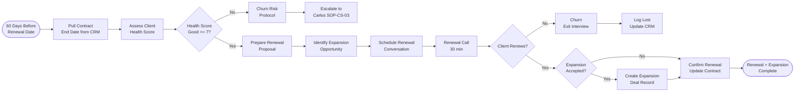

# SOP-CS-02 — Client Renewal & Expansion

**Owner:** Customer Success Manager / Sales Director  
**Cadence:** 60 days before each renewal; expansion opportunities identified at QBR  
**Last updated:** 2026-05-01  
**Related:** [01-qbr.md](01-qbr.md) · [03-support-escalation.md](03-support-escalation.md) · [crm-operations/02-deals.md](../crm-operations/02-deals.md)

---

## Overview

This SOP governs the renewal management process for retainer clients and the expansion playbook for adding services to existing client accounts.

**Renewal types:**
- **Auto-renew:** Client on monthly rolling — no action needed unless they signal churn risk
- **Annual renewal:** Client on annual contract — 60-day advance renewal process
- **Quarterly renewal:** Client on quarterly contract — 30-day advance renewal process

**Expansion types:**
- **Vertical expansion:** More depth in same service (e.g., SEO package → CMO package)
- **Horizontal expansion:** Adding a new service (e.g., adding social management to SEO)
- **Niche expansion:** Same service for a new business unit or location

**Success metrics:**
- Annual renewal rate: ≥85%
- Expansion revenue: ≥20% of existing ARR per year
- Renewal proposal sent: ≥30 days before contract end
- Average expansion deal size: ≥50% of existing monthly value

---

## Workflow



---

## Procedures

### 1. Renewal Pipeline Setup (60 days out)

Create a recurring query or CRM task to flag contracts approaching renewal:

```sql
SELECT c.id, c.first_name, c.last_name, c.company, d.value, d.expected_close_date,
       DATEDIFF(d.expected_close_date, CURDATE()) as days_to_renewal
FROM contacts c
JOIN deals d ON d.contact_id = c.id
WHERE c.status = 'client'
  AND d.stage = 'closed_won'
  AND d.expected_close_date BETWEEN CURDATE() AND DATE_ADD(CURDATE(), INTERVAL 60 DAY)
ORDER BY days_to_renewal ASC;
```

For each result, create a CRM task: "Renewal conversation: [Client] — due [date-30days-before-renewal]"

---

### 2. Client Health Score Assessment

Before approaching renewal, calculate a health score (0–10):

| Signal | Weight | Healthy (1 pt) | Warning (0.5 pt) | Risk (0 pt) |
|---|---|---|---|---|
| NPS score | 2× | 9–10 | 7–8 | <7 |
| Last QBR outcome | 1× | Positive, expansion discussed | Neutral | Negative or skipped |
| Support tickets last 90 days | 1× | <2 tickets | 2–4 tickets | >4 tickets |
| Response time to our comms | 1× | Responds within 24h | 24–72h | >72h or no response |
| Contract payment history | 2× | Always on time | 1 late payment | 2+ late payments |
| Engagement with deliverables | 1× | Reviews and provides feedback | Occasionally engages | Never responds |
| Results vs. baseline | 2× | Clear improvement | Marginal improvement | No improvement |

**Score interpretation:**
- 8–10: Healthy — standard renewal approach
- 5–7: Watch — proactive check-in, address concerns before renewal call
- 0–4: At-risk — escalate to Carlos immediately (SOP-CS-03)

---

### 3. Renewal Proposal Preparation (1h)

Prepare a renewal proposal 30 days before contract end:

**Proposal structure:**
1. **Results summary:** What we delivered in the contract period (data-backed)
2. **Renewed scope:** Same services, or updated scope based on QBR discussions
3. **Pricing:** Same rate or adjusted (with justification)
4. **New commitment:** 1–2 things we'll focus on in the renewal period
5. **Expansion option:** Optional add-on service (presented separately, not bundled)
6. **Terms:** Contract length, payment terms, notice period

**Pricing considerations for renewal:**
- Clients on same rate for >12 months: eligible for 5–10% rate review
- Discuss any price changes at least 30 days in advance
- Rate increases require Carlos approval

---

### 4. Expansion Opportunity Identification

During QBR (SOP-CS-01) or renewal call, identify expansion signals:

**Verbal signals:**
- "We're thinking about [new service]..." → offer it
- "We're not getting enough [leads/traffic/visibility] in [area]..." → propose solution
- "We hired someone for [function] but they're overwhelmed..." → propose support
- "We're expanding to [new location/segment]..." → propose niche expansion

**Data signals:**
- Blog content performing well → propose social management to amplify
- Organic traffic strong → propose conversion rate optimization add-on
- Local SEO improving → propose multi-location expansion package

**Standard expansion offers:**
| Current service | Natural expansion |
|---|---|
| SEO retainer | Add content cluster package |
| Content cluster | Add social management |
| Social management | Add paid amplification consultation |
| SEO + Content | Upgrade to CMO package |
| CMO package | Add one-time projects (video, landing pages) |

---

### 5. Renewal Conversation (30 min call)

**Script framework:**
```
Opening (5 min):
"Before I send over the renewal proposal, I wanted to check in directly — 
 how are you feeling about the work we've done together?"

Results review (10 min):
"Let me share a few numbers that stood out this [period]..."
[3 specific data points — always lead with business outcomes, not vanity metrics]

Next period goals (5 min):
"For the next [period], here's what I'm recommending we focus on..."

Renewal ask (5 min):
"Does continuing on the same arrangement work for you, or would you want to adjust scope?"

Expansion offer (5 min — if applicable):
"One thing I've been wanting to discuss — we're seeing an opportunity to [expansion]..."
```

---

### 6. Renewal Confirmation & Contract Update

When client confirms renewal:

1. Update CRM deal record:
   - Create a NEW deal (don't modify old closed-won deal)
   - Link to same contact
   - Stage: `closed_won` immediately
   - Value: new contract value
   - Expected close date: next renewal date
2. Update contact `next_renewal_date` field
3. Send confirmation email: "Confirmed — continuing [service] through [end date]"
4. Generate invoice (see billing SOP)

For expansion:
1. Create a separate deal record for the expansion service
2. Handle as a new deal (SOP-CRM-02) — proposal, negotiation, close
3. Do not bundle expansion into renewal contract without separate agreement

---

### 7. Churn Exit Interview (When Client Doesn't Renew)

For every non-renewal, conduct a brief exit interview:

**5 questions:**
1. "What was the primary reason for not continuing?"
2. "Was there anything specific we could have done differently?"
3. "How would you rate your experience with NetWebMedia overall? (0–10)"
4. "Are you open to reconnecting in the future?"
5. "Would you be willing to provide a testimonial for the work we did complete?"

Log responses in CRM. Update contact status to `churned`. Tag with churn reason:
`churn_budget`, `churn_competitor`, `churn_results`, `churn_relationship`, `churn_business_change`

---

## Technical Details

### Renewal Date Tracking in CRM

Renewal dates are stored in deal `expected_close_date` for the current active deal. When a renewal is confirmed, a new deal is created with the next renewal date.

Alternative: use a custom `next_renewal_date` field on the contact record for quick lookup without querying deals.

### Invoice Generation Reference

Invoices for renewals go through the billing system:
```bash
curl -X POST \
  -H "X-Auth-Token: <token>" \
  "https://netwebmedia.com/crm-vanilla/api/?r=billing&action=create_invoice" \
  -d '{
    "contact_id": 123,
    "deal_id": 456,
    "amount": 2500,
    "currency": "USD",
    "due_date": "2026-06-01",
    "description": "CMO Package — June 2026"
  }'
```

---

## Troubleshooting

| Issue | Likely cause | Fix |
|---|---|---|
| Client surprised by renewal date | No 60-day alert set up | Create recurring task at contract start for 60-day renewal reminder |
| Expansion rejected repeatedly | Wrong timing or wrong offer | Note objection, wait for next QBR; don't pressure |
| Client ghosts before renewal | Low engagement score | Send physical or LinkedIn message (not email); make it personal |
| Renewal rate dropping | Inconsistent results delivery | Review delivery quality, schedule Carlos review of client portfolio |
| Churn exit interview refused | Client upset | Respect the refusal, send a brief survey instead, offer to reconnect in 6 months |

---

## Checklists

### Renewal Kickoff (60 days out)
- [ ] Renewal date identified in CRM
- [ ] Health score calculated (0–10)
- [ ] If health score <5: escalate to Carlos immediately
- [ ] Renewal task created: "Renewal conversation: [Client] — due [30 days before renewal]"

### Renewal Proposal (30 days out)
- [ ] Results summary prepared with data
- [ ] Expansion opportunity identified
- [ ] Proposal document created in CRM
- [ ] Renewal call scheduled in Google Calendar

### Renewal Close
- [ ] Renewal confirmed verbally during call
- [ ] New deal record created in CRM
- [ ] Contact `next_renewal_date` updated
- [ ] Confirmation email sent
- [ ] Expansion deal created if accepted

### Churn Processing (When client doesn't renew)
- [ ] Exit interview attempted
- [ ] Exit interview responses logged in CRM
- [ ] Contact status updated to `churned`
- [ ] Churn reason tag applied
- [ ] 6-month win-back task created

---

## Related SOPs
- [01-qbr.md](01-qbr.md) — QBR where expansion opportunities are first identified
- [03-support-escalation.md](03-support-escalation.md) — Churn risk escalation protocol
- [crm-operations/02-deals.md](../crm-operations/02-deals.md) — Creating renewal and expansion deal records
