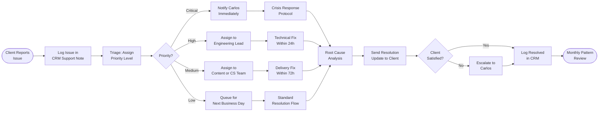

# SOP-CS-03 — Client Support Escalation

**Owner:** Customer Success Manager  
**Cadence:** As needed; reviewed monthly for patterns  
**Last updated:** 2026-05-01  
**Related:** [01-qbr.md](01-qbr.md) · [02-renewal-expansion.md](02-renewal-expansion.md) · [technical-deployment/04-post-deploy.md](../technical-deployment/04-post-deploy.md)

---

## Overview

This SOP governs how client issues, complaints, and escalations are received, triaged, and resolved. It covers three escalation tiers and establishes response time SLAs.

**Issue categories:**
1. **Technical issues** — Site down, broken functionality, deploy failures affecting client
2. **Delivery issues** — Late deliverables, missed commitments, quality complaints
3. **Relationship issues** — Client expressing dissatisfaction, churn signals, billing disputes
4. **Emergency** — Production outage, data loss, or reputational incident

**SLA targets:**
| Priority | Response time | Resolution target |
|---|---|---|
| Critical (production down) | 30 min | 4 hours |
| High (functionality broken) | 2 hours | 24 hours |
| Medium (quality concern) | 4 hours | 72 hours |
| Low (general question) | 24 hours | 7 days |

---

## Workflow



---

## Procedures

### 1. Issue Intake & Logging (10 min)

When a client reports an issue (via email, WhatsApp, CRM message):

1. Immediately acknowledge receipt (even if you don't have a solution yet):
   ```
   Subject: Re: [Issue subject]
   
   Hi [Name],
   
   Thanks for letting me know — I've flagged this as [priority] and we're on it.
   I'll follow up within [SLA timeframe] with an update.
   
   Carlos / NetWebMedia
   ```

2. Log the issue in CRM contact notes:
   ```json
   {
     "note_type": "support_issue",
     "priority": "high",
     "issue_summary": "Client's blog post 404ing after deploy",
     "reported_at": "2026-05-01T14:23:00",
     "reported_via": "email",
     "sla_due": "2026-05-02T14:23:00"
   }
   ```

3. Create a CRM task: "Resolve: [Issue summary]" with due date = SLA target

---

### 2. Priority Triage

**Critical (30-min response, 4h resolution):**
- Client's production website is down (returns 500, 404, or blank)
- Client's e-commerce checkout not working
- Security breach or data exposure
- Deploy error that broke a client-facing feature

**High (2-hour response, 24h resolution):**
- Key page returning errors
- Email campaign not delivered
- Significant ranking drop (>50% traffic loss)
- Billing charge dispute

**Medium (4-hour response, 72h resolution):**
- Deliverable quality below expectations
- Content has factual errors
- Social post published incorrectly
- Missing deliverable (late by <7 days)

**Low (24-hour response, 7-day resolution):**
- General questions about strategy
- Minor copy edits
- Additional requests outside agreed scope
- Password/access issues (non-urgent)

---

### 3. Technical Issue Response Protocol

For any technical issue affecting a client's site or services:

1. **Immediately verify** — reproduce the issue yourself:
   ```bash
   curl -sI https://[client-domain.com]/ | head -5
   curl -s "https://netwebmedia.com/api/public/audit?url=[client-domain.com]" | python3 -m json.tool
   ```

2. **Check if NWM-caused** — did a recent deploy affect this?
   - Check GitHub Actions deploy logs from last 48h
   - Check Sentry for error spikes at deploy time

3. **If NWM-caused:** Follow SOP-TD-04 rollback protocol immediately, notify client with timeline

4. **If client-side or external:** Diagnose and advise:
   - DNS issue: verify with `dig [domain]`
   - Hosting issue: check InMotion status
   - Google penalty: check Search Console for manual actions

5. **Root cause documentation:** Even for fast fixes, write one paragraph in CRM notes explaining what caused the issue and what prevents recurrence

---

### 4. Delivery Issue Response Protocol

For late or quality-below-expectation deliverables:

1. **Acknowledge immediately** — do not dispute or minimize the issue
2. **Assess the gap:** What was promised vs. what was delivered?
3. **Recovery options:**
   - Expedited delivery: Can the deliverable be improved/completed within 48h?
   - Make-good: Offer a bonus deliverable or next-month credit
   - Scope revision: Sometimes the issue reveals a scope misalignment — address that
4. **If pattern (3rd time same client complains):** Carlos reviews the account personally
5. **Never over-promise on recovery timelines** — under-promise and over-deliver on the fix

---

### 5. Churn Risk Escalation to Carlos

Any of these triggers escalation to Carlos within 2 hours:
- Client NPS score <7 (from QBR or ad-hoc survey)
- Client explicitly mentions "canceling" or "ending the contract"
- Two or more unresolved issues in the same week
- Client mentions a competitor by name
- Client hasn't responded to 3 consecutive communications

**Escalation message to Carlos:**
```
Subject: ⚠️ Churn Risk: [Client Name]

Priority: HIGH

Client: [Name], [Company]
Contract value: $[monthly value]/month
Trigger: [What happened]

Background:
[2–3 sentences on relationship history and current issue]

Recommended action:
[Specific suggestion — e.g., "Carlos calls client personally today"]

CRM link: [deal or contact URL]
```

---

### 6. Billing Dispute Resolution

For disputed invoices or charges:

1. Acknowledge immediately: "I'll look into this right away"
2. Pull the invoice and payment record from CRM/billing system
3. Compare against agreed scope in the original contract/proposal
4. Three outcomes:
   - **Charge is correct:** Explain clearly with reference to agreement, offer to walk through on a call
   - **Charge is incorrect:** Issue credit or refund immediately, apologize, fix the billing process
   - **Scope gray area:** Escalate to Carlos for final decision

Never argue about billing over email — always move to a phone call for disputes.

---

### 7. Monthly Pattern Review (First Monday, 30 min)

Review all support issues from the past month to identify patterns:

```sql
-- Support issues by client
SELECT c.company, COUNT(*) as issues, MAX(n.created_at) as last_issue
FROM contacts c
JOIN contact_notes n ON n.contact_id = c.id
WHERE n.note_type = 'support_issue'
  AND n.created_at > DATE_SUB(NOW(), INTERVAL 30 DAY)
GROUP BY c.company
ORDER BY issues DESC;
```

Flag:
- Any client with >2 issues in 30 days → proactive check-in
- Recurring issue types → system or process improvement needed
- Issues taking >SLA to resolve → process improvement

---

## Technical Details

### Issue Priority Reference Card

```
Critical: Site down / data exposure / charge dispute >$500
High:     Page errors / missed campaign send / traffic loss >50%  
Medium:   Quality below expectations / minor errors / late deliverable
Low:      Questions / copy edits / access issues
```

### CRM Support Note Schema

Use `note_type = 'support_issue'` in all support-related CRM notes for query-ability:
```json
{
  "note_type": "support_issue",
  "priority": "high|medium|low|critical",
  "issue_category": "technical|delivery|relationship|billing",
  "issue_summary": "one-line description",
  "reported_at": "ISO 8601",
  "sla_due": "ISO 8601",
  "resolved_at": "ISO 8601 or null",
  "resolution_summary": "what was done"
}
```

---

## Troubleshooting

| Issue | Likely cause | Fix |
|---|---|---|
| Client reports bug not in NWM code | Third-party plugin or host issue | Diagnose and hand off with documentation — clear scope boundaries |
| Client blames NWM for pre-existing issue | Poor baseline documentation at onboarding | Implement baseline audit documentation at onboarding start (SOP-CS-04) |
| Response SLA missed | No task created for the issue | Always create CRM task at intake with SLA due date |
| Same technical issue recurs for same client | Root cause not fully resolved | Write post-mortem, fix root cause not just symptom |
| Client escalates to social media | Relationship breakdown | Carlos handles personally, immediate response, take conversation to private channel |

---

## Checklists

### Issue Intake
- [ ] Acknowledgement email sent to client within SLA window
- [ ] Issue logged in CRM notes with priority and category
- [ ] CRM task created with SLA due date
- [ ] Issue assigned to appropriate team member

### Resolution
- [ ] Root cause identified
- [ ] Fix implemented or delivery corrected
- [ ] Resolution documented in CRM note
- [ ] Client notified of resolution
- [ ] Client satisfaction confirmed

### Churn Risk
- [ ] Carlos notified within 2h of churn risk trigger
- [ ] Churn risk tag added to CRM contact
- [ ] Recovery plan documented
- [ ] Follow-up scheduled within 7 days

---

## Related SOPs
- [01-qbr.md](01-qbr.md) — NPS scores that reveal hidden dissatisfaction
- [02-renewal-expansion.md](02-renewal-expansion.md) — Churn risk handling in renewal context
- [technical-deployment/04-post-deploy.md](../technical-deployment/04-post-deploy.md) — Post-deploy verification to catch issues before clients report them
