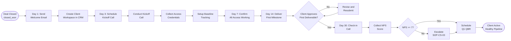

# SOP-CS-04 — Client Onboarding

**Owner:** Customer Success Manager  
**Cadence:** Per new client (within 48h of deal closed_won)  
**Last updated:** 2026-05-01  
**Related:** [01-qbr.md](01-qbr.md) · [crm-operations/02-deals.md](../crm-operations/02-deals.md) · [technical-deployment/04-post-deploy.md](../technical-deployment/04-post-deploy.md)

---

## Overview

This SOP governs the client onboarding process from deal closed_won through the 30-day mark, ensuring clients are set up for success, expectations are aligned, and baseline metrics are established for future QBR reporting.

**Onboarding timeline:** Day 0 (deal closed) → Day 1 (welcome) → Day 3 (kickoff call) → Day 7 (access + setup) → Day 14 (first deliverable) → Day 30 (30-day check-in).

**Success metrics:**
- Welcome email sent: within 24h of deal close
- Kickoff call completed: within 7 days
- GA4 / Search Console access confirmed: within 7 days
- First deliverable delivered: within 14 days (or per contract terms)
- 30-day satisfaction check: NPS ≥7

---

## Workflow



---

## Procedures

### 1. Day 0–1: Welcome & Workspace Setup

**Within 24h of deal close:**

1. Create onboarding tasks in CRM (auto-created by closed_won workflow if configured):
   - Day 1: Send welcome email
   - Day 3: Schedule kickoff call
   - Day 7: Confirm all access
   - Day 14: First deliverable due
   - Day 30: Check-in call

2. Send welcome email to client:
   ```
   Subject: Welcome to NetWebMedia — Let's get started

   Hi [First Name],

   I'm thrilled to officially welcome [Company] to NetWebMedia!

   Here's what happens next:

   1. Kickoff call — I'll reach out today to schedule a 60-min call 
      where we'll align on goals, timeline, and first priorities.

   2. Access requests — We'll need access to [list based on service: 
      GA4, Search Console, CMS, social accounts].

   3. First deliverable — You'll see [first deliverable] within 14 days 
      of our kickoff call.

   Our goal is to make this the easiest, highest-ROI partnership you've 
   ever had. Any questions — just reply here.

   Looking forward to it,
   Carlos
   ```

3. Update CRM contact `status = 'client'`, `onboarding_start = today`

---

### 2. Day 3: Kickoff Call Preparation

**Before scheduling the call:**
1. Review the original audit/proposal to understand what was promised
2. Review any notes from the sales discovery call
3. Prepare the kickoff call agenda

**Schedule the call:**
- Google Calendar event: `NWM - Client - Kickoff: [Client] [Service]`
- Duration: 60 minutes
- Include Google Meet link
- Send 24h before with agenda

**Kickoff call agenda:**
| Time | Topic |
|---|---|
| 0–5 min | Introductions, set the tone |
| 5–15 min | Client's goals and success criteria (their words) |
| 15–25 min | Our approach and methodology |
| 25–35 min | Timeline and first milestone review |
| 35–45 min | Access requirements and technical setup |
| 45–55 min | Communication preferences (how often, what channels, who) |
| 55–60 min | Next steps and confirmation |

---

### 3. Access Collection & Technical Setup

After kickoff call, collect all required access:

**For SEO / Content clients:**
- [ ] Google Analytics 4: Add `carlos@netwebmedia.com` as Analyst or Editor
- [ ] Google Search Console: Add as Full User
- [ ] Website CMS access: Admin or Editor role
- [ ] Google Business Profile: Manager access (for local SEO)

**For Social Management clients:**
- [ ] Instagram: Add as Editor via Meta Business Suite
- [ ] Facebook: Admin access via Meta Business Suite
- [ ] YouTube: Manager access

**For CMO Package clients:**
- [ ] All of above
- [ ] Google Ads access (if applicable)
- [ ] Email marketing platform (if they have one)
- [ ] Existing analytics dashboards

**Security note:** Never request passwords. Only request sharing/access grants that use the service's native permission system.

---

### 4. Baseline Metrics Documentation (Day 7)

Before doing any optimization work, document baseline metrics. This is critical for QBR ROI reporting.

**Create a CRM note:** `note_type = 'baseline_metrics'`

**SEO baseline:**
```json
{
  "date": "2026-05-01",
  "organic_sessions_30d": 450,
  "impressions_30d": 8200,
  "average_ctr": 2.1,
  "average_position": 24.5,
  "top_keyword": "hotel viña del mar",
  "top_keyword_position": 12,
  "core_web_vitals_lcp": 3.2,
  "core_web_vitals_cls": 0.18,
  "pagespeed_mobile": 42,
  "pagespeed_desktop": 78,
  "indexed_pages": 34,
  "backlinks": 12
}
```

**Content baseline:**
```json
{
  "blog_posts_existing": 8,
  "avg_post_length_words": 650,
  "schema_coverage": "none",
  "internal_links_avg": 1.2
}
```

This baseline is the benchmark for every QBR. Without it, ROI demonstrations are impossible.

---

### 5. First Deliverable (Day 14)

Deliver the first milestone per the contract:

**Common first deliverables by service type:**
| Service | Day 14 deliverable |
|---|---|
| SEO retainer | Full SEO audit report + 90-day priority list |
| Content package | First blog post (draft for review) |
| CMO package | 90-day marketing plan + first content calendar |
| Social management | Social profile audit + first 2 weeks of scheduled posts |
| Web design | Wireframes / mockup for homepage |

**Delivery format:**
- Send via CRM email (tracked open)
- Include a brief cover note explaining what's included and what's next
- Set clear approval deadline: "Please share feedback by [date+5 days]"

---

### 6. Day 30 Check-in Call (30 min)

Schedule a brief check-in call at day 30 to catch issues early:

**Agenda:**
1. How's the relationship feeling so far? (5 min)
2. Any concerns about communication, quality, or timing? (5 min)
3. Quick look at early wins (even small ones) (10 min)
4. Confirm next 30 days' priorities (5 min)
5. Collect NPS: "How would you rate us 0–10 so far?" (5 min)

**If NPS <7 at day 30:** Immediate escalation to Carlos — this is very early churn risk.

**Update CRM after call:**
- `onboarding_complete = true`
- `nps_30d = [score]`
- First QBR scheduled (3 months from now)

---

### 7. Onboarding Completion & Handoff

At day 30, formally close the onboarding phase:

1. Create first QBR task (3 months from kickoff date)
2. Transition to standard CS management rhythm
3. Ensure all access is confirmed and working
4. Baseline metrics documented in CRM
5. If a dedicated account manager: formal handoff briefing with CRM notes review

---

## Technical Details

### GA4 Access Granting

To give NWM access to client's GA4:
```
Client navigates to: GA4 → Admin → Property → Access Management
→ Add users → Enter carlos@netwebmedia.com → Role: Analyst
```

Note: We never have admin access to client GA4 — Analyst is sufficient for reporting.

### Search Console Access

```
Client navigates to: Search Console → Settings → Users and permissions
→ Add user → carlos@netwebmedia.com → Permission: Full
```

### Baseline Tracking Template

Store baseline in CRM contact notes with `note_type = 'baseline_metrics'` so it's queryable for QBR prep:
```sql
SELECT contact_id, JSON_EXTRACT(notes_json, '$.organic_sessions_30d') as baseline_sessions
FROM contact_notes
WHERE note_type = 'baseline_metrics'
  AND contact_id = ?;
```

---

## Troubleshooting

| Issue | Likely cause | Fix |
|---|---|---|
| Client doesn't schedule kickoff | Getting cold feet post-sale | Call (not email) within 24h of missed scheduling deadline |
| Access never granted (>7 days) | Client forgot or unsure how | Send screen-share recording showing exactly how to grant access |
| Baseline metrics missing from Search Console | Client site not yet in Search Console | Add site to Search Console, submit sitemap — baseline available in 2–4 weeks |
| First deliverable rejected | Misalignment between sales promise and CS delivery | Review original proposal, have brief call with client to realign |
| 30-day NPS <7 | Unmet expectations or communication issues | Carlos personal call within 24h, full issue review and recovery plan |

---

## Checklists

### Day 0–1
- [ ] Welcome email sent within 24h
- [ ] Onboarding tasks created in CRM
- [ ] Contact status updated to 'client'

### Day 3 (Kickoff)
- [ ] Kickoff call scheduled
- [ ] Call conducted per agenda
- [ ] Access list documented
- [ ] Communication preference noted

### Day 7 (Setup)
- [ ] All access grants confirmed and working
- [ ] Baseline metrics documented in CRM with `note_type: baseline_metrics`
- [ ] First deliverable scope confirmed

### Day 14 (First Deliverable)
- [ ] First deliverable delivered
- [ ] Approval deadline set
- [ ] Client acknowledged receipt

### Day 30 (Check-in)
- [ ] Check-in call completed
- [ ] 30-day NPS collected and logged
- [ ] If NPS <7: Carlos escalated immediately
- [ ] If NPS ≥7: First QBR scheduled (3 months out)
- [ ] `onboarding_complete = true` in CRM

---

## Related SOPs
- [01-qbr.md](01-qbr.md) — First QBR 3 months post-onboarding
- [02-renewal-expansion.md](02-renewal-expansion.md) — Renewal starting from onboarded clients
- [03-support-escalation.md](03-support-escalation.md) — Any issues during onboarding period
- [crm-operations/02-deals.md](../crm-operations/02-deals.md) — Deal record that triggers onboarding
