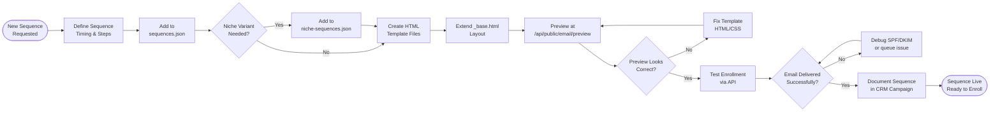

# SOP-EM-01 — Email Sequence Setup

**Owner:** Content Strategist / Operations Manager  
**Cadence:** Per new sequence creation (one-time setup per sequence type)  
**Last updated:** 2026-05-01  
**Related:** [02-email-send.md](02-email-send.md) · [03-drip-campaigns.md](03-drip-campaigns.md) · [crm-operations/workflow-automation.md](../crm-operations/workflow-automation.md)

---

## Overview

This SOP governs setup of email drip sequences in the NetWebMedia email system: defining sequence timing in `email-templates/sequences.json`, creating HTML templates using the `_base.html` layout, and enrolling contacts via the `seq_enroll()` API.

**System architecture:**
- Sequence definitions: `email-templates/sequences.json` (timing, subject, template ref)
- Niche variants: `email-templates/niche-sequences.json`
- Template files: `email-templates/*.html` (using `_base.html` layout)
- Enrollment function: `seq_enroll()` in `api-php/lib/email-sequences.php`
- Queue processing: `GET /api/cron` — processes `email_sequence_queue` table
- Preview: `GET /api/public/email/preview?id=<sequence-id>&lang=es`

**Available sequences:** `welcome`, `audit_followup`, `partner_application` + 14 niche-specific variants

**Success metrics:**
- Sequence triggers within 5 min of enrollment event
- Email 1 open rate: ≥30%
- Email 2+ open rate: ≥20%
- Unsubscribe rate: <2% per sequence
- Delivery rate: ≥98% (SPF/DKIM configured)

---

## Workflow



---

## Procedures

### 1. Sequence Design (30 min)

Define the sequence before writing a single line of code:

**Required decisions:**
- **Trigger:** What event enrolls a contact? (form submit, audit request, purchase, manual)
- **Goal:** What behavior does the sequence drive? (book call, read blog, upgrade, leave review)
- **Length:** How many emails? (standard: 3–7 emails over 14–21 days)
- **Spacing:** Days between each email
- **Exit condition:** What stops the sequence? (reply, booking, unsubscribe)

**Standard sequence templates:**
| Sequence | Trigger | Length | Goal |
|---|---|---|---|
| `welcome` | Newsletter subscribe | 4 emails / 14 days | Build trust, drive first audit |
| `audit_followup` | Audit form submit | 5 emails / 10 days | Book discovery call |
| `partner_application` | Partner form submit | 3 emails / 7 days | Complete partner onboarding |
| `<niche>_welcome` | Niche-specific optin | 4 emails / 14 days | Niche-specific case studies |

---

### 2. sequences.json Update (20 min)

Add the new sequence definition to `email-templates/sequences.json`:

```json
{
  "sequence_id": "audit_followup",
  "name": "Audit Follow-up",
  "trigger": "audit_submit",
  "emails": [
    {
      "id": "audit_followup-1",
      "delay_days": 0,
      "subject": "Your free audit is ready — {{company_name}}",
      "template": "audit_followup_1.html",
      "preview_text": "We analyzed your site and found 3 quick wins"
    },
    {
      "id": "audit_followup-2",
      "delay_days": 2,
      "subject": "Quick question about {{company_name}}'s website",
      "template": "audit_followup_2.html",
      "preview_text": "Did you get a chance to review the audit?"
    },
    {
      "id": "audit_followup-3",
      "delay_days": 5,
      "subject": "3 things blocking {{company_name}}'s Google visibility",
      "template": "audit_followup_3.html",
      "preview_text": "Here's what our analysis found"
    }
  ]
}
```

**Template variable tokens:** `{{first_name}}`, `{{company_name}}`, `{{niche}}`, `{{audit_url}}`, `{{unsubscribe_url}}`

---

### 3. Niche Variant Setup (20 min — conditional)

If the sequence needs niche-specific variants (different case studies, industry language):

1. Open `email-templates/niche-sequences.json`
2. Add niche override entries for any email where copy differs by niche:
```json
{
  "niche": "tourism",
  "sequence_id": "welcome",
  "email_overrides": [
    {
      "id": "welcome-2",
      "subject": "How Hotel Arenas increased bookings 40% with SEO",
      "template": "welcome_2_tourism.html"
    }
  ]
}
```

The email system checks `niche-sequences.json` first, falls back to `sequences.json` default.

---

### 4. HTML Template Creation (1–2h per email)

All templates extend `email-templates/_base.html`. Structure:

```html
<!-- email-templates/welcome_1.html -->
<!DOCTYPE html>
<html>
<head>
  <meta charset="UTF-8">
  <meta name="viewport" content="width=device-width, initial-scale=1.0">
  <title>{{subject}}</title>
  <!-- Inline all CSS — email clients strip <style> blocks -->
</head>
<body style="margin:0; padding:0; background:#F4F5F7; font-family:Arial,sans-serif;">
  <!-- Header: NetWebMedia logo + brand stripe -->
  <!-- Body: 600px max-width centered -->
  <!-- CTA button: orange #FF671F, white text, rounded 4px -->
  <!-- Footer: unsubscribe link (required), address, social icons -->
</body>
</html>
```

**Email HTML rules:**
- All CSS must be inlined (no `<link>` stylesheets, no external CSS)
- Max width: 600px
- Use `<table>` layout for Outlook compatibility (not flexbox/grid)
- Images: absolute URLs (`https://netwebmedia.com/assets/...`), include `alt` text
- CTA button: use both `<a>` styled as button AND a fallback text link below it
- Unsubscribe link in footer is legally required — use `{{unsubscribe_url}}` token

**Brand email palette:**
- Header background: `#010F3B` (navy)
- CTA button: `#FF671F` (orange)
- Body background: `#F4F5F7` (light grey)
- Body text: `#222222`
- Footer text: `#888888`

---

### 5. Template Preview & Testing (30 min)

1. Preview the template in browser:
   ```
   GET /api/public/email/preview?id=<sequence-email-id>&lang=es
   ```
   Example: `http://127.0.0.1:3000/api/public/email/preview?id=welcome-1&lang=es`

2. Check at both desktop (600px) and mobile (375px) widths in DevTools.

3. Test variable substitution — preview endpoint should replace `{{first_name}}` etc. with test values.

4. Send a real test email to `carlos@netwebmedia.com`:
   ```bash
   curl -X POST https://netwebmedia.com/api/public/email/test \
     -H "Content-Type: application/json" \
     -d '{"sequence_id": "welcome", "email_id": "welcome-1", "to": "carlos@netwebmedia.com"}'
   ```

5. Check rendering in:
   - Gmail (web)
   - Gmail (mobile app)
   - Apple Mail (if available)

---

### 6. Enrollment Integration (30 min)

Wire the `seq_enroll()` call to the trigger event in `api-php/`:

```php
// In the relevant route handler (e.g., api-php/routes/public.php for form submits)
require_once __DIR__ . '/../lib/email-sequences.php';

// On form submit success:
seq_enroll($contact_email, 'audit_followup', [
    'first_name'   => $first_name,
    'company_name' => $company_name,
    'niche'        => $niche,
    'audit_url'    => 'https://netwebmedia.com/audit-report.html?id=' . $audit_id,
]);
```

`seq_enroll()` writes a row to `email_sequence_queue` with `scheduled_at = NOW() + delay_days`.

The cron job at `GET /api/cron` processes the queue every 5 minutes (cPanel cron required for api-php sequences — separate from the CRM workflow cron).

---

### 7. Queue Monitoring (10 min)

After enrollment, verify the queue:
```sql
SELECT * FROM email_sequence_queue
WHERE email = 'test@example.com'
ORDER BY scheduled_at ASC;
```

Expected rows: one per email in the sequence, with `scheduled_at` spaced by `delay_days`.

Status field lifecycle: `pending` → `sent` → (or `failed` with error in `error_message`).

---

## Technical Details

### seq_enroll() Signature

```php
seq_enroll(
    string $email,
    string $sequence_id,
    array  $variables = [],
    string $niche     = null   // optional: triggers niche-sequence override lookup
): bool
```

Returns `true` if all queue rows inserted successfully, `false` on DB error.

### email_sequence_queue Schema

```sql
CREATE TABLE email_sequence_queue (
    id           INT AUTO_INCREMENT PRIMARY KEY,
    email        VARCHAR(255) NOT NULL,
    sequence_id  VARCHAR(64)  NOT NULL,
    email_id     VARCHAR(64)  NOT NULL,
    variables    JSON,
    scheduled_at DATETIME     NOT NULL,
    sent_at      DATETIME,
    status       ENUM('pending','sent','failed') DEFAULT 'pending',
    error_message TEXT,
    created_at   DATETIME DEFAULT CURRENT_TIMESTAMP
);
```

### Cron Requirement (api-php sequences)

The api-php email cron (`GET /api/cron`) is separate from the CRM workflow cron:
```
*/5 * * * * curl -s "https://netwebmedia.com/api/cron" > /dev/null
```
This must be set in cPanel → Cron Jobs for the `webmed6_nwm` database sequences.

---

## Troubleshooting

| Issue | Likely cause | Fix |
|---|---|---|
| Preview returns 404 | `email_id` doesn't match `sequences.json` `id` field | Check exact `id` value in sequences.json, must match `preview?id=` param |
| Variables not substituted in preview | Token format wrong | Use double curly braces `{{variable_name}}`, no spaces |
| Email arrives in spam | Missing SPF/DKIM, or spammy subject | Check SPF/DKIM DNS records via MXToolbox, avoid ALL CAPS or excessive punctuation in subjects |
| Queue rows not processing | cPanel cron not running or `/api/cron` returning error | Check cPanel cron job exists, test `curl https://netwebmedia.com/api/cron` manually |
| Outlook renders broken layout | Using CSS flexbox/grid instead of `<table>` | Rewrite layout as `<table>` structure, inline all CSS |
| Unsubscribe link missing | Footer template missing `{{unsubscribe_url}}` token | Add token to `_base.html` footer, required legally |
| `seq_enroll()` returns false | DB write failed | Check `webmed6_nwm` connection in `api-php/config.local.php`, check `email_sequence_queue` table exists |

---

## Checklists

### Sequence Design
- [ ] Trigger event defined
- [ ] Goal and exit condition defined
- [ ] Email count and spacing decided
- [ ] sequences.json updated with new sequence
- [ ] niche-sequences.json updated if niche variants required

### Template Creation
- [ ] All email HTML templates created
- [ ] All CSS inlined (no external stylesheets)
- [ ] `<table>` layout for Outlook compatibility
- [ ] Images use absolute HTTPS URLs
- [ ] `{{unsubscribe_url}}` present in every email footer
- [ ] CTA button has text fallback

### Testing
- [ ] Preview endpoint shows correct rendering
- [ ] Mobile layout tested at 375px
- [ ] Test email sent to carlos@netwebmedia.com
- [ ] Variable substitution verified
- [ ] No broken images in test send

### Go-Live
- [ ] `seq_enroll()` integrated into trigger handler
- [ ] Queue rows verified after test enrollment
- [ ] Cron job confirmed running
- [ ] CRM campaign record updated with `email_sequences` field

---

## Related SOPs
- [02-email-send.md](02-email-send.md) — Individual email broadcast sends
- [03-drip-campaigns.md](03-drip-campaigns.md) — Multi-touch drip campaign management
- [04-whatsapp-optins.md](04-whatsapp-optins.md) — WhatsApp opt-in flow (parallel to email)
- [crm-operations/workflow-automation.md](../crm-operations/workflow-automation.md) — CRM workflow engine (separate from api-php sequences)
