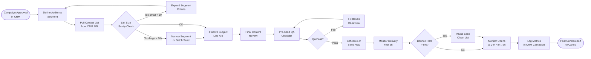

# SOP-EM-02 — Email Broadcast Send

**Owner:** Content Strategist  
**Cadence:** Per campaign send (typically 1–2 per cluster cycle)  
**Last updated:** 2026-05-01  
**Related:** [01-sequence-setup.md](01-sequence-setup.md) · [03-drip-campaigns.md](03-drip-campaigns.md) · [marketing-content/04-campaign-assets.md](../marketing-content/04-campaign-assets.md)

---

## Overview

This SOP governs the end-to-end process for sending a broadcast email to a contact segment: audience selection, content review, pre-send QA, actual send via the CRM email campaign system, and post-send monitoring.

**System:** `crm-vanilla/api/handlers/campaigns.php` — email campaign management. Contacts are stored in `webmed6_crm`. Emails are sent via Resend API (configured via `RESEND_API_KEY`).

**Success metrics:**
- Open rate: ≥25% for broadcast, ≥35% for targeted segment
- Click-through rate: ≥3%
- Delivery rate: ≥98%
- Unsubscribe rate: <1% per send
- Spam complaint rate: <0.1%

---

## Workflow



---

## Procedures

### 1. Audience Segment Definition (20 min)

Define who receives this email using CRM contact filters:

**Common segment types:**
```json
{
  "segment": "niche_subscribers",
  "filters": {
    "niche": "tourism",
    "status": "active",
    "subscribed": true,
    "last_email_sent_gt": "30_days_ago"
  }
}
```

**API call to get segment count:**
```bash
curl -H "X-Auth-Token: <token>" \
  "https://netwebmedia.com/crm-vanilla/api/?r=contacts&niche=tourism&subscribed=1&count=1"
```

**Minimum list size:** 10 contacts (below this, verify segment criteria).  
**Maximum single-batch send:** 2,000 contacts. Above this, split into batches with 4h between sends.

**Do NOT send to:**
- Contacts with `status = "bounced"`
- Contacts with `unsubscribed = true`
- Contacts added in last 24h (too new, no consent confirmation)

---

### 2. Subject Line A/B Test Setup (15 min)

For segments >200 contacts, run a 2-way subject line test:

- **Version A:** Direct value statement ("Your tourism website is losing 40% of visitors")
- **Version B:** Question or curiosity hook ("Why are Santiago hotels ranking below Airbnb?")

Split: 50/50 random. Record both subject lines in CRM campaign record:
```json
{
  "subject_a": "Your tourism website is losing 40% of visitors",
  "subject_b": "Why are Santiago hotels ranking below Airbnb?",
  "ab_test": true,
  "ab_winner_metric": "open_rate",
  "ab_result_time": "4h_post_send"
}
```

---

### 3. Content Final Review (30 min)

Review the email content against these standards:

**Copy checklist:**
- Subject line: 40–60 characters, includes one of: number, name, urgency word, or question
- Preview text: 60–90 characters, extends subject line (not repeat)
- Opening line: addresses pain point within first 50 words
- Body: 150–300 words max for broadcast (not a blog post)
- Single CTA: one button, one goal
- CTA button text: action verb ("Get my free audit", "See the case study", "Book a call")
- Signature: Carlos Martinez, NetWebMedia — personal, not brand-only

**Legal requirements:**
- Physical address in footer (InMotion/cPanel server address or NWM office)
- Unsubscribe link functional and prominent
- No misleading subject line (CAN-SPAM / CASL compliance)

---

### 4. Pre-Send QA (20 min)

Run through the pre-send checklist before triggering any send:

1. Send test email to `carlos@netwebmedia.com`
2. Check test in Gmail web, Gmail mobile, and one other client
3. Verify all links work (click every link in the test email)
4. Verify images load (check on mobile data, not just WiFi)
5. Verify unsubscribe link works (click it in test, then re-subscribe)
6. Verify `{{variables}}` are replaced (no literal `{{first_name}}` visible)
7. Verify sender name and reply-to address are correct

---

### 5. Send Execution (10 min)

**Via CRM campaign UI:**
1. Navigate to `netwebmedia.com/crm-vanilla/` → Marketing → Email Campaigns
2. Open the campaign record
3. Set `status = "sending"` or use "Send Now" / "Schedule" buttons
4. Confirm segment, subject line, and send time
5. Click Send / Confirm

**Via API (for automated sends):**
```bash
curl -X POST \
  -H "X-Auth-Token: <token>" \
  -H "Content-Type: application/json" \
  "https://netwebmedia.com/crm-vanilla/api/?r=campaigns&action=send" \
  -d '{
    "campaign_id": 42,
    "send_now": true
  }'
```

**Optimal send times (Chile / America/Santiago timezone):**
| Audience | Best day | Best time |
|---|---|---|
| B2B / business owners | Tuesday–Thursday | 9:00–11:00 AM |
| Mixed / general | Tuesday or Thursday | 10:00 AM |
| Re-engagement | Monday | 9:00 AM |

---

### 6. Delivery Monitoring (2h post-send)

Watch the following metrics in the first 2 hours:

**Healthy signs:**
- Delivery rate rising toward 98%+
- Open rate starting to climb (first opens typically within 30 min)
- Bounce rate <2%

**Alert thresholds:**
| Metric | Alert threshold | Action |
|---|---|---|
| Hard bounce rate | >5% | Pause send, clean list |
| Spam complaint | >0.1% | Pause send, review content |
| Delivery failure | >10% | Check Resend API status, verify DKIM |
| Zero opens after 1h | 0 opens for a large list | Check spam folder delivery |

**Monitor via Resend dashboard** (or CRM campaign stats if integrated).

---

### 7. Post-Send Analytics (Friday of send week)

Pull final metrics at 24h, 48h, and 72h:

```bash
curl -H "X-Auth-Token: <token>" \
  "https://netwebmedia.com/crm-vanilla/api/?r=campaigns&id=42&action=stats"
```

Expected response:
```json
{
  "sent": 450,
  "delivered": 441,
  "opened": 132,
  "clicked": 18,
  "bounced": 9,
  "unsubscribed": 3,
  "open_rate": 29.9,
  "ctr": 4.1
}
```

Update CRM campaign record with final stats. Flag to Carlos if:
- Open rate <20% (investigate subject line or list health)
- CTR <2% (investigate CTA placement or offer)
- Unsubscribe rate >1% (review content relevance)

---

## Technical Details

### Resend API Integration

Emails send via Resend API. Key config in `crm-vanilla/api/config.local.php`:
```php
define('RESEND_API_KEY', '<key>');
define('EMAIL_FROM', 'carlos@netwebmedia.com');
define('EMAIL_FROM_NAME', 'Carlos at NetWebMedia');
define('EMAIL_REPLY_TO', 'carlos@netwebmedia.com');
```

### Email Headers Required

For deliverability, these headers must be present in all sends:
- `From:` — matches authenticated sending domain
- `List-Unsubscribe:` — one-click unsubscribe header (RFC 8058)
- `List-Unsubscribe-Post: List-Unsubscribe=One-Click`
- `X-Mailer: NetWebMedia/1.0`

### SPF / DKIM Verification

Before sending any new campaign, verify DNS is clean:
```
mxtoolbox.com/SuperTool → SPF check for netwebmedia.com
mxtoolbox.com/SuperTool → DKIM check (selector: resend)
```

---

## Troubleshooting

| Issue | Likely cause | Fix |
|---|---|---|
| High bounce rate (>5%) | Stale list with unverified emails | Run list through email validation, remove hard bounces from CRM |
| Low open rate (<15%) | Poor subject line or wrong send time | A/B test subject line, check inbox placement with mail-tester.com |
| Emails landing in spam | Missing DKIM or spammy content | Verify DKIM DNS record, run content through SpamAssassin checker |
| `{{variables}}` showing as literal text | Template rendering not happening | Check `seq_enroll()` call passes variables array, verify template uses `{{token}}` exactly |
| Unsubscribe link broken | `{{unsubscribe_url}}` token not replaced | Verify `seq_enroll()` / campaign send function generates unsubscribe token per recipient |
| Send API returns 401 | Token expired or wrong | Re-authenticate, get fresh `nwm_token` from CRM login |
| Zero clicks despite good opens | CTA button broken on mobile | Test CTA on iPhone, ensure button has `min-height: 44px` and readable text |

---

## Checklists

### Pre-Send
- [ ] Audience segment defined and count verified
- [ ] Subject line finalized (A/B set up if >200 contacts)
- [ ] Content reviewed against copy checklist
- [ ] Unsubscribe link present and functional
- [ ] Physical address in footer
- [ ] Test email sent to carlos@netwebmedia.com
- [ ] All links verified in test email
- [ ] No `{{variable}}` tokens showing as literal text

### Send Day
- [ ] Send time confirmed (correct timezone)
- [ ] CRM campaign status set to "sending"
- [ ] Send triggered (UI or API)
- [ ] Monitoring started (first check at 30min, 1h, 2h)

### Post-Send (72h)
- [ ] 24h open rate logged in CRM
- [ ] 72h final stats logged in CRM
- [ ] Bounce list cleaned from contact database
- [ ] Unsubscribers marked in CRM
- [ ] Weekly report updated with send metrics

---

## Related SOPs
- [01-sequence-setup.md](01-sequence-setup.md) — Setting up drip sequences (automated sends)
- [03-drip-campaigns.md](03-drip-campaigns.md) — Multi-touch drip sequences ongoing management
- [marketing-content/04-campaign-assets.md](../marketing-content/04-campaign-assets.md) — Email header image creation
- [crm-operations/contact-management.md](../crm-operations/contact-management.md) — List health and segmentation
