# SOP-EM-03 — Drip Campaign Management

**Owner:** Content Strategist / Operations Manager  
**Cadence:** Ongoing — weekly monitoring, monthly audit  
**Last updated:** 2026-05-01  
**Related:** [01-sequence-setup.md](01-sequence-setup.md) · [02-email-send.md](02-email-send.md) · [crm-operations/workflow-automation.md](../crm-operations/workflow-automation.md)

---

## Overview

This SOP governs the ongoing management of active drip campaigns: monitoring queue health, reviewing performance, optimizing underperforming steps, managing unsubscribes and bounces, and running quarterly sequence audits.

**Two separate drip engines (do not confuse):**
1. **`api-php/lib/email-sequences.php`** → `email_sequence_queue` in `webmed6_nwm` → public website sequences (welcome, audit_followup, partner_application)
2. **CRM workflow engine** (`crm-vanilla/api/lib/wf_crm.php`) → `workflow_runs` in `webmed6_crm` → CRM contact-triggered sequences (deal stage, tag-based)

This SOP covers **both** — health monitoring applies to both engines.

**Success metrics:**
- Queue backlog: <100 pending sends older than 2h
- Failed sends: <1% of queue rows
- Weekly sequence completion rate: ≥80% of enrolled contacts reach final email
- Bounce processing: same-day removal from active lists

---

## Workflow

```mermaid
graph LR
    A([Monday Morning\nWeekly Check]) --> B[Check api-php\nQueue Backlog]
    B --> C{Backlog > 100\nPending > 2h?}
    C -- Yes --> D[Check Cron Job\nRunning?]
    C -- No --> E[Check CRM Workflow\nQueue Backlog]
    D -- No --> F[Fix Cron Job\nor Manual Trigger]
    D -- Yes --> G[Check Resend API\nfor errors]
    F --> E
    G --> E
    E --> H{CRM Workflow\nFailures?}
    H -- Yes --> I[Review workflow_runs\nfailed rows]
    H -- No --> J[Pull Weekly\nPerformance Metrics]
    I --> J
    J --> K{Any Step\nOpen Rate < 15%?}
    K -- Yes --> L[Flag for\nSubject Line Test]
    K -- No --> M{Bounce Rate\n> 2%?}
    L --> M
    M -- Yes --> N[Clean Bounce List\nfrom CRM Contacts]
    M -- No --> O[Monthly Audit\nDue?]
    N --> O
    O -- Yes --> P[Full Sequence\nAudit]
    O -- No --> Q([Report Complete\nNo Action Needed])
    P --> Q
```



---

## Procedures

### 1. Weekly Queue Health Check (Monday, 15 min)

**api-php sequence queue:**
```sql
-- Check for stuck pending emails (older than 2h, not sent)
SELECT sequence_id, COUNT(*) as stuck_count, MIN(scheduled_at) as oldest
FROM email_sequence_queue
WHERE status = 'pending'
  AND scheduled_at < DATE_SUB(NOW(), INTERVAL 2 HOUR)
GROUP BY sequence_id;
```

**Healthy state:** Zero or near-zero stuck rows. `status='pending'` rows with future `scheduled_at` are normal.

**Failed rows:**
```sql
SELECT * FROM email_sequence_queue
WHERE status = 'failed'
  AND created_at > DATE_SUB(NOW(), INTERVAL 7 DAY)
ORDER BY created_at DESC
LIMIT 50;
```

Review `error_message` column for patterns (API errors, missing variables, bad email addresses).

**CRM workflow queue (`webmed6_crm`):**
```sql
SELECT status, COUNT(*) as cnt, MAX(error) as last_error
FROM workflow_runs
WHERE created_at > DATE_SUB(NOW(), INTERVAL 7 DAY)
GROUP BY status;
```

Failed CRM workflow runs: check `error` column in `workflow_runs`, correlate with workflow step type.

---

### 2. Cron Health Verification (10 min)

**api-php cron (cPanel):**
1. Log in to cPanel → Cron Jobs
2. Verify `*/5 * * * * curl -s "https://netwebmedia.com/api/cron" > /dev/null` is active
3. If missing: re-add the cron job (cPanel UI)
4. Manual test: `curl -v "https://netwebmedia.com/api/cron"` — expect 200 with JSON response

**CRM workflow cron (GitHub Actions):**
1. Navigate to repo → Actions → `cron-workflows.yml`
2. Verify last run was <10 minutes ago
3. If stuck: manually trigger via "Run workflow" button
4. If consistently failing: check the workflow YAML and `MIGRATE_TOKEN` secret

---

### 3. Weekly Performance Metrics (Monday, 30 min)

Pull stats for each active sequence:

```bash
# api-php sequences — manual SQL report
SELECT 
  sequence_id,
  email_id,
  COUNT(*) as total_sent,
  SUM(status='sent') as delivered,
  -- open/click tracking depends on pixel/click redirect implementation
FROM email_sequence_queue
WHERE status = 'sent'
  AND sent_at > DATE_SUB(NOW(), INTERVAL 7 DAY)
GROUP BY sequence_id, email_id
ORDER BY sequence_id, email_id;
```

Compile into weekly stats table:

| Sequence | Email # | Sent | Delivered | Open Rate | CTR | Unsub |
|---|---|---|---|---|---|---|
| welcome | 1 | 42 | 41 | 34% | 5% | 0% |
| audit_followup | 1 | 28 | 27 | 41% | 8% | 0% |

Flag any step with:
- Open rate <15% → subject line test needed
- CTR <2% → CTA redesign needed
- Unsubscribe rate >1% → content relevance review

---

### 4. Bounce List Cleanup (As needed, same day as bounce alert)

Hard bounces (permanent delivery failures) must be removed from the active list immediately:

1. Query failed rows:
   ```sql
   SELECT DISTINCT email FROM email_sequence_queue
   WHERE status = 'failed'
     AND error_message LIKE '%bounce%'
     OR error_message LIKE '%invalid%'
     OR error_message LIKE '%not exist%';
   ```

2. Mark contacts in CRM as bounced:
   ```bash
   curl -X PATCH \
     -H "X-Auth-Token: <token>" \
     -H "Content-Type: application/json" \
     "https://netwebmedia.com/crm-vanilla/api/?r=contacts" \
     -d '{"email": "bounced@example.com", "email_status": "bounced"}'
   ```

3. Remove from all active sequences:
   ```sql
   UPDATE email_sequence_queue
   SET status = 'cancelled'
   WHERE email = 'bounced@example.com'
     AND status = 'pending';
   ```

4. Document in weekly report: "X bounces cleaned, removed from queue."

---

### 5. Underperforming Step Optimization (As needed)

When a step's open rate is <15% for 2+ consecutive weeks:

**Subject line A/B test:**
1. Pause the current sequence step (set `status = 'paused'` in sequences.json)
2. Write 2 new subject line variants following copywriting guidelines
3. Update sequences.json with variant A as primary
4. Run for 2 weeks, compare open rates
5. If open rate >20%, keep; otherwise try variant B

**Body content improvements for low CTR:**
1. Move CTA button higher (above fold — visible without scrolling)
2. Simplify CTA text to single action verb + benefit
3. Add social proof element (case study stat, testimonial)
4. Test HTML vs. plain-text version (plain text often performs better for early sequence emails)

---

### 6. Monthly Sequence Audit (First Monday of each month, 1h)

Full audit of all active sequences:

1. **Relevance check:** Is the sequence content still accurate? Any outdated stats, dead links, or old CTAs?
2. **Timing check:** Are the day intervals still appropriate? (Welcome sequence: are we sending email 2 too soon/late?)
3. **List hygiene:** How many contacts are enrolled vs. completing the sequence? High dropout = sequence too long or content quality issue
4. **Compliance check:** Every email has unsubscribe link, physical address, and correct FROM name
5. **New niche variants:** Are any of the 14 niches missing niche-specific variants for key sequences?

Document findings and update sequences.json / templates as needed.

---

### 7. Unsubscribe Processing (Same day)

When a contact unsubscribes:
1. CRM should automatically mark `subscribed = false` via unsubscribe handler
2. Cancel all pending queue rows for that email:
   ```sql
   UPDATE email_sequence_queue
   SET status = 'cancelled'
   WHERE email = 'unsub@example.com'
     AND status = 'pending';
   ```
3. Never re-enroll an unsubscribed contact — check `subscribed` field before any `seq_enroll()` call
4. Add `subscribed = false` check as a guard in all enrollment trigger handlers

---

## Technical Details

### Queue Status Lifecycle

```
pending → sent       (processed by cron, delivered)
pending → failed     (cron attempted, Resend API returned error)
pending → cancelled  (manually cancelled or contact unsubscribed)
```

### CRM Workflow Run Status Lifecycle

```
pending → running → completed  (executed successfully)
pending → running → waiting    (hit a wait step, next_run_at set)
waiting → running → completed  (wait expired, resumed by cron)
pending → failed               (step execution error)
```

### Monitoring SQL Queries

```sql
-- Sequence completion funnel
SELECT sequence_id, email_id, COUNT(*) as cnt
FROM email_sequence_queue
WHERE status = 'sent'
GROUP BY sequence_id, email_id
ORDER BY sequence_id, email_id;

-- Drop-off analysis (contacts who received email N but not N+1)
-- Join consecutive steps and find contacts not progressing
```

---

## Troubleshooting

| Issue | Likely cause | Fix |
|---|---|---|
| Queue backlog growing (>100 rows stuck) | Cron job not running | Check cPanel cron job, manually trigger `/api/cron`, check Resend API key |
| Same emails sending repeatedly | Cron processing same rows multiple times | Check for missing `status = 'sent'` update in cron handler, add `WHERE status = 'pending'` to query |
| CRM workflow stuck in 'waiting' | `next_run_at` set too far in future, or GitHub Actions cron failing | Check `workflow_runs.next_run_at`, manually trigger cron, check GitHub Actions schedule |
| Contacts unsubscribed but still receiving | Unsubscribe handler not cancelling queue | Verify unsub handler calls `UPDATE email_sequence_queue SET status='cancelled'` |
| Open tracking not working | Tracking pixel blocked by email client | Use click-through tracking on links as alternative metric; accept lower tracked open rates |
| Sequence completing too fast | `delay_days = 0` on multiple steps | Review sequences.json timing, ensure delays are correct integers |

---

## Checklists

### Weekly Health Check (Monday)
- [ ] api-php queue checked — no stuck pending rows older than 2h
- [ ] api-php failed rows reviewed and error messages documented
- [ ] CRM workflow queue checked — no unexplained failed runs
- [ ] GitHub Actions cron-workflows.yml last run verified
- [ ] Weekly performance metrics compiled

### Bounce Cleanup (Same day as alert)
- [ ] Hard bounce emails identified from failed queue rows
- [ ] Contacts marked `email_status = 'bounced'` in CRM
- [ ] Pending queue rows cancelled for bounced emails
- [ ] Weekly report updated with bounce count

### Monthly Audit
- [ ] All sequence content reviewed for accuracy
- [ ] All links in templates verified working
- [ ] Day intervals reviewed and confirmed appropriate
- [ ] Compliance check: unsubscribe + address in all emails
- [ ] Niche variant coverage reviewed
- [ ] Low-performing steps flagged for subject line test

---

## Related SOPs
- [01-sequence-setup.md](01-sequence-setup.md) — Creating new sequences
- [02-email-send.md](02-email-send.md) — Broadcast send operations
- [04-whatsapp-optins.md](04-whatsapp-optins.md) — Parallel WhatsApp channel management
- [crm-operations/workflow-automation.md](../crm-operations/workflow-automation.md) — CRM workflow engine that drives CRM-triggered email sequences
- [operations-admin/monitoring.md](../operations-admin/monitoring.md) — System health monitoring (cron, API uptime)
