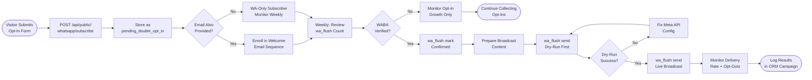

# SOP-EM-04 — WhatsApp Opt-In Management

**Owner:** Operations Manager / Content Strategist  
**Cadence:** Weekly opt-in review; daily monitoring during WABA verification period  
**Last updated:** 2026-05-01  
**Related:** [02-email-send.md](02-email-send.md) · [crm-operations/contact-management.md](../crm-operations/contact-management.md)

---

## Overview

This SOP governs the WhatsApp Business Account (WABA) opt-in capture pipeline: accepting subscribers via `/whatsapp-updates.html`, managing the pending opt-in list via the `wa_flush` CRM handler, confirming subscribers after WABA verification, and sending approved broadcasts via the Meta Cloud API.

**Current status (2026-05-01):** WABA verification in progress — target June 2026. Opt-ins are being collected now. No broadcasts until verification completes.

**System architecture:**
- Opt-in landing page: `netwebmedia.com/whatsapp-updates.html`
- Public API endpoint: `POST /api/public/whatsapp/subscribe` (stores `pending_double_opt_in`)
- CRM management UI: `crm-vanilla/whatsapp-subs.html` + `js/whatsapp-subs.js`
- CRM handler: `crm-vanilla/api/handlers/wa_flush.php`
- Meta Cloud API: called by `wa_flush.php` `send` action after WABA verification

**Legal requirement:** `pending_double_opt_in` rows include literal consent text per Meta's WABA legal requirement. Never skip this field.

**Success metrics (post-WABA verification):**
- Opt-in rate from `/whatsapp-updates.html`: ≥5% of page visitors
- Double opt-in confirmation rate: ≥60% of pending subscribers
- Message delivery rate: ≥95%
- Opt-out rate: <3% per broadcast

---

## Workflow



---

## Procedures

### 1. Opt-In Pipeline Overview (Reference)

The opt-in flow:

1. Visitor visits `netwebmedia.com/whatsapp-updates.html` or sees a CTA on any page
2. They submit the form (phone, name, optional email, optional topic/niche)
3. `POST /api/public/whatsapp/subscribe` stores a `pending_double_opt_in` row in `webmed6_nwm`
4. If email provided, the contact is also enrolled in the `welcome` email sequence
5. After WABA verification, a double opt-in confirmation message is sent via WhatsApp
6. On reply/confirmation, the status changes to `confirmed`

**Do NOT manually bypass the double opt-in step** — Meta WABA requires explicit consent documentation.

---

### 2. Weekly Opt-In Review (Monday, 10 min)

Check new opt-ins via the CRM admin panel:

1. Navigate to `netwebmedia.com/crm-vanilla/whatsapp-subs.html` (admin login required)
2. Review the opt-in table:
   - New `pending_double_opt_in` rows this week
   - Any rows with errors or invalid phone numbers
   - Growth trend (week-over-week)

**Via API:**
```bash
curl -H "X-Auth-Token: <token>" \
  "https://netwebmedia.com/crm-vanilla/api/?r=wa_flush&action=count"
```

Expected response:
```json
{
  "pending_double_opt_in": 47,
  "confirmed": 12,
  "opted_out": 2
}
```

**Note invalid phone numbers** (non-international format, disconnected numbers) — mark them manually if needed.

---

### 3. Post-WABA Verification: Confirming Subscribers

After WABA verification completes (target June 2026):

1. Send the Meta-approved double opt-in template message to all `pending_double_opt_in` subscribers:
   ```bash
   curl -H "X-Auth-Token: <token>" \
     "https://netwebmedia.com/crm-vanilla/api/?r=wa_flush&action=send&dry_run=1"
   ```
   Dry run first — confirms Meta API connectivity without sending.

2. If dry run succeeds:
   ```bash
   curl -H "X-Auth-Token: <token>" \
     "https://netwebmedia.com/crm-vanilla/api/?r=wa_flush&action=send"
   ```

3. Subscribers who reply confirm → status changes to `confirmed` via the webhook handler.

**Required Meta API environment variables** (set in `crm-vanilla/api/config.local.php` via GitHub Secrets):
- `WA_PHONE_ID` — Meta WABA phone number ID
- `WA_META_TOKEN` — Meta Cloud API access token
- `WA_META_APP_SECRET` — Meta webhook verification secret
- `WA_VERIFY_TOKEN` — Webhook verify token (for GET challenge)

Until these are set, `wa_flush send` returns 503 with a setup message (expected behavior).

---

### 4. Broadcast Content Preparation (Per send)

WhatsApp broadcasts via WABA can only use pre-approved message templates. Template approval workflow:

1. Design template content (text, variables, CTA button)
2. Submit for Meta approval via Meta Business Suite → WhatsApp → Message Templates
3. Wait 24–48h for approval (Meta reviews templates for policy compliance)
4. Once approved, reference the template by name in `wa_flush` send payloads

**Template structure requirements:**
- Header (optional): text, image, or document
- Body: 1024 characters max, supports `{{1}}` `{{2}}` variables
- Footer (optional): short disclaimer text
- CTA buttons (optional): up to 3 buttons (URL, phone, or quick-reply)

**Example approved template:**
```
Header: NetWebMedia — Digital Marketing Insights
Body: Hola {{1}}, tenemos nuevas estadísticas sobre marketing digital para {{2}}. 
      ¿Te interesa ver el análisis completo?
CTA: Ver análisis [URL: https://netwebmedia.com/blog/...]
```

---

### 5. Broadcast Execution (Post-WABA verification)

1. Prepare the CRM campaign record with broadcast details:
   ```json
   {
     "campaign_type": "whatsapp_broadcast",
     "wa_template_name": "monthly_insights",
     "wa_variables": ["first_name", "niche"],
     "segment": "confirmed_subscribers",
     "status": "ready_to_send"
   }
   ```

2. Run dry-run via CRM admin panel or API (always dry-run first)

3. Review dry-run output — check variable substitution, template name, recipient count

4. Trigger live broadcast via CRM panel button or API

5. Monitor delivery in Meta Business Suite → WhatsApp Insights

---

### 6. Opt-Out Processing (Same day)

When a subscriber opts out (replies STOP or uses WhatsApp block):

1. Meta webhook fires → `crm-vanilla/api/handlers/wa_flush.php` updates subscriber status to `opted_out`
2. Verify the webhook is configured: Meta Business Suite → Webhooks → WhatsApp → messages, message_deliveries, messaging_optins
3. Verify the webhook URL is: `https://netwebmedia.com/crm-vanilla/api/?r=wa_flush&action=webhook`
4. Opt-out contacts must never receive future broadcasts — the `wa_flush` send action filters out `opted_out` rows by default

---

### 7. CTA Coverage Audit (Monthly, 15 min)

Ensure all public-facing WhatsApp CTAs point to `/whatsapp.html` or `/whatsapp-updates.html` — NOT to direct `wa.me/` links:

**Check all CTAs:**
```bash
grep -r "wa.me" --include="*.html" .
```

Expected: zero results (or only legacy pages that have been deprecated). The 2026-05-01 sweep replaced all 28 direct `wa.me/` links. Any new pages added must use `/whatsapp.html?topic=<intent>` instead.

---

## Technical Details

### wa_flush Handler Actions

| Action | Description |
|---|---|
| `count` | Returns count of subscribers by status |
| `list` | Returns paginated subscriber list with filters |
| `mark` | Manually update subscriber status |
| `send` | Send broadcast to confirmed subscribers |
| `send&dry_run=1` | Simulate send without calling Meta API |
| `webhook` | Receive Meta webhook events |

### Consent Text Storage

The `POST /api/public/whatsapp/subscribe` endpoint stores:
```json
{
  "status": "pending_double_opt_in",
  "consent_text": "I agree to receive WhatsApp updates from NetWebMedia about digital marketing insights, promotions, and industry news. I can opt out at any time by replying STOP.",
  "consent_timestamp": "2026-05-01T10:23:00-04:00",
  "ip_address": "<hashed>",
  "source_page": "/whatsapp-updates.html"
}
```

This exact text is required by Meta WABA policy. Do NOT modify the consent text wording without re-reviewing Meta's requirements.

---

## Troubleshooting

| Issue | Likely cause | Fix |
|---|---|---|
| `wa_flush send` returns 503 | `WA_PHONE_ID` or `WA_META_TOKEN` not set | Set GitHub Secrets and redeploy; verify `config.local.php` has the defines |
| Meta webhook not receiving events | Webhook URL not registered or verify token mismatch | Re-register webhook in Meta Business Suite, verify `WA_VERIFY_TOKEN` matches |
| Double opt-in message not delivered | Template not approved or phone number format wrong | Check Meta template status; ensure phone number is in E.164 format (+1234567890) |
| Subscriber opt-out not recorded | Webhook not processing STOP replies | Test webhook with Meta's webhook tester, check `wa_flush webhook` handler logs |
| Template rejected by Meta | Policy violation (no explicit offer, misleading CTA) | Review Meta's template policy, rewrite content to be informational not promotional |
| Phone numbers failing delivery | Invalid or landline numbers in list | Run phone number validation before import; filter out non-mobile numbers |

---

## Checklists

### Weekly Opt-In Review
- [ ] CRM admin panel opened, opt-in count reviewed
- [ ] New pending subscribers this week counted and logged
- [ ] Invalid phone numbers flagged
- [ ] Growth trend noted in weekly report

### Pre-Broadcast (Post-WABA Verification)
- [ ] Message template submitted and approved by Meta
- [ ] CRM campaign record created with broadcast details
- [ ] Subscriber segment confirmed (only `status = 'confirmed'`)
- [ ] Dry-run executed and output reviewed
- [ ] Variable substitution verified in dry-run

### Post-Broadcast
- [ ] Delivery rate checked in Meta Business Suite
- [ ] Opt-out count logged
- [ ] CRM campaign record updated with send metrics
- [ ] Opt-outs marked in subscriber list

### Monthly CTA Audit
- [ ] `grep -r "wa.me"` returns zero direct links in HTML files
- [ ] All WhatsApp CTAs point to `/whatsapp.html` or `/whatsapp-updates.html`
- [ ] Consent text in subscribe endpoint verified unchanged

---

## Related SOPs
- [02-email-send.md](02-email-send.md) — Email broadcast as parallel channel
- [crm-operations/contact-management.md](../crm-operations/contact-management.md) — Contact record management
- [operations-admin/monitoring.md](../operations-admin/monitoring.md) — Webhook health monitoring
