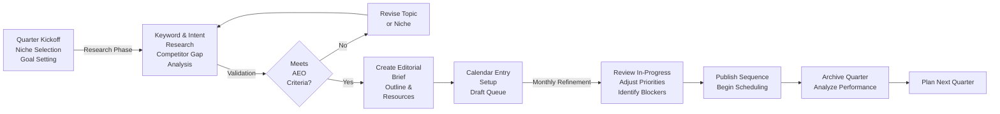

## Overview

This SOP documents the content planning process for NetWebMedia's multi-channel content strategy: blog posts, email sequences, social media, and landing pages. Content planning drives the editorial calendar, ensures brand consistency, aligns with business goals, and optimizes for SEO/AEO across 14 industry niches.

The process runs on a **quarterly planning cycle** (Jan-Mar, Apr-Jun, Jul-Sep, Oct-Dec) with monthly refinement sprints. Each quarter targets a **content cluster per niche** (minimum 2 pillar posts + 5-10 supporting assets). Topics are researched for AI search intent, featured snippets, and knowledge panels.

**Key Metrics:** 12-16 clusters/quarter, 48-64 total assets, 2-3 months lead time from research to publish.

## Workflow Diagram



## Step-by-Step Procedures

### 1. Quarter Kickoff & Niche Selection (Days 1-3)

**Purpose:** Define quarterly content direction and select which niches to target.

**Steps:**
1. Schedule quarterly planning meeting (1 hour, Content Strategist + CMO + Product Manager)
2. Review prior quarter performance: GA4 top posts, email engagement, social reach, rank position gains
3. Identify business priorities from `plans/execution-90day.html` — which niches align with sales focus?
4. Audit current niche coverage (use `_deploy/content-niche-coverage.json` tracker):
   - Green (4+ clusters): skip or go minimal
   - Yellow (2-3 clusters): prioritize
   - Red (0-1 cluster): urgent
5. Select 4 niches for deep content clusters (2 pillar posts + 8-10 assets each)
6. Document in `_deploy/q<N>-content-plan.md`: selected niches, business drivers, success metrics
7. **Action:** Create CRM campaign record:
   ```
   POST /api/resources/campaign
   {
     "type": "campaign",
     "data": {
       "name": "Q2 2026 Content Cluster: Legal Tech",
       "status": "planning",
       "niche": "law_firms",
       "quarter": "Q2 2026",
       "clusters_target": 4,
       "assets_target": 48,
       "start_date": "2026-04-01",
       "end_date": "2026-06-30"
     }
   }
   ```

---

### 2. Keyword & Intent Research (Days 4-10)

**Purpose:** Identify high-value topics with AEO potential (AI Overviews, featured snippets, knowledge panels).

**Steps:**
1. **Primary research:**
   - Use Google Search Console: analyze top queries landing on niche pages
   - Google Trends: seasonal volume by niche keyword cluster
   - SimilarWeb / Ahrefs (if available): competitor content gaps
   - Reddit / Quora: "What do X professionals ask about Y?"
   
2. **AEO-specific validation:**
   - Run each topic through Google Search: does it show an AI Overview?
   - If yes: analyze the featured source (news article? definition page? how-to?). Can we outrank it?
   - If no: is there a featured snippet? Knowledge panel? Rich result (FAQPage)?
   - Target minimum 60% of chosen topics already have AI Overviews (high intent validation)
   
3. **Build topic matrix** in `_deploy/q<N>-topic-matrix-<niche>.csv`:
   ```
   Topic,Search Volume,Difficulty,Featured Snippet?,AI Overview?,Cluster Role,Pillar/Support
   "How to get your law firm cited in AI overviews",120,45,Yes,Yes,Citations,Pillar
   "Local SEO vs AEO for law firms",80,38,No,Yes,Channel Choice,Pillar
   "AI discovery: law firm keywords 2026",150,40,Yes,Yes,Research,Support
   ```
   
4. **Niche-specific schema decisions:** Which entity types for this niche?
   - Law firms → `LegalService`, `Attorney`, `LocalBusiness`, `FAQPage`
   - Restaurants → `Restaurant`, `LocalBusiness`, `AggregateRating`
   - Healthcare → `MedicalOrganization`, `Physician`, `FAQPage`
   
5. **Document in editorial brief** (see Step 3)

---

### 3. Create Editorial Brief & Outline (Days 11-15)

**Purpose:** Lock in research, create a master brief that writers use end-to-end.

**Steps:**
1. Create brief document at `_deploy/briefs/q<N>-<niche>-pillar-1.md`:
   ```markdown
   # Editorial Brief: How to Get Your Law Firm Cited in AI Overviews
   
   **Cluster:** Q2 2026 Legal Services
   **Type:** Pillar Post
   **Target Word Count:** 2,000–2,200 words
   **Format:** How-to + Reference
   **Schema:** Article + FAQPage + LegalService
   
   ## Intent & Target Audience
   - Primary: Law firm partners, marketing directors
   - Search intent: "How do I get my firm in AI search results?"
   - AEO angle: What signals does Claude/ChatGPT/Perplexity prioritize?
   
   ## Outline (nested, with section word counts)
   
   1. Intro (150–200 words)
      - Why law firms are invisible in AI Overviews
      - What we'll cover
   
   2. AEO Signal #1: Structured Data (LegalService Schema) (300–350 words)
      - What Google AI reads
      - Example schema snippet
      - Implementation steps (3 steps)
   
   3. AEO Signal #2: Local Citations (300–350 words)
      - Citation sources that matter
      - Check your firm's coverage
      - How to add missing citations
   
   4. AEO Signal #3: Topical Authority (400–500 words)
      - What "authority" means in AI context
      - Build topical depth (practice areas, locations)
      - Link your practice-area pages internally
   
   5. FAQ Section (8–10 questions, 300–400 words)
      - Will my firm appear in ChatGPT?
      - How long before changes show up in AI?
      - Is AEO different from SEO?
      - (etc.)
   
   6. Tools & Resources (100–150 words)
      - Link to Schema.org validator
      - Citation check tools
      - Topical Authority audit checklist
   
   7. Conclusion (100–150 words)
      - Recap the 3 signals
      - Next steps
   
   ## Key Sources to Cite
   - Anthropic docs on how Claude retrieves sources
   - Google Search Central guidance on structured data
   - Industry examples (Above the Law, Law.com articles)
   
   ## Visual Assets Needed
   - 1 diagram: "AEO citation flow" (source → AI model → output)
   - 1 table: "Citation platforms by practice area"
   
   ## Internal Links (must include)
   - Link to: /industries/legal-services/index.html (industry hub)
   - Link to: /blog/legal-services-local-seo-vs-aeo.html (sister pillar)
   - Link to: Any practice-area pages the firm hosts
   
   ## Deliverables
   - Draft HTML (with schema blocks)
   - Alt text for all images
   - Email snippet (200 words, summary)
   - Social quote (280 chars, quote from post)
   ```

2. Share brief with Content Strategist for review (1 day turnaround)
3. Assign to writer(s) + set due date (10–12 days for draft)
4. **Action:** Create CRM task:
   ```
   POST /api/resources/task
   {
     "type": "task",
     "data": {
       "title": "Write: How to Get Law Firm Cited in AI Overviews",
       "assigned_to": 3,  // writer ID
       "due_date": "2026-05-15",
       "campaign_id": 142,  // Q2 content campaign
       "status": "assigned",
       "priority": "high"
     }
   }
   ```

---

### 4. Content Calendar Setup (Days 16-20)

**Purpose:** Lock in publish dates, coordinate across channels, prevent conflicts.

**Steps:**
1. Open shared Google Calendar (`netwebmedia-editorial` — shared with team)
2. Block publish dates (Mon/Wed for pillar posts, daily for social) for next 12 weeks
3. For each cluster:
   - Week 1: Pillar #1 blog launch (Wed)
   - Week 2: Email sequence (Monday sequence send)
   - Week 3: Pillar #2 blog launch (Wed)
   - Week 4: Social carousel (5 slides, M–F)
   - Week 5+: Support asset drips (how-to snippets, case studies)
4. **Block out in Google Calendar:**
   - Color code by niche (color palette in `plans/brand-book.html`)
   - Event description: draft link, status, assignee
5. Create queue tracking in `_deploy/content-queue-q<N>.md`:
   ```markdown
   | Date | Type | Niche | Title | Status | Assigned | Links |
   |---|---|---|---|---|---|---|
   | May 8 | Blog | law_firms | How to Get Cited in AI | Draft→Review | Sarah | [brief](link) |
   | May 15 | Email | law_firms | AEO for Lawyers #1 | Planning | Alex | [sequence](link) |
   | May 20 | Social | law_firms | AEO carousel 5-post | Template | Design | [assets](link) |
   ```
6. Update `plans/index.html` with link to current quarter's calendar
7. **Action:** Populate CRM calendar with blog publish events:
   ```
   POST /api/resources/event
   {
     "type": "event",
     "data": {
       "title": "Publish: How to Get Law Firm Cited in AI Overviews",
       "date": "2026-05-08",
       "time": "09:00",
       "event_type": "content_publish",
       "niche": "law_firms",
       "campaign_id": 142
     }
   }
   ```

---

### 5. Draft Review & Feedback Loop (Days 21-35)

**Purpose:** Ensure brand voice, SEO, and niche correctness before publish.

**Steps:**
1. Writer submits draft HTML + supporting assets (email snippet, social quote) to shared folder
2. Content Strategist reviews for:
   - Brand voice alignment (check against `BRAND.md` and prior posts)
   - Outline adherence (matches editorial brief)
   - AEO optimization (schema blocks present, AI-sourced sections identified)
   - Internal link count (minimum 3–5 to related niche pages)
   - Word count accuracy (within brief range)
   - CTA clarity (next step for reader)
3. If revisions needed:
   - Comment directly in doc (track changes enabled)
   - Tag writer with due date (2–3 days)
   - Loop repeats until "approved"
4. CMO final sign-off (1 day)
5. **Action:** Update CRM task status:
   ```
   PUT /api/resources/task/<id>
   {
     "status": "in_review",
     "comments": "Draft submitted. Awaiting strategy review."
   }
   ```

---

### 6. Monthly Refinement & Priority Adjustment (Every 4th Friday)

**Purpose:** Review in-progress content, adjust schedule if needed, identify blockers.

**Steps:**
1. Sync meeting: Content Strategist + CMO + 1 writer (30 min)
2. **Review current status:**
   - % of content in draft (target: 70%+)
   - % of content approved/scheduled (target: 50%+)
   - Any missed deadlines? Document root cause
3. **Identify blockers:**
   - Writer stuck on research? Assign additional research
   - Designer backlog for visuals? Prioritize high-impact pieces
   - Topic feedback from sales? Pivot if significantly off-target
4. **Adjust next month priorities** if business focus shifted (e.g., new niche became top priority)
5. **Document in `_deploy/q<N>-refinement-notes.md`:**
   ```markdown
   ## Refinement: May 24, 2026
   
   ### Status
   - Drafts complete: 3/4 (75%) ✓
   - Approved & scheduled: 2/4 (50%)
   
   ### Blockers
   - Healthcare pillar #2 waiting on medical expert quote (+3 days)
   - Social carousel visual delayed by 1 week (design capacity)
   
   ### Adjustments
   - Move healthcare pillar #2 publish from May 22 → May 29
   - Prioritize restaurant carousel for May 20 original date
   ```

---

### 7. Archive & Quarterly Analysis (Days 85-90)

**Purpose:** Document what worked, plan next quarter.

**Steps:**
1. Pull GA4 report for all quarter's published content (4 weeks post-publish):
   - Page views, bounce rate, average session duration, conversion rate
   - Sort by niche and compare to baseline
2. Pull email engagement data:
   - Open rate, click rate, conversion to lead
3. Pull social analytics:
   - Reach, engagement, click-through rate by platform
4. **Create end-of-quarter report** at `_deploy/q<N>-performance-report.md`:
   ```markdown
   # Q2 2026 Content Performance
   
   ## Overview
   - Content published: 48 assets across 4 niches
   - Time to publish (avg): 8.2 weeks
   - Budget variance: +5% (overage in freelance writing)
   
   ## By Niche Performance
   
   ### Legal Services (10 assets)
   - Avg page views/post: 2,240 (↑15% vs Q1)
   - Avg engagement (email): 18% open, 4.2% click
   - Top performer: "AI Citations" pillar (3,800 views, 22% email CTR)
   
   ### Hospitality / Tourism (12 assets)
   - Avg page views/post: 1,680 (↓8% vs Q1)
   - Seasonal dip noted; recommend Q3 repositioning
   
   ## Lessons Learned
   - How-to format outperformed interview-based posts by 3:1
   - Social carousel format (5 slides) saw 2.4x reach vs single-image
   - Email sequences with clear CTAs had 6% CTR vs 2% for newsletter-style
   
   ## Next Quarter Recommendations
   - Double down on how-to format
   - Increase carousel frequency (weekly vs bi-weekly)
   - Add "Resource Hub" aggregation pages for top-performing niches
   ```

5. **Archive all briefs & drafts** to `_deploy/archive/q<N>/`
6. Schedule planning meeting for next quarter (see Step 1)

---

## Technical Details

### Google Calendar Integration

- **Shared Calendar URL:** https://calendar.google.com/calendar/u/0?cid=netwebmedia-editorial@company.com
- **Color Coding:** By niche (navy = law_firms, orange = restaurants, etc.)
- **Event Fields Required:**
  - Title: "Publish: [Post Title]" or "Send: [Email Sequence]"
  - Date & Time: 09:00 UTC (publish time, triggers GA4 event)
  - Description: Link to draft doc + status
  - Calendar: netwebmedia-editorial
- **Sync:** Content Strategist syncs calendar to CRM campaign records (manual; runs after Day 20 calendar finalization)

### CRM Campaign Record Schema

Content planning creates a `campaign` resource to track niche clusters:

```json
{
  "type": "campaign",
  "data": {
    "name": "Q2 2026 Content Cluster: [Niche]",
    "campaign_type": "content_cluster",
    "niche": "law_firms",  // enum, 14 niches only
    "quarter": "Q2 2026",
    "status": "planning|active|completed",
    "clusters_target": 4,
    "assets_target": 48,
    "assets_published": 0,
    "start_date": "2026-04-01",
    "end_date": "2026-06-30",
    "budget_allocated": 25000,
    "budget_spent": 0,
    "lead_owner": "content-strategist-id",
    "cms_folder": "s3://nwm-content/q2-2026-legal/",
    "ga4_event_prefix": "q2_2026_legal_",
    "tags": ["aeo", "law_firms", "2026-strategy"]
  }
}
```

### Editorial Brief Template

Location: `_deploy/briefs/` (shared with writers; version-controlled in git)

Minimum fields:
- Title, cluster, type (pillar/support), target word count, format
- Intent & audience (1-2 paragraphs)
- Nested outline with section word counts
- Key sources to cite (3-5 minimum)
- Internal links required (specific URLs)
- Visual assets needed (diagrams, tables, images)
- Schema types required (Article, FAQPage, niche-specific)
- Email snippet word count, social quote max chars
- Deliverable checklist (HTML, alt text, email, social)

### AEO Validation Checklist

Before approving a topic for the calendar, Content Strategist must verify:

- [ ] Google Search shows AI Overview for target query
- [ ] At least 1 featured snippet or knowledge panel exists (validates query intent)
- [ ] Competitor analysis: none of top 3 results cover this exact angle (identify gap)
- [ ] Schema mapping: we can use at least 2 structured data types (Article + FAQPage minimum)
- [ ] Topical fit: aligns with niche expertise (e.g., healthcare post uses medical terminology)
- [ ] Keyword density: target keyword appears 3-5 times in natural context (not forced)
- [ ] Internal link opportunities: ≥3 existing niche pages can link to this (strengthens topical graph)

If ≥5 checkboxes are unchecked, flag topic for refinement.

---

## Troubleshooting

| Issue | Cause | Solution |
|---|---|---|
| **Writer misses deadline** | Unclear scope, conflicting priorities, research gaps | Sync with writer within 24 hrs; identify blocker; extend deadline if external (expert quote, research tool). Document root cause in refinement notes. |
| **Draft doesn't match brief outline** | Writer interpreted outline loosely, added tangential sections | Have Content Strategist rework outline with writer before revision. Make checklist-style outline in future briefs. |
| **Topic underperforms in GA4** | Poor keyword targeting, low search intent, missing AI Overview | Don't repeat format next quarter. For underperformers, A/B test: swap internal link strategy, add different CTA, republish with new title. Archive post-mortem. |
| **Publish date slips repeatedly** | Calendar over-committed, no buffer for reviews | Reduce clusters from 4 to 3 per quarter; add 1-week review buffer. Publish fewer assets, higher quality. |
| **Email engagement flat** | Sequence copy generic, CTA unclear, send time poor | Analyze top-performing sequences for copy patterns; rewrite underperformers; test send times in GA4. |
| **No schema showing in search preview** | Schema block missing or malformed JSON-LD | Use schema.org validator tool post-publish. For backlog: rerun `_add_schema.py` with corrected niche code. |

---

## Checklists

### Quarterly Planning Checklist
- [ ] Prior-quarter performance reviewed (GA4, email, social analytics)
- [ ] Business priorities from `plans/execution-90day.html` mapped to niches
- [ ] Niche coverage audit completed (green/yellow/red status for all 14 niches)
- [ ] 4 niches selected for deep content clusters
- [ ] Q<N> content plan documented at `_deploy/q<N>-content-plan.md`
- [ ] CRM campaign record created for each niche cluster
- [ ] Team kickoff meeting scheduled (Content Strategist, CMO, Product Manager)

### Editorial Brief Completion Checklist
- [ ] Research completed: keyword matrix, AEO validation, schema decisions documented
- [ ] Outline drafted with section word counts (matches 2,000–2,200 word target)
- [ ] Internal link targets identified (≥3 related niche pages)
- [ ] Key sources listed (≥3 authoritative)
- [ ] Visual assets defined (diagrams, tables, images with dimensions)
- [ ] Schema types specified (Article + FAQPage + niche-specific minimum)
- [ ] Email snippet requirement noted (200 words max)
- [ ] Social quote requirement noted (280 chars max)
- [ ] Assigned to writer with due date
- [ ] CRM task created and linked to campaign

### Content Calendar Lock-In Checklist
- [ ] Google Calendar blocked for next 12 weeks (Mon/Wed publishes, daily social)
- [ ] All cluster publish dates set (pillar #1 → email → pillar #2 → social carousel → support assets)
- [ ] No conflicts (e.g., two blog publishes same day)
- [ ] Color coding by niche applied
- [ ] Event descriptions include draft links and assignee names
- [ ] Content queue CSV updated (`_deploy/content-queue-q<N>.md`)
- [ ] CRM calendar events created for all blog publishes
- [ ] Team invited to Google Calendar and notified of dates

### Monthly Refinement Checklist
- [ ] Status review completed: % drafts, % approved, % scheduled
- [ ] Blocker identification documented (writer, design, research, feedback)
- [ ] Adjustments to next-month schedule made (if any)
- [ ] Root cause of missed deadlines documented
- [ ] Refinement notes added to `_deploy/q<N>-refinement-notes.md`
- [ ] Next month priorities prioritized in content queue
- [ ] Team synced on changes (email or meeting)

---

## Related SOPs

- **02-blog-publication.md** — How-to for publishing drafted blog posts, SEO optimization, CMS workflow
- **03-social-production.md** — Carousel asset creation, social scheduling, engagement monitoring
- **04-campaign-assets.md** — Email sequences, landing pages, downloadable resources
- **crm-operations/workflow-automation.md** — CRM automation for content campaigns (auto-enroll contacts in email sequences on publish)
- **customer-success/qbr.md** — Using content performance data in quarterly business reviews (reference GA4 analytics in QBR discussion)
