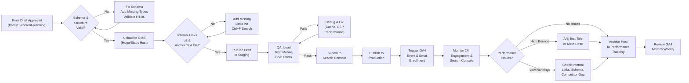

# SOP: Blog Publication & SEO Optimization

**Owner:** Content Strategist  
**Last Updated:** 2026-05-01  
**Version:** 1.0  
**Status:** Active  
**Related SOPs:** 01-content-planning.md, 03-social-production.md, 04-campaign-assets.md, crm-operations/reporting.md

---

## Overview

This SOP governs the publication, optimization, and promotion of blog posts to `netwebmedia.com/blog/`. It covers the complete workflow from final draft approval through CMS publication, SEO validation, schema verification, internal linking, and ongoing performance monitoring. Success metrics include: average Time to First Byte <200ms, Core Web Vitals pass (100% pages), schema validation (zero errors), internal link coverage (≥3 per post), GA4 tracking activation (100% posts), email list inclusion (100% within 24h), and social scheduling completion within 48h of publish.

---

## Horizontal Workflow Diagram



---

## Procedures

### 1. Final QA & Schema Validation (4 hours before publish)

**Step 1.1:** Retrieve the final approved draft from the editorial tracking spreadsheet (column "Status: Ready to Publish"). Confirm with Content Strategist that feedback has been incorporated and no further revisions are needed.

**Step 1.2:** Validate the document structure in the CMS editor:
- Heading hierarchy: H1 (title only) → H2 (section headers) → H3 (subsections max)
- No skipped heading levels (e.g., H1 directly to H3)
- All images have `alt` text (minimum 10 words describing content, not keyword stuffing)
- Lists are semantic (`<ul>` / `<ol>`, not fake lists with dashes)

**Step 1.3:** Validate JSON-LD schema blocks:
```javascript
// Validate using schema.org validator in CMS preview
// Required for every blog post:
{
  "@context": "https://schema.org",
  "@type": "Article",
  "headline": "Exact H1 Title",
  "author": { "@type": "Organization", "name": "NetWebMedia" },
  "datePublished": "2026-05-15",
  "dateModified": "2026-05-15",
  "image": "https://netwebmedia.com/images/featured.jpg",
  "description": "80-char meta description matching on-page text"
}
// PLUS niche-specific schema:
// law_firms → Attorney / LegalService
// restaurants → Restaurant / Recipe (if food post)
// healthcare → MedicalOrganization / HealthTopicContent
// tourism → TouristAttraction / LodgingBusiness (per niche)
// and FAQPage if post contains >2 Q&A sections
```

**Step 1.4:** Use the schema.org validator tool (paste HTML into https://validator.schema.org/) and confirm:
- Zero errors (warnings OK if non-blocking)
- All required fields present (headline, author, datePublished, description)
- Type matches post intent (Article for strategy, HowTo for guides, FAQPage for Q&A)

**Step 1.5:** If schema fails, edit the draft immediately:
- Add missing fields (dateModified should always equal datePublished on first publish)
- Fix type mismatches (if post is Q&A-heavy, ensure FAQPage is present; if it's a guide, add HowToStep array)
- Revalidate and confirm zero errors before proceeding

---

### 2. Internal Linking & SEO Anchor Setup (2-3 hours)

**Step 2.1:** Retrieve the "Internal Link Opportunities" list from the editorial brief (created in 01-content-planning.md). This list includes 3–5 existing NetWebMedia pages that should be linked to from this post.

**Step 2.2:** Search the post text for natural anchor placement using Ctrl+F:
- Look for noun phrases matching the target link (e.g., "conversion rate optimization" → link to `/blog/conversion-optimization.html`)
- Scan headings and body text for organic opportunities (not forced keyword insertions)
- Avoid over-linking: maximum 1 internal link per 300 words to maintain UX

**Step 2.3:** Insert internal links with descriptive anchor text:
- **Good anchor:** "Learn how [page topic] in our [content type] guide" → links to `/blog/page.html`
- **Bad anchor:** "click here" or bare URL
- **Never:** Link keyword-stuffed anchors (e.g., "best legal marketing software for law firms" is too long and looks spammy)

**Step 2.4:** Validate link targets exist and return 200 (not 404):
```bash
# Test each link URL in cURL:
curl -s -o /dev/null -w "%{http_code}" https://netwebmedia.com/blog/target-page.html
# Should return 200, not 301/302 (redirects are OK but slow), not 404
```

**Step 2.5:** If a link target returns 404, do NOT add the link. Instead, check the "Related SOPs" section at the end of this document—there may be a newer URL to use. If not, note it for future blog planning (indicates a gap post that should be created).

**Step 2.6:** Confirm:
- Minimum 3 internal links added (from the brief's "Internal Link Opportunities")
- All links test 200 (or known working 301)
- Anchor text is natural and descriptive
- Link density ≤ 1 per 300 words
- No broken links (404s)

---

### 3. CMS Upload & Staging Deploy (1 hour)

**Step 3.1:** Log into the CMS editor (location: `/admin/posts/` on staging or your local instance). If using a static-site generator like Hugo, commit the `.md` file to the blog source directory.

**Step 3.2:** Configure post metadata in the CMS:
- **Title (H1):** Exact match to the final approved title from the editorial brief
- **Slug:** URL-friendly version (lowercase, hyphens, no special chars)
  - Example: "legal-services-local-seo-vs-aeo.html"
  - Rule: slug must match the filename for consistency
- **Meta Description (160 chars max):** Pulled from brief's "Meta Description" field; test with a search result preview tool
- **Featured Image:** Minimum 1200×630px, optimized JPG/PNG (< 200KB)
- **Publication Date:** Use today's date (or scheduled publish time if delay is intended)
- **Author:** "NetWebMedia" (organization name, not individual byline for consistency)
- **Category/Niche:** Must match one of the 14 canonical niches (law_firms, restaurants, healthcare, etc.)
- **Tags:** 3–5 topic tags (lowercase, separated by commas)

**Step 3.3:** Verify the CMS preview (staging URL) loads without errors:
- Page renders fully (no blank sections, missing images, or JS errors)
- Schema blocks render (check browser DevTools → Network → schema block request, should 200)
- Images load and have alt text visible in DevTools → Accessibility panel

**Step 3.4:** Test mobile responsiveness:
```
In Chrome DevTools (F12 → Device Toggle):
  - iPhone 12 (375×812): text readable, images scale, no horizontal scroll
  - iPad (768×1024): same
  - Desktop (1280×800): desktop layout active
```

**Step 3.5:** If tests fail, return to the CMS editor and fix:
- Images not loading? Check file paths (absolute vs relative—use absolute `/blog/images/...`)
- Schema errors? Revalidate with schema.org validator
- Mobile text too small? Likely CSS issue—check `css/styles.css` for mobile breakpoints

---

### 4. Search Console & Publishing (1 hour)

**Step 4.1:** Copy the final staging URL and submit it to Google Search Console:
```
In Google Search Console → Inspect URL:
  URL: https://netwebmedia.com/blog/final-post-slug.html
  → Click "Request Indexing"
  → Google will crawl and index within 24–48h
```

**Step 4.2:** In the CMS, change post status from "Draft" to "Published" or run the deploy command (depends on your platform):
```bash
# If using Hugo or static site generator:
git add blog/post.md
git commit -m "blog: publish [post-title] for [niche]"
git push origin main
# The deploy-site-root.yml workflow will auto-trigger

# If using a traditional CMS (WordPress, etc.):
# Click "Publish" button in the editor UI
```

**Step 4.3:** Verify the post is live at the production URL (not staging):
```bash
curl -s -o /dev/null -w "%{http_code}" https://netwebmedia.com/blog/post-slug.html
# Should return 200 within 60 seconds of publish
```

**Step 4.4:** If live URL returns 404, check:
- Deployment status in GitHub Actions (`deploy-site-root.yml`)
- File path in repo matches the expected URL structure
- `.htaccess` rewrite rules are correct (if using Apache)

---

### 5. GA4 Tracking & Email Enrollment (30 minutes)

**Step 5.1:** Enable GA4 tracking for the published post:
```javascript
// GA4 event: fire on post load (auto-tracked by ga4 script loaded sitewide)
// Event name: "page_view"
// Event parameters:
// - page_title: "[Post Title]"
// - page_location: "https://netwebmedia.com/blog/post-slug.html"
// - niche: "law_firms" (enum from the 14 canonical niches)
// - content_type: "pillar" or "support" (from editorial brief)
// - quarter: "Q2 2026" (from campaign planning)
// These are auto-captured by ga4 script if post metadata tags are correct
```

**Step 5.2:** Create a CRM campaign record for email enrollment (if this post is part of a monthly email sequence):
```
POST /api/resources/campaign
{
  "type": "campaign_content_email",
  "data": {
    "post_id": "legal-seo-vs-aeo",
    "post_title": "Legal Services Local SEO vs AEO: Which Strategy Wins in 2026?",
    "post_url": "https://netwebmedia.com/blog/legal-services-local-seo-vs-aeo.html",
    "niche": "law_firms",
    "quarter": "Q2 2026",
    "email_sequences": ["audit_followup", "welcome"],
    "email_send_date": "2026-05-16T09:00:00Z",
    "segment_tags": ["law_firms", "SEO", "AEO"],
    "ga4_event_prefix": "blog_legal_seo_aeo"
  }
}
```
Response includes `campaign_id` for tracking.

**Step 5.3:** Verify email enrollment in the CRM:
- Log into `netwebmedia.com/crm-vanilla/` as an admin
- Navigate to Campaigns → filter by niche "law_firms"
- Confirm the post appears in the campaign content list with status "Active"

**Step 5.4:** If email enrollment fails (API returns 400):
- Check that `niche` value is one of the 14 canonical niches (case-sensitive)
- Verify `email_send_date` is ISO 8601 format
- Confirm `email_sequences` array references existing sequences (check CRM Campaigns section for valid sequence names)

---

### 6. Social & Promotion Scheduling (48 hours)

**Step 6.1:** The social production team will handle scheduling within 48h of publication (see 03-social-production.md for detail). Content Strategist triggers this by setting the campaign status to "Ready for Social" in the CRM.

**Step 6.2:** Verify social queue in CRM:
- Dashboard → Social Queue → filter by post title
- Confirm 3 social variants (LinkedIn, Instagram, TikTok) are scheduled
- Check publish times (LinkedIn 8am–10am PT, Instagram 9am–12pm PT, TikTok 7pm–10pm PT per geo-targeting rules)

---

### 7. 24-Hour Performance Monitoring (1–2 hours over 24h window)

**Step 7.1:** Set a reminder to check GA4 at 24h and 72h post-publication. Metrics to monitor:
- **Page Views:** Expect 20–150 sessions in first 24h (baseline is 30–50 for avg blog post)
- **Bounce Rate:** <60% is good, >75% indicates title/meta description mismatch or poor relevance
- **Avg Session Duration:** >2 min indicates readers are engaging; <1 min suggests content mismatch
- **Click Through Rate (Internal Links):** >5% of sessions should click ≥1 internal link

**Step 7.2:** In GA4 dashboard:
```
Explore → Custom event analysis
  Event: page_view
  Filter: page_location contains "/blog/post-slug"
  Time range: Last 24 hours
  Breakdown by: traffic_source
  
Expected sources: organic (Google, Bing), direct, referral (email click-through)
Anything from utm_source=facebook/instagram means social team already promoted (good!)
```

**Step 7.3:** Check Search Console impression data at 24h and 72h:
```
Search Console → Performance → Search Results
  Filter URL: https://netwebmedia.com/blog/post-slug.html
  Date range: Last 7 days
  
Metrics:
  - Impressions: should show ≥100 impressions by day 3 (Google indexed post)
  - Average CTR: target >3% (depends on competition; law-firm posts usually 2–5%)
  - Average Position: target top 10 for primary keyword (new post may start at position 50+, improves with age + backlinks)
```

**Step 7.4:** If 24h performance is below baseline:
- **Bounce >75%:** A/B test the meta description or title. Use Search Console data to identify impression-generating keywords, then optimize description to match search intent.
- **No impressions by 72h:** Check Google Search Console for crawl errors (`inspect URL` → "Coverage" tab). If page is not indexed, resubmit.
- **Ranking at position 50+:** Confirm internal links are in place (step 2), check for schema errors, and compare competitor content (are they deeper, longer, more recent?).

---

### 8. Weekly Performance Review & Optimization (Fridays, 1 hour)

**Step 8.1:** Every Friday (or Monday for posts published in previous week), pull GA4 report for posts published in the last 7–30 days:
```
GA4 → Explore → Time Period Analysis
  Event: page_view
  Filter: page_title contains "[niche] OR [quarter]"
  Time range: Last 30 days (rolling)
  Dimensions: page_title, traffic_source, user_engagement_duration
  Metrics: users, engagement_rate, average_engagement_time
```

**Step 8.2:** Rank posts by engagement:
1. High engagement (>3 min avg, >40% engagement rate): Repurpose as social series or email campaign
2. Medium engagement (1.5–3 min avg): Monitor; no action unless bounce >70%
3. Low engagement (<1.5 min avg, >70% bounce): Flag for optimization (see step 7.4)

**Step 8.3:** For low-engagement posts, implement quick fixes within 5 days:
- Rewrite title to match top search queries (check Search Console Performance tab)
- Update meta description to clarify value proposition
- Improve CTR on internal links (consider anchor text changes)
- Test new CTA text in email (if post is in drip sequence)

**Step 8.4:** Document weekly findings in a running "Performance Notes" tab in the editorial tracking spreadsheet:
```
Post Title | Publish Date | Avg Session Duration | Bounce Rate | Engagement Rate | Action Taken | Status
Legal Tech SEO | 2026-05-10 | 2.3 min | 65% | 45% | Rewrite meta desc | Monitoring
Restaurant AEO | 2026-05-12 | 1.2 min | 78% | 25% | A/B test title | In progress
```

---

### 9. Monthly Backlink & Referral Audit (Monthly, 2 hours)

**Step 9.1:** On the 25th of each month, review backlink performance in Search Console:
```
Search Console → Links → Top Linked Pages
  Filter: page_location contains "/blog/"
  Sort: Descending by count of referring sites
  
Goal: Identify posts earning natural backlinks (high referral authority)
Action: Reach out to 2–3 top referring domains with follow-up content or collaboration offers
```

**Step 9.2:** Cross-reference with GA4 referral traffic:
```
GA4 → Acquisition → Traffic Source Detail
  Filter: traffic_source = "referral"
  Breakdown by: source_medium
  
High-value referrers (>10 clicks/month): Law associations, industry directories, CMS ecosystems
Low-value referrers (1–5 clicks/month): Forum posts, comments (often spam, tag as "low-intent")
```

---

## Technical Details

### GA4 Event Schema for Blog Posts

```javascript
// Auto-captured on blog post page load (sitewide ga4 script)
{
  event: "page_view",
  page_location: "https://netwebmedia.com/blog/slug.html",
  page_title: "Post Title | NetWebMedia",
  page_referrer: "[previous page]",
  user_id: "[hashed email or GA session ID]",
  content_type: "pillar", // or "support", from brief
  content_niche: "law_firms", // canonical niche enum
  quarter: "Q2 2026",
  campaign_id: "[UUID from CRM campaign record]",
  engaged: true, // true if session_duration > 10s
  session_duration: [variable],
  scroll_depth: "[0-25%, 25-50%, 50-75%, 75-100%]" // auto-tracked
}
```

### CMS Metadata Requirements

Every blog post in the CMS must include:
- **Title (H1):** Unique, 50–60 chars, includes primary keyword, question or benefit format
- **Meta Description:** 155–160 chars, unique, includes primary + secondary keyword, call-to-action word (e.g., "Learn," "Discover," "Get free")
- **Featured Image:** Minimum 1200×630px (16:9 aspect ratio), optimized <200KB JPG/PNG, file name matches slug (e.g., `legal-seo-vs-aeo.jpg`)
- **Alt Text:** Image alt text ≥10 words describing image content, not keyword-stuffed
- **Schema Type:** Article + FAQPage (if ≥2 Q&A sections) + niche-specific (e.g., Attorney for law_firms, Restaurant for restaurants)
- **Publication Date:** YYYY-MM-DD format in ISO 8601 (2026-05-15)
- **Author:** Organization name "NetWebMedia" (not individual byline)
- **Category/Niche:** One of the 14 canonical niches (case-sensitive enum)

### Internal Link Best Practices

1. **Link density:** 1 link per 300–500 words (max 5–6 per 2000-word post)
2. **Anchor text:** Descriptive, 2–4 words, related to link target topic (never "click here")
3. **Link placement:** Natural in body text, not forced in opening/closing paragraphs
4. **Target URLs:** Always 200 status; 301 redirects are OK but slow (avoid chains)
5. **Relevance:** Link topic must match target page (don't link "accounting" post to "marketing" page)
6. **Niche consistency:** Prefer internal links within same niche (law firm post → law firm resource)

### Search Console Configuration

1. **Property:** Ensure `https://netwebmedia.com/` is registered (not `http://` or `www.`)
2. **Sitemaps:** Submit at `/sitemap.xml` (auto-regenerated by `_deploy/regen-sitemap.py`)
3. **Mobile Usability:** Monitor for issues (Core Web Vitals, mobile rendering)
4. **Coverage:** Check for indexing issues (crawl errors, noindex tags, etc.)
5. **Performance:** Weekly review of top queries, CTR, position trends

---

## Troubleshooting

| Issue | Cause | Solution |
|---|---|---|
| Post returns 404 after publish | Deployment failed in CI; file not synced to production | Check GitHub Actions `deploy-site-root.yml` workflow status. If failed, re-run workflow or check `.htaccess` rewrite rules. |
| Schema validation fails | Missing required fields (datePublished, author) or type mismatch | Re-validate with schema.org tool. Add missing fields. If type is wrong (Article vs FAQPage), fix and resubmit. |
| Internal link returns 404 | Target page was deleted or slug changed after link was added | Use Search Console for 404 detection. Update link to new slug or remove link if page is deprecated. |
| Low GA4 events (0 page views in 24h) | Analytics script not loading (CSP block, network error) or wrong GA4 ID | Check DevTools Network tab for `google-analytics.js` request. Verify `GA_MEASUREMENT_ID` is correct in `js/nwm-ga.js`. Check CSP header in `.htaccess` allows `google-analytics.com`. |
| Bounce rate >80% by 48h | Title or meta description misleads reader; content doesn't match intent | A/B test meta description in Search Console. Rewrite to clarify value prop. Check competitor content for comparison (are they deeper, more recent?). |
| Post not indexing by 72h | Google hasn't crawled page yet (new site, low authority) or page is blocked by `robots.txt` / `noindex` tag | Resubmit URL in Search Console. Check `robots.txt` and `.htaccess` for `noindex` blocks. Check page meta tags (`<meta name="robots">`). Consider adding internal link from homepage to speed indexing. |
| Email campaign enrollment fails (API 400) | Invalid niche enum, missing email_sequences, or malformed date | Verify niche matches one of 14 canonical niches. Check email_sequences array references existing sequences (not custom names). Confirm email_send_date is ISO 8601 format (`YYYY-MM-DDTHH:MM:SSZ`). |
| No social promotion within 48h | Social team did not pick up the campaign; status not set to "Ready for Social" | Check CRM campaign record status. Update from "Published" to "Ready for Social". Ping social team in Slack. |
| Mobile rendering breaks on iPhone | CSS media query not loading (CSP block) or viewport meta tag missing | Check DevTools mobile view (F12 → device toggle). Verify `<meta name="viewport" content="width=device-width, initial-scale=1">` is in page head. Check CSS file loads (Network tab). |
| Image alt text missing (accessibility failure) | Uploaded image without alt text or alt text auto-generation failed | Edit post in CMS. For each image, add alt text (minimum 10 words describing image, not keyword-stuffed). Re-save and re-publish. |

---

## Checklists

### Pre-Publication QA Checklist (Due 4 hours before publish)

- [ ] Final draft approved by Content Strategist (confirmation email received)
- [ ] Heading hierarchy correct (H1 title only, H2 sections, no skips)
- [ ] All images have alt text (≥10 words, not keyword-stuffed)
- [ ] JSON-LD schema validates with zero errors (schema.org validator)
- [ ] Schema includes Article + FAQPage (if applicable) + niche-specific type
- [ ] No broken internal links (all URLs return 200 or known 301)
- [ ] Minimum 3 internal links from brief's "Internal Link Opportunities"
- [ ] Meta description 155–160 chars, includes primary keyword + CTA word
- [ ] Featured image 1200×630px, <200KB optimized JPG/PNG
- [ ] Publication date set to today (ISO 8601 format)
- [ ] Category/niche is one of 14 canonical niches
- [ ] Tags 3–5 (lowercase, comma-separated)

### Staging & Deployment Checklist (Due 1 hour before publish)

- [ ] Staging URL loads without 404 or JS errors
- [ ] Mobile responsive test pass (iPhone 12, iPad, desktop)
- [ ] Images load on staging and have alt text visible in DevTools
- [ ] CSP header allows all external resources (fonts, CDN, etc.)
- [ ] Deployment triggered (GitHub Actions or manual CMS publish)
- [ ] Production URL returns 200 within 60 seconds
- [ ] Post appears in `/blog/` directory listing with title visible

### GA4 & Email Enrollment Checklist (Due within 2 hours post-publish)

- [ ] GA4 event fires on page load (DevTools → Network → google-analytics request shows event payload)
- [ ] CRM campaign record created with post_id, post_url, niche, quarter
- [ ] Email enrollment configured (email_sequences array includes valid sequences)
- [ ] Email send date set (ISO 8601, usually 24–48h post-publish for first send)
- [ ] CRM dashboard shows post in Social Queue (status "Ready for Social")
- [ ] GA4 dashboard shows ≥1 page_view event for the post URL

### Social Promotion Checklist (Due 48 hours post-publish)

- [ ] Social team confirms 3 variants created (LinkedIn, Instagram, TikTok)
- [ ] Publish times confirmed (LinkedIn 8–10am PT, Instagram 9am–12pm PT, TikTok 7–10pm PT)
- [ ] UTM parameters included (`utm_source=social_[platform], utm_medium=organic, utm_campaign=blog_[niche]`)
- [ ] GA4 event filter configured to track social referrals by source
- [ ] Post added to monthly email sequence (if applicable)

### Weekly Performance Review Checklist (Every Friday)

- [ ] GA4 report pulled for posts published in last 7–30 days
- [ ] Posts ranked by engagement rate (high >40%, medium 20–40%, low <20%)
- [ ] Low-engagement posts flagged for A/B testing (title, meta desc, internal links)
- [ ] Search Console Performance report reviewed (impressions, CTR, position)
- [ ] Backlink audit completed (top referring domains identified)
- [ ] Weekly notes added to editorial tracking spreadsheet
- [ ] Next week's content priorities confirmed with Content Strategist

---

## Related SOPs

- **01-content-planning.md** — Quarterly content planning, editorial brief creation, niche selection
- **03-social-production.md** — Social media variant creation, scheduling, carousel assets
- **04-campaign-assets.md** — Email sequences, landing pages, downloadable resources
- **crm-operations/reporting.md** — GA4 dashboard setup, custom events, attribution modeling
- **customer-success/qbr.md** — Quarterly business reviews, performance summaries for clients
