# SOP-03 — Social Media Content Production

**Owner:** Content Strategist / Creative Director  
**Cadence:** Per content cluster cycle (3 posts = 3 IG carousels + 3 email campaigns)  
**Last updated:** 2026-05-01  
**Related:** [01-content-planning.md](01-content-planning.md) · [02-blog-publication.md](02-blog-publication.md) · [04-campaign-assets.md](04-campaign-assets.md)

---

## Overview

This SOP governs production of Instagram carousel assets, platform-specific caption variants, scheduling, engagement monitoring, and performance reporting for NetWebMedia's social content program.

**Active channels (2026):** Instagram `@netwebmedia`, YouTube, Facebook `/netwebmedia`, TikTok (Q3 2026 activation).  
**Excluded:** LinkedIn (Carlos decision 2026-04-20), X/Twitter (Carlos decision 2026-05-01).

**Cycle output per cluster:** 3 Instagram carousel posts (5 slides each = 15 images), 3 FB cross-posts, 3 YouTube community posts, captions in EN + ES.

**Success metrics:**
- Carousel production: 15 slides exported at 1080×1080 PNG, <200KB each
- Instagram reach: ≥500 per carousel within 7 days of publish
- Engagement rate: ≥3% (likes + comments + saves / reach)
- Caption variants: 3 per cluster (IG, FB, YouTube community)
- UTM compliance: 100% of link-in-bio swaps tracked

---

## Workflow

```mermaid
graph LR
    A([Blog Post Published]) --> B[Pull Content Brief\n& Key Points]
    B --> C{Carousel Template\nSelected?}
    C -- No --> D[Select from a/b/c\nTemplates]
    C -- Yes --> E[Edit render-carousels.py\nSLIDES list]
    D --> E
    E --> F[Run python3\nrender-carousels.py]
    F --> G{All 15 SVGs\nGenerated?}
    G -- No --> H[Fix template error\nrerun script]
    H --> F
    G -- Yes --> I[Open\nsocial-carousel-preview.html]
    I --> J[Export 15 PNGs\nvia Canvas API]
    J --> K{Images Pass\nQA Checks?}
    K -- Fail --> L[Fix SVG source\nreexport]
    L --> K
    K -- Pass --> M[Write Caption Variants\nEN + ES × 3 platforms]
    M --> N[Add UTM Parameters\nto Link-in-Bio URL]
    N --> O[Schedule Posts\nIG / FB / YouTube]
    O --> P[Publish & Monitor\n24h Engagement]
    P --> Q{Engagement Rate\n>= 3%?}
    Q -- No --> R[Boost with Story\nor Reel Teaser]
    Q -- Yes --> S[Log Metrics in\nGA4 + CRM Campaign]
    R --> S
    S --> T([Weekly Report\nto Carlos])
```



---

## Procedures

### 1. Content Brief Extraction (30 min)

Immediately after the corresponding blog post publishes (see [SOP-02](02-blog-publication.md)):

1. Open the blog post and extract the **5 core insights** that translate visually — avoid abstract concepts, favor statistics, step lists, comparisons.
2. Map each insight to one carousel slide:
   - Slide 1: Hook / bold claim (title card)
   - Slides 2–4: Insight 1–3 with supporting data point or short phrase
   - Slide 5: CTA — "More on netwebmedia.com" + blog URL (short link)
3. Note the niche (`tourism`, `restaurants`, `health`, etc.) — carousel template selection is niche-aware.
4. Record the carousel mapping in the CRM campaign record (`social_carousel_brief` field).

---

### 2. Carousel Template Selection (10 min)

Three brand-intro carousel templates exist in `assets/social/carousels/`:
- **Template A** (`a-slide-{1..5}.svg`) — Dark navy background, large stat callout, suited for data-heavy posts
- **Template B** (`b-slide-{1..5}.svg`) — Orange gradient header, step-list layout, suited for how-to posts
- **Template C** (`c-slide-{1..5}.svg`) — Split-panel layout, suited for comparison or before/after posts

Selection criteria:
| Post type | Template |
|---|---|
| Data / statistics | A |
| Step-by-step guide | B |
| Comparison / decision matrix | C |
| Brand introduction | A or B (rotate) |

---

### 3. Carousel Slide Generation (45 min)

The render pipeline: `_deploy/render-carousels.py` → 15 SVGs in `assets/social/carousels/` → export to PNG via `/social-carousel-preview.html`.

**Step-by-step:**

1. Open `_deploy/render-carousels.py`. Locate the `SLIDES` list at the top of the file — this is the only section to edit.
2. Update the `SLIDES` list with the 5 extracted content points (Slide 1 = hook, Slides 2–4 = insights, Slide 5 = CTA).
3. Run from repo root:
   ```bash
   python3 _deploy/render-carousels.py
   ```
4. Verify 15 SVG files were created/updated in `assets/social/carousels/` — file sizes should be 5–50KB each.
5. Open `http://127.0.0.1:3000/social-carousel-preview.html` (start `node server.js` if not running).
6. Verify all 15 slides render correctly in the browser grid — check for:
   - Text overflow (no clipping)
   - Brand colors present (navy `#010F3B`, orange `#FF671F`)
   - Font rendering correct (Inter / Poppins)
   - Niche-specific icons or icons are correct

---

### 4. PNG Export & Quality Assurance (20 min)

1. On the preview page at `/social-carousel-preview.html`, click **"Export all 15 as PNG (1080×1080)"** — this uses the Canvas API, zero npm deps.
2. 15 PNG files download to the browser downloads folder — rename them with the convention:
   ```
   NWM-<niche>-<quarter>-<cluster>-slide-<N>.png
   ```
   Example: `NWM-tourism-Q2-2026-cluster1-slide-1.png`
3. QA checklist for each PNG:
   - Resolution: 1080×1080 exactly (check file properties)
   - File size: <200KB (compress with Squoosh if needed)
   - No white borders or black bars
   - Text is readable at thumbnail size (smallest preview ~100px)
   - Brand mark / logo present on Slide 1 and Slide 5
4. Move approved PNGs to `assets/social/exports/<niche>/<quarter>/`.

**Do NOT commit exported PNGs to git** — they are build artifacts. The SVG source files are version-controlled.

---

### 5. Caption Writing — EN + ES (45 min)

Write 3 caption variants per carousel (IG, FB, YouTube community), each in English and Spanish:

**Instagram caption format:**
```
[Hook — 1 line, max 125 chars before "more" fold]

[3–5 bullet insights from carousel]

[CTA: Link in bio 🔗 to read the full guide]

[5–8 hashtags: 3 niche, 2 location, 3 brand]
```

**Facebook caption format:**
```
[Expanded hook — 2–3 sentences, can be longer]

[Blog post URL directly in body]

[Question to prompt comments]
```

**YouTube community post format:**
```
[Poll or question related to carousel topic]

[2–3 sentence context]

[Link to blog post]
```

**Spanish captions:** Use `data-es` phrasing style consistent with bilingual pages. Avoid literal translation — adapt idioms. Check `js/main.js` lang toggle pages for reference phrasing.

**Hashtag bank (rotate, don't repeat across consecutive posts):**
- Brand: `#netwebmedia #marketingdigital #presenciadigital`
- Niche-specific: add 3 per post from the industry tag list
- Location: `#latinoamerica #españa #agenciadigital`

---

### 6. UTM Parameter Setup (15 min)

Every carousel's link-in-bio CTA must have UTM parameters for GA4 attribution:

```
https://netwebmedia.com/blog/<post-slug>.html
  ?utm_source=instagram
  &utm_medium=organic_social
  &utm_campaign=<niche>-<quarter>-cluster<N>
  &utm_content=carousel_slide5
```

Create the tracked URL and update the Instagram bio link before scheduling. Use a URL shortener only if platform character limits force it — prefer the full trackable URL when possible.

Also update the CRM campaign record:
```json
{
  "social_utm_base": "utm_source=instagram&utm_medium=organic_social&utm_campaign=<value>",
  "link_in_bio_url": "<full tracked URL>",
  "social_status": "scheduled"
}
```

---

### 7. Scheduling & Publishing (30 min)

**Platform publish times (Chile/Santiago timezone = America/Santiago):**
| Platform | Optimal time | Day |
|---|---|---|
| Instagram | 9:00 AM – 12:00 PM | Tue, Thu, or Sat |
| Facebook | 10:00 AM – 1:00 PM | Mon, Wed, or Fri |
| YouTube community | 11:00 AM | Wed or Fri |

**Instagram publication process (manual via app, or Creator Studio):**
1. Upload 5 PNG slides as a single carousel post
2. Write caption in English (primary audience)
3. Add Spanish caption as first comment (pinned) for bilingual reach
4. Add hashtags (last section of caption or first comment)
5. Tag location: "Latin America" (broad)
6. Schedule or publish immediately

**Facebook cross-post:**
- Share the Instagram post to Facebook page (if using Meta Business Suite) OR post directly with the FB caption variant
- Tag the blog post URL directly in the body copy

**YouTube community:**
- Post as a Poll or Question format
- Include blog link

---

### 8. 24-Hour Engagement Monitoring (1–2h over 24h window)

Post-publish tracking via Instagram Insights (in-app) and GA4:

**Instagram Insights targets (24h post-publish):**
- Reach: ≥250 accounts
- Profile visits: ≥20
- Link in bio taps: ≥10
- Saves: ≥5 (saves are the highest-value signal)
- Comments: ≥3

**GA4 check (24h post-publish):**
- Filter `utm_source=instagram` in Traffic Acquisition report
- Expect: 10–30 sessions from social within 24h
- Verify: blog page shows up in Landing Page report with the UTM campaign

**If engagement rate <1% at 48h:**
1. Create a short Story (10-second preview of slide 2 or 3) as a teaser repost
2. Increase hashtag relevance — swap out low-reach tags for higher-reach alternatives
3. Consider boosting the post as a paid promotion (budget decision for Carlos)

---

### 9. Weekly Performance Report (Friday, 45 min)

Every Friday, compile social performance for the week:

1. Pull Instagram Insights for the last 7 days:
   - Total reach, impressions, profile visits, website taps, follower growth
   - Per-post metrics: reach, engagement rate, saves, comments
2. Pull GA4 social referral traffic: source/medium = `instagram / organic_social`, `facebook / organic_social`
3. Update the CRM campaign record with:
   - `social_reach_7d`, `social_engagement_rate`, `social_link_clicks`
4. Rank posts by engagement rate — flag any <1% for carousel re-design in next cycle
5. Document top-performing slide format (A, B, or C) and copy style for next sprint

---

## Technical Details

### SVG Carousel Source Structure

`assets/social/carousels/` file naming:
```
{a|b|c}-slide-{1|2|3|4|5}.svg   # 15 source SVGs
```

`_deploy/render-carousels.py` SLIDES list structure:
```python
SLIDES = [
    {"title": "Hook headline", "body": "Supporting copy max 80 chars", "stat": "85%"},
    {"title": "Insight 1 title", "body": "Detail text", "icon": "chart"},
    {"title": "Insight 2 title", "body": "Detail text", "icon": "target"},
    {"title": "Insight 3 title", "body": "Detail text", "icon": "globe"},
    {"title": "CTA title", "body": "Read the full guide", "url": "netwebmedia.com/blog/..."},
]
```

### GA4 Social Events

Custom events fired on blog pages for social attribution:
```javascript
gtag('event', 'social_referral', {
  'traffic_source': 'instagram',
  'campaign': 'tourism-Q2-2026-cluster1',
  'content_niche': 'tourism',
  'landing_page': '/blog/tourism-aeo-strategy-2026.html'
});
```

### UTM Parameter Convention

```
utm_source:   instagram | facebook | youtube
utm_medium:   organic_social
utm_campaign: <niche>-<quarter>-cluster<N>  (e.g. tourism-Q2-2026-cluster1)
utm_content:  carousel_slide5 | story_link | community_post
```

---

## Troubleshooting

| Issue | Likely cause | Fix |
|---|---|---|
| SVG renders with missing text | Font not embedded in SVG | Add `<defs>` with `@font-face` for Inter/Poppins, or rasterize text to paths |
| PNG export fails in Canvas API | Browser security blocking canvas taint | Open preview page via `http://127.0.0.1:3000`, not `file://` |
| PNG file >200KB | Too many gradient effects in SVG | Simplify gradients, reduce shadow complexity in SVG source |
| Instagram rejects carousel | Image dimensions not exactly 1080×1080 | Re-export with explicit canvas size in render script |
| GA4 shows no social traffic | UTM parameters malformed | Check URL in GA4 Real Time report, verify `?` before first param, `&` between params |
| Link-in-bio taps not tracked | Bio URL missing UTM | Update Instagram bio to the full UTM-tagged URL |
| Hashtags not reaching target audience | Using banned or shadowbanned tags | Check Instagram hashtag status, rotate tags, reduce from 30 to 8–10 focused tags |
| Facebook post has no reach | FB algorithm deprioritizing link posts | Move URL to first comment instead of post body |
| Story teaser not clickable | Account needs 10k followers for swipe-up | Use link sticker instead of swipe-up on Story |

---

## Checklists

### Pre-Production (Before Writing Captions)
- [ ] Blog post is published and indexed (Check Search Console)
- [ ] 5 carousel slide points extracted from blog
- [ ] Template (A/B/C) selected and justified
- [ ] `render-carousels.py` SLIDES list updated
- [ ] Script run, 15 SVGs generated
- [ ] SVGs reviewed in `/social-carousel-preview.html`

### PNG Export & QA
- [ ] All 15 PNGs exported at 1080×1080
- [ ] Each PNG <200KB
- [ ] No text overflow or clipping visible
- [ ] Brand colors correct (navy + orange)
- [ ] Files renamed with NWM convention
- [ ] Moved to `assets/social/exports/<niche>/<quarter>/`

### Caption & Scheduling
- [ ] IG caption written (EN + ES)
- [ ] FB caption written (EN + ES)
- [ ] YouTube community post written (EN)
- [ ] UTM parameters added to link-in-bio URL
- [ ] CRM campaign record updated with `social_utm_base` and `link_in_bio_url`
- [ ] Posts scheduled at correct times for each platform
- [ ] `social_status` in CRM set to "scheduled"

### Post-Publish Monitoring
- [ ] 24h engagement check completed
- [ ] GA4 social referral traffic verified
- [ ] CRM campaign record updated with 24h metrics
- [ ] Weekly report compiled (Friday)
- [ ] Low-engagement posts flagged for redesign

---

## Related SOPs
- [01-content-planning.md](01-content-planning.md) — Quarterly cluster planning that defines carousel topics
- [02-blog-publication.md](02-blog-publication.md) — Blog post that triggers carousel production
- [04-campaign-assets.md](04-campaign-assets.md) — Campaign assets bundled with social posts
- [email-marketing/drip-campaigns.md](../email-marketing/drip-campaigns.md) — Email campaigns coordinated with social timing
- [crm-operations/reporting.md](../crm-operations/reporting.md) — Weekly metrics consolidation
