# SOP-04 — Campaign Asset Management

**Owner:** Content Strategist / Creative Director  
**Cadence:** Per content cluster cycle  
**Last updated:** 2026-05-01  
**Related:** [01-content-planning.md](01-content-planning.md) · [03-social-production.md](03-social-production.md) · [email-marketing/email-send.md](../email-marketing/email-send.md)

---

## Overview

This SOP governs creation, organization, review, and distribution of campaign assets for each content cluster — including blog images, social visuals, email headers, and PDF lead magnets tied to a cluster campaign.

**Asset types per cluster:**
- Blog featured image (1200×630px, <200KB)
- Instagram carousel PNGs (15 × 1080×1080, via SOP-03)
- Email header image (600×200px, <100KB)
- Optional: PDF lead magnet (2–4 pages)
- Optional: YouTube thumbnail (1280×720px)

**Success metrics:**
- 100% of published blog posts have a featured image meeting spec
- Email header delivered to CRM sequence before send date
- All assets named per convention and stored in `assets/` tree
- No asset committed to git exceeds 500KB

---

## Workflow

```mermaid
graph LR
    A([Cluster Brief\nApproved]) --> B[Inventory Required\nAsset Types]
    B --> C{Featured Image\nExists?}
    C -- No --> D[Create in Canva\nor Photoshop]
    C -- Yes --> E[Verify Specs\n1200×630 <200KB]
    D --> E
    E --> F{Email Header\nRequired?}
    F -- No --> G[Skip Email\nHeader Step]
    F -- Yes --> H[Create Email Header\n600×200 <100KB]
    G --> I{PDF Lead Magnet\nRequired?}
    H --> I
    I -- No --> J[Skip PDF Step]
    I -- Yes --> K[Create PDF from\nBlog Content]
    J --> L[Asset QA Review\nAll types]
    K --> L
    L --> M{All Assets\nPass QA?}
    M -- Fail --> N[Revise Failing\nAssets]
    N --> L
    M -- Pass --> O[Upload to\nassets/ tree]
    O --> P[Update CRM Campaign\nRecord with Asset URLs]
    P --> Q[Notify Content Team\nAssets Ready]
    Q --> R([Assets Deployed\nWith Post Publish])
```



---

## Procedures

### 1. Asset Inventory Planning (15 min)

At the start of each cluster cycle, determine which assets are needed:

| Asset | Always required | Conditional |
|---|---|---|
| Blog featured image | Yes | — |
| IG carousel PNGs (×15) | Yes (via SOP-03) | — |
| Email header | Yes if cluster has email campaign | If `email_sequences` set in CRM |
| YouTube thumbnail | Only if blog has an accompanying video | `video_id` set in CRM |
| PDF lead magnet | Only for pillar posts targeting high-intent keywords | Carlos / CMO approval |

Record asset requirements in the CRM campaign record:
```json
{
  "assets_required": ["featured_image", "email_header", "ig_carousel"],
  "assets_optional": ["youtube_thumb", "pdf_lead_magnet"],
  "assets_status": "in_production"
}
```

---

### 2. Featured Image Creation (30 min)

**Specs:** 1200×630px, JPEG or WebP, <200KB, no text overlay needed (headline already in post).

Design guidelines:
- Use brand palette: navy `#010F3B` background or white background with navy/orange accents
- Include niche-relevant imagery (royalty-free from Unsplash, Pexels, or brand stock)
- Add subtle brand watermark (bottom-right corner, 20% opacity)
- Do NOT include text that duplicates the blog title — Google may penalize redundant text in images

**File naming convention:**
```
<niche>-<post-slug>-featured.jpg
```
Example: `tourism-aeo-strategy-2026-featured.jpg`

**Storage path:** `assets/images/blog/<niche>/<filename>`

**Optimization step:**
```bash
# Target: <200KB. Use ImageMagick or Squoosh.
convert input.jpg -quality 80 -resize 1200x630^ -gravity center -extent 1200x630 output.jpg
```

---

### 3. Email Header Image (20 min)

**Specs:** 600×200px, JPEG, <100KB. Required when the cluster includes an email broadcast.

Design guidelines:
- Solid brand navy background (`#010F3B`) with orange accent stripe
- NetWebMedia wordmark centered (from `assets/social/avatar-1024.svg`)
- Subtitle text: niche + cluster theme (max 40 chars)
- No images behind text — email clients render inconsistently

**File naming convention:**
```
email-header-<niche>-<quarter>-cluster<N>.jpg
```
Example: `email-header-tourism-Q2-2026-cluster1.jpg`

**Storage path:** `assets/images/email/`

**Reference:** Load into email template via `">` — absolute URL required in email HTML (no relative paths in email clients).

---

### 4. YouTube Thumbnail (15 min — conditional)

Only create if a video accompanies this cluster post.

**Specs:** 1280×720px, JPEG, <2MB (YouTube allows up to 2MB).

Design guidelines:
- Bold headline text (max 6 words) in Inter Bold, white or orange
- High-contrast background (navy or industry photo)
- Face or diagram preferred (higher CTR than text-only)
- Include NetWebMedia logo bottom-right

**File naming:** `yt-thumb-<niche>-<post-slug>.jpg`  
**Storage path:** `assets/images/video/`

---

### 5. PDF Lead Magnet (2h — conditional)

Only create when Carlos / CMO approves a lead magnet for a cluster (typically for pillar posts with high commercial intent).

**Structure (4 pages max):**
1. Cover: Brand design, title, subtitle, "netwebmedia.com" URL
2. Content summary: 5 key takeaways from blog post
3. Action checklist: 10-item implementation checklist
4. CTA page: "Book a free audit" with URL and QR code to `/audit`

**Technical spec:**
- PDF optimized for web (Acrobat "Reduce File Size" or Ghostscript)
- Target: <2MB
- Fonts embedded
- No JavaScript or form fields (spam risk in email attachments)

**Hosting:** Upload to `assets/downloads/<niche>/` directory. Link from blog post and email sequence.

**File naming:** `nwm-<niche>-guide-<quarter>.pdf`

---

### 6. Asset QA Review (30 min)

Before uploading any asset to the live repo, run through this QA matrix:

| Check | Featured Img | Email Header | IG Carousel | YT Thumb | PDF |
|---|---|---|---|---|---|
| Dimensions correct | 1200×630 | 600×200 | 1080×1080 | 1280×720 | N/A |
| File size within limit | <200KB | <100KB | <200KB | <2MB | <2MB |
| Brand colors | ✓ | ✓ | ✓ | ✓ | ✓ |
| No spelling errors | ✓ | ✓ | ✓ | ✓ | ✓ |
| File named per convention | ✓ | ✓ | ✓ | ✓ | ✓ |
| Alt text prepared | ✓ | ✓ | N/A | N/A | N/A |

---

### 7. Asset Upload & Organization (15 min)

Upload assets to the correct `assets/` subdirectory:

```
assets/
├── images/
│   ├── blog/<niche>/          ← featured images
│   ├── email/                 ← email headers
│   └── video/                 ← YouTube thumbnails
├── social/
│   ├── carousels/             ← SVG sources (version controlled)
│   └── exports/<niche>/<quarter>/  ← exported PNGs (NOT in git)
└── downloads/<niche>/         ← PDF lead magnets
```

**Git hygiene:** Only commit SVG sources and JPEG/WebP images. Do NOT commit:
- PNG exports from carousel pipeline (build artifacts)
- Raw/unoptimized source files
- PSDs or AI source files

Add any accidentally staged large files to `.gitignore`:
```
assets/social/exports/
assets/raw/
*.psd
*.ai
```

---

### 8. CRM Campaign Record Update (10 min)

After all assets pass QA and are uploaded, update the CRM campaign record:

```json
{
  "assets_status": "ready",
  "featured_image_url": "https://netwebmedia.com/assets/images/blog/<niche>/<filename>",
  "email_header_url": "https://netwebmedia.com/assets/images/email/<filename>",
  "ig_carousel_folder": "assets/social/exports/<niche>/<quarter>/",
  "pdf_lead_magnet_url": "https://netwebmedia.com/assets/downloads/<niche>/<filename>",
  "assets_ready_date": "2026-05-01T10:00:00-04:00"
}
```

Change `status` to `"assets_ready"` — this triggers the content team pipeline notification.

---

### 9. Distribution Coordination (15 min)

Once assets are ready, coordinate with downstream workflows:

1. **Blog team** (SOP-02): Confirm featured image URL for CMS upload
2. **Social team** (SOP-03): Confirm IG carousel folder path
3. **Email team** (email-marketing/email-send.md): Send email header URL and confirm send date
4. **Sales team**: If PDF lead magnet exists, update the lead capture form at `/audit` or `/services.html` to gate the PDF

Notify via CRM internal note (not Slack — keep comms in CRM for audit trail):
```
Assets for <cluster name> are ready:
- Featured image: [URL]
- Email header: [URL]
- IG carousels: [folder]
[PDF URL if applicable]

Ready for: blog publish, email send, IG schedule
```

---

## Technical Details

### Asset URL Structure

All assets must be accessible via absolute URL after deploy:
```
https://netwebmedia.com/assets/images/blog/<niche>/<filename>
https://netwebmedia.com/assets/images/email/<filename>
https://netwebmedia.com/assets/downloads/<niche>/<filename>
```

Apache `assets/` directory has no `.htaccess` auth block — all paths are public. Do NOT store sensitive files under `assets/`.

### Image Optimization Commands

```bash
# Optimize JPEG for blog featured image
convert input.jpg -quality 82 -strip -interlace Plane -resize 1200x630^ \
  -gravity center -extent 1200x630 assets/images/blog/<niche>/<output>.jpg

# Optimize for email (aggressive compression)
convert input.jpg -quality 70 -strip -resize 600x200! \
  assets/images/email/<output>.jpg

# Verify file size
ls -lh assets/images/blog/<niche>/<output>.jpg
```

### Alt Text Guidelines

Alt text must be written for all images:
- Blog featured image: `"[Niche] digital marketing strategy guide — NetWebMedia"`
- Email header: empty `alt=""` (decorative, screen readers skip it)
- IG carousel: NA (not in HTML)

---

## Troubleshooting

| Issue | Likely cause | Fix |
|---|---|---|
| Featured image not loading on blog post | Wrong absolute path or file not deployed | Verify `git add` included the image, check deploy log, test URL directly |
| Email image blocked by email client | Image hosted on HTTP not HTTPS | Ensure URL uses `https://netwebmedia.com/` |
| PDF download returns 404 | File not in `assets/downloads/<niche>/` or not deployed | Check file path, verify deploy-site-root.yml included `assets/` in staging step |
| Large PNG exported by Canvas API | Canvas exports uncompressed | After download, run through Squoosh or ImageOptim, target <200KB |
| Featured image cut off on mobile | Wrong crop / gravity | Re-export with center gravity, verify 1200×630 dimensions exactly |
| Git repo size growing | Binary assets committed unoptimized | Run `git gc`, audit large files with `git rev-list --all --objects | sort -k2 | tail -20` |
| CRM asset URL field blank after update | API call missing field or wrong key | Re-run the CRM PATCH, verify JSON field names match `campaigns` schema |
| YouTube thumbnail rejected | File size >2MB | Compress to 72% JPEG quality, target <1.5MB to be safe |

---

## Checklists

### Asset Planning
- [ ] Asset inventory completed (required vs. optional determined)
- [ ] CRM campaign record updated with `assets_required` list
- [ ] Asset creation tasks assigned with due dates

### Production
- [ ] Featured image created at 1200×630, <200KB
- [ ] Featured image named per convention and placed in correct folder
- [ ] Email header created at 600×200, <100KB (if required)
- [ ] YouTube thumbnail created at 1280×720 (if required)
- [ ] PDF lead magnet created, <2MB, fonts embedded (if required)
- [ ] IG carousel PNGs produced (per SOP-03)

### QA & Upload
- [ ] All assets pass QA matrix (dimensions, file size, brand colors, no typos)
- [ ] Alt text written for featured image and email header
- [ ] All files uploaded to correct `assets/` subdirectory
- [ ] Files optimized and within size limits
- [ ] Git commit includes only version-controlled assets (no exports, no raw files)

### Distribution
- [ ] CRM campaign record updated with all asset URLs
- [ ] Campaign status changed to `assets_ready`
- [ ] Blog team notified of featured image URL
- [ ] Social team notified of carousel folder path
- [ ] Email team notified of header URL and send date

---

## Related SOPs
- [01-content-planning.md](01-content-planning.md) — Defines which assets are needed for each cluster
- [02-blog-publication.md](02-blog-publication.md) — Consumes featured image for blog CMS upload
- [03-social-production.md](03-social-production.md) — Consumes IG carousel assets
- [email-marketing/email-send.md](../email-marketing/email-send.md) — Consumes email header image
- [video-production/carousel-production.md](../video-production/carousel-production.md) — Carousel SVG → video pipeline
