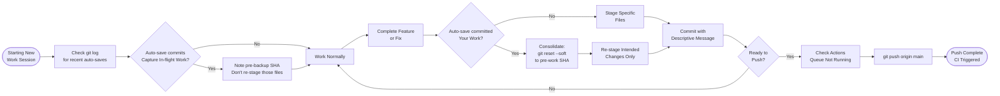

# SOP-OA-01 — Git Backup & Repository Hygiene

**Owner:** Engineering Lead / Operations Manager  
**Cadence:** Daily auto-backup review; weekly hygiene  
**Last updated:** 2026-05-01  
**Related:** [02-db-maintenance.md](02-db-maintenance.md) · [technical-deployment/02-github-actions.md](../technical-deployment/02-github-actions.md)

---

## Overview

This SOP governs git repository hygiene, the auto-backup daemon behavior, and the process for consolidating fragmented backup commits before pushing.

**Auto-backup daemon:** A local daemon periodically commits and pushes WIP as `backup: auto-save <timestamp>`. It will commit in-flight work mid-stream. This is intentional but requires management.

**Risk:** Pushing to `main` while the daemon is running can create fragmented history, orphaned partial commits, and CI deploy triggers at unintended times.

**Success metrics:**
- Fragmented backup commits consolidated before any named push
- `git log --oneline -10` shows named commits with meaningful messages
- No secrets or large binary artifacts committed
- Auto-backup commits never outnumber named commits in any 24h window

---

## Workflow



---

## Procedures

### 1. Pre-Work Session Check (5 min)

Before starting any work, check the current repo state:

```bash
git log --oneline -10
git status
```

Look for recent `backup: auto-save` commits. If they exist:
1. Note the SHA of the **last named commit** (the one before the first auto-save)
2. Check which files were captured in the auto-saves: `git diff <named-sha>..HEAD --name-only`
3. During your work session, only stage files NOT already in the auto-save commits

---

### 2. Consolidating Fragmented History

When you have a series of `backup: auto-save` commits that captured your in-flight work:

```bash
# Identify the commit BEFORE the auto-save sequence
git log --oneline -15
# Find the last named commit SHA (e.g., abc123f "feature: add contact import")

# Soft reset to that point — preserves all changes in working directory
git reset --soft abc123f

# Verify the staging area shows all the accumulated changes
git diff --cached --stat

# Review what's staged (may include files you don't want)
git diff --cached

# Stage only what you intend to commit
git restore --staged .         # Unstage everything
git add specific/file.php      # Stage only intended files
git add another/file.js

# Create a single named commit
git commit -m "feature: brief description of what changed and why"

# Push with lease (safer than --force)
git push --force-with-lease origin main
```

**Never use `git push --force` without `--force-with-lease`** — the lease check prevents overwriting commits you haven't seen.

**Never force-push while a GitHub Actions run is in progress** — it can cause the CI to build from an inconsistent state.

---

### 3. Checking the Actions Queue Before Push

Before a significant push (especially force-with-lease):

1. Check GitHub Actions: repo → Actions tab
2. Look for any running workflows (`deploy-site-root.yml`, etc.)
3. If a workflow is running: wait for it to complete before pushing
4. If you must push immediately: the hash-based deploy handles this gracefully, but force-push during a run can cause confusion

---

### 4. What NOT to Commit (Weekly Cleanup)

Run this check before any push session:

```bash
# Check for large files
git diff --cached --stat | awk '{print $3, $1}' | sort -rn | head -20

# Check for secrets
git diff --cached | grep -E "(api_key|password|secret|token|RESEND|JWT)" 

# Check for temp/artifact files
git status --short | grep -E "\.(zip|sql\.bak|log|tmp|DS_Store)"
```

**Never commit:**
- `.env` files or any `config.local.php` (secrets at runtime)
- `*.zip` archives (use git ignore)
- `_backup/`, `site-upload/`, `*.sql.bak` directories
- `assets/social/exports/` (PNG build artifacts — in .gitignore)
- `node_modules/` (should be in .gitignore)
- `backend/db.sqlite3` (local dev DB)

**Check .gitignore covers these:**
```bash
cat .gitignore | grep -E "exports|node_modules|local.php|sqlite"
```

---

### 5. Repository Size Audit (Monthly)

```bash
# Check repo size
git count-objects -vH

# Find large files in git history
git rev-list --all --objects | git cat-file --batch-check='%(objecttype) %(objectname) %(objectsize) %(rest)' | sort -k3 -rn | head -20
```

If large binary files are in history (images, PDFs):
1. Identify the commit that added them
2. Use `git filter-repo` to remove them (only if they were accidentally committed)
3. This requires a force-push — notify team before doing this

---

### 6. Branch Hygiene

Check for stale branches:
```bash
git branch -a --sort=-committerdate | head -20
```

Delete merged branches:
```bash
# Local
git branch -d <branch-name>

# Remote
git push origin --delete <branch-name>
```

For the main development model (trunk-based on `main`): feature branches should be short-lived (<3 days) and merged via PR. Do not accumulate long-lived feature branches.

---

### 7. Auto-Backup Daemon Notes

The auto-save daemon:
- Runs on a schedule (every X minutes when files are modified)
- Commits all modified files with message `backup: auto-save <timestamp>`
- Pushes to `main` immediately

**Working with the daemon:**
- You CANNOT stop it mid-session (it's a background process)
- You CAN consolidate after the fact (see Procedure 2)
- If it pushed a partial commit that breaks CI: revert (`git revert HEAD`) or fix immediately

**The daemon IS a safety net** — its commits mean you never lose work. The cleanup step (consolidation) is just cosmetic/history hygiene.

---

## Technical Details

### Commit Message Convention

Named commits should follow this pattern:
```
type: brief description (max 72 chars)
```

Types: `feature`, `fix`, `refactor`, `content`, `deploy`, `docs`, `chore`

Examples:
- `feature: add instagram carousel preview export button`
- `fix: resolve CRM contact deduplicate null email crash`
- `content: publish tourism AEO strategy blog post Q2`
- `deploy: add social/ directory to ftps staging loop`

### Force-with-Lease Explained

`--force-with-lease` checks that the remote HEAD matches the SHA you expect before pushing. If someone (or the auto-backup daemon) pushed a new commit after your last fetch, the push fails — protecting you from silently overwriting their work.

Always run `git fetch origin main` immediately before `git push --force-with-lease` to get the most current remote state.

---

## Troubleshooting

| Issue | Likely cause | Fix |
|---|---|---|
| `--force-with-lease` rejected | Auto-backup daemon pushed while you were working | `git fetch origin main`, review new commits, then retry |
| Working directory messy after reset | `git reset --soft` left staged files | `git restore --staged .` then re-stage intentionally |
| Accidentally committed `config.local.php` | Forgot to check `git status` before adding | Immediately revert the commit, rotate any exposed secrets |
| CI triggered multiple times by backup commits | Each backup push triggers a deploy | Expected behavior; deploy is hash-based and safe to run multiple times |
| Large binary in history causing clone slowness | Image or archive committed without optimization | Use `git filter-repo` to remove from history, force-push |

---

## Checklists

### Before Starting Work
- [ ] `git log --oneline -10` reviewed for recent auto-saves
- [ ] `git status` clean or files understood
- [ ] Pre-work SHA noted if auto-saves present

### Before Any Named Push
- [ ] No secrets in staged files
- [ ] No large binaries (>500KB) accidentally staged
- [ ] No auto-save sequences — consolidated into named commit
- [ ] GitHub Actions not currently running
- [ ] Commit message follows convention (type: description)

### Weekly Hygiene
- [ ] `git status --short` reviewed for junk files
- [ ] `.gitignore` up to date (exports, node_modules, local.php)
- [ ] Stale branches cleaned up
- [ ] Monthly: repo size audit run

---

## Related SOPs
- [02-db-maintenance.md](02-db-maintenance.md) — Database backups (separate from git)
- [technical-deployment/02-github-actions.md](../technical-deployment/02-github-actions.md) — CI/CD that fires on every push
- [03-secrets-rotation.md](03-secrets-rotation.md) — Rotating secrets if accidentally committed
