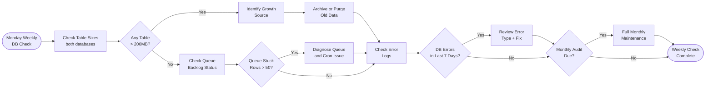

# SOP-OA-02 — Database Maintenance

**Owner:** Engineering Lead / Operations Manager  
**Cadence:** Weekly health check; monthly full audit  
**Last updated:** 2026-05-01  
**Related:** [01-backup-git.md](01-backup-git.md) · [03-secrets-rotation.md](03-secrets-rotation.md) · [technical-deployment/05-migrations.md](../technical-deployment/05-migrations.md)

---

## Overview

This SOP governs database maintenance for both production databases at InMotion cPanel: `webmed6_nwm` (public API) and `webmed6_crm` (CRM). Covers monitoring table sizes, running cleanup operations, backup verification, and responding to database errors.

**Two databases — never cross-query:**
- `webmed6_nwm` — `api-php/` resources (EAV store, email queue, blog posts, audit data)
- `webmed6_crm` — CRM entities (contacts, deals, workflows, conversations, campaigns)

**Access:** Via cPanel phpMyAdmin or remote MySQL connection (if enabled on InMotion).

**No automated database backup configured for production.** InMotion cPanel provides daily backups — verify these are enabled.

**Success metrics:**
- No table exceeding 500MB (alert Carlos if approaching)
- `email_sequence_queue` cleared of >90-day-old sent rows: monthly
- No orphaned rows in workflow_runs: <5% failed/stuck
- cPanel backup retention: ≥7 days

---

## Workflow



---

## Procedures

### 1. Weekly Table Size Check (Monday, 10 min)

Run in phpMyAdmin or via MySQL CLI (if remote access enabled):

```sql
-- webmed6_nwm table sizes
SELECT 
  table_name,
  ROUND(((data_length + index_length) / 1024 / 1024), 2) AS 'Size (MB)',
  table_rows
FROM information_schema.tables
WHERE table_schema = 'webmed6_nwm'
ORDER BY (data_length + index_length) DESC;

-- webmed6_crm table sizes
SELECT 
  table_name,
  ROUND(((data_length + index_length) / 1024 / 1024), 2) AS 'Size (MB)',
  table_rows
FROM information_schema.tables
WHERE table_schema = 'webmed6_crm'
ORDER BY (data_length + index_length) DESC;
```

**Alert thresholds:**
- >50MB: Monitor closely
- >200MB: Investigate growth source
- >500MB: Report to Carlos, plan archival

---

### 2. Email Queue Maintenance (Monthly)

The `email_sequence_queue` in `webmed6_nwm` accumulates indefinitely:

```sql
-- Check queue size
SELECT status, COUNT(*) as cnt, MAX(created_at) as latest
FROM email_sequence_queue
GROUP BY status;

-- Archive sent rows older than 90 days
-- Step 1: Export to archive table (safety first)
CREATE TABLE IF NOT EXISTS email_sequence_queue_archive LIKE email_sequence_queue;

INSERT INTO email_sequence_queue_archive
SELECT * FROM email_sequence_queue
WHERE status = 'sent'
  AND sent_at < DATE_SUB(NOW(), INTERVAL 90 DAY);

-- Step 2: Delete from live table (only after archive verified)
DELETE FROM email_sequence_queue
WHERE status = 'sent'
  AND sent_at < DATE_SUB(NOW(), INTERVAL 90 DAY);

-- Report
SELECT ROW_COUNT() as deleted_rows;
```

**Also clean failed rows older than 30 days** (after investigating errors):
```sql
DELETE FROM email_sequence_queue
WHERE status = 'failed'
  AND created_at < DATE_SUB(NOW(), INTERVAL 30 DAY);
```

---

### 3. CRM Workflow Runs Cleanup (Monthly)

`workflow_runs` in `webmed6_crm` accumulates completed/failed runs:

```sql
-- Check workflow_runs status
SELECT status, COUNT(*) as cnt, MAX(created_at) as latest
FROM workflow_runs
GROUP BY status;

-- Archive completed runs older than 60 days
CREATE TABLE IF NOT EXISTS workflow_runs_archive LIKE workflow_runs;

INSERT INTO workflow_runs_archive
SELECT * FROM workflow_runs
WHERE status IN ('completed', 'cancelled')
  AND created_at < DATE_SUB(NOW(), INTERVAL 60 DAY);

DELETE FROM workflow_runs
WHERE status IN ('completed', 'cancelled')
  AND created_at < DATE_SUB(NOW(), INTERVAL 60 DAY);
```

**Never delete `failed` runs without reviewing them first** — they may contain important error context.

---

### 4. Resources EAV Store Audit (Quarterly)

The `resources` table in `webmed6_nwm` is the EAV backbone. It can grow large with orphaned or test records:

```sql
-- Count by type
SELECT type, COUNT(*) as cnt, MAX(created_at) as latest
FROM resources
GROUP BY type
ORDER BY cnt DESC;

-- Find very old records by type (e.g., old blog drafts)
SELECT id, type, created_at, updated_at
FROM resources
WHERE type = 'blog_draft'
  AND created_at < DATE_SUB(NOW(), INTERVAL 180 DAY)
  AND status = 'draft'
LIMIT 20;
```

Before deleting any resource records, verify they're not referenced by:
- External links (check Search Console 404s)
- Email sequences (`variables` JSON pointing to the resource)
- CRM contact notes

---

### 5. Rate Limit File Cleanup (Weekly)

Rate limiting uses file-based storage at:
- `api-php/data/ratelimit/<ip-hash>.json`
- `crm-vanilla/storage/ratelimit/<ip-hash>.json`

These accumulate but auto-GC probabilistically. Manual cleanup if the directory grows large:

```bash
# Check size (via cPanel File Manager or SSH if available)
# api-php/data/ratelimit/
# crm-vanilla/storage/ratelimit/

# Files older than 24h are safe to delete (rate limit windows are short)
# Delete via cPanel File Manager → select all → delete
# Or if SSH available:
# find /path/to/ratelimit/ -name "*.json" -mmin +1440 -delete
```

---

### 6. Backup Verification (Monthly)

InMotion cPanel provides daily automatic backups. Verify they're working:

1. Log in to cPanel → Backup Wizard → Download a Full Backup
2. Verify last backup date is within 24h
3. Check backup retention: confirm at least 7 days of backups exist
4. Test restore: quarterly, download a backup and verify the SQL is valid:
   ```bash
   gunzip -c backup.sql.gz | head -100  # Should show valid SQL
   ```

**If InMotion backup is disabled or failing:**
1. Log in to cPanel → JetBackup (if available) or Backup Wizard
2. Enable "Daily Backup" if not enabled
3. Set retention to 7 days minimum

---

### 7. Query Performance Audit (Quarterly)

For queries taking >1 second (slow query log if enabled):

```sql
-- Check missing indexes on commonly queried columns
EXPLAIN SELECT * FROM contacts WHERE email = 'test@example.com';
-- Look for "type: ALL" (full table scan) — needs an index

-- Add index if missing:
ALTER TABLE contacts ADD INDEX IF NOT EXISTS idx_email (email);

-- Check CRM contacts
EXPLAIN SELECT * FROM contacts WHERE user_id = 1 AND status = 'client';
-- Should use idx on user_id
```

Common indexes to verify exist:
- `contacts`: `email`, `user_id`, `niche`, `status`
- `deals`: `contact_id`, `user_id`, `stage`
- `workflow_runs`: `workflow_id`, `status`, `next_run_at`
- `email_sequence_queue`: `email`, `status`, `scheduled_at`

---

## Technical Details

### Database Connection Architecture

```
webmed6_nwm connection:
  api-php/config.php → PDO to webmed6_nwm
  Used by: api-php/routes/*.php, api-php/lib/email-sequences.php

webmed6_crm connection:
  crm-vanilla/api/config.php → PDO to webmed6_crm
  Used by: crm-vanilla/api/handlers/*.php, crm-vanilla/api/lib/wf_crm.php
```

Never mix these connections. A handler in `crm-vanilla/api/` reading from `webmed6_nwm` would violate database isolation.

### InMotion cPanel MySQL Access

Options for running maintenance queries:
1. **phpMyAdmin** (easiest): cPanel → phpMyAdmin → select database → SQL tab
2. **Remote MySQL** (if IP whitelisted): add `REMOTE_DB_ACCESS_IP` in cPanel → Remote MySQL
3. **SSH** (if available): SSH to server, run `mysql -u webmed6_usr -p webmed6_crm`

InMotion shared hosting restricts direct `root` MySQL access. Use the per-database user credentials from `config.local.php`.

---

## Troubleshooting

| Issue | Likely cause | Fix |
|---|---|---|
| Table growing rapidly | Missing cleanup job or log accumulation | Identify the table, check if archived/cleanup is configured, archive old rows |
| `email_sequence_queue` processing slow | No index on `scheduled_at` + `status` | Add compound index: `ADD INDEX idx_queue_process (status, scheduled_at)` |
| phpMyAdmin times out on large queries | Row count too high for browser export | Use command-line mysqldump instead, increase phpMyAdmin timeout |
| Backup download fails | cPanel backup server under load | Try at off-peak hours (2–5 AM Chile time) |
| High disk usage warning from InMotion | Log files or database backups accumulating | Check `/home/webmed6/logs/` and cPanel Disk Usage tool |

---

## Checklists

### Weekly (Monday)
- [ ] Table sizes checked in both databases
- [ ] No table >200MB (alert Carlos if so)
- [ ] email_sequence_queue checked for stuck/failed rows
- [ ] workflow_runs checked for excessive failed rows

### Monthly
- [ ] email_sequence_queue: sent rows >90 days archived + deleted
- [ ] workflow_runs: completed/cancelled rows >60 days archived + deleted
- [ ] Rate limit file directories cleared of stale files
- [ ] InMotion backup verified within 24h and 7-day retention confirmed

### Quarterly
- [ ] Resources EAV store audited for orphaned records
- [ ] Index audit run on commonly queried columns
- [ ] Backup restore test: download and verify SQL valid

---

## Related SOPs
- [01-backup-git.md](01-backup-git.md) — Git source code backup
- [03-secrets-rotation.md](03-secrets-rotation.md) — Rotating DB passwords
- [technical-deployment/05-migrations.md](../technical-deployment/05-migrations.md) — Schema change management
- [email-marketing/03-drip-campaigns.md](../email-marketing/03-drip-campaigns.md) — Email queue monitoring
