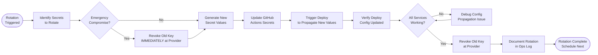

# SOP-OA-03 — Secrets & Credentials Rotation

**Owner:** Engineering Lead  
**Cadence:** Quarterly scheduled rotation; immediate on suspected compromise  
**Last updated:** 2026-05-01  
**Related:** [01-backup-git.md](01-backup-git.md) · [02-db-maintenance.md](02-db-maintenance.md) · [technical-deployment/02-github-actions.md](../technical-deployment/02-github-actions.md)

---

## Overview

This SOP governs rotation of API keys, database passwords, JWT secrets, and maintenance tokens used across the NetWebMedia production system.

**Secrets architecture:** All secrets live in GitHub Actions Secrets → injected into `api-php/config.local.php` and `crm-vanilla/api/config.local.php` at deploy time. The live server never stores secrets in the codebase.

**Rotation triggers:**
1. **Scheduled:** Quarterly (every 90 days)
2. **Suspected compromise:** Immediately (within 2 hours of detection)
3. **Team member departure:** Immediately
4. **Accidental git commit:** Immediately (see Procedure 7)

**Success metrics:**
- Quarterly rotation completed on schedule
- Zero secrets in git history
- All GitHub Actions Secrets rotated and tested within 4h of compromise detection
- No downtime caused by rotation (zero-downtime rotation protocol followed)

---

## Workflow



---

## Procedures

### 1. Secrets Inventory

All secrets managed in GitHub Secrets (repo → Settings → Secrets → Actions):

| Secret | Provider | Scope | Rotation frequency |
|---|---|---|---|
| `JWT_SECRET` | Internal (generate with openssl) | Auth tokens | Quarterly |
| `DB_PASSWORD` | InMotion cPanel MySQL | Database access | Quarterly |
| `RESEND_API_KEY` | Resend.com | Email delivery | Quarterly |
| `ANTHROPIC_API_KEY` | Anthropic API | AI features | Quarterly |
| `HUBSPOT_TOKEN` | HubSpot | CRM sync | Quarterly |
| `MP_ACCESS_TOKEN` | MercadoPago | Payments | Quarterly |
| `MP_PUBLIC_KEY` | MercadoPago | Payments | Quarterly |
| `MP_WEBHOOK_SECRET` | MercadoPago | Webhooks | Quarterly |
| `TWILIO_SID` | Twilio | SMS/Voice | Quarterly |
| `TWILIO_TOKEN` | Twilio | SMS/Voice | Quarterly |
| `WA_META_TOKEN` | Meta Cloud API | WhatsApp | Quarterly |
| `WA_META_APP_SECRET` | Meta | WhatsApp | Quarterly |
| `WA_VERIFY_TOKEN` | Internal | Webhook verification | Quarterly |
| `MIGRATE_TOKEN` | Internal | DB maintenance | Quarterly |
| `CPANEL_FTP_ROOT_PASSWORD` | InMotion cPanel | Deploy FTP | Quarterly |
| `CPANEL_FTP_PASSWORD` | InMotion cPanel | Deploy FTP | Quarterly |

---

### 2. Zero-Downtime Rotation Protocol

For API keys that have a brief window where both old and new keys are valid (most modern APIs):

1. Generate the new key at the provider dashboard
2. Update the GitHub Secret with the new value
3. Trigger a deploy (push any commit or run workflow manually)
4. Verify the deploy succeeds and the new key is working:
   ```bash
   curl -s "https://netwebmedia.com/api/public/stats" | head -5
   ```
5. Only AFTER confirming the new key works: revoke the old key at the provider

This ensures zero downtime — the old key stays valid until the new one is confirmed working.

**Exception:** If the key is compromised, revoke immediately (Step 1, not Step 5).

---

### 3. JWT_SECRET Rotation

JWT_SECRET signs authentication tokens. Rotating it invalidates all existing sessions.

1. Generate a new 64-character hex secret:
   ```bash
   openssl rand -hex 32
   ```
2. Update `JWT_SECRET` in GitHub Secrets
3. Deploy (push a whitespace commit to trigger)
4. **All logged-in users will be logged out** — their old tokens will fail JWT verification
5. Verify login works with the new secret:
   - Navigate to `netwebmedia.com/crm-vanilla/`
   - Log in with CRM credentials
   - Confirm access

**Schedule JWT rotation during low-traffic hours** — Saturday morning Chile time (early morning for US traffic too).

---

### 4. Database Password Rotation

Rotating `webmed6_nwm` and `webmed6_crm` MySQL user passwords:

1. Log in to cPanel → MySQL Databases
2. Find the database user (e.g., `webmed6_usr`)
3. Change the password: cPanel → MySQL Databases → scroll to "Current Users" → "Change Password"
4. Immediately update the GitHub Secret (`DB_PASSWORD`) with the new password
5. Push a deploy immediately (within 5 minutes) — the old password is now invalid
6. Verify deploy succeeded and API responds:
   ```bash
   curl -s "https://netwebmedia.com/api/public/stats"
   ```

**Risk:** There will be a brief downtime (seconds to minutes) between the password change and the deploy propagating. Schedule during low-traffic hours.

---

### 5. MIGRATE_TOKEN Rotation

MIGRATE_TOKEN is used in CI to trigger database migrations and CRM cron:

1. Generate a new value:
   ```bash
   openssl rand -hex 16  # 32-char hex token
   ```
2. Update `MIGRATE_TOKEN` in GitHub Secrets
3. Push a deploy — `config.local.php` will have the new token
4. Verify the cron workflow still works:
   - Check `cron-workflows.yml` ran successfully after the deploy
   - Check the migrate endpoint responds:
     ```bash
     curl -X POST -H "..." "https://netwebmedia.com/crm-vanilla/api/?r=migrate&token=<NEW_TOKEN>"
     ```

---

### 6. FTP Password Rotation

For `CPANEL_FTP_ROOT_PASSWORD` and `CPANEL_FTP_PASSWORD`:

1. Log in to cPanel → FTP Accounts
2. Find the FTP user → "Change Password"
3. Generate a strong new password: use cPanel's password generator (16+ chars, mixed)
4. Update the GitHub Secret immediately
5. Test the next deploy — verify FTPS upload succeeds

Do NOT rotate FTP passwords while a deploy is in progress — it will cause the active upload to fail.

---

### 7. Emergency: Accidentally Committed Secret

If a secret is committed to git:

**IMMEDIATE actions (within 10 minutes):**

1. **Revoke the exposed key immediately** at the provider dashboard — do NOT wait
2. Remove the secret from git history:
   ```bash
   # Identify the commit that added it
   git log --all --oneline -- path/to/file
   
   # Remove the file from all history (destructive)
   git filter-repo --path path/to/compromised/file --invert-paths
   
   # Force push to remove from GitHub
   git push origin main --force-with-lease
   ```
3. GitHub: Settings → Secrets → update with new value
4. Deploy immediately to propagate new value
5. Check if the secret appeared in any GitHub PR comments or issues — delete those manually
6. Notify Carlos immediately about the exposure window

**Investigate impact:**
- Check provider logs for any unauthorized usage during the exposure window
- Review API call logs for suspicious patterns

---

### 8. Quarterly Rotation Checklist Execution

For scheduled quarterly rotation:

**Week 1 of each quarter:**
1. Generate new values for all secrets listed in the inventory
2. Update GitHub Secrets one by one (don't bulk-update — test each)
3. Trigger a deploy after each group of related secrets
4. Verify all systems working after each deploy
5. Revoke old API keys after new ones confirmed working

**Priority order for rotation:**
1. `JWT_SECRET` (logs everyone out — do at off-peak hours)
2. `DB_PASSWORD` (brief downtime — schedule carefully)
3. FTP passwords (`CPANEL_FTP_*`)
4. All API keys (zero-downtime rotation)
5. Maintenance tokens (`MIGRATE_TOKEN`, etc.)

---

## Technical Details

### Where Secrets Flow

```
GitHub Secrets
  ↓ (at deploy time, via deploy-site-root.yml)
api-php/config.local.php (never in git, generated at deploy)
crm-vanilla/api/config.local.php (never in git, generated at deploy)
  ↓ (PHP include at runtime)
api-php/config.php defines() / crm-vanilla/api/config.php defines()
  ↓
Available as PHP constants throughout the codebase
```

The `config.local.php` files are in `.gitignore` and generated fresh on every deploy. They do NOT persist between deploys — each deploy overwrites them with current secret values.

### Verifying Secret Propagation

After updating a secret and deploying:
```bash
# Test JWT_SECRET: verify login works
# Test DB_PASSWORD: verify API returns data (not DB connection error)
# Test RESEND_API_KEY: send a test email
# Test MIGRATE_TOKEN: manually trigger migrate endpoint
```

---

## Troubleshooting

| Issue | Likely cause | Fix |
|---|---|---|
| API returns 500 after rotation | New DB_PASSWORD not propagated yet | Wait 2 min, redeploy, check `config.local.php` was regenerated |
| Login broken after JWT rotation | Old tokens invalidated | Expected — users re-login with the new secret in effect |
| CRM cron fails after MIGRATE_TOKEN rotation | Deploy didn't propagate new token | Force re-deploy, verify `config.local.php` has new `define('MIGRATE_TOKEN', ...)` |
| FTPS deploy fails after FTP rotation | Secret mismatch between GitHub and cPanel | Update GitHub Secret to match the new cPanel password exactly |
| Email sending fails after RESEND rotation | Old API key revoked before new one deployed | Keep both keys valid during transition window; revoke old only after deploy confirmed |

---

## Checklists

### Quarterly Rotation
- [ ] New JWT_SECRET generated and updated in GitHub Secrets
- [ ] JWT rotation confirmed (login works, old sessions invalidated)
- [ ] DB_PASSWORD rotated in cPanel AND GitHub Secrets
- [ ] DB rotation confirmed (API responding, no 500s)
- [ ] All API keys (Resend, Anthropic, HubSpot, MercadoPago, Twilio, Meta) rotated
- [ ] All API keys confirmed working via test calls
- [ ] FTP passwords rotated in cPanel AND GitHub Secrets
- [ ] Maintenance tokens (MIGRATE_TOKEN etc.) rotated
- [ ] Old API keys revoked at each provider
- [ ] Rotation documented in ops log

### Emergency Rotation
- [ ] Exposed key revoked at provider within 10 min
- [ ] Secret removed from git history (if committed)
- [ ] GitHub force-pushed to remove exposure
- [ ] New key deployed within 30 min
- [ ] Provider logs checked for unauthorized usage
- [ ] Carlos notified

---

## Related SOPs
- [01-backup-git.md](01-backup-git.md) — Preventing secrets from being committed
- [technical-deployment/02-github-actions.md](../technical-deployment/02-github-actions.md) — How secrets flow through the deploy pipeline
- [operations-admin/04-monitoring.md](04-monitoring.md) — Detecting signs of compromised credentials
