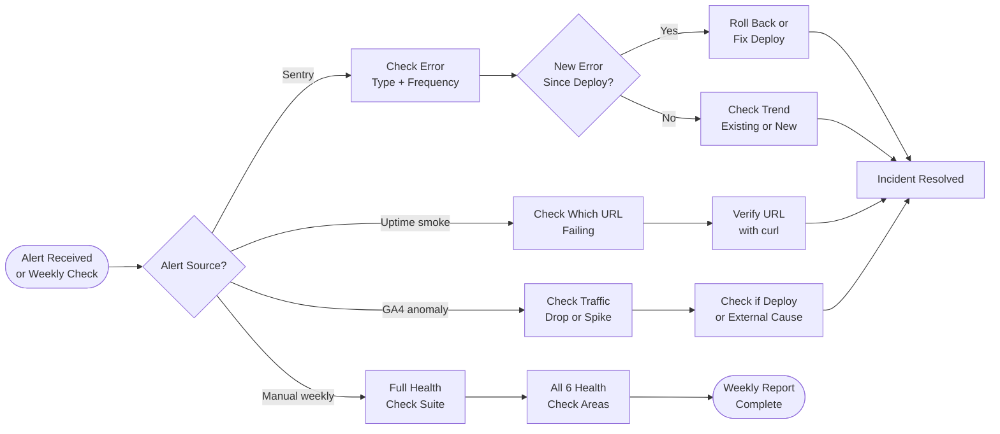

# SOP-OA-04 — Production Monitoring & Incident Response

**Owner:** Engineering Lead / Operations Manager  
**Cadence:** Daily automated; manual review weekly  
**Last updated:** 2026-05-01  
**Related:** [01-backup-git.md](01-backup-git.md) · [02-db-maintenance.md](02-db-maintenance.md) · [technical-deployment/04-post-deploy.md](../technical-deployment/04-post-deploy.md)

---

## Overview

This SOP governs production monitoring for netwebmedia.com: what's monitored, where to look, how to respond to incidents, and the weekly health review cadence.

**Monitoring stack:**
- **Sentry** — client-side JS errors (`netwebmedia` org)
- **GitHub Actions** — CI/CD health (`uptime-smoke.yml`, `psi-baseline.yml`)
- **GA4** — real-time traffic anomalies
- **InMotion cPanel** — server error logs, disk usage, PHP error log
- **Resend dashboard** — email delivery health
- **Meta Business Suite** — WhatsApp delivery and webhook health (post-WABA)

**Severity levels:**
| Level | Definition | Response time |
|---|---|---|
| P0 (Critical) | Site down or data breach | 30 min |
| P1 (High) | Key feature broken, email delivery failing | 2 hours |
| P2 (Medium) | Non-critical feature broken, elevated error rate | 24 hours |
| P3 (Low) | Performance degradation, minor UI issue | 72 hours |

---

## Workflow



---

## Procedures

### 1. Sentry Monitoring (Daily, 5 min)

Open Sentry → `netwebmedia` org → Issues:

1. Filter: last 24 hours
2. Look for: any new issue types (yellow/red indicators)
3. Priority patterns to investigate immediately:
   - PHP 500 errors (`server_error` category)
   - Authentication failures (`unauthorized` or `401` spikes)
   - CSP violations (`Content-Security-Policy` blocked resources)
   - JavaScript `TypeError` or `ReferenceError` with high frequency (>10 in 1h)

4. For each new high-frequency error:
   - Read the stack trace
   - Identify if it's user-impacting
   - Check if it correlates with a recent deploy
   - Create a fix task or log as P2/P3

**Sentry alert rules configured:**
- >3 new errors of same type in 5 minutes → email to `carlos@netwebmedia.com`
- Any `server_error` category → immediate alert

---

### 2. Uptime Smoke Check (Weekly, via GitHub Actions)

`uptime-smoke.yml` runs on schedule — verify its status weekly:

1. Repo → Actions → `uptime-smoke.yml` → last 10 runs
2. All green = all monitored URLs returning expected status codes
3. Any red: read the job output to identify which URL failed
4. Spot check the failing URL manually:
   ```bash
   curl -sI https://netwebmedia.com/[failing-path] | head -5
   ```
5. Common causes: deploy issue, DNS change, cPanel maintenance

**URLs monitored by smoke test (reference):**
- `netwebmedia.com/` → 200
- `netwebmedia.com/services.html` → 200
- `netwebmedia.com/api/public/stats` → 200
- `netwebmedia.com/crm-vanilla/` → 200
- `netwebmedia.com/api/` → 301 (redirect to `/api/`)

---

### 3. GA4 Traffic Anomaly Detection (Weekly)

In GA4 → Home → Insights (Google's automated anomaly detection):
- Check for any "Unusual traffic" or "Significant changes" cards
- Look at last 7 days: Organic traffic trend (should be stable or growing)

**Alert if:**
- Organic sessions drop >30% week-over-week → possible Google penalty or indexing issue
- Direct traffic spikes >3× → possible bot traffic
- Any page shows 0 sessions for 2+ days when it had traffic previously → indexing issue

**Quick check via Search Console:**
- Coverage report → any "Excluded" or "Error" URLs spiking?
- Core Web Vitals → any new poor/needs improvement pages?

---

### 4. Email Delivery Health (Weekly)

Check Resend dashboard (https://resend.com/dashboard):
1. Delivery rate: should be ≥98%
2. Bounce rate: should be <2%
3. Spam complaints: should be <0.1%
4. Any API errors (check Resend's Logs tab)

Also check the `email_sequence_queue` table for failed rows:
```sql
SELECT COUNT(*) FROM email_sequence_queue
WHERE status = 'failed'
  AND created_at > DATE_SUB(NOW(), INTERVAL 7 DAY);
```

Any >10 failed rows in a week: investigate error_message patterns.

---

### 5. GitHub Actions Health (Weekly, Monday)

Check all scheduled and deploy workflows:

```
Weekly checks:
  ✓ deploy-site-root.yml — last run green
  ✓ cron-workflows.yml — running every 5 min, all green
  ✓ uptime-smoke.yml — green
  ✓ psi-baseline.yml — green (PageSpeed baseline)
  ✓ indexnow-ping.yml — green (search indexing)
  ✓ generate-blog-queue.yml — green (scheduled blog generation)
```

For any failing scheduled workflow:
1. Read the error in the run log
2. Check if it's a transient failure (retry) or persistent (needs fix)
3. For `cron-workflows.yml` failure: verify `MIGRATE_TOKEN` secret and endpoint

---

### 6. Weekly Full Health Review (Monday, 20 min total)

Consolidate all monitoring signals into a brief status:

```markdown
# Health Check — [Date]

## Site Status
- All URLs: ✓ / ✗ [specific URL if failing]
- Sentry: X new errors (P1: 0, P2: X, P3: X)

## Email
- Delivery rate: X%
- Failed queue rows (last 7 days): X

## CI/CD
- cron-workflows: ✓ running every 5 min
- Deploy workflows: ✓ all green

## Performance
- PageSpeed (mobile): X (baseline: Y)
- Organic traffic: X sessions (±X% vs last week)

## Actions Required
- [Any P1/P2 items needing attention]
```

Post to CRM internal notes tagged `weekly_health`.

---

### 7. Incident Response Protocol

**P0: Site completely down**

Response steps (within 30 min):
1. Verify it's a real outage: `curl -sI https://netwebmedia.com/ | head -2`
2. Check if InMotion is having an issue: [InMotion status page]
3. Check last deploy: did a recent push break something?
4. Check cPanel error log for PHP fatal errors
5. If deploy-caused: immediately revert (`git revert HEAD && git push`)
6. If InMotion server issue: contact InMotion support + tweet status to clients
7. Notify Carlos within 15 minutes of detection

**P1: Key feature broken**

Response steps (within 2h):
1. Identify the specific feature and affected users
2. Check Sentry for stack trace
3. Determine if it's code, config, or data issue
4. Fix and deploy, or apply workaround
5. Notify Carlos with description and resolution

**P2/P3: Non-critical issues**

1. Log in CRM as a support issue with priority level
2. Create fix task with appropriate due date (P2: today, P3: this week)
3. Include in weekly report to Carlos

---

### 8. cPanel Server Monitoring (Monthly)

Log in to cPanel:
1. **Resource Usage** → CPU and RAM: flag if consistently >80% on shared hosting
2. **Disk Usage** → check `/home/webmed6/` total: flag if >80% of quota
3. **PHP Error Log** (`/home/webmed6/public_html/error_log`) → review for recurring fatal errors
4. **FTP Activity** → check for any unauthorized FTP connections

For disk usage concerns:
- Check `_deploy/companies/` — 680 company pages can accumulate
- Check `video-out/` — MP4 renders accumulate if not cleaned
- Clean any backup archives or temp files

---

## Technical Details

### Sentry Configuration

Sentry is initialized in `js/nwm-sentry.js` (loaded sitewide via `<script>` in every page header). The Sentry DSN and org slug are configured there. Check the file for current project settings.

**PHP-side errors:** Sentry also captures PHP exceptions if the PHP SDK is configured. Check `api-php/config.php` for `\Sentry\init([...])` — if absent, PHP errors only show in the cPanel error log.

### GA4 Access

GA4 property for netwebmedia.com. Access via `carlos@netwebmedia.com` Google account. The GA4 measurement ID is in `js/nwm-ga.js`.

### InMotion Status Page

Monitor InMotion hosting status at their public status page. Bookmark this for quick P0 triage.

---

## Troubleshooting

| Issue | Likely cause | Fix |
|---|---|---|
| Sentry not receiving errors | CSP blocking Sentry script or DSN changed | Check CSP in `.htaccess` includes Sentry domain, verify DSN in `nwm-sentry.js` |
| uptime-smoke.yml flapping | Transient InMotion response time | Check if consistent failure (real issue) or occasional (transient); rerun |
| GA4 shows 0 sessions | GA4 script blocked by CSP or ad blocker | Verify in browser DevTools (disable extensions), check CSP includes GA domain |
| cron-workflows failing | MIGRATE_TOKEN changed or endpoint unreachable | Check GitHub Actions log for specific error, verify secret and endpoint manually |
| High PHP error count | New code with uncaught exceptions | Read cPanel error_log for pattern, correlate with recent deploy |
| Disk usage spike | Video renders or company page generation | Clean `video-out/` and audit `_deploy/companies/` for stale files |

---

## Checklists

### Daily (5 min)
- [ ] Sentry: no new P0/P1 errors
- [ ] Uptime: no red alerts in GitHub Actions

### Weekly (Monday, 20 min)
- [ ] Sentry 7-day error summary reviewed
- [ ] All GitHub Actions scheduled workflows green
- [ ] Email delivery rate ≥98%
- [ ] GA4 traffic anomalies checked
- [ ] Weekly health report posted to CRM

### Monthly (First Monday)
- [ ] cPanel resource usage checked
- [ ] cPanel disk usage checked
- [ ] PHP error_log reviewed
- [ ] FTP access log reviewed for anomalies
- [ ] Database table sizes within limits (SOP-OA-02)

---

## Related SOPs
- [02-db-maintenance.md](02-db-maintenance.md) — Database health monitoring
- [03-secrets-rotation.md](03-secrets-rotation.md) — Response to suspected credential compromise
- [technical-deployment/04-post-deploy.md](../technical-deployment/04-post-deploy.md) — Post-deploy verification that feeds monitoring baseline
- [customer-success/03-support-escalation.md](../customer-success/03-support-escalation.md) — When a monitoring issue becomes a client-facing incident
