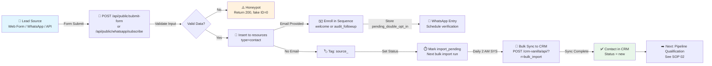

# SOP: Lead Capture & CRM Intake

**Owner:** Sales Director  
**Stakeholders:** CMO, Operations  
**Last Updated:** 2026-05-01  
**Review Frequency:** Quarterly

---

## Overview

Lead capture flows through three main channels:
1. **Web forms** (audit request, contact form, signup)
2. **WhatsApp opt-in** (via `/whatsapp-updates.html`)
3. **API integrations** (HubSpot sync, third-party platforms)

All leads land in `webmed6_nwm` database initially, then sync to `webmed6_crm` (CRM-vanilla) via bulk import.

---

## Workflow: Lead Capture Pipeline



---

## Step 1: Form Configuration

### Web Forms
All public web forms POST to `/api/public/submit-form`:

```html
<form method="POST" action="/api/public/submit-form">
  <input type="hidden" name="form_id" value="audit_request">
  <input type="email" name="email" required>
  <input type="tel" name="phone">
  <input type="text" name="company">
  <input type="hidden" name="niche" value="law_firms">
  <!-- Honeypot (hidden) -->
  <input type="text" name="website" style="display:none;">
  <button type="submit">Request Audit</button>
</form>
```

**Form IDs (valid types):**
- `audit_request` — 40-char audit analysis
- `contact_us` — general inquiry
- `schedule_call` — sales call booking
- `newsletter_signup` — email list join

**Honeypot field:** Any submission with non-empty `website` field gets 200 response with fake `submission_id: 0` (no database write). Prevents bot adaptation via error feedback.

### WhatsApp Opt-in
Users visit `/whatsapp-updates.html` → select topic (`sales`, `support`, `marketing`) → submit email + phone.

**POST** to `/api/public/whatsapp/subscribe`:
```json
{
  "email": "user@example.com",
  "phone": "+1234567890",
  "topic": "sales",
  "consent_text": "I agree to receive WhatsApp messages per Meta WABA terms"
}
```

Stores as `type=contact` with:
- `status: pending_double_opt_in`
- `channel: whatsapp`
- `opt_in_consent: <literal consent text from checkbox>`
- `phone_verified: false` (until Meta verification completes)

---

## Step 2: Data Validation & Sanitization

**In `api-php/routes/public.php`:**

| Field | Rule | Action |
|---|---|---|
| `email` | Valid format + not spam trap | Reject if fails |
| `phone` | Valid E.164 format | Normalize or skip |
| `company` | Length 2–100 chars | Truncate if too long |
| `niche` | Must match one of 14 niches | Default to `smb` if invalid |
| Rate limit | 10 per IP per hour | Return 429 after threshold |

**Spam traps** (auto-reject):
- Disposable email domains (guerrillamail, tempmail, etc.)
- Known spam patterns in name (viagra, casino, etc.)

---

## Step 3: Database Insert

**Table:** `webmed6_nwm.resources`

```sql
INSERT INTO resources (
  type, data, created_at, updated_at, status
) VALUES (
  'contact',
  JSON_OBJECT(
    'email', ?, 'phone', ?, 'company', ?,
    'niche', ?, 'source', 'web_form',
    'form_id', ?, 'ip_address', ?, 'user_agent', ?
  ),
  NOW(), NOW(), 'import_pending'
)
```

Returns `submission_id` (resource ID) to the client.

---

## Step 4: Sequence Enrollment

**If email provided:**
1. Check if already enrolled in a sequence (prevent duplicates)
2. Determine sequence based on `form_id`:
   - `audit_request` → enroll in `audit_followup` (5-email drip, days 0/1/3/7/14)
   - `contact_us` → enroll in `welcome` (3-email sequence, days 0/3/7)
   - `newsletter_signup` → enroll in `welcome`
3. Insert to `email_sequence_queue` table
4. Return confirmation message to user

**Sequence logic in `api-php/lib/email-sequences.php`:**
```php
seq_enroll($email, 'audit_followup', ['niche' => $niche]);
// Queues emails; cron picks them up every 5 minutes
```

---

## Step 5: Status Tracking

After form submission, lead status progresses:

| Status | Meaning | Duration | Next Action |
|---|---|---|---|
| `import_pending` | Not yet synced to CRM | 1–24 hours | Bulk import |
| `new` | In CRM, not contacted | Until manual outreach | Sales qualification |
| `contacted` | Email/call sent | — | Manual update |
| `qualified` | Sales-ready opportunity | — | Move to pipeline |
| `disqualified` | Not a fit | — | Nurture or archive |

---

## Step 6: Bulk Import to CRM (Daily)

**Scheduled:** Daily at 2:00 AM America/Santiago (GitHub Actions `cron-workflows.yml`)

**Process:**
1. Query all `resources WHERE type='contact' AND status='import_pending'`
2. Transform to CRM contact object (map niche, parse phone, etc.)
3. POST to `/crm-vanilla/api/?r=bulk_import`
4. CRM upserts contacts by email (prevent duplicates)
5. Mark as `status='new'` in `webmed6_nwm`

**Bulk import endpoint:**
```
POST /crm-vanilla/api/?r=bulk_import&token=<MIGRATE_TOKEN>
Content-Type: application/json

{
  "contacts": [
    {
      "email": "user@example.com",
      "company": "ACME Inc",
      "niche": "law_firms",
      "source": "web_form",
      "tags": ["audit_requested"]
    }
  ]
}
```

---

## Step 7: WhatsApp Verification Flow

For WhatsApp opt-ins, Meta requires **double opt-in**:

1. **Immediate (upon signup):**
   - Store as `pending_double_opt_in`
   - Queue welcome template via WhatsApp API
   - Link includes verification token

2. **User clicks link in WhatsApp message:**
   - GET `/api/public/whatsapp/verify?token=<token>`
   - Update contact: `status='whatsapp_confirmed'`, `phone_verified=true`
   - Mark eligible for WABA broadcast list

3. **Admin bulk action:**
   - `/crm-vanilla/whatsapp-subs.html` (admin only)
   - Filter by status + date range
   - "Flush to Meta" button: POST to `/crm-vanilla/api/?r=wa_flush&action=send`
   - Enroll confirmed contacts in WABA list (up to 250 batch calls)

---

## Rate Limiting

**Per IP, per hour:**
- 10 form submissions
- 5 WhatsApp opt-ins
- 3 bulk imports

**Storage:** File-based at `/api/data/ratelimit/<ip-hash>.json` (survives PHP-FPM restarts)

**On limit exceeded:**
- Return HTTP 429 (Too Many Requests)
- Suggest user retry in 1 hour

---

## Troubleshooting

| Issue | Cause | Fix |
|---|---|---|
| Form submits but doesn't appear in CRM | Bulk import hasn't run yet | Wait 24 hours or manually run import |
| Duplicate contacts in CRM | Email collision during sync | Bulk import uses email as unique key; CRM merge if needed |
| Email sequence didn't enroll | Email already enrolled | Check email_sequence_queue; re-enroll if needed |
| WhatsApp verify link expires | User clicks after >24 hours | Admin can re-send verify via WhatsApp UI |

---

## Checklist: Monthly Lead Source Audit

- [ ] Check form abandonment rate (Google Analytics)
- [ ] Review honeypot false-positive rate
- [ ] Validate email sequence enrollment (% of leads)
- [ ] Confirm bulk import ran successfully (log check)
- [ ] Review WhatsApp double-opt-in completion rate
- [ ] Spot-check 10 random leads in CRM (correct data)

---

## Related Documents

- [SOP 02: Pipeline Management & Qualification](02-pipeline-qualification.md)
- [Email Marketing SOP: Sequence Setup](../email-marketing/01-sequence-setup.md)
- [Operations SOP: Monitoring](../operations-admin/04-monitoring.md)
