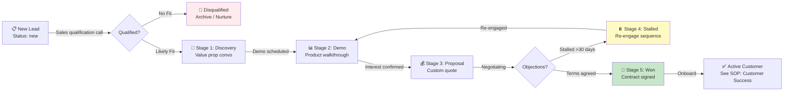

# SOP: Pipeline Management & Qualification

**Owner:** Sales Director  
**Stakeholders:** CMO, CEO  
**Last Updated:** 2026-05-01  
**Review Frequency:** Monthly

---

## Overview

Sales pipeline flows through **5 stages**, determined by deal likelihood and next action. Pipeline velocity is tracked weekly; Carlos reviews deal health on Thursdays.

---

## Workflow: Qualification & Pipeline Movement



---

## Deal Stages Defined

| Stage | Criteria | Duration | Next Action |
|---|---|---|---|
| **1. Discovery** | Problem identified, 1–2 calls complete | 1–2 weeks | Schedule demo |
| **2. Demo** | Live product demo delivered, questions answered | 3–7 days | Send proposal |
| **3. Proposal** | Custom quote + contract terms shared | 5–10 days | Present to decision-maker |
| **4. Stalled** | No contact >30 days (auto-flagged) | 14 days | Re-engagement email |
| **5. Won** | Signed contract + payment received | — | Onboard customer |

---

## Sales Rep Responsibilities

### Daily
1. **Check new leads** (Morning standup)
   - CRM: filter by `status=new` + `niche=assigned`
   - Sort by lead score (engagement signals)
   - Assign top 5 for outreach today

2. **Make qualification calls**
   - Call script in Sales handbook
   - Ask: pain point, budget, timeline, decision-maker
   - Update deal record with call notes
   - Move to Stage 1 if qualified

3. **Update deal status**
   - Log all customer interactions in CRM
   - Move cards in pipeline as work progresses
   - Mark next action + due date

### Weekly
1. **Pipeline review** (Thursday 10 AM America/Santiago)
   - Run pipeline report: `POST /crm-vanilla/api/?r=reporting&type=pipeline_summary`
   - Review all deals in Stage 3 or higher
   - Flag stalled deals (>30 days, no contact)
   - Prep forecast for Carlos

2. **Deal health check**
   - Calls overdue? Make them today
   - Proposals without response? Send follow-up
   - Contracts ready to sign? Coordinate with admin

### Monthly
1. **Performance review**
   - Conversion rate: Stage 1 → Won
   - Average deal size
   - Sales cycle length (avg days to close)
   - Quarterly targets vs. actual

---

## Workflow Engine: Auto-Tagging & Notifications

CRM visual workflows handle repetitive qualification tasks:

**Workflow: "Auto-Tag Stalled Deals"**
- Trigger: Deal in Stage 3 for >30 days, no activity
- Action: Add tag `stalled`, notify sales rep
- Send email to rep: "Check in with [Company] - quote sent 30 days ago"

**Workflow: "Proposal Auto-Send"**
- Trigger: Deal moves to Stage 3
- Action: Pull custom proposal template from video factory
- Send personalized video proposal email
- Log email sent in deal timeline

**Workflow: "Won Deal Notification"**
- Trigger: Deal moves to Stage 5
- Action: Notify Carlos (CEO)
- Create task in customer success
- Schedule onboarding kickoff call

---

## Deal Scoring & Lead Qualification

**Auto-scoring formula** (0–100):

| Signal | Points | Decay |
|---|---|---|
| Email opened | +5 | Expires 7 days |
| Link clicked | +10 | Expires 7 days |
| Form filled (audit) | +15 | No decay |
| Call scheduled | +25 | No decay |
| Demo completed | +40 | No decay |
| Proposal sent | +20 | No decay |
| >30 days no activity | −10 | Daily |
| Spam flag (disposable email) | −20 | Permanent |

**Qualification thresholds:**
- **Score < 20:** Nurture (hold in sequences, no outreach)
- **Score 20–50:** Manual qualification call needed
- **Score > 50:** Sales-ready, move to Stage 1+

---

## Objection Handling & Stalled Deals

When deal stalls (no response >30 days):

### Auto-Actions (CRM Workflow)
1. Send re-engagement email (template: `reeng_30day`)
2. Tag deal `stalled_30day`
3. Move to Stage 4 automatically
4. Notify sales rep

### Manual Intervention (Sales Rep)
1. Call customer (not email)
2. Ask: "Still interested? Any blockers?"
3. Adjust proposal if needed (pricing, timeline)
4. If "no," move to Disqualified + reason tag
5. If "yes," reactivate deal + reschedule

### Nurture Path (>60 days no contact)
- Move to nurture sequence (weekly value tips)
- Remove from active pipeline (don't count in forecast)
- Flag for CEO quarterly review

---

## Forecast & Reporting

**Weekly forecast (Thursday):**
- Sales Director prepares: Stage 1–5 deal count + value
- Presents to Carlos: likelihood-weighted revenue prediction
- Flag deals at risk of missing month-end close

**Report endpoint:**
```
POST /crm-vanilla/api/?r=reporting&type=pipeline_summary
Response: {
  "stages": {
    "discovery": {"count": 8, "value": $120K},
    "demo": {"count": 3, "value": $50K},
    ...
  },
  "weighted_forecast": $130K,
  "close_rate_30d": "42%"
}
```

---

## Deal Record Template

Every deal has these fields in CRM:

```json
{
  "deal_id": "deal_123",
  "company": "Acme Legal",
  "contact_name": "Jane Doe",
  "email": "jane@acme.legal",
  "phone": "+1234567890",
  "niche": "law_firms",
  "stage": "proposal",
  "value": 50000,
  "currency": "USD",
  "close_date": "2026-05-15",
  "created_at": "2026-04-10",
  "last_activity": "2026-04-30T14:22:00Z",
  "notes": "Decision-maker out Wed-Fri, followup Mon",
  "next_action": "Send revised proposal with payment plan",
  "next_action_due": "2026-05-02",
  "tags": ["enterprise", "decision_pending"],
  "probability": 75
}
```

---

## Disqualification Criteria

Move deal to **Disqualified** if:
- Customer says "no" explicitly
- Budget unavailable (tier too low for offer)
- Timeline misaligned (they want something 2+ years out)
- Wrong person contacted (not decision-maker)
- Spam/bot submission

**Document disqualification reason** in deal notes for re-targeting later.

---

## Checklist: Monthly Pipeline Health

- [ ] All Stage 3+ deals have a next action + due date
- [ ] Stalled deals auto-tagged and re-engaged
- [ ] Sales rep activity logged (calls, emails, demos)
- [ ] Forecast accuracy reviewed (predicted vs. closed)
- [ ] Win rate by niche calculated
- [ ] Disqualified deals reviewed for win-back opportunities

---

## Related Documents

- [SOP 01: Lead Capture](01-lead-capture.md)
- [SOP 03: Deal Closure](03-deal-closure.md)
- [CRM SOP: Deal Workflows](../crm-operations/02-deals.md)
