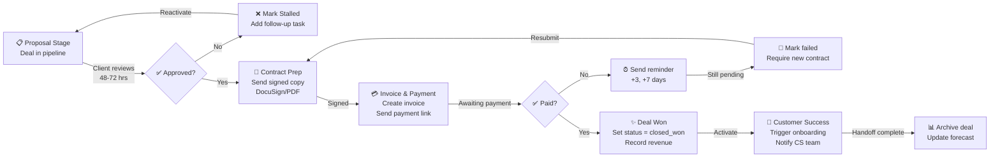

# SOP: Deal Closure & Contract Execution

**Owner:** Sales Director  
**Last Updated:** 2026-05-01  
**Related SOPs:** [02-Pipeline-Qualification](02-pipeline-qualification.md), [04-Account-Onboarding](04-account-onboarding.md), [Email Marketing: Sequence Setup](../email-marketing/01-sequence-setup.md)

---

## Overview

This SOP covers the final stages of a sales deal: proposal acceptance, contract negotiation, payment processing, and handoff to Customer Success. The workflow ensures all legal and financial requirements are met before the customer is activated in production.

---

## Workflow Diagram



---

## Step-by-Step Procedure

### 1. Proposal Delivery (Days 1–3)

**Trigger:** Deal moves to Stage 4 (Proposal) in CRM.

**Actions:**
- [ ] CRM: Set deal `status = "proposal_pending"` and `proposal_sent_date = NOW()`
- [ ] Prepare proposal document (PDF or DocuSign link; include pricing, scope, timeline, terms)
- [ ] **Email client** with subject line: `"Your Custom NetWebMedia Proposal – [Client Name]"`
  - Include 2–3 decision-maker names (from deal `cc_list` field)
  - Set explicit review deadline: `"Please review and confirm by [date + 72 hours]"`
  - Include link to proposal + payment method options (credit card, ACH, bank wire)
- [ ] **CRM task:** Create "Follow up on proposal" reminder for Day 2 (48-hour mark)
- [ ] **Slack:** Notify sales team in `#deals` channel with deal summary and deadline

**API calls:**
```javascript
// Update deal status
POST /crm-vanilla/api/?r=deals&id=<deal_id>
{
  "status": "proposal_pending",
  "proposal_sent_date": "2026-05-01T14:30:00Z"
}

// Create follow-up task (CRM automation)
POST /crm-vanilla/api/?r=tasks
{
  "contact_id": <contact_id>,
  "deal_id": <deal_id>,
  "title": "Follow up on proposal",
  "due_date": "2026-05-03",
  "priority": "high",
  "assigned_to": <rep_id>
}
```

---

### 2. Proposal Follow-Up (Days 2–3)

**No decision by Day 2 morning?**
- [ ] Send quick Slack DM or email: `"Checking in — any questions on the proposal?"`
- [ ] Extend task deadline if needed; don't close deal yet

**Decision received:**
- [ ] **If approved:** Jump to Step 3 (Contract Prep)
- [ ] **If rejected/modified:** 
  - [ ] Discuss objections on call (reference [02-Pipeline-Qualification](02-pipeline-qualification.md) objection matrix)
  - [ ] Revise proposal if needed; resend
  - [ ] Set new follow-up date; do NOT move to stalled yet (max 2 revisions before stalling)

---

### 3. Contract Preparation & Signing (Days 4–5)

**Trigger:** Client approves proposal.

**Actions:**
- [ ] CRM: Set deal `status = "contract_sent"` and `contract_sent_date = NOW()`
- [ ] **Prepare contract:**
  - Use template: `_deploy/contracts/nwm-standard-msa-<package>.docx`
  - Update: Client name, scope, pricing, start date, renewal date (e.g., annual renewal on anniversary)
  - Add payment terms: `"Net 7"` (default) or `"Due on signing"` (if upfront required)
  - Include link to email sequence (`crm_vanilla` enroll on signing)
- [ ] **Send for signature:**
  - **DocuSign:** Preferred for enterprise clients (> $10K ARR)
    - Upload contract; set signing order (primary + secondary signers from `cc_list`)
    - Set reminder: "Signing required by [date + 48 hours]"
    - Track status in DocuSign dashboard
  - **PDF + email:** Acceptable for smaller deals
    - Email contract as PDF + request wet-ink scan or typed signature on email reply
- [ ] **CRM task:** Create "Check contract signature status" for Day 5 morning (24-hour mark)

**DocuSign API example:**
```javascript
// Trigger DocuSign envelope
POST https://api.docusign.com/v2.1/accounts/{account_id}/envelopes
{
  "emailSubject": "Signature Request – NetWebMedia Agreement",
  "recipients": {
    "signers": [
      {
        "email": "<primary_signer@company.com>",
        "name": "<Primary Signer>",
        "recipientId": "1"
      }
    ]
  },
  "documents": [{
    "documentId": "1",
    "name": "NWM-MSA.pdf",
    "base64": "<base64_encoded_pdf>"
  }],
  "status": "sent"
}
```

---

### 4. Contract Received & Countersigned (Days 5–6)

**Client returns signed contract:**
- [ ] CRM: Set deal `status = "contract_signed"` and `contract_signed_date = NOW()`
- [ ] **Store contract** in secure location:
  - CRM attachment field: `contracts` array
  - Shared drive: `/Shared Drives/NetWebMedia Sales/Closed Deals/[Year]/[Client Name]/contract.pdf`
- [ ] **Review contract:**
  - Verify all signatures present (both parties)
  - Check dates match proposal (start, renewal, payment due)
  - If amendments made by client: Consult Carlos or legal; countersign or renegotiate if terms changed
- [ ] If fully signed: Jump to Step 5 (Invoice & Payment)

---

### 5. Invoice & Payment (Days 6–7)

**Trigger:** Signed contract received.

**Actions:**
- [ ] **CRM:** Set deal `status = "awaiting_payment"`
- [ ] **Create invoice:**
  - Use template: `_deploy/invoices/nwm-invoice-template.xlsx`
  - Fields: Invoice number (auto-increment), date, due date (Net 7 from today), line items, total, client info, payment methods
  - Generate PDF via custom script or manual export
- [ ] **Send invoice + payment options:**
  - Email subject: `"Invoice #[X] – NetWebMedia Services"`
  - Include 3 payment methods:
    1. **Credit card:** Stripe link (`stripe.com/pay/...` or embedded form)
    2. **ACH/Bank transfer:** Bank details + ACH routing
    3. **Wire transfer:** Wire details + SWIFT code (if international)
  - Payment link expiry: 30 days
  - Include note: `"Payment due by [date]"`
- [ ] **CRM task:** Create "Check payment received" reminder for Day 9 (+3 days after send)

**Invoice API example:**
```javascript
// Create invoice in CRM
POST /crm-vanilla/api/?r=invoices
{
  "contact_id": <contact_id>,
  "deal_id": <deal_id>,
  "invoice_number": "INV-2026-1234",
  "date": "2026-05-01",
  "due_date": "2026-05-08",
  "line_items": [
    {"description": "Digital Marketing Strategy – 3 months", "amount": 5000}
  ],
  "total": 5000,
  "status": "sent"
}

// Track payment (Stripe webhook)
// Stripe webhook → /api/public/stripe/webhook
// Payload updates invoice status to "paid" + triggers CRM update
```

---

### 6. Payment Follow-Up (Days 9–13)

**No payment received by Day 9?**
- [ ] Send gentle reminder: `"Checking in on invoice #[X] – due [date]. Please confirm receipt."`
- [ ] Check email: Payment may have been sent to wrong address or bounced
- [ ] Offer to resend invoice or answer payment questions

**Still unpaid by Day 13 (+6 days)?**
- [ ] **Escalate:**
  - [ ] Call client directly: `"Do you need anything from us to process payment?"`
  - [ ] Confirm invoice was received and amount is correct
  - [ ] Offer payment plan if needed (requires Carlos approval for >$5K deals)
- [ ] CRM: Set deal `status = "payment_issue"` + add note with reason
- [ ] If client requests payment plan, see Section 7 (Alternative Payment Terms)

**Payment received:**
- [ ] CRM: Set deal `status = "closed_won"` and `closed_date = NOW()`
- [ ] Record revenue in CRM (auto-calculated from `deal_amount`)
- [ ] Update forecast (if not auto-updated)
- [ ] Jump to Step 8 (Customer Success Handoff)

---

### 7. Alternative Payment Terms (If Needed)

**Payment plan (e.g., 3 equal installments):**
- [ ] Require **Carlos approval** for any plan extending > 30 days
- [ ] Create **3 separate invoices:**
  - Invoice 1: 50% (due now)
  - Invoice 2: 25% (due +30 days)
  - Invoice 3: 25% (due +60 days)
- [ ] Add to contract: `"Payment schedule: [invoice dates + amounts]"`
- [ ] CRM: Set deal `payment_plan = "3x"` and track each milestone
- [ ] Automate reminders: Create tasks for Days 30 and 60 for follow-up invoices

---

### 8. Customer Success Handoff (Day 14)

**Trigger:** Deal marked `closed_won` + payment received (or payment plan initiated).

**Actions:**
- [ ] **Notify Customer Success team:**
  - Slack: Post in `#customer-success` with deal summary:
    ```
    🎉 New Customer: [Client Name]
    📊 ARR: $[amount] | Package: [package name]
    👤 Primary Contact: [name, email, phone]
    📅 Start Date: [date] | Renewal: [date]
    👤 Rep: [sales rep name]
    ```
- [ ] **Create Customer Success record:**
  - Link contact to deal: `contact.deals_array += [<deal_id>]`
  - Trigger onboarding workflow: `POST /crm-vanilla/api/?r=workflows&id=<onboarding_wf_id>&action=run_now`
  - Set enrollment date: `onboarding_start_date = NOW()`
  - Auto-assign to CS owner (based on package or geography)
- [ ] **Enroll in email sequence:**
  - Sequence: `"welcome_new_customer_[package]"` (e.g., `welcome_new_customer_growth_plan`)
  - Trigger: Automatically sent on Day 0 after `closed_won` status
  - Includes: Login credentials, getting-started guide, onboarding call calendar link
- [ ] **CRM:** Update contact `status = "customer"` + set `customer_start_date`

**Workflow automation example:**
```javascript
// Auto-enroll in CS onboarding workflow (crm-vanilla/js/automation.js trigger)
{
  "trigger_type": "deal_stage_changed",
  "trigger_filter": {"status": "closed_won"},
  "steps": [
    {
      "type": "send_email",
      "template": "welcome_new_customer",
      "cc_list": ["<cs_owner_email>"]
    },
    {
      "type": "create_task",
      "title": "Schedule onboarding call with [Client Name]",
      "assigned_to": "<cs_owner_id>",
      "due_date": "+1 day"
    }
  ]
}
```

---

### 9. Deal Archive (Day 21)

**Housekeeping step:**
- [ ] CRM: Set deal `archived = true` (removes from active pipeline)
- [ ] **Update forecast:**
  - If deal was forecast for current month but closed previous month: Update forecast export
  - Reconcile with actual revenue in accounting
- [ ] **Generate deal closure report** (monthly):
  - Count closed deals, total ARR, average deal size
  - Identify patterns (most common package, fastest/slowest closure time)
  - Share in sales standup: `#sales-closed-deals` channel

---

## Technical Details

### Invoice Number Sequence
- Format: `INV-YYYY-NNNN` (e.g., `INV-2026-0001`)
- Auto-increment stored in CRM `sequence_counters` table
- SQL: `UPDATE sequence_counters SET value = value + 1 WHERE type = 'invoice' AND year = 2026`

### Payment Webhook Integration
- **Stripe webhook:** `POST /api/public/stripe/webhook`
- Payload includes: `charge.succeeded` event → extract invoice ID → POST to CRM to update status
- **ACH/wire:** Manual verification step (email proof of transfer) → CRM update by admin

### Contract Storage
- Primary: CRM `contracts` array (JSON, max 5 MB)
- Backup: Shared Google Drive `/NetWebMedia Sales/Closed Deals/[Year]/[Client]/`
- Do NOT store in `/api-php/data/` (public web-accessible directory)

### Deal Amount Decimal Precision
- Store all amounts in CRM as `DECIMAL(12, 2)` (max $999,999.99)
- Never use `FLOAT` — currency requires exact decimal representation

---

## Troubleshooting

| Issue | Cause | Resolution |
|-------|-------|-----------|
| **DocuSign envelope not received** | Email filtered as spam or wrong address | Resend DocuSign link manually + add to whitelist |
| **Payment marked "paid" but invoice shows "unpaid"** | Webhook not triggered | Check Stripe dashboard for charge status; manually POST to CRM API |
| **Contract amendment after signing** | Client requested terms change | Escalate to Carlos; do NOT sign modified contract without approval |
| **Client requests payment plan** | Payment upfront not feasible | Require Carlos approval; create 3 separate invoices + update deal notes |
| **Deal stuck in "awaiting_payment" for 30+ days** | Client unresponsive | Mark `status = "stalled"` + schedule re-qualification call in 90 days |

---

## Checklists

### Deal Closure Checklist (Before Marking Closed_Won)
- [ ] Signed contract received and verified (both parties signed)
- [ ] Invoice created and sent
- [ ] Payment received OR payment plan approved + first payment received
- [ ] Client start date confirmed and scheduled
- [ ] Customer Success team notified in Slack
- [ ] Onboarding sequence auto-enrolled
- [ ] Contact status updated to "customer"
- [ ] Deal archived in CRM

### Monthly Sales Close Checklist (End of Month)
- [ ] All closed_won deals archived
- [ ] Forecast reconciled with actual revenue
- [ ] Deal closure report generated and shared
- [ ] Contract storage audit (all contracts backed up to shared drive)
- [ ] Payment reconciliation (compare invoiced vs. received amounts)
- [ ] Aging invoice report (any unpaid invoices > 30 days?)

---

## Related SOPs

- [**02-Pipeline-Qualification**](02-pipeline-qualification.md) — Objection handling & deal scoring leading up to proposal stage
- [**04-Account-Onboarding**](04-account-onboarding.md) — Customer success handoff and first 30 days
- [**Email Marketing: Sequence Setup**](../email-marketing/01-sequence-setup.md) — Enrollment and welcome sequence mechanics

---

*Last reviewed: 2026-05-01 | Next review: 2026-06-01*
