# SOP: Customer Onboarding & Account Activation

**Owner:** Customer Success Manager  
**Last Updated:** 2026-05-01  
**Related SOPs:** [03-Deal-Closure](03-deal-closure.md), [CRM Operations: Contact Management](../crm-operations/01-contact-management.md), [Email Marketing: Sequence Setup](../email-marketing/01-sequence-setup.md)

---

## Overview

This SOP covers the first 30 days after a deal closes: provisioning customer access, delivering initial content, scheduling training calls, and ensuring the customer is set up for success. Success metrics: 90% of onboarding tasks completed by Day 14, zero critical blockers by Day 7.

---

## Workflow Diagram

```mermaid
graph LR
    A["🎉 Deal Closed<br/>Payment received"] -->|"Trigger"| B["📋 Onboarding Kickoff<br/>Day 0-1<br/>Assign CS owner<br/>Create checklist"]
    B -->|"Day 1"| C["🔐 Provision Access<br/>Create CRM account<br/>Generate login link<br/>Send credentials"]
    C -->|"Day 1"| D["📧 Send Welcome Email<br/>Getting started guide<br/>Onboarding timeline<br/>Support contact info"]
    D -->|"Day 2"| E["📅 Schedule Kickoff Call<br/>Set date + time<br/>Send calendar invite<br/>Confirm attendees"]
    E -->|"Day 3-5"| F["📞 Kickoff Call<br/>Review goals<br/>Show platform<br/>Q&A<br/>Next steps"]
    F -->|"Day 6-10"| G["📚 Deliver Content<br/>Strategy document<br/>Content calendar<br/>First 3 posts<br/>Campaign materials"]
    G -->|"Day 10-14"| H["✅ First Execution<br/>Publish first campaign<br/>Monitor performance<br/>Adjust if needed"]
    H -->|"Day 15-21"| I["📊 Review & Optimize<br/>Analyze results<br/>Adjust strategy<br/>Plan next phase"]
    I -->|"Day 21-30"| J["🎓 Graduation Call<br/>Review progress<br/>Identify wins<br/>Set expectations<br/>Transition to support"]
    J -->|"Day 30+"| K["📞 Ongoing Support<br/>Monthly QBR<br/>Performance tracking<br/>Expansion planning"]
```



---

## Step-by-Step Procedure

### Phase 1: Kickoff (Days 0–2)

#### Day 0: Onboarding Initiation

**Trigger:** Deal marked `closed_won` in CRM + payment received.

**Actions:**
- [ ] **CRM:** Create onboarding record
  - Set `onboarding_status = "in_progress"`
  - Set `onboarding_start_date = TODAY()`
  - Set `expected_completion_date = TODAY() + 30 days`
  - Assign `cs_owner_id` (auto-assigned or manually selected based on package)
- [ ] **Customer Success team meeting (Slack):**
  - Post in `#customer-success`:
    ```
    🎉 NEW ONBOARDING: [Client Name]
    📊 Package: [package name] | ARR: $[amount]
    👤 CS Owner: [name] | Primary Contact: [name, email, phone]
    📅 Kickoff Call: [proposed date/time]
    ```
- [ ] **Create onboarding task checklist** in CRM:
  - Checklist type: `"onboarding_30_day"`
  - Tasks (in order): Provision access → Welcome email → Schedule kickoff → Kickoff call → Deliver content → Execute first campaign → Graduation call
  - Assign all tasks to CS owner
  - Due dates: Stagger per timeline below

#### Day 1: Provision Access

**Actions:**
- [ ] **Create customer account** (CRM account record):
  - `account_name = [Client Name]`
  - `package = [selected package]`
  - `status = "active"`
  - `account_start_date = TODAY()`
  - `renewal_date = [calculated based on contract]` (e.g., 1 year from start)
  - `support_level = [per package]` (e.g., "email_only", "email_phone", "dedicated")
  - `billing_contact_id = [primary contact ID]`
  - `secondary_contacts = [array of other user IDs]` (if multi-user plan)

**API call:**
```javascript
POST /crm-vanilla/api/?r=accounts
{
  "contact_id": <contact_id>,
  "name": "[Client Name]",
  "package": "growth_plan",
  "status": "active",
  "account_start_date": "2026-05-01",
  "renewal_date": "2027-05-01",
  "support_level": "email_phone"
}
```

- [ ] **Generate customer dashboard login credentials:**
  - Username: Customer email (auto-populate from contact)
  - Password: Auto-generate 12+ character (requires reset on first login)
  - Send via secure email: `"Your NetWebMedia Dashboard Login"` + login link
  - Include note: `"Password expires after first use. Change it immediately."`

- [ ] **Grant account access in 3rd-party tools** (if applicable):
  - Analytics dashboard (GA4 property for client account)
  - Video Factory (if video services included)
  - Email template library (if managing campaigns)
  - Social media scheduling tool (if social management included)
  - Add contact to relevant Slack channels (`#[client-name]-support`, etc.)

- [ ] **CRM task:** Mark "Provision Access" complete; auto-advance to next task

---

#### Day 1: Welcome Email

**Actions:**
- [ ] **Trigger welcome sequence** (auto-sent via CRM workflow)
  - Sequence: `"onboarding_welcome_[package]"` (e.g., `onboarding_welcome_growth_plan`)
  - Email 1 (Day 0): Welcome + login link + getting started guide (PDF attachment)
  - Includes: Next steps timeline, CS owner contact info, support hours, escalation process
  - CTA: "Click here to verify your account"

**Welcome email template structure:**
```
Subject: Welcome to NetWebMedia – [Client Name]! 🚀

Hi [First Name],

Thank you for choosing NetWebMedia! We're excited to help you transform your [industry] business.

📋 YOUR ONBOARDING TIMELINE:
  • Day 1-2: Account access provisioned ✓
  • Day 2-3: Schedule kickoff call
  • Day 5: Kickoff strategy call (30 min)
  • Days 5-10: Content & strategy delivered
  • Days 10-14: First campaign launches
  • Day 30: Graduation & transition to support

🔐 YOUR DASHBOARD LOGIN:
  URL: https://netwebmedia.com/crm-vanilla/
  Email: [contact email]
  Password: [auto-generated, expires after first use]

📞 YOUR CUSTOMER SUCCESS OWNER:
  Name: [CS Owner Name]
  Email: [CS Owner Email]
  Phone: [CS Owner Phone]
  Slack: @[CS Owner] (direct channel #[client-name]-support)

📚 RESOURCES:
  • Getting Started Guide (attached PDF)
  • Video: 5-minute platform overview (link)
  • FAQ: Common questions (link)
  • Support: support@netwebmedia.com

Let's get started!

Best,
[CS Owner Name]
NetWebMedia Customer Success
```

---

#### Day 2: Schedule Kickoff Call

**Actions:**
- [ ] **Coordinate with customer:**
  - Send calendar invite (email) + Slack DM to primary contact
  - Proposed time: `"[3 options, each 30 min duration, within next 5 days]"`
  - Include: Zoom link, agenda, duration (30 min)
  - Timezone: Auto-detect from contact record or ask
  - Confirm attendees: Primary contact + any internal stakeholders they want to include

- [ ] **Prepare kickoff agenda** (30-minute call):
  1. **Intro (5 min):** Icebreaker + team intros (CS owner + client stakeholders)
  2. **Goals Review (5 min):** Recap contract goals; confirm success metrics
  3. **Platform Demo (10 min):** 2-3 key features relevant to their package
  4. **Timeline & Expectations (5 min):** 30-day onboarding timeline; what to expect
  5. **Q&A (5 min):** Open questions; note action items

- [ ] **Send Slack reminder** to CS owner:
  ```
  📅 KICKOFF CALL SCHEDULED: [Client Name]
  ⏰ [Date/Time] – [Zoom Link]
  ✅ Agenda: [link to shared doc]
  📋 Attendees: [names confirmed]
  ```

---

### Phase 2: Strategy & Discovery (Days 3–5)

#### Day 3–5: Kickoff Call + Strategy Documentation

**Kickoff Call Actions:**
- [ ] **Join Zoom call** (CS owner + client + optional internal stakeholder)
  - Record call (with permission): `"For our records and your reference"`
  - Take notes in CRM: `account.kickoff_call_notes = "[summary]"`
  - Document: Goals (quantified), current challenges, success metrics, timeline expectations

- [ ] **Deliver initial strategy document** (shared within 24 hours post-call):
  - Document format: Google Doc or PDF (shared via email + CRM)
  - Contents:
    1. **Executive Summary** (1 page): What we'll do, expected outcomes, timeline
    2. **Current State Analysis** (1–2 pages): Based on kickoff call + audit
    3. **Recommended Strategy** (2–3 pages): Specific tactics for their industry/package
    4. **Content Calendar** (1 month template): Themes, formats, posting schedule
    5. **Success Metrics** (1 page): KPIs to track, review frequency (monthly)
    6. **Next Steps** (bullets): Content delivery dates, review checkpoints

- [ ] **CRM task:** Mark "Kickoff Call" complete; advance to "Deliver Content"

---

#### Days 5–10: Content Delivery

**Actions:**
- [ ] **Deliver initial content package** (based on package tier):

  **Growth Plan (3-month engagement):**
  - 3 blog posts (1,500–2,000 words each) + SEO optimization
  - 1 email sequence (5 emails, drip over 30 days)
  - 3 social media post templates (ready to schedule)
  - 1 industry-specific landing page template
  - Delivery: Shared Google Drive folder + CRM content library

  **Scale Plan (6-month engagement):**
  - All Growth Plan content PLUS:
  - Video brief (30–60 sec) + Remotion template
  - Weekly content calendar (12 weeks pre-planned)
  - 1 webinar/educational content series outline
  - Competitive analysis report

  **Custom Plan:**
  - Per contract scope; follow same pattern as growth/scale but custom volume

- [ ] **Review content with customer:**
  - Schedule brief call or async review (depends on package)
  - Share drafts in shared doc; request feedback
  - Incorporate feedback; finalize within 48 hours
  - Move approved content to "Live" folder in shared drive

- [ ] **Provide publishing instructions:**
  - Step-by-step for each content type (blog publish, email send, social post)
  - Links to platform docs (CMS, email tool, social scheduler)
  - Contact for questions: `"Email me if anything's unclear"`

**Content delivery tracking:**
```javascript
// CRM record: Account content_delivered_date
PUT /crm-vanilla/api/?r=accounts&id=<account_id>
{
  "content_delivered_date": "2026-05-08",
  "content_package_items": [
    {"type": "blog_post", "title": "...", "status": "approved"},
    {"type": "email_sequence", "title": "...", "status": "approved"},
    {"type": "social_posts", "count": 3, "status": "approved"}
  ]
}
```

---

### Phase 3: Execution (Days 10–14)

#### Days 10–14: First Campaign Launch

**Actions:**
- [ ] **Co-pilot first campaign launch** with customer:
  - Day 10: CS owner sends: `"Ready to go live with first blog post? Here's the checklist:"`
  - Customer publishes first post (with CS owner as backup if needed)
  - CS owner verifies publication (check live URL, check search console indexing)
  - Take screenshot for CRM record

- [ ] **Launch email sequence:**
  - Customer enrolls first 100 contacts in welcome sequence
  - CS owner monitors first 24 hours: Open rate, click rate
  - If issues (spam folder, formatting): Debug and resend

- [ ] **Schedule first social posts:**
  - Use customer's social scheduler or post manually
  - 3 posts across 3–5 days (stagger for engagement)
  - Monitor engagement: Take screenshot of analytics

- [ ] **Document execution in CRM:**
  - `account.first_campaign_launch_date = TODAY()`
  - `account.first_content_performance = {...}` (open rates, views, engagement)

- [ ] **CRM task:** Mark "First Execution" complete

---

### Phase 4: Review & Optimization (Days 15–21)

#### Days 15–21: Mid-Point Review

**Actions:**
- [ ] **Gather performance data** (from Day 10 launch):
  - Blog post: Page views, avg. time on page, bounce rate (from GA4)
  - Email: Open rate, click rate, unsubscribe rate
  - Social: Impressions, engagement rate, follower growth
  - Create simple report: 1 page with 3 charts

- [ ] **Schedule mid-point review call** (15 min, asynchronous ok):
  - Discuss: What's working, what needs adjustment
  - Celebrate wins: "Your blog post got X views in 5 days!"
  - Identify gaps: Low engagement on social? Try different topic.
  - Decision: Adjust strategy or continue as-is?

- [ ] **Update strategy** if needed:
  - Modify content calendar (pivot topic, format, or posting schedule)
  - Brief update to strategy doc: `"[Date] – Updated based on performance review"`
  - Share revised content for Days 22–30

- [ ] **CRM task:** Mark "Review & Optimize" complete

---

### Phase 5: Graduation (Days 22–30)

#### Days 22–30: Transition to Ongoing Support

**Actions:**
- [ ] **Prepare graduation call** (30 min, final structured call):
  - Agenda:
    1. **Review 30-Day Performance** (10 min): Dashboard walkthrough, key wins, lessons learned
    2. **Assess Onboarding Completion** (5 min): Checklist review, any blockers resolved?
    3. **Transition to Support** (10 min): How to reach us post-onboarding, support hours, escalation
    4. **Next Phase Planning** (5 min): Expansion ideas, renewal expectations, upsell opportunities

- [ ] **Create customer success playbook** (one-pager):
  - Quick reference: How to use the platform for common tasks
  - Support options: Email, Slack, phone (based on package)
  - Success metrics dashboard (where to find real-time performance)
  - Contact directory: CS owner + team

- [ ] **Transition customer to ongoing support:**
  - Move from `"onboarding"` to `"active_customer"` status in CRM
  - Assign account to general CS support queue (or dedicated rep if upsell planned)
  - Remove from onboarding email sequences; enroll in regular check-in sequence

- [ ] **Schedule first monthly QBR** (if applicable):
  - For packages with QBR support: Schedule 30 days out (e.g., June 1 if onboarded May 1)
  - Send calendar invite + QBR agenda template

- [ ] **Update CRM graduation date:**
  ```javascript
  PUT /crm-vanilla/api/?r=accounts&id=<account_id>
  {
    "onboarding_completion_date": "2026-05-31",
    "onboarding_status": "completed",
    "account_status": "active_customer"
  }
  ```

---

## Technical Details

### Onboarding Package Tiers

| Package | Content | Timeline | Support | Cost |
|---------|---------|----------|---------|------|
| **Growth Plan** | 3 blog posts, 1 email sequence, 3 social posts, 1 landing page template | 30 days to delivery | Email + Slack | $5K–$10K |
| **Scale Plan** | 12 weeks content calendar, video brief, webinar outline, competitive analysis | 30 days kickoff; ongoing delivery | Email + Slack + phone | $10K–$20K |
| **Custom Plan** | Per contract scope | Per contract | Per contract | $20K+ |

### Login Credentials Management
- Store in CRM `account.login_credentials` JSON (encrypted field):
  ```json
  {
    "dashboard_url": "https://netwebmedia.com/crm-vanilla/",
    "username": "[contact email]",
    "temporary_password": "[auto-generated, expires on first use]",
    "created_date": "2026-05-01",
    "last_reset_date": null
  }
  ```
- Passwords NEVER sent in plain text; always via secure link or 1Password vault

### Onboarding Automation
- Workflow trigger: `deal_status = "closed_won"`
- Auto-enroll: `"onboarding_welcome_[package]"` email sequence
- Auto-create: `onboarding_checklist` task list for CS owner
- Auto-schedule: Kickoff call reminder (Day 0 + Day 1)

---

## Troubleshooting

| Issue | Cause | Resolution |
|-------|-------|-----------|
| **Customer doesn't receive login link** | Email filtered as spam | Resend via Slack DM + check spam folder + verify email in CRM |
| **Customer misses kickoff call** | Calendar invite ignored or timezone confusion | Send Slack reminder 24 hrs prior; offer rescheduling |
| **Content not approved by Day 10** | Customer slow to review | Follow up with brief email: `"Any feedback on the strategy doc?"` |
| **First campaign gets zero engagement** | Wrong content topic or format | Analyze audience preference from kickoff call; pivot topic for next post |
| **Customer asks for feature not in package** | Scope creep | Politely refer to contract scope; offer upsell conversation |

---

## Checklists

### 30-Day Onboarding Checklist
- [ ] **Day 0:** Onboarding kickoff (CS owner assigned, task list created)
- [ ] **Day 1:** Access provisioned, temporary login sent
- [ ] **Day 1:** Welcome email sent (auto-triggered)
- [ ] **Day 2:** Kickoff call scheduled (calendar invite sent)
- [ ] **Day 5:** Kickoff call completed, notes recorded
- [ ] **Day 6:** Strategy document delivered (shared, feedback requested)
- [ ] **Day 10:** Content package delivered (all items approved)
- [ ] **Day 10:** First content goes live (blog post published, email queued)
- [ ] **Day 15:** Performance data collected (3 KPIs tracked)
- [ ] **Day 21:** Mid-point review call scheduled
- [ ] **Day 21:** Strategy adjustments finalized (if needed)
- [ ] **Day 30:** Graduation call scheduled
- [ ] **Day 30:** Customer graduated to ongoing support status
- [ ] **Day 30:** First monthly QBR scheduled (if applicable)

### QBR Preparation Checklist (For Ongoing Customers)
- [ ] Pull 30-day performance dashboard (GA4, email, social analytics)
- [ ] Calculate: ROI estimate based on actual traffic/conversions
- [ ] Identify 2–3 quick wins and 1–2 improvement opportunities
- [ ] Prepare upsell or expansion talking points (if applicable)
- [ ] Send agenda + pre-call data 48 hours before QBR

---

## Related SOPs

- [**03-Deal-Closure**](03-deal-closure.md) — Contract execution and payment leading up to onboarding
- [**CRM Operations: Contact Management**](../crm-operations/01-contact-management.md) — Account record structure and multi-user management
- [**Email Marketing: Sequence Setup**](../email-marketing/01-sequence-setup.md) — Welcome sequence enrollment and drip mechanics
- [**Customer Success: QBR**](../customer-success/02-qbr.md) — Monthly business review process post-onboarding

---

*Last reviewed: 2026-05-01 | Next review: 2026-06-01*
