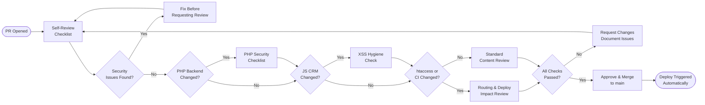

# SOP-TD-01 — Code Review

**Owner:** Engineering Lead  
**Cadence:** Per pull request  
**Last updated:** 2026-05-01  
**Related:** [02-github-actions.md](02-github-actions.md) · [03-ftps-deploy.md](03-ftps-deploy.md) · [05-migrations.md](05-migrations.md)

---

## Overview

This SOP governs the code review process for all changes to the netwebmedia.com monorepo: review standards, security checklist, deployment impact assessment, and merge criteria.

**Repo context:** Flat-deployed multi-property monorepo. No automated tests — smoke tests run post-deploy via GitHub Actions. Security and correctness reviews happen here, at PR time.

**What triggers a formal code review:**
- Any change to `api-php/` or `crm-vanilla/api/` (PHP backend)
- Any new JavaScript functionality in `crm-vanilla/js/`
- Any `.htaccess` changes (routing/security impact)
- Any `deploy-site-root.yml` changes (CI/CD impact)
- Schema migrations (`schema_*.sql` files)
- New dependencies (package.json, composer.json changes)

**Simple HTML/CSS/content changes** can be merged by Carlos without formal review.

**Success metrics:**
- Zero security regressions introduced via PR
- Zero broken deploys caused by missing workflow path updates
- Zero XSS vulnerabilities in CRM JavaScript
- All `schema_*.sql` migrations are idempotent before merge

---

## Workflow



---

## Procedures

### 1. Self-Review Before Opening a PR (15 min)

Before requesting review, run through self-check:

1. `git diff main...HEAD` — read every changed line
2. No secrets or credentials committed (check for API keys, passwords, tokens)
3. No TODO comments that should be resolved before merge
4. No debug code left in (`console.log`, `var_dump`, `die()`, test-only routes)
5. Files staged intentionally — no accidental inclusion of temp files, `.env`, backups

**Check for large files:**
```bash
git diff main...HEAD --stat | grep -E "[0-9]{4,}" # Files with >999 lines changed — flag for review
```

---

### 2. PHP Backend Security Checklist

For any change to `api-php/` or `crm-vanilla/api/`:

**SQL injection prevention:**
- [ ] All user input goes through PDO prepared statements (`?` placeholders)
- [ ] No string concatenation in SQL queries with user-provided values
- [ ] `ORDER BY` and table names (which can't be parameterized) use allowlist validation

**Authentication & authorization:**
- [ ] Protected routes check `X-Auth-Token` header validity
- [ ] Multi-tenant routes use `tenancy_where()` — never bare `WHERE id = ?` without tenant check
- [ ] New admin-only endpoints check admin role before execution
- [ ] Public endpoints (`/api/public/`) have rate limiting via file-based limiter

**Input validation:**
- [ ] Enum fields validated against allowlist (`$ALLOWED_STATUS`, `$ALLOWED_NICHE`, etc.)
- [ ] Integer IDs cast to `(int)` before use
- [ ] JSON blob fields go through a `_normalize_*()` function before storage
- [ ] URLs submitted by users pass through `url_guard()` (SSRF protection)

**Output security:**
- [ ] JSON responses don't leak internal error messages to clients
- [ ] Error responses return generic messages in production, details in dev only

---

### 3. CRM JavaScript XSS Checklist

For any change to `crm-vanilla/js/*.js`:

- [ ] All user-controlled strings in `innerHTML` use `CRM_APP.esc()` (defined in `app.js`)
- [ ] No direct `innerHTML = userValue` anywhere in changed code
- [ ] `textContent` used where HTML rendering is not needed
- [ ] No `eval()` or `new Function(string)` patterns
- [ ] External data from API responses treated as untrusted before insertion into DOM

**Finding innerHTML patterns:**
```bash
grep -n "innerHTML" crm-vanilla/js/[changed-file].js
# Every match must use CRM_APP.esc() or be verified as non-user-controlled
```

---

### 4. .htaccess and Routing Changes

For any `.htaccess` change:

- [ ] Test with curl locally before pushing: `curl -I http://127.0.0.1:3000/[path]`
- [ ] Verify the canonical URL convention is maintained (extensionless top-level, `.html` nested)
- [ ] Child `.htaccess` rule does NOT unexpectedly shadow parent rules
- [ ] HTTPS redirect and www→non-www redirect blocks are intact
- [ ] CSP header additions don't break existing inline scripts or external CDN sources
- [ ] New directory additions follow the two-step deploy workflow update pattern

---

### 5. CI/CD Impact Assessment

For any change to `.github/workflows/`:

- [ ] Verify `on.push.paths` includes all intended trigger paths
- [ ] Verify staging `for d in ...` loop includes all directories that should deploy
- [ ] Secret references (`${{ secrets.NAME }}`) use correct secret names (check GitHub repo settings)
- [ ] `dry_run` logic preserved for `workflow_dispatch` testing
- [ ] Migration step curl command retains full Chrome User-Agent + Origin + Referer headers

---

### 6. Schema Migration Review

For any new `schema_*.sql` file:

- [ ] Idempotent: uses `CREATE TABLE IF NOT EXISTS`, `ALTER TABLE ... ADD COLUMN IF NOT EXISTS`, or `INSERT IGNORE`
- [ ] No `SET @var := (SELECT ...)` + `PREPARE/EXECUTE` pattern (leaves PDO cursors open)
- [ ] No semicolons inside string literals (naive splitter in `migrate.php`)
- [ ] Expected to be swallowed as idempotency error on re-run (codes 1050, 1060, 1061, 1062)
- [ ] Foreign key constraint names are unique (not reusing names from other tables)

---

### 7. Merge & Post-Merge Checklist

Before merging:
- [ ] All review checkboxes above passed
- [ ] PR description explains what changed and why
- [ ] If new top-level directory: both `deploy-site-root.yml` updates confirmed
- [ ] If schema migration: `migrate.php` will handle idempotent replay confirmed

After merging:
- [ ] Watch GitHub Actions deploy run — verify it completes without errors
- [ ] Spot-check changed URLs with `curl -I https://netwebmedia.com/[path]`
- [ ] If PHP changes: test one API endpoint manually
- [ ] If migration: verify migrate endpoint returned `{"ran": N, "skipped": M, "errors": []}` in deploy log

---

## Technical Details

### Security Vulnerability Patterns to Catch

**SQL injection (high risk):**
```php
// BAD — never do this:
$sql = "SELECT * FROM contacts WHERE email = '" . $_POST['email'] . "'";

// GOOD:
$stmt = $db->prepare("SELECT * FROM contacts WHERE email = ?");
$stmt->execute([$_POST['email']]);
```

**XSS in CRM JavaScript (high risk):**
```javascript
// BAD:
container.innerHTML = `<div>${userData.name}</div>`;

// GOOD:
container.innerHTML = `<div>${CRM_APP.esc(userData.name)}</div>`;
```

**Missing tenant check (medium risk):**
```php
// BAD — exposes other tenants' data:
$stmt = $db->prepare("SELECT * FROM deals WHERE id = ?");

// GOOD:
[$tWhere, $tParams] = tenancy_where();
$stmt = $db->prepare("SELECT * FROM deals WHERE $tWhere AND id = ?");
$stmt->execute(array_merge($tParams, [$id]));
```

### CSP Header Check

Before adding any third-party script, verify the CSP header in root `.htaccess`:
```
Content-Security-Policy: default-src 'self'; script-src 'self' <allowed-sources>; ...
```

New external domains need to be explicitly added to the relevant CSP directive.

---

## Troubleshooting

| Issue | Likely cause | Fix |
|---|---|---|
| Deploy breaks after merge | Missing path in `deploy-site-root.yml` trigger paths or `for d in` loop | Check CLAUDE.md "Adding a new top-level directory" section |
| Migration fails on deploy | Non-idempotent SQL (no IF NOT EXISTS, etc.) | Add appropriate idempotency guards, see SOP-TD-05 |
| CRM page broken after JS change | XSS escaping broke template rendering | Check if `CRM_APP.esc()` is escaping HTML that should be rendered |
| API returns 500 | PHP error (unhandled exception, DB connection fail) | Check Sentry (netwebmedia org), review error logs |
| CSP violation after merge | New inline script or external resource not in CSP | Add domain to CSP header in `.htaccess`, test in browser DevTools console |

---

## Checklists

### Pre-PR (Self-Review)
- [ ] `git diff` read line by line
- [ ] No secrets or debug code
- [ ] No large accidental file inclusions

### PHP Review
- [ ] PDO prepared statements everywhere
- [ ] Tenant isolation via `tenancy_where()`
- [ ] Enum allowlists for all enum fields
- [ ] User-submitted URLs use `url_guard()`

### JS Review
- [ ] All `innerHTML` with user data uses `CRM_APP.esc()`
- [ ] No `eval()` or dynamic Function construction

### Deploy Review
- [ ] `.htaccess` changes tested locally
- [ ] CI path triggers updated if new directories
- [ ] Schema migration idempotency verified

---

## Related SOPs
- [02-github-actions.md](02-github-actions.md) — CI/CD workflow management
- [03-ftps-deploy.md](03-ftps-deploy.md) — FTPS deploy process
- [04-post-deploy.md](04-post-deploy.md) — Post-deploy verification steps
- [05-migrations.md](05-migrations.md) — Database migration standards
