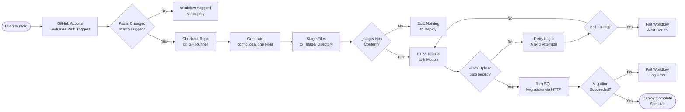

# SOP-TD-02 — GitHub Actions CI/CD Management

**Owner:** Engineering Lead  
**Cadence:** Per deploy; weekly health check  
**Last updated:** 2026-05-01  
**Related:** [01-code-review.md](01-code-review.md) · [03-ftps-deploy.md](03-ftps-deploy.md) · [04-post-deploy.md](04-post-deploy.md)

---

## Overview

This SOP governs the three GitHub Actions deploy workflows and supporting operational workflows: how they trigger, what they do, how to monitor them, and how to debug failures.

**Deploy workflows:**
| Workflow | File | Triggers on | Deploys to |
|---|---|---|---|
| Root site + CRM | `deploy-site-root.yml` | root HTML, CSS, JS, api-php/, crm-vanilla/ | `/public_html/` |
| Companies | `deploy-companies.yml` | `_deploy/companies/**` | `/public_html/companies/` |
| CRM legacy (deprecated) | `deploy-crm.yml` | Manual only | `/public_html/crm-vanilla/` |

**Operational workflows (non-deploy):**
`cron-workflows.yml` (CRM workflow cron), `psi-baseline.yml`, `uptime-smoke.yml`, `indexnow-ping.yml`, `generate-blog-queue.yml`, `publish-blogs-scheduled.yml`, `generate-guide-pdfs.yml`

**Deploy host:** InMotion cPanel via FTPS explicit (port 21). Never Vercel/Netlify.

**Success metrics:**
- Deploy success rate: ≥99%
- Deploy time: <15 min from push to live
- No broken deploys caused by missing path registrations
- `cron-workflows.yml` running every 5 min with zero failures

---

## Workflow



---

## Procedures

### 1. Monitoring a Deploy in Progress (5 min)

1. Navigate to repo → Actions tab
2. Click the running workflow
3. Expand each job step to see progress:
   - `checkout` → `generate-configs` → `stage-files` → `ftps-upload` → `run-migrations`
4. Watch for any step turning red (failure)

**Common progress indicators:**
- "Staging files..." — building the `_stage/` directory
- "Uploading X files..." — FTPS transfer in progress (may be slow for large deploys)
- Migration step: expect `{"ran": N, "skipped": M, "errors": []}` in curl response

---

### 2. Adding a New Deploy Path

When adding a new top-level directory (e.g., `social/`) — **both steps required:**

**Step 1:** Add to `on.push.paths` in `deploy-site-root.yml`:
```yaml
on:
  push:
    paths:
      - '**.html'
      - 'css/**'
      - 'js/**'
      - 'social/**'  # ← ADD THIS
```

**Step 2:** Add to the staging `for d in` loop (line ~155 in workflow):
```yaml
for d in css js assets images fonts blog tutorials lp industries app social; do
#                                                                  ^^^^^^ ADD
```

Omitting Step 2 causes a silent deploy success — the workflow runs but the new directory is never uploaded. Symptom: 404 on the new path, 200 everywhere else.

---

### 3. Triggering a Manual Deploy (Dry Run)

To test workflow logic without uploading files:

1. GitHub → Actions → `deploy-site-root.yml` → "Run workflow" button
2. Set `dry_run: true` in the inputs
3. Click "Run workflow"
4. Review logs — all steps except FTPS upload will execute
5. Verify `_stage/` contents look correct in the log output

---

### 4. Debugging a Failed Deploy

**Step 1: Identify which step failed**
Read the job step that turned red in the Actions log.

**Step 2: Common failures and fixes:**

| Failure | Likely cause | Fix |
|---|---|---|
| `generate-configs` fails | GitHub Secret not set | Go to Settings → Secrets, verify secret name exactly matches reference in workflow |
| `ftps-upload` fails (auth) | FTP credentials wrong or expired | Rotate FTP password in cPanel, update `CPANEL_FTP_ROOT_PASSWORD` secret |
| `ftps-upload` timeout | Large file count, InMotion connection limit | Retry manually; if persistent, check InMotion server status |
| `ftps-upload` partial | Connection dropped mid-transfer | FTP-Deploy-Action is hash-based incremental — safe to re-run, only untransferred files retry |
| Migration step returns 406 | mod_security blocking request | Verify curl command has Chrome User-Agent + Origin + Referer headers (see CLAUDE.md) |
| Migration step returns `"errors": [...]` | SQL error in migration file | Read error message, fix SQL in `schema_*.sql` file, push again |
| Workflow doesn't trigger | Changed file not in `on.push.paths` | Add the path pattern, push a whitespace change to re-trigger |

**Step 3: Re-trigger after fix**
After fixing the root cause, push a new commit or use "Re-run all jobs" in Actions UI.

---

### 5. Weekly Workflow Health Check (Monday, 10 min)

1. Navigate to repo → Actions
2. Check last 7 days of runs for `deploy-site-root.yml`:
   - Any failures? Investigate root cause
   - Average duration normal? (>15 min may indicate FTPS slowness)
3. Check `cron-workflows.yml`:
   - Last run: <10 min ago
   - All runs in last 7 days: green
   - If any red: check the POST to cron endpoint, verify `MIGRATE_TOKEN` secret
4. Check `uptime-smoke.yml`:
   - No failures (would indicate production outage)

---

### 6. Secret Management

Secrets used in workflows (managed in repo → Settings → Secrets → Actions):

**Deploy secrets:**
- `CPANEL_FTP_ROOT_USER` / `CPANEL_FTP_ROOT_PASSWORD` — root site FTP
- `CPANEL_FTP_USER` / `CPANEL_FTP_PASSWORD` — companies FTP (chrooted)

**App secrets (injected into config.local.php):**
`JWT_SECRET`, `DB_PASSWORD`, `RESEND_API_KEY`, `ANTHROPIC_API_KEY`, `HUBSPOT_TOKEN`, `MP_ACCESS_TOKEN`, `MP_PUBLIC_KEY`, `MP_WEBHOOK_SECRET`, `TWILIO_SID`, `TWILIO_TOKEN`, `TWILIO_FROM`, `WA_VERIFY_TOKEN`, `WA_META_TOKEN`, `WA_PHONE_ID`, `WA_META_APP_SECRET`

**Maintenance tokens:**
`MIGRATE_TOKEN`, `SEED_TOKEN`, `DEDUPE_TOKEN`, `IMPORT_BEST_TOKEN`, `IMPORT_CSV_TOKEN`

**Rotating a secret:**
1. Update the secret value in GitHub Settings → Secrets
2. Push a no-op commit (e.g., whitespace change in a `.md` file) to trigger re-deploy
3. The new value flows into `config.local.php` automatically

---

### 7. The cron-workflows.yml Explained

This workflow has a special dual purpose:
1. **Scheduled:** Runs every 5 minutes via GitHub Actions schedule — advances CRM workflow runs (wait steps, etc.)
2. **Health check:** If it stops running, CRM automations stall silently

**What it does:**
```
POST https://netwebmedia.com/crm-vanilla/api/?r=cron_workflows&token=<MIGRATE_TOKEN>
  Headers: User-Agent: Mozilla/5.0 (Chrome), Origin: ..., Referer: ...
```

**Expected response:**
```json
{"ran": 3, "skipped": 12, "errors": []}
```

`"ran"` = workflow runs that advanced. If `"errors"` is non-empty, investigate.

---

## Technical Details

### FTPS Configuration (InMotion cPanel)

```
Protocol: FTPS Explicit (not Implicit)
Port: 21
SSL: Explicit TLS
Passive mode: true
```

InMotion requires Explicit TLS on port 21. Do NOT use:
- FTPS Implicit (port 990) — InMotion doesn't support this
- SFTP — different protocol, uses port 22 (not configured)
- FTP (unencrypted) — blocked by InMotion policy

### FTP User Scope

The two FTP users have different directory scopes:
- `CPANEL_FTP_ROOT_USER` — writes to `/public_html/` (root site + all subdirs)
- `CPANEL_FTP_USER` — chrooted to `/public_html/companies/` only

This is by design — `CPANEL_FTP_USER` physically cannot write to the root site. Never try to use it for root site files.

---

## Troubleshooting

| Issue | Likely cause | Fix |
|---|---|---|
| Deploy triggers but nothing changes on site | `_stage/` build empty — new dir not in `for d in` loop | Add dir to the staging loop (Step 2 of path update) |
| Workflow triggers on wrong files | Path patterns too broad in `on.push.paths` | Narrow patterns, test with `paths-filter` action |
| cron-workflows.yml shows "skipped" | GitHub Actions free tier schedule can delay by 10+ min | This is expected; if consistently >15 min late, investigate GH status |
| Migration runs on every deploy even if nothing changed | Migrations are idempotent by design — this is correct | Normal behavior; `skipped` in response confirms this |
| Two deploy workflows fire simultaneously | Both path trigger patterns matched a single push | Both are safe to run concurrently — FTPS is hash-based, no race conditions |

---

## Checklists

### Pre-Push Deploy Check
- [ ] If new top-level directory: both `deploy-site-root.yml` updates done
- [ ] No secrets in committed code
- [ ] Schema migrations are idempotent

### Post-Deploy Verification (After Actions completes)
- [ ] GitHub Actions shows green
- [ ] Migration step log shows `{"ran": N, "errors": []}`
- [ ] Changed URLs return 200 (curl spot check)
- [ ] Sentry shows no new error spike

### Weekly Health Check (Monday)
- [ ] deploy-site-root.yml: last 7 days all green
- [ ] cron-workflows.yml: running every 5 min, last run <10 min ago
- [ ] uptime-smoke.yml: all green (no production outage)

---

## Related SOPs
- [01-code-review.md](01-code-review.md) — Code review before merge and deploy
- [03-ftps-deploy.md](03-ftps-deploy.md) — FTPS transfer details
- [04-post-deploy.md](04-post-deploy.md) — Post-deploy verification
- [05-migrations.md](05-migrations.md) — SQL migration standards
- [operations-admin/monitoring.md](../operations-admin/monitoring.md) — Production health monitoring
