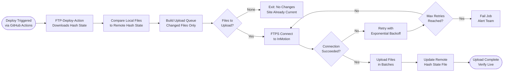

# SOP-TD-03 — FTPS Deploy Operations

**Owner:** Engineering Lead  
**Cadence:** Automated per push; manual when CI fails  
**Last updated:** 2026-05-01  
**Related:** [02-github-actions.md](02-github-actions.md) · [04-post-deploy.md](04-post-deploy.md)

---

## Overview

This SOP covers the FTPS deployment process for netwebmedia.com: how files are staged and uploaded, how to execute a manual FTPS deploy when CI fails, and how to resolve connection issues with InMotion cPanel.

**Host:** InMotion cPanel at netwebmedia.com (shared hosting account `webmed6`)  
**Protocol:** FTPS Explicit TLS on port 21 (NOT SFTP, NOT FTP, NOT Implicit TLS/990)  
**Tool:** `SamKirkland/FTP-Deploy-Action` — hash-based incremental sync

**Why incremental/hash-based:** Only files that changed (by hash comparison) are uploaded. This makes re-deploys safe and fast — running the deploy twice will only upload the delta.

**Success metrics:**
- Deploy completes in <15 min for typical changes (<100 files)
- Zero partial uploads (hash check catches incomplete transfers)
- Manual FTPS fallback executable in <30 min

---

## Workflow



---

## Procedures

### 1. Understanding the Hash-Based Sync (Reference)

`FTP-Deploy-Action` maintains a `.ftp-deploy-sync-state.json` file on the remote server. This file tracks the hash of every uploaded file.

On each deploy:
1. Downloads the hash state from remote
2. Compares to current local file hashes
3. Uploads only files with changed/new hashes
4. Deletes remote files whose local source was deleted
5. Updates the hash state file

**Implication:** If you manually edit a file on the server (via cPanel File Manager), it will be overwritten on next deploy. Never edit production files directly — all changes go through git → deploy.

---

### 2. Manual FTPS Deploy (When CI is Unavailable)

If GitHub Actions is down or the workflow fails persistently, execute a manual deploy using FileZilla or lftp:

**FileZilla configuration:**
```
Host: ftp.netwebmedia.com
Username: [CPANEL_FTP_ROOT_USER from GitHub Secrets]
Password: [CPANEL_FTP_ROOT_PASSWORD from GitHub Secrets]
Port: 21
Encryption: Require explicit FTP over TLS (FTPS)
```

**Manual upload steps:**
1. Open FileZilla, connect with above settings
2. Navigate to local repo root and remote `/public_html/`
3. Select changed files (or full sync if needed)
4. Upload (FileZilla handles individual file transfers)
5. After upload, run migrations manually (see SOP-TD-05)

**lftp command (for scripted manual deploy):**
```bash
lftp -u "$FTP_USER,$FTP_PASS" -e "
  set ftp:ssl-force true
  set ftp:ssl-protect-data true
  set ssl:verify-certificate false
  mirror --reverse --delete --verbose \
    --exclude='.git' \
    --exclude='node_modules' \
    --exclude='_deploy/companies' \
    ./  /public_html/
  bye
" ftp.netwebmedia.com
```

**Warning:** Manual sync with `--delete` will remove files from production that don't exist locally. Double-check your local working tree is clean (`git status`) before running.

---

### 3. Checking What Files Will Deploy

Before a push, to preview what would be uploaded:

```bash
# See what files changed since last deploy commit
git diff --name-only HEAD origin/main

# Or since a specific commit
git diff --name-only <last-deploy-sha>..HEAD
```

For a large change set, identify which workflow(s) would trigger:
- Root HTML/CSS/JS changes → `deploy-site-root.yml`
- `crm-vanilla/**` changes → `deploy-site-root.yml` (deprecated `deploy-crm.yml` is manual only)
- `_deploy/companies/**` → `deploy-companies.yml`

---

### 4. Verifying the Remote Hash State

If you suspect the remote hash state is corrupted (e.g., after a partial deploy or manual server edits):

1. Download `.ftp-deploy-sync-state.json` from remote server (via FileZilla or cPanel File Manager → `/public_html/`)
2. Check if the file is valid JSON and has recent timestamps
3. If corrupted: delete the file from remote and re-run deploy — FTP-Deploy-Action will do a full sync on next run (uploads all files)

**Full sync trigger:**
Delete `.ftp-deploy-sync-state.json` from remote server → push any commit → GitHub Actions will upload all tracked files.

This is safe but slow (~500+ files for the full site).

---

### 5. Investigating FTPS Connection Failures

InMotion's FTPS is reliable but can fail under these conditions:

**Connection refused:**
- InMotion server under maintenance → check InMotion status page
- FTP credentials expired → rotate password in cPanel, update GitHub Secret

**TLS handshake failure:**
- Ensure `Encryption: Require explicit FTP over TLS` (NOT Implicit)
- Port must be 21 (NOT 990)

**Too many connections:**
- InMotion limits concurrent FTP connections per account
- Default limit: 5 simultaneous connections
- FTP-Deploy-Action uses 1 connection — should not hit limit unless a stuck previous session exists
- Fix: in cPanel → FTP Sessions, disconnect any stuck sessions

**Transfer timeouts:**
- Large files (>1MB images, PDF bundles) can timeout
- Solution: compress large assets before committing, keep individual files <500KB

---

### 6. Post-Upload Verification (5 min)

After any FTPS upload (automated or manual):

```bash
# Spot check 3 recently changed files
curl -sI https://netwebmedia.com/[changed-path-1].html | grep "HTTP/"
curl -sI https://netwebmedia.com/css/styles.css | grep "HTTP/"
curl -sI https://netwebmedia.com/crm-vanilla/api/ | grep "HTTP/"

# Expected: HTTP/2 200 or HTTP/2 301 (for redirect targets)
```

Also check:
- No new 404s for recently linked pages
- Browser DevTools: no broken image or CSS 404 errors
- Sentry: no spike in error count

---

## Technical Details

### FTP User Permissions

| User | Chroot | Can write |
|---|---|---|
| `CPANEL_FTP_ROOT_USER` | `/` (full public_html) | Everything |
| `CPANEL_FTP_USER` | `/public_html/companies/` | companies/ only |

The companies FTP user physically cannot write to root site files. This is a security feature — the companies deploy workflow is isolated.

### Server File Structure

```
/public_html/
├── index.html              ← Root site
├── services.html
├── css/
├── js/
├── api-php/               ← PHP API
├── crm-vanilla/           ← CRM app
├── companies/             ← Generated company pages
├── blog/
├── industries/
├── assets/
└── .ftp-deploy-sync-state.json  ← Hash state (don't commit to git)
```

### cPanel File Manager Access

For emergency read-only inspection (never edit via cPanel for production):
1. Log in to cPanel at `netwebmedia.com:2083`
2. File Manager → `/public_html/`
3. View files, check timestamps, read error logs at `/public_html/error_log`

---

## Troubleshooting

| Issue | Likely cause | Fix |
|---|---|---|
| FTPS connection timeout | InMotion under maintenance or IP blocked | Check InMotion status, wait 10 min, retry |
| Files not updating on live site | Hash state shows file unchanged, but it is | Delete `.ftp-deploy-sync-state.json` from remote, force full sync |
| Manual FileZilla shows "certificate error" | Hostname mismatch in TLS cert | Accept cert (InMotion uses wildcard cert), verify host is `ftp.netwebmedia.com` |
| Upload succeeds but file shows old content | CDN or browser cache | Hard refresh (Ctrl+Shift+R), check `Cache-Control` header for that file type |
| `deploy-crm.yml` accidentally fires | It was manually triggered | Deprecate the workflow by removing the trigger — it should only be `workflow_dispatch` |

---

## Checklists

### Before Manual Deploy
- [ ] `git status` clean (no uncommitted changes)
- [ ] FTP credentials retrieved from GitHub Secrets
- [ ] FileZilla / lftp configured with FTPS Explicit on port 21
- [ ] List of files to upload reviewed

### After Any Deploy (Auto or Manual)
- [ ] Spot check 3 changed URLs with curl
- [ ] Browser: no broken resources in DevTools Network tab
- [ ] Sentry: no new error spike
- [ ] Migration step completed successfully (if applicable)

---

## Related SOPs
- [02-github-actions.md](02-github-actions.md) — Automated deploy workflow management
- [04-post-deploy.md](04-post-deploy.md) — Full post-deploy verification checklist
- [05-migrations.md](05-migrations.md) — Database migrations that follow FTPS deploy
