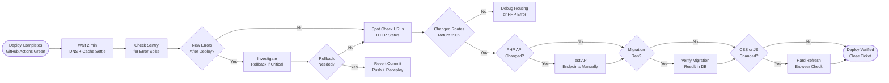

# SOP-TD-04 — Post-Deploy Verification

**Owner:** Engineering Lead  
**Cadence:** After every production deploy  
**Last updated:** 2026-05-01  
**Related:** [02-github-actions.md](02-github-actions.md) · [03-ftps-deploy.md](03-ftps-deploy.md) · [05-migrations.md](05-migrations.md)

---

## Overview

This SOP defines the verification steps that must run after every production deploy to netwebmedia.com, ensuring the site is functioning correctly before considering the deploy closed.

**Verification scope scales with change size:**
- **CSS/content-only changes:** Quick check (steps 1–3) — 5 min
- **PHP backend changes:** Standard check (steps 1–6) — 15 min
- **Major changes (new routes, htaccess, migrations):** Full check (all steps) — 30 min

**Success metrics:**
- Zero undetected broken deploys reaching users
- All verification steps completed before deploy is marked "done"
- Sentry alert response time: <15 min after deploy

---

## Workflow



---

## Procedures

### 1. Wait Period & Initial Checks (2 min)

After GitHub Actions shows green:
1. Wait 2 minutes — Apache needs to pick up new PHP files, browser caches may still serve old CSS/JS
2. Confirm the deploy commit is the expected one:
   ```bash
   curl -s https://netwebmedia.com/version.txt 2>/dev/null || echo "no version file"
   ```
   (If a `version.txt` exists, verify its content matches the deployed commit SHA)

---

### 2. Sentry Error Spike Check (2 min)

Open Sentry → `netwebmedia` org → Issues tab:
- Filter: last 1 hour
- Look for: any new error types that appeared after the deploy time
- Pay attention to: `TypeError`, `ReferenceError`, PHP `500` errors, CSP violations

**If new errors appear after deploy:**
1. Click the error to see stack trace
2. Identify if it's deploy-related (new code path) or pre-existing (unrelated)
3. If deploy-related: assess severity and whether rollback is needed

---

### 3. HTTP Status Spot Check (3 min)

Check the key URLs that were touched in this deploy:

```bash
# Check changed pages
curl -sI https://netwebmedia.com/[changed-page].html | head -2

# Check the PHP API
curl -sI https://netwebmedia.com/api/public/stats | head -2

# Check CRM API
curl -sI https://netwebmedia.com/crm-vanilla/api/?r=auth | head -2

# Check homepage
curl -sI https://netwebmedia.com/ | head -2
```

Expected responses:
- HTML pages: `HTTP/2 200`
- API endpoints: `HTTP/2 200` or `HTTP/2 401` (auth-protected, but not 404/500)
- Redirect targets: `HTTP/2 301` then follow to `200`

**Automatic smoke test:** `uptime-smoke.yml` runs automatically — check its status in Actions tab.

---

### 4. PHP API Endpoint Test (5 min — when PHP changed)

For changes to `api-php/` or `crm-vanilla/api/`:

**Public endpoint test (no auth needed):**
```bash
curl -s "https://netwebmedia.com/api/public/stats" | python3 -m json.tool
```
Expected: valid JSON, no PHP error output, no stack trace in response body

**Audit endpoint test:**
```bash
curl -s -X POST "https://netwebmedia.com/api/public/audit" \
  -H "Content-Type: application/json" \
  -d '{"url": "https://example.com", "email": "test@test.com"}'
```
Expected: JSON with `submission_id` field

**CRM API test (requires auth token):**
```bash
curl -s -H "X-Auth-Token: <token>" \
  "https://netwebmedia.com/crm-vanilla/api/?r=contacts&limit=1" | python3 -m json.tool
```
Expected: JSON array or object, not PHP error

---

### 5. Browser Visual Check (5 min — for CSS/JS/HTML changes)

Open the changed page in a browser and verify:

1. Hard refresh: `Ctrl+Shift+R` (bypass cache)
2. Open DevTools → Console: zero JavaScript errors
3. Open DevTools → Network: no 404s for CSS, JS, images, fonts
4. Open DevTools → Application → check CSP violations in Console
5. Check mobile view: DevTools device toolbar at 375px (iPhone) and 768px (iPad)
6. Verify bilingual toggle if the page has `data-en`/`data-es` attributes

---

### 6. Migration Verification (5 min — when schema_*.sql deployed)

Verify migration ran successfully by checking the deploy log:

1. Open GitHub Actions → the completed deploy run
2. Find the "run-migrations" step
3. Verify the curl response contains `"ran"` field:
   ```json
   {"ran": 2, "skipped": 14, "errors": []}
   ```
4. If `"errors"` is non-empty: investigate the error SQL, fix the migration file, push again
5. Spot-check the new columns/tables exist (via CRM admin or SQL query if accessible)

---

### 7. CRM Functionality Smoke Test (10 min — for CRM changes)

When `crm-vanilla/` JavaScript or PHP changed, test the CRM golden path:

1. Navigate to `netwebmedia.com/crm-vanilla/`
2. Log in with valid credentials
3. Test the specific changed feature (e.g., if Contacts page changed, open a contact, edit a field)
4. Check browser console for errors
5. Test navigation to adjacent pages — no broken routes
6. Verify API calls in DevTools Network tab return 200 (not 500)

---

### 8. Cache-Busted CSS/JS Verification

CSS/JS is cached for 5 minutes with revalidation. To force immediate verification:
```
Cache-Control: max-age=300, must-revalidate
```

For urgent verification before 5-min cache expires:
1. In DevTools → Network tab → check "Disable cache" checkbox
2. Reload the page
3. Verify the CSS/JS file versions you expect are loaded

Or use curl with cache-bypass headers:
```bash
curl -s -H "Cache-Control: no-cache" -H "Pragma: no-cache" \
  https://netwebmedia.com/css/styles.css | head -5
```

---

### 9. Rollback Procedure (When Needed)

If a deploy introduces a breaking change:

**Fast rollback (revert commit):**
```bash
git revert HEAD --no-edit
git push origin main
```

This creates a new revert commit and re-triggers the deploy workflow. The deploy will upload the reverted files within 5–10 min.

**Alternative: force revert to specific SHA:**
```bash
git reset --soft <pre-deploy-sha>
git commit -m "revert: undo breaking deploy"
git push origin main
```

**Do NOT use `git push --force` on main** — use `--force-with-lease` only if absolutely necessary, and only after checking the deploy queue isn't running.

---

## Technical Details

### Sentry Alert Configuration

Sentry is configured in `js/nwm-sentry.js` (loaded sitewide). Alerts go to:
- Slack channel: `#sentry-alerts` (if configured)
- Email: `carlos@netwebmedia.com`

Set alert threshold: >3 same-type errors in 5 minutes = immediate alert.

### Apache Error Log Access

For PHP errors that don't reach Sentry (e.g., fatal parse errors):
```
cPanel → Error Log viewer → /public_html/error_log
```

Or check via the API diagnostic endpoint (if it exists):
```bash
curl -H "X-Auth-Token: <admin_token>" \
  "https://netwebmedia.com/crm-vanilla/api/?r=diagnostics"
```

### Cache-Control Headers by File Type

```
HTML:       Cache-Control: no-store (immediate)
CSS/JS:     Cache-Control: max-age=300, must-revalidate (5 min)
Images:     Cache-Control: max-age=31536000, immutable (1 year)
Fonts:      Cache-Control: max-age=31536000, immutable (1 year)
API JSON:   Cache-Control: no-store (immediate)
```

---

## Troubleshooting

| Issue | Likely cause | Fix |
|---|---|---|
| Site unchanged after green deploy | Cache serving old file | Hard refresh, verify with curl --no-cache header |
| Sentry spike after deploy | New error in changed code path | Check Sentry error, roll back if user-impacting |
| API returns PHP warnings in JSON | `display_errors = On` in production PHP config | Check `.htaccess` or `php.ini` — set `display_errors = Off` in production |
| CSS looks broken after deploy | Wrong file staged (root `styles.css` instead of `css/styles.css`) | Verify canonical file path per CLAUDE.md — `css/styles.css` is production |
| Migration shows `"ran": 0` | Migration already ran on previous deploy | Normal — idempotency design means subsequent runs skip already-applied changes |
| CRM pages 500 after deploy | PHP fatal error (syntax or missing function) | Check cPanel error_log, revert deploy, fix code |

---

## Checklists

### Minimal Check (CSS/content changes — 5 min)
- [ ] Sentry: no new errors after deploy
- [ ] Changed page URL returns 200
- [ ] Browser: hard refresh shows expected change

### Standard Check (PHP changes — 15 min)
- [ ] All items from Minimal Check
- [ ] Public API endpoint returns valid JSON
- [ ] CRM API endpoint returns expected response
- [ ] DevTools: zero console errors on changed pages

### Full Check (Major changes — 30 min)
- [ ] All items from Standard Check
- [ ] Migration log verified: `{"ran": N, "errors": []}`
- [ ] CRM golden path tested manually
- [ ] Mobile view checked at 375px
- [ ] Bilingual toggle tested (if applicable)
- [ ] Sentry monitored for 15 min post-deploy

---

## Related SOPs
- [02-github-actions.md](02-github-actions.md) — How the deploy runs
- [03-ftps-deploy.md](03-ftps-deploy.md) — Manual FTPS deploy when CI fails
- [05-migrations.md](05-migrations.md) — Database migration process
- [operations-admin/monitoring.md](../operations-admin/monitoring.md) — Ongoing production health monitoring
