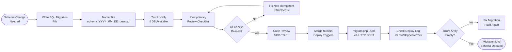

# SOP-TD-05 — Database Migration Management

**Owner:** Engineering Lead  
**Cadence:** Per new migration; verified on every deploy  
**Last updated:** 2026-05-01  
**Related:** [01-code-review.md](01-code-review.md) · [02-github-actions.md](02-github-actions.md) · [04-post-deploy.md](04-post-deploy.md)

---

## Overview

This SOP governs creation, review, and verification of database migrations for the `webmed6_crm` database (CRM schema) and `webmed6_nwm` database (public API schema).

**Migration system design:** Schema files live in `crm-vanilla/api/` and run automatically on every deploy via HTTP POST to `/crm-vanilla/api/?r=migrate`. Migrations must be idempotent — no version tracking table, no "run once" assumption.

**Key constraint:** Two separate databases — never mix them:
- `webmed6_crm` — CRM tables (contacts, deals, workflows, conversations)
- `webmed6_nwm` — Public API tables (resources EAV store, email_sequence_queue, blog)

**Success metrics:**
- Zero migration failures in production
- All migrations idempotent (safe to run 100× without side effects)
- No `SET @var + PREPARE/EXECUTE` patterns (PDO cursor issue)
- Migration deploy step returns `{"ran": N, "errors": []}`

---

## Workflow



---

## Procedures

### 1. Writing a Migration File (15 min)

**File naming convention:**
```
crm-vanilla/api/schema_<YYYY>_<MM>_<DD>_<description>.sql
```
Examples:
- `schema_2026_05_01_add_workflow_runs.sql`
- `schema_2026_04_28_add_ig_publish_table.sql`
- `schema_2026_05_01_demo_cleanup.sql`

The file must go in `crm-vanilla/api/` — the deploy pipeline scans this directory.

---

### 2. Idempotency Patterns (Required)

Every statement in a migration must be safe to run on a database that already has the change applied:

**Creating tables:**
```sql
-- GOOD
CREATE TABLE IF NOT EXISTS workflow_runs (
  id           INT AUTO_INCREMENT PRIMARY KEY,
  workflow_id  INT NOT NULL,
  status       ENUM('pending','running','waiting','completed','failed') DEFAULT 'pending',
  step_index   INT DEFAULT 0,
  context_json JSON,
  next_run_at  DATETIME NULL,
  error        TEXT,
  created_at   DATETIME DEFAULT CURRENT_TIMESTAMP,
  updated_at   DATETIME DEFAULT CURRENT_TIMESTAMP ON UPDATE CURRENT_TIMESTAMP
);

-- BAD — fails if table already exists
CREATE TABLE workflow_runs (...);
```

**Adding columns:**
```sql
-- GOOD — MySQL 8.0+ syntax
ALTER TABLE contacts ADD COLUMN IF NOT EXISTS email_status VARCHAR(20) DEFAULT 'active';

-- Alternative for older MySQL (also handled by migrate.php error swallowing):
ALTER TABLE contacts ADD COLUMN email_status VARCHAR(20) DEFAULT 'active';
-- migrate.php swallows error code 1060 (Duplicate column name)
```

**Adding indexes:**
```sql
-- GOOD
ALTER TABLE workflow_runs ADD INDEX IF NOT EXISTS idx_status (status);

-- Or use CREATE INDEX IF NOT EXISTS
CREATE INDEX IF NOT EXISTS idx_workflow_id ON workflow_runs(workflow_id);
-- migrate.php swallows error code 1061 (Duplicate key name)
```

**Inserting seed data:**
```sql
-- GOOD
INSERT IGNORE INTO email_templates (id, name, subject, body) VALUES
(1, 'welcome_1', 'Welcome to NetWebMedia', '<html>...</html>');

-- migrate.php swallows error code 1062 (Duplicate entry)
```

**Foreign keys:**
```sql
-- Use unique FK names to avoid code 1826 (duplicate FK name) or 1005 (InnoDB FK clash)
ALTER TABLE workflow_runs 
  ADD CONSTRAINT fk_wr_workflow_id_20260501 FOREIGN KEY (workflow_id) REFERENCES workflows(id) ON DELETE CASCADE;
-- Include date or unique suffix in FK name
```

---

### 3. What NOT to Use in Migrations

These patterns are explicitly banned:

**❌ `SET @var := (SELECT ...) + PREPARE/EXECUTE`**
```sql
-- BANNED — leaves PDO cursors open, fails with "Cannot execute queries while other unbuffered queries are active"
SET @exists := (SELECT COUNT(*) FROM information_schema.COLUMNS WHERE ...);
PREPARE stmt FROM IF(@exists = 0, 'ALTER TABLE ...', 'SELECT 1');
EXECUTE stmt;
DEALLOCATE PREPARE stmt;

-- ALLOWED replacement: use plain DDL with IF NOT EXISTS or let migrate.php swallow the error
ALTER TABLE contacts ADD COLUMN IF NOT EXISTS new_field VARCHAR(100);
```

**❌ Semicolons inside string literals**
```sql
-- BANNED — migrate.php splitter is naive, splits on raw ";"
ALTER TABLE t COMMENT 'Data; used by workflow'; -- the "; used" becomes a broken statement

-- ALLOWED: rephrase without semicolons in literals
ALTER TABLE t COMMENT 'Data used by workflow';
```

**❌ Transaction blocks with COMMIT**
```sql
-- AVOID — migrate.php runs statements one at a time; DDL in MySQL implies auto-commit anyway
START TRANSACTION;
ALTER TABLE ...;
COMMIT;
```

---

### 4. Testing the Migration Locally

If you have access to a local MySQL database matching the production schema:

```bash
# Apply the migration
mysql -u root -p webmed6_crm < crm-vanilla/api/schema_2026_05_01_demo_cleanup.sql

# Verify it ran without errors
echo $?  # Should be 0

# Re-apply to test idempotency
mysql -u root -p webmed6_crm < crm-vanilla/api/schema_2026_05_01_demo_cleanup.sql
# Should also complete without errors
```

If local DB is not available, the production deploy is the first run — make extra-sure idempotency patterns are correct before pushing.

---

### 5. Deploy & Verification

After pushing the migration file to `main`:

1. GitHub Actions `deploy-site-root.yml` runs automatically
2. After FTPS upload, the migration step runs:
   ```bash
   curl -s -X POST \
     -H "User-Agent: Mozilla/5.0 (Windows NT 10.0; Win64; x64) AppleWebKit/537.36..." \
     -H "Origin: https://netwebmedia.com" \
     -H "Referer: https://netwebmedia.com/crm-vanilla/" \
     "https://netwebmedia.com/crm-vanilla/api/?r=migrate&token=<MIGRATE_TOKEN>"
   ```

3. Expected response:
   ```json
   {"ran": 1, "skipped": 14, "errors": []}
   ```
   - `ran`: number of new/changed migration files executed
   - `skipped`: already-idempotent operations that returned expected errors
   - `errors`: unexpected errors — should be empty array

4. If `"errors"` contains items: read the error SQL and message, fix the migration file, push again.

---

### 6. Manual Migration Trigger

If you need to re-run migrations without a code push:

```bash
curl -s -X POST \
  -H "User-Agent: Mozilla/5.0 (Windows NT 10.0; Win64; x64) AppleWebKit/537.36 (KHTML, like Gecko) Chrome/124.0.0.0 Safari/537.36" \
  -H "Origin: https://netwebmedia.com" \
  -H "Referer: https://netwebmedia.com/crm-vanilla/" \
  "https://netwebmedia.com/crm-vanilla/api/?r=migrate&token=<MIGRATE_TOKEN>"
```

The `MIGRATE_TOKEN` value is the secret in GitHub → Settings → Secrets → `MIGRATE_TOKEN`. Its default value when the secret is unset is `NWM_MIGRATE_2026` — do NOT use this in production.

**mod_security requirement:** The curl command MUST include the full Chrome User-Agent + Origin + Referer headers. Without them, InMotion's mod_security returns 406 and the migration doesn't run.

---

### 7. migrate.php Swallowed Error Codes

`crm-vanilla/api/migrate.php` explicitly swallows these MySQL error codes as expected idempotency results:

| MySQL code | Meaning | Example |
|---|---|---|
| 1050 | Table already exists | `CREATE TABLE IF NOT EXISTS` fallback |
| 1060 | Duplicate column name | `ADD COLUMN` already applied |
| 1061 | Duplicate key name | `ADD INDEX` already applied |
| 1062 | Duplicate entry | `INSERT IGNORE` for seed data |
| 1826 | Duplicate FK constraint name | FK already added |
| 1005 (errno: 121) | InnoDB FK name clash | Duplicate FK name in different table |

These are counted as `skipped`, not `errors`, in the response.

---

## Technical Details

### migrate.php Statement Splitter

`migrate.php` splits SQL files on raw `;` character. No parsing of string literals, comments, or stored procedures.

**Rules:**
- Each statement ends with `;`
- No semicolons inside string literals (`COMMENT 'foo; bar'` is banned)
- No stored procedures or functions (they contain multiple `;` internally)
- No `DELIMITER` commands

### webmed6_nwm Migrations

The public API (`api-php/`) also has its own migration system at `api-php/migrate.php`. The CRM migration system (`crm-vanilla/api/migrate.php`) only touches `webmed6_crm`. **Do NOT put `webmed6_nwm` schema changes in `crm-vanilla/api/schema_*.sql` files.**

For `webmed6_nwm` changes:
- Add SQL to `api-php/migrate.php` directly (it runs on a different trigger)
- Or create `api-php/schema_*.sql` if the api-php pipeline supports it

---

## Troubleshooting

| Issue | Likely cause | Fix |
|---|---|---|
| Migration returns 406 | mod_security blocking curl without proper headers | Add full Chrome User-Agent + Origin + Referer headers to curl call |
| `"errors": ["SQL syntax error"]` | Semicolon in string literal | Remove semicolon from string literal or rephrase |
| `"errors": ["Cannot execute queries while other unbuffered queries are active"]` | `SET @var + PREPARE/EXECUTE` pattern used | Replace with plain DDL (`ALTER TABLE ... ADD COLUMN IF NOT EXISTS`) |
| `ran: 0` on new migration | File not in `crm-vanilla/api/` or wrong directory | Check file path, verify it's in the directory scanned by `migrate.php` |
| Migration runs but column not visible | Wrong database targeted | Check `crm-vanilla/api/config.php` DB connection is `webmed6_crm` |
| Schema changes needed in webmed6_nwm | Putting file in crm-vanilla/api/ | Put `webmed6_nwm` changes in `api-php/` migration system instead |

---

## Checklists

### New Migration File
- [ ] Named `schema_YYYY_MM_DD_description.sql`
- [ ] Placed in `crm-vanilla/api/` (not elsewhere)
- [ ] All `CREATE TABLE` use `IF NOT EXISTS`
- [ ] All `ADD COLUMN` use `IF NOT EXISTS` or rely on error 1060 swallowing
- [ ] All `ADD INDEX` use `IF NOT EXISTS` or rely on error 1061 swallowing
- [ ] All `INSERT` use `INSERT IGNORE` or `ON DUPLICATE KEY UPDATE`
- [ ] Foreign key names are unique (include date suffix)
- [ ] No `SET @var + PREPARE/EXECUTE` patterns
- [ ] No semicolons inside string literals
- [ ] Idempotency: migration applied twice = same result as once

### Post-Deploy Verification
- [ ] Deploy log shows migration step ran
- [ ] Response contains `"ran"` field (not error 404/500)
- [ ] `"errors"` array is empty
- [ ] New columns/tables visible in CRM (spot check)

---

## Related SOPs
- [01-code-review.md](01-code-review.md) — Migration review before merge
- [02-github-actions.md](02-github-actions.md) — Automated migration trigger in deploy workflow
- [04-post-deploy.md](04-post-deploy.md) — Verifying migration success after deploy
