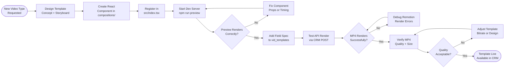

# SOP-VP-01 — Video Template Setup

**Owner:** Engineering Lead / Creative Director  
**Cadence:** Per new video template type  
**Last updated:** 2026-05-01  
**Related:** [02-render-delivery.md](02-render-delivery.md) · [03-carousel-production.md](03-carousel-production.md)

---

## Overview

This SOP governs the creation of new programmatic video templates in the video-factory (`video-factory/`), which uses Remotion (React-based video rendering) served via an Express server on port 3030.

**Video factory architecture:**
- Templates: `video-factory/src/compositions/` — React components
- Registration: `video-factory/src/index.tsx`
- API field spec: `api-php/routes/video.php` → `vid_templates()` function
- Render server: `video-factory/server.js` on port 3030
- CRM trigger: `POST /api/video/render` → calls server on `:3030/render`
- Output: MP4 in `/video-out/*.mp4`, served from site root

**Success metrics:**
- New template renders without errors in browser preview
- Render via API completes in <60 seconds
- Output MP4: H.264, 1920×1080, <50MB for 60-second video
- Template registered and callable from CRM

---

## Workflow



---

## Procedures

### 1. Template Design & Storyboard (30 min)

Before writing code, define the template:

**Required decisions:**
- **Duration:** Total seconds (typical: 15s, 30s, 60s)
- **Resolution:** 1920×1080 (standard), 1080×1080 (square for IG), 1080×1920 (vertical for Stories/TikTok)
- **Sections:** Intro → main content → outro
- **Dynamic fields:** What text/data will vary per render? (company name, niche, stats, URLs)
- **Brand elements:** Logo position, color use, font (Inter/Poppins)

**Typical template types for NWM:**
| Template | Duration | Use case |
|---|---|---|
| `audit_summary` | 30s | Personalized audit results for leads |
| `case_study_highlight` | 60s | Client result showcase |
| `industry_spotlight` | 45s | Niche-specific educational content |
| `proposal_intro` | 15s | Personalized intro to a proposal |

---

### 2. React Component Creation (1–2h)

Create the component in `video-factory/src/compositions/`:

```tsx
// video-factory/src/compositions/AuditSummary.tsx
import { AbsoluteFill, Sequence, useCurrentFrame, interpolate } from 'remotion';

interface AuditSummaryProps {
  companyName: string;
  pagespeedScore: number;
  seoScore: number;
  primaryKeyword: string;
  niche: string;
}

export const AuditSummary: React.FC<AuditSummaryProps> = ({
  companyName,
  pagespeedScore,
  seoScore,
  primaryKeyword,
  niche,
}) => {
  const frame = useCurrentFrame();

  // Animate opacity: fade in over first 15 frames
  const opacity = interpolate(frame, [0, 15], [0, 1]);

  return (
    <AbsoluteFill style={{ backgroundColor: '#010F3B' }}>
      {/* Intro sequence: 0–30 frames (1 second at 30fps) */}
      <Sequence from={0} durationInFrames={30}>
        <div style={{ opacity, color: '#FF671F', fontSize: 48, fontFamily: 'Inter' }}>
          NetWebMedia
        </div>
      </Sequence>

      {/* Main content: 30–870 frames */}
      <Sequence from={30} durationInFrames={840}>
        <div style={{ color: 'white', fontSize: 36 }}>
          {companyName} — Digital Audit Results
        </div>
        <div>PageSpeed: {pagespeedScore}/100</div>
        <div>SEO Score: {seoScore}/100</div>
      </Sequence>

      {/* Outro: last 30 frames */}
      <Sequence from={870} durationInFrames={30}>
        <div>Visit netwebmedia.com</div>
      </Sequence>
    </AbsoluteFill>
  );
};
```

**Remotion timing (30fps default):**
- 30 frames = 1 second
- 900 frames = 30 seconds
- 1800 frames = 60 seconds

---

### 3. Template Registration (10 min)

Register the new composition in `video-factory/src/index.tsx`:

```tsx
import { Composition } from 'remotion';
import { AuditSummary } from './compositions/AuditSummary';

export const RemotionRoot: React.FC = () => {
  return (
    <>
      {/* Existing compositions... */}

      {/* New template */}
      <Composition
        id="audit-summary"
        component={AuditSummary}
        durationInFrames={900}   // 30 seconds at 30fps
        fps={30}
        width={1920}
        height={1080}
        defaultProps={{
          companyName: 'Example Company',
          pagespeedScore: 42,
          seoScore: 38,
          primaryKeyword: 'hotel santiago',
          niche: 'tourism',
        }}
      />
    </>
  );
};
```

---

### 4. Browser Preview Testing (15 min)

```bash
cd video-factory
npm run preview  # Opens Remotion browser preview on localhost
```

In the preview:
1. Select the new composition from the dropdown
2. Scrub through the full duration
3. Check: animations smooth, no layout breaks, text readable
4. Check: brand colors correct (navy `#010F3B`, orange `#FF671F`)
5. Test with different prop values (change `defaultProps` in index.tsx)

---

### 5. API Field Spec Registration (20 min)

Add the template's field spec to `api-php/routes/video.php` in the `vid_templates()` function:

```php
// api-php/routes/video.php
function vid_templates() {
  return [
    // ... existing templates ...
    'audit-summary' => [
      'label'  => 'Audit Summary Video',
      'fields' => [
        ['name' => 'companyName',     'type' => 'text',   'required' => true,  'label' => 'Company Name'],
        ['name' => 'pagespeedScore',  'type' => 'number', 'required' => true,  'label' => 'PageSpeed Score (0-100)'],
        ['name' => 'seoScore',        'type' => 'number', 'required' => true,  'label' => 'SEO Score (0-100)'],
        ['name' => 'primaryKeyword',  'type' => 'text',   'required' => false, 'label' => 'Primary Keyword'],
        ['name' => 'niche',           'type' => 'enum',   'required' => true,  'label' => 'Industry',
         'options' => ['tourism','restaurants','health','beauty','smb','law_firms','real_estate',
                       'local_specialist','automotive','education','events_weddings',
                       'financial_services','home_services','wine_agriculture']],
      ],
      'duration' => 30,
      'resolution' => '1920x1080',
    ],
  ];
}
```

---

### 6. API Render Test (15 min)

Start the video factory server and test a render:

```bash
# Terminal 1: Start video factory
cd video-factory && npm start

# Terminal 2: Test render
curl -X POST http://127.0.0.1:3030/render \
  -H "Content-Type: application/json" \
  -d '{
    "compositionId": "audit-summary",
    "outputFilename": "test-audit-summary.mp4",
    "inputProps": {
      "companyName": "Hotel Pacífico",
      "pagespeedScore": 42,
      "seoScore": 38,
      "primaryKeyword": "hotel viña del mar",
      "niche": "tourism"
    }
  }'
```

Expected response: `{"success": true, "outputPath": "/video-out/test-audit-summary.mp4"}`

Verify the output MP4:
- Plays correctly in VLC or browser
- Correct duration (30 seconds)
- No rendering artifacts
- File size reasonable (<50MB for 30s)

---

### 7. CRM Integration Verification

Test that the CRM can trigger the render via the PHP API:

```bash
curl -X POST \
  -H "X-Auth-Token: <token>" \
  -H "Content-Type: application/json" \
  "https://netwebmedia.com/api/video/render" \
  -d '{
    "template": "audit-summary",
    "props": {
      "companyName": "Hotel Pacífico",
      "pagespeedScore": 42,
      "seoScore": 38,
      "niche": "tourism"
    }
  }'
```

The PHP API calls `video-factory/server.js :3030/render` internally. Ensure `remotion_render_url` is set in `/home/webmed6/.netwebmedia-config.php` (server-side config).

---

## Technical Details

### Remotion Key Concepts

- **Frame:** Single moment in time (at 30fps, 1 second = 30 frames)
- **`useCurrentFrame()`:** Returns current frame number (0-indexed)
- **`interpolate()`:** Maps frame range to value range (for animations)
- **`<Sequence>`:** Shows a component only during a specific frame range
- **`<AbsoluteFill>`:** Full-size container (fills entire 1920×1080)

### Render Pipeline

```
CRM → POST /api/video/render (api-php)
     → Validates props against vid_templates() field spec
     → POST http://localhost:3030/render (video-factory)
     → Remotion CLI renders composition to MP4
     → MP4 saved to /video-out/
     → Response: {success: true, outputPath: ...}
```

### Font Embedding in Remotion

To use Inter/Poppins (brand fonts) in Remotion:
```tsx
import { loadFont } from '@remotion/google-fonts/Inter';
const { fontFamily } = loadFont();
// Use fontFamily in inline styles
```

---

## Troubleshooting

| Issue | Likely cause | Fix |
|---|---|---|
| Preview blank or black | Component error (check browser console) | Fix React errors in composition, check prop types |
| Render times out | Complex animation or large assets | Simplify animations, compress images used in template |
| MP4 has no audio | Template doesn't include audio component | Add `<Audio>` component if audio needed, or accept silent video |
| Font not rendering | Google fonts not loaded | Use `@remotion/google-fonts` package for reliable font loading |
| API returns 503 | `remotion_render_url` not set in server config | Set `remotion_render_url = "http://localhost:3030"` in netwebmedia config |
| CRM shows template not available | `vid_templates()` not updated | Add template spec to `api-php/routes/video.php` |

---

## Checklists

### Template Development
- [ ] Storyboard designed (sections, duration, dynamic fields)
- [ ] React component created in `compositions/`
- [ ] Composition registered in `src/index.tsx` with correct duration and resolution
- [ ] Browser preview tested at full duration
- [ ] All brand colors and fonts verified

### API Integration
- [ ] Field spec added to `vid_templates()` in `video.php`
- [ ] Local render test via `:3030/render` succeeds
- [ ] MP4 quality and file size acceptable
- [ ] CRM API render test passes

---

## Related SOPs
- [02-render-delivery.md](02-render-delivery.md) — Rendering and delivering videos to clients
- [03-carousel-production.md](03-carousel-production.md) — Related static asset production pipeline
