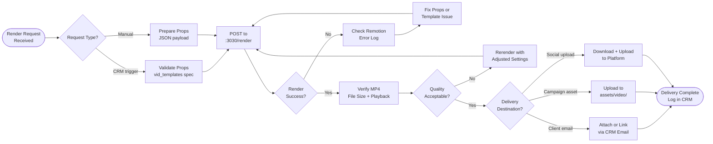

# SOP-VP-02 — Video Render & Delivery

**Owner:** Creative Director / Engineering Lead  
**Cadence:** Per video render request (manual or CRM-triggered)  
**Last updated:** 2026-05-01  
**Related:** [01-template-setup.md](01-template-setup.md) · [03-carousel-production.md](03-carousel-production.md) · [marketing-content/04-campaign-assets.md](../marketing-content/04-campaign-assets.md)

---

## Overview

This SOP governs the process of rendering a video using the video-factory and delivering the final MP4 to its destination — whether for a client audit, a marketing campaign, or social media.

**Render types:**
1. **CRM-triggered** — initiated via `POST /api/video/render` from CRM or lead processing
2. **Manual** — direct call to `:3030/render` for internal use
3. **Batch** — multiple renders for a campaign (e.g., personalized audit videos for 20 leads)

**Output:** MP4 files in `/video-out/` served from `https://netwebmedia.com/video-out/<filename>.mp4`

**Success metrics:**
- Render completion: <60 seconds for 30s video
- File size: <50MB per render
- Delivery within 24h of render request
- Zero broken/corrupted MP4 outputs

---

## Workflow



---

## Procedures

### 1. Manual Render Request (10 min)

Start the video factory server if not running:

```bash
cd video-factory
npm start  # Starts Express server on :3030
```

Trigger a render:
```bash
curl -X POST http://127.0.0.1:3030/render \
  -H "Content-Type: application/json" \
  -d '{
    "compositionId": "audit-summary",
    "outputFilename": "hotel-pacifico-audit-2026-05.mp4",
    "inputProps": {
      "companyName": "Hotel Pacífico",
      "pagespeedScore": 42,
      "seoScore": 38,
      "primaryKeyword": "hotel viña del mar",
      "niche": "tourism"
    }
  }'
```

Monitor render progress: Remotion logs frame-by-frame progress to console. For a 30-second video (900 frames), expect 30–90 seconds render time.

Expected success response:
```json
{
  "success": true,
  "outputPath": "/video-out/hotel-pacifico-audit-2026-05.mp4",
  "duration_seconds": 30,
  "file_size_mb": 12.4
}
```

---

### 2. CRM-Triggered Render (Reference)

CRM triggers renders via:
```bash
POST https://netwebmedia.com/api/video/render
X-Auth-Token: <token>
Content-Type: application/json

{
  "template": "audit-summary",
  "props": { ... },
  "contact_id": 123,  # optional — links video to contact
  "deal_id": 456      # optional — links video to deal
}
```

The PHP handler (`api-php/routes/video.php`):
1. Validates `template` against `vid_templates()` spec
2. Validates all required `props` fields
3. POSTs to `$remotion_render_url` (video-factory server)
4. Returns render URL in response
5. Optionally updates CRM contact record with `video_url`

---

### 3. Batch Render (For Campaign Personalization)

For sending personalized audit videos to multiple leads:

```bash
# Example: render 20 audit videos for a niche campaign
while IFS=, read -r company_name pagespeed_score seo_score keyword; do
  curl -X POST http://127.0.0.1:3030/render \
    -H "Content-Type: application/json" \
    -d "{
      \"compositionId\": \"audit-summary\",
      \"outputFilename\": \"audit-${company_name// /-}-$(date +%Y%m).mp4\",
      \"inputProps\": {
        \"companyName\": \"$company_name\",
        \"pagespeedScore\": $pagespeed_score,
        \"seoScore\": $seo_score,
        \"primaryKeyword\": \"$keyword\",
        \"niche\": \"tourism\"
      }
    }"
  sleep 5  # Wait between renders to avoid overloading server
done < leads.csv
```

Wait for all renders to complete before moving to delivery.

---

### 4. Quality Verification (5 min per video)

After render completes:

1. **Playback test:** Open MP4 in VLC or browser — verify plays without stuttering
2. **Duration check:** Confirm correct length (e.g., 30 seconds ±0.5s)
3. **File size check:** Should be 5–50MB for typical 15–60 second renders. If >100MB, the render settings may need adjustment.
4. **Visual check:** Scrub to key frames:
   - Frame 1: Intro visible
   - Middle frame: Main content visible
   - Last frame: Outro/CTA visible
5. **Text legibility:** All text readable without squinting
6. **Brand colors:** Navy background, orange accents, white text

If quality fails: adjust the template (SOP-VP-01) or re-render with modified props.

---

### 5. Delivery — Client Email

When delivering a video to a client:

**Option A: Direct link (preferred)**
Upload to `assets/video/client/<client-slug>/` and share the URL:
```
https://netwebmedia.com/video-out/[filename].mp4
```

**Option B: Embed link in email**
```html
<p>Your personalized audit video is ready:</p>
<a href="https://netwebmedia.com/video-out/[filename].mp4" 
   style="...button styles...">
  Watch Your Audit Video →
</a>
<p>Or copy this link: https://netwebmedia.com/video-out/[filename].mp4</p>
```

Do NOT attach MP4 directly to email — most email clients block large attachments, and files >10MB will bounce.

**Log delivery in CRM:**
```bash
curl -X PATCH \
  -H "X-Auth-Token: <token>" \
  "https://netwebmedia.com/crm-vanilla/api/?r=contacts&id=<id>" \
  -d '{"video_url": "https://netwebmedia.com/video-out/[filename].mp4", "video_sent_at": "2026-05-01"}'
```

---

### 6. Delivery — Social Upload

For videos destined for Instagram, YouTube, or Facebook:

1. Download from `/video-out/` via browser or curl
2. Check platform requirements:
   - Instagram Feed: MP4, H.264, <100MB, 60 seconds max, 1:1 or 4:5 ratio
   - Instagram Reels: Vertical 9:16, 15–90 seconds
   - YouTube: MP4, H.264, 1920×1080, up to 15 min (standard account)
   - Facebook: MP4, <10GB, up to 240 min
3. Upload via platform's native tool (never automate this — social platforms flag API uploads)
4. Add caption from SOP-03 social production

---

### 7. Video Archive & Cleanup (Monthly)

The `/video-out/` directory accumulates renders. Monthly cleanup:

```bash
# List files older than 90 days
find /video-out/ -name "*.mp4" -mtime +90 -ls

# Archive to separate storage before deletion (ask Carlos before deleting)
```

Permanent assets (marketing videos, case studies) should be moved to `assets/video/permanent/` to distinguish from temporary renders.

---

## Technical Details

### Remotion Render Configuration

Default render settings in `video-factory/server.js`:
```javascript
const renderResult = await renderMedia({
  composition,
  serveUrl,
  codec: 'h264',
  outputLocation: outputPath,
  inputProps,
  concurrency: 2,           // parallel rendering threads
  videoBitrate: '2M',       // 2Mbps — good quality / reasonable size
  fps: 30,
  crf: 18,                  // Constant Rate Factor (lower = better quality, larger file)
});
```

Adjusting quality vs. file size:
- Smaller file: increase `crf` to 23–28
- Better quality: decrease `crf` to 15–17 (much larger file)
- Faster render: increase `concurrency` (limited by CPU)

### Video Output Naming Convention

```
<niche>-<client-slug>-<template>-<YYYYMM>.mp4
```
Examples:
- `tourism-hotel-pacifico-audit-summary-202605.mp4`
- `restaurants-la-mar-case-study-202605.mp4`
- `nwm-industry-spotlight-health-202605.mp4`

---

## Troubleshooting

| Issue | Likely cause | Fix |
|---|---|---|
| Render server not responding | `npm start` not running | Start video factory: `cd video-factory && npm start` |
| Render times out (>5 min) | Too many concurrent renders or complex template | Reduce `concurrency` to 1, simplify template animations |
| MP4 plays with no video (audio only) | Composition props error causing blank frames | Check React component for conditional rendering issues |
| Large file size (>100MB for 30s) | `crf` too low or `videoBitrate` too high | Increase `crf` to 23, reduce `videoBitrate` to "1M" |
| Remotion preview crashes | Dependency version mismatch | Run `cd video-factory && npm install`, check `@remotion/*` versions match |
| PHP API returns 503 | `remotion_render_url` not configured | Set in `/home/webmed6/.netwebmedia-config.php` |

---

## Checklists

### Pre-Render
- [ ] Video factory server running on :3030
- [ ] Template exists (check `vid_templates()` in video.php)
- [ ] Props prepared and validated
- [ ] Output filename follows naming convention

### Quality Check
- [ ] MP4 plays without errors
- [ ] Correct duration
- [ ] File size <50MB (for standard 30s)
- [ ] All frames render correctly (scrub through)
- [ ] Text legible and brand colors correct

### Delivery
- [ ] Video URL confirmed accessible
- [ ] Delivery method confirmed (email link, social upload, campaign asset)
- [ ] CRM contact record updated with `video_url`
- [ ] Delivery logged in CRM note

---

## Related SOPs
- [01-template-setup.md](01-template-setup.md) — Creating new video templates
- [03-carousel-production.md](03-carousel-production.md) — Parallel static asset pipeline
- [marketing-content/04-campaign-assets.md](../marketing-content/04-campaign-assets.md) — Video as campaign asset
