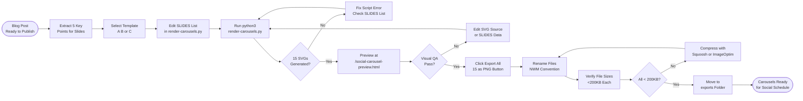

# SOP-VP-03 — Instagram Carousel Production Pipeline

**Owner:** Creative Director  
**Cadence:** Per content cluster cycle (3 carousels per cycle)  
**Last updated:** 2026-05-01  
**Related:** [marketing-content/03-social-production.md](../marketing-content/03-social-production.md) · [marketing-content/04-campaign-assets.md](../marketing-content/04-campaign-assets.md)

---

## Overview

This SOP documents the complete carousel production pipeline from SVG source editing through PNG export and platform upload. It is a companion to SOP-03 (Social Production) — SOP-03 covers the social media workflow; this SOP focuses on the technical asset production pipeline.

**Asset locations:**
- SVG sources: `assets/social/carousels/{a,b,c}-slide-{1..5}.svg` (15 files, version-controlled)
- Render script: `_deploy/render-carousels.py`
- Preview page: `/social-carousel-preview.html` (noindex)
- Exports: `assets/social/exports/<niche>/<quarter>/` (NOT in git)

**Three carousel templates:**
- **A** (`a-slide-*.svg`): Dark navy, large stat callout — data-heavy posts
- **B** (`b-slide-*.svg`): Orange gradient header, step list — how-to posts
- **C** (`c-slide-*.svg`): Split panel — comparison/before-after posts

**Success metrics:**
- 15 PNGs exported per cycle at 1080×1080
- Each PNG <200KB
- Export time: <30 min per carousel set
- Brand color compliance: 100%

---

## Workflow



---

## Procedures

### 1. SLIDES List Data Entry (20 min)

Open `_deploy/render-carousels.py` and update the `SLIDES` list at the top:

```python
# _deploy/render-carousels.py
SLIDES = [
    {
        "slide": 1,
        "type": "hook",
        "headline": "85% of Tourism Websites Are Invisible to AI",
        "subtext": "Here's what the other 15% are doing differently",
        "stat": "85%",
        "icon": None
    },
    {
        "slide": 2,
        "type": "insight",
        "headline": "Schema Markup is the Foundation",
        "subtext": "LodgingBusiness + FAQPage schema = AI citations",
        "stat": "3x",
        "icon": "schema"
    },
    {
        "slide": 3,
        "type": "insight",
        "headline": "FAQ Sections Drive AI Answers",
        "subtext": "5 questions minimum per page gets AI visibility",
        "stat": "5+",
        "icon": "faq"
    },
    {
        "slide": 4,
        "type": "insight",
        "headline": "Google Maps + Website Must Align",
        "subtext": "NAP consistency across 10+ directories = trust signals",
        "stat": "10+",
        "icon": "map"
    },
    {
        "slide": 5,
        "type": "cta",
        "headline": "Ready to Get Found by AI?",
        "subtext": "Free audit at netwebmedia.com/audit",
        "stat": None,
        "icon": "arrow"
    }
]

# Set the active template (a, b, or c)
TEMPLATE = "a"

# Set niche for color theming
NICHE = "tourism"
```

**Slide content guidelines:**
- Slide 1 (hook): Bold claim or statistic — max 8 words in headline
- Slides 2–4 (insights): Specific, actionable — max 10 words headline + max 15 words subtext
- Slide 5 (CTA): Clear action verb + benefit + URL — no more than this

---

### 2. SVG Generation (5 min)

```bash
# From repo root
python3 _deploy/render-carousels.py
```

The script:
1. Reads the `SLIDES` list and `TEMPLATE` setting
2. For each of the 5 slides, updates `assets/social/carousels/{template}-slide-{N}.svg`
3. Injects the slide data (headline, subtext, stat, icon) into the SVG template
4. Applies niche-specific color accent if configured

**Expected output:**
```
Generating carousel: template=a, niche=tourism
  ✓ a-slide-1.svg updated
  ✓ a-slide-2.svg updated
  ✓ a-slide-3.svg updated
  ✓ a-slide-4.svg updated
  ✓ a-slide-5.svg updated
Done. Open /social-carousel-preview.html to review.
```

If the script errors: check Python syntax in the `SLIDES` list (common issue: trailing commas, unclosed strings).

---

### 3. Visual QA in Browser Preview (10 min)

Start the local server if not running:
```bash
node server.js  # Port 3000
```

Open: `http://127.0.0.1:3000/social-carousel-preview.html`

**QA checklist for each of the 5 slides:**
- [ ] Text is not cut off or overflowing the slide boundary
- [ ] Headline is readable at thumbnail size (mentally zoom out to 33%)
- [ ] Brand colors: navy `#010F3B` background or orange `#FF671F` accent
- [ ] Font: Inter or Poppins (no fallback system font rendering)
- [ ] Niche-appropriate icon renders (no missing/broken icon)
- [ ] Slide 1 has NetWebMedia logo/mark
- [ ] Slide 5 has the call-to-action URL visible
- [ ] All 5 slides have visual consistency (same template, same typography scale)

If any slide fails QA: edit the relevant SVG directly in `assets/social/carousels/` or update the SLIDES data and re-run the script.

---

### 4. PNG Export (5 min)

On the preview page:
1. Click **"Export all 15 as PNG (1080×1080)"**
2. Browser triggers 15 file downloads (may require allowing multiple downloads in browser settings)
3. Files download to the browser's default downloads folder

The Canvas API export:
- Creates a 1080×1080 canvas
- Renders each SVG into the canvas
- Exports as PNG

**If the export button doesn't trigger downloads:**
- Check browser pop-up blocker (allow multiple downloads from `127.0.0.1`)
- Check browser console for Canvas API errors
- Verify the server is running (`http://` not `file://` — CORS restriction)

---

### 5. File Renaming (10 min)

After download, rename the 15 PNGs from browser-default names to the NWM convention:

**Convention:**
```
NWM-{niche}-{quarter}-cluster{N}-slide-{1..5}.png
```

Examples for a tourism Q2 cluster 1 carousel:
```
NWM-tourism-Q2-2026-cluster1-slide-1.png
NWM-tourism-Q2-2026-cluster1-slide-2.png
...
NWM-tourism-Q2-2026-cluster1-slide-5.png
```

Repeat for the other 2 carousels in the cycle (cluster2, cluster3).

---

### 6. File Size Optimization (5–10 min)

Check each PNG's file size — target <200KB:

```bash
# Check sizes
ls -lh NWM-tourism-Q2-2026-cluster1-slide-*.png

# Compress any over 200KB with ImageMagick:
mogrify -quality 85 -strip NWM-tourism-Q2-2026-cluster1-slide-*.png
```

Or use [Squoosh](https://squoosh.app) in browser for visual compression with quality preview.

SVG-to-PNG exports are typically 50–150KB — if >200KB, the SVG source has unnecessarily complex gradients or embedded images. Simplify the SVG source.

---

### 7. Export Folder Organization

Move final PNGs to the exports directory:

```
assets/social/exports/
└── tourism/
    └── Q2-2026/
        ├── cluster1/
        │   ├── NWM-tourism-Q2-2026-cluster1-slide-1.png
        │   ├── NWM-tourism-Q2-2026-cluster1-slide-2.png
        │   ├── NWM-tourism-Q2-2026-cluster1-slide-3.png
        │   ├── NWM-tourism-Q2-2026-cluster1-slide-4.png
        │   └── NWM-tourism-Q2-2026-cluster1-slide-5.png
        ├── cluster2/
        └── cluster3/
```

**This folder is in `.gitignore`** — exports are build artifacts, not source code. The SVG sources in `assets/social/carousels/` ARE version-controlled.

---

## Technical Details

### SVG Source Structure

Each SVG file (`assets/social/carousels/{a|b|c}-slide-{1..5}.svg`) has placeholder comments where the render script injects content:

```svg
<!-- HEADLINE_PLACEHOLDER -->
<text class="headline">{{headline}}</text>

<!-- SUBTEXT_PLACEHOLDER -->
<text class="subtext">{{subtext}}</text>

<!-- STAT_PLACEHOLDER -->
<text class="stat">{{stat}}</text>
```

The render script does string substitution of these placeholders.

### Canvas API Export Code

The export button in `/social-carousel-preview.html` uses:
```javascript
const canvas = document.createElement('canvas');
canvas.width = 1080;
canvas.height = 1080;
const ctx = canvas.getContext('2d');

const img = new Image();
img.onload = () => {
  ctx.drawImage(img, 0, 0, 1080, 1080);
  canvas.toBlob(blob => {
    const url = URL.createObjectURL(blob);
    const a = document.createElement('a');
    a.href = url;
    a.download = `slide-${N}.png`;
    a.click();
  }, 'image/png');
};
img.src = 'data:image/svg+xml;base64,' + btoa(svgContent);
```

---

## Troubleshooting

| Issue | Likely cause | Fix |
|---|---|---|
| SVG text overflows slide | Headline too long | Shorten headline to <8 words, increase min-font-size in SVG |
| Font renders as system font | Font not embedded or loaded | Add Google Font `@import` to SVG `<defs>`, or use web-safe font as fallback |
| PNG export fails silently | CORS when opening via `file://` | Always use `http://127.0.0.1:3000/social-carousel-preview.html` |
| Exports are blurry | SVG units not scaled to 1080×1080 | Check Canvas drawImage dimensions, ensure SVG viewBox matches |
| Script overwrites wrong SVG files | `TEMPLATE` variable set to wrong letter | Verify `TEMPLATE = "a"` (or b/c) matches intended template |
| All slides look identical | SLIDES list has duplicate entries | Review SLIDES list in render-carousels.py for copy-paste errors |

---

## Checklists

### Data Entry & Generation
- [ ] 5 slide points extracted from blog post
- [ ] Template (A/B/C) selected based on post type
- [ ] SLIDES list updated in render-carousels.py
- [ ] `TEMPLATE` variable set correctly
- [ ] Script run, 5 SVGs updated

### Visual QA
- [ ] All 5 slides previewed in browser
- [ ] No text overflow on any slide
- [ ] Brand colors correct
- [ ] Fonts rendering correctly (not system fallback)
- [ ] CTA URL visible on slide 5

### Export & Delivery
- [ ] 15 PNGs exported via Canvas API button
- [ ] Files renamed per NWM convention
- [ ] All files <200KB (compressed if needed)
- [ ] Files moved to `assets/social/exports/<niche>/<quarter>/cluster<N>/`
- [ ] SVG sources committed to git (exports folder excluded)

---

## Related SOPs
- [marketing-content/03-social-production.md](../marketing-content/03-social-production.md) — Full social workflow (scheduling, captions, monitoring)
- [marketing-content/04-campaign-assets.md](../marketing-content/04-campaign-assets.md) — Carousel as part of campaign asset bundle
- [02-render-delivery.md](02-render-delivery.md) — Video rendering (parallel asset pipeline)
