# NetWebMedia — Sales Management Simulation

> **Polished HTML version:** open [`index.html`](./index.html) in a browser.
> **PDF export:** [`NetWebMedia-Sales-Simulation.pdf`](./NetWebMedia-Sales-Simulation.pdf)

End-to-end simulation of how NWM manages a real sale, from inbound form-submit through active client. Buyer: **Sarah Test · Test Law Group · CMO Growth ($999/mo · $11,988 year-1 commitment)**.

---

## At a glance

| Field | Value |
|---|---|
| Buyer | Sarah Test |
| Org | Test Law Group |
| Niche | Law Firms |
| Product | CMO Growth |
| Setup + Month 1 | $1,498 |
| Year-1 commitment | $11,988 |
| Cycle | 7 days (form-submit → won) |
| Lead source | AEO Brief #001 |

---

## The 8-stage funnel

| Stage | Prob. | Owner | Time budget | Cycle ~ |
|---|---|---|---|---|
| 1 · New Lead | 5% | System | 0 (auto) | 2.1 d |
| 2 · Qualified | 20% | Carlos | 5 min | 1.4 d |
| 3 · Discovery Scheduled | 35% | Carlos | 2 min | 2.8 d |
| 4 · Discovery Done | 50% | Carlos | 42 min | 2.2 d |
| 5 · Proposal Sent | 65% | Carlos | 15 min | 1.6 d |
| 6 · Negotiation | 80% | Carlos | 20–30 min | 1.1 d |
| 7 · Won | 100% | System + Carlos | 0 (auto) | same-day |
| 8 · Active Client | — | project-manager → customer-success | Week 1 = onboarding | ongoing |

---

## Stage 1 — New Lead


- **Trigger:** form_submit on `/industries/legal-services/`
- **Owner:** System
- **SLA:** First human reply < 5 min
- **Activity:** Contact + Deal auto-created, `welcome-1` email fires within 2 min, Carlos notified via Slack #nwm-inbound

## Stage 2 — Qualified

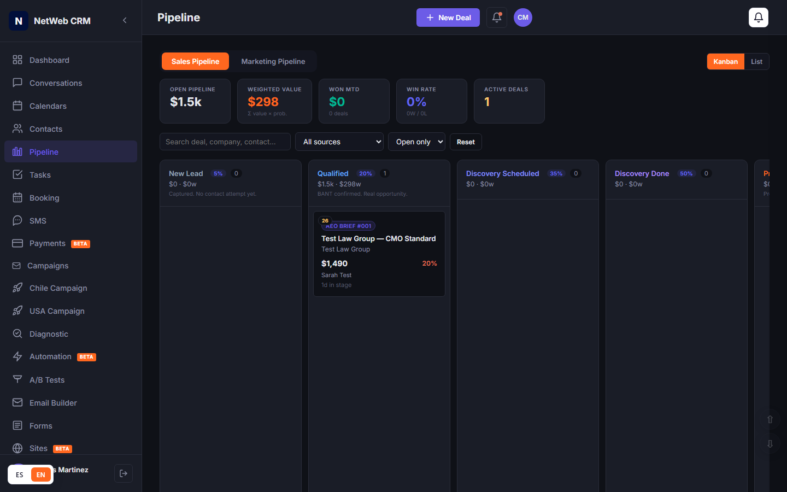

- **Trigger:** First human reply (any channel)
- **Owner:** Carlos
- **What counts:** Reply within 24h + at least 1 BANT signal
- **Activity:** Sarah replied to welcome-1 in 26 min + WhatsApp 14 min later

## Stage 3 — Discovery Scheduled

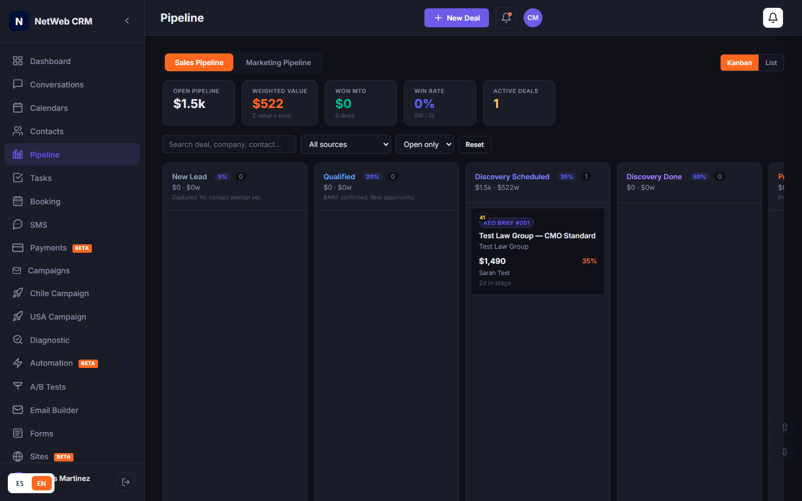

- **Trigger:** Calendar invite accepted
- **Owner:** Carlos
- **Tool:** Booking module + Calendly link via WhatsApp
- **Action:** Pre-call brief auto-generated at T-30min

## Stage 4 — Discovery Done


- **Trigger:** Call concluded + notes saved
- **Owner:** Carlos (with AI Copilot for transcription)
- **Output:** 3 pain points captured for Test Law Group
  1. Intake latency (4–6h vs. 5-min winning threshold)
  2. AEO discoverability (not in top-10 ChatGPT citations)
  3. Ad-hoc referral nurture (no quarterly touchpoints)

## Stage 5 — Proposal Sent

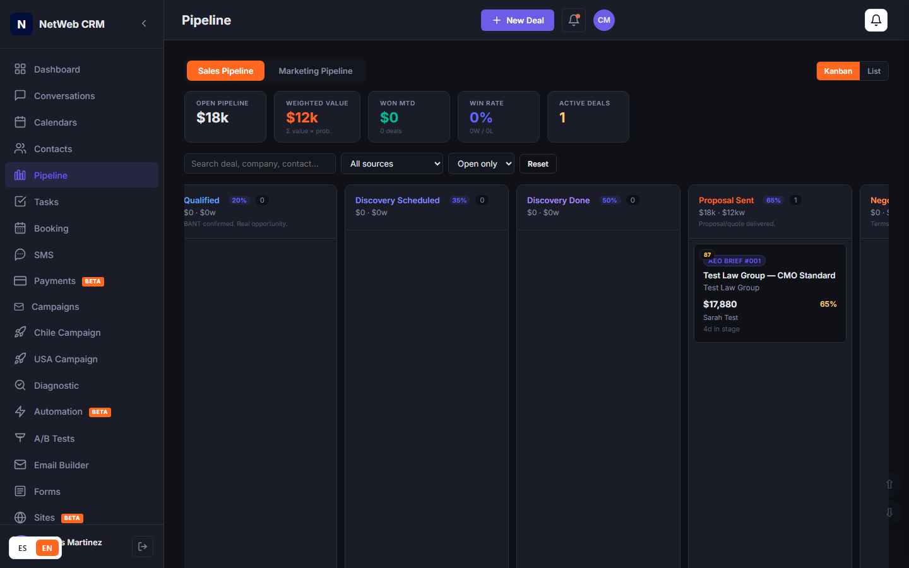

- **Trigger:** Proposal document attached to deal + emailed
- **Owner:** Carlos
- **Time:** 15 min (mostly templated)
- **Tool:** Documents module, proposal template
- **Engagement:** Sarah opened 2h after send · 8 min on page · returned to Pricing 3×
- **Artifact:** Proposal CMO-2026-0042 (see below)

## Stage 6 — Negotiation


- **Trigger:** Reply to proposal with a question
- **Owner:** Carlos
- **This deal's question:** "Can we start month-to-month and switch to annual at month 4?"
- **Answer:** Yes — revised engagement letter sent in 23 min

## Stage 7 — Won

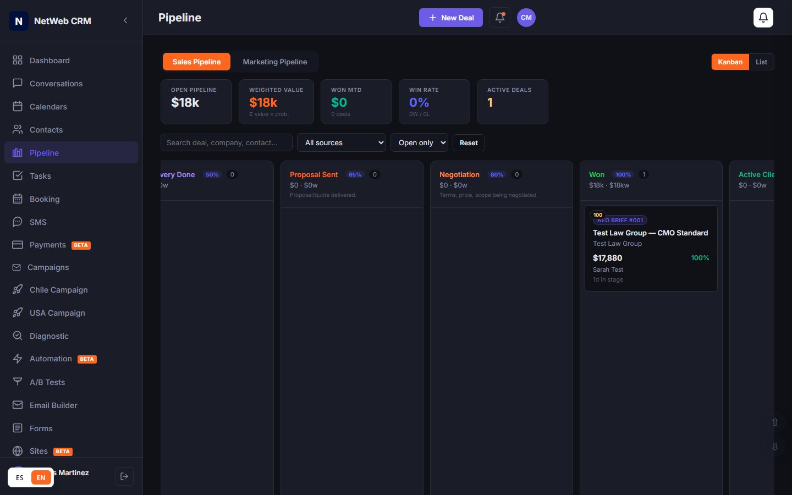

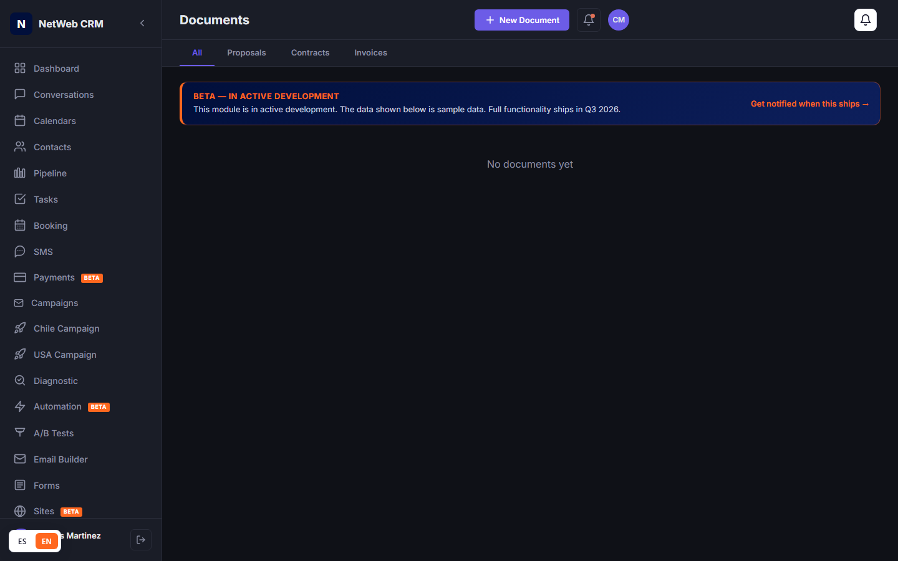

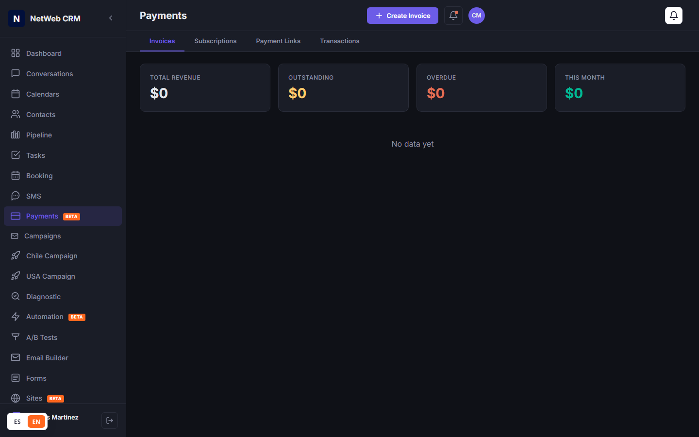

- **Trigger:** DocuSign signature + Stripe charge success
- **Time:** 0 — fully automated
- **Artifacts created:** Engagement Letter (signed) · NDA (signed) · Invoice $1,498 (paid) · Subscription $999/mo (active)
- **KPI strip flips:** Open Pipeline $12k · Active Deals 1

## Stage 8 — Active Client


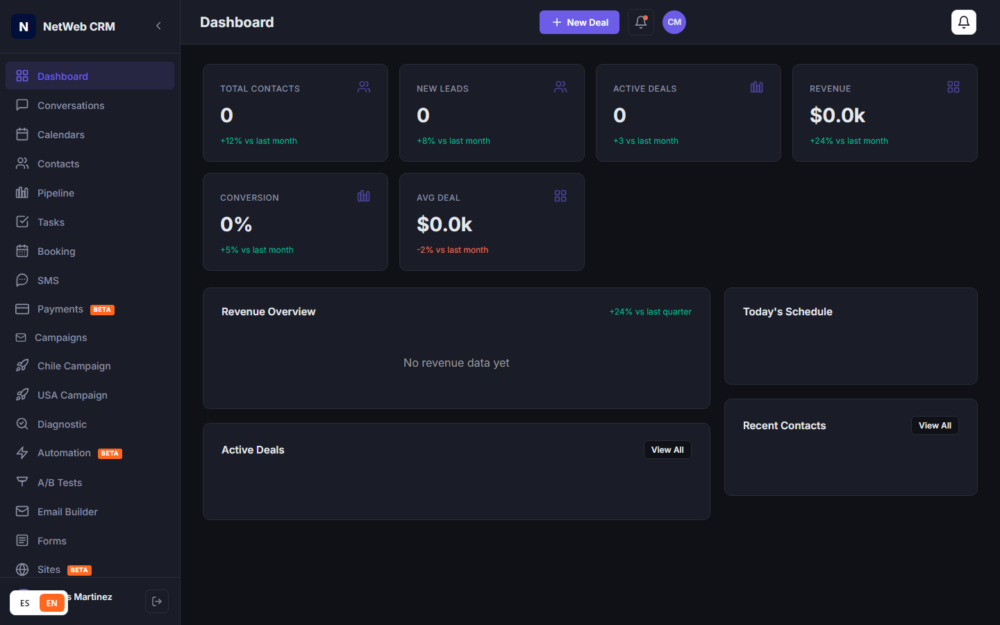

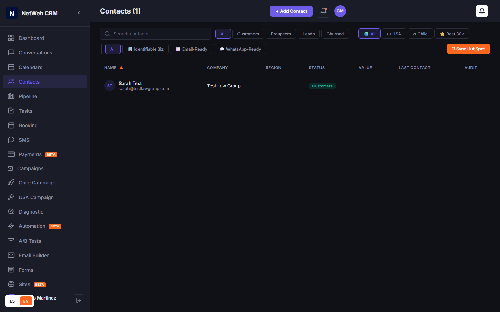

### Won → kickoff workflow · 6 auto-created tasks

| When | Owner | Task |
|---|---|---|
| +0 min | customer-success | Welcome email + kickoff call invite (Wed 10am PT) |
| +15 min | engineering-lead | Provision NWM CRM sub-account, niche=law_firms, owner role to Sarah |
| Day 1 | cmo (agent) | AEO baseline audit · 5 practice-area queries across ChatGPT/Claude/Perplexity |
| Day 2 | engineering-lead | Build 5-min intake automation (form → SMS → consultation booking) |
| Day 5 | content-strategist | Deliver content piece #1 (anchor practice-area pillar) for review |
| Day 28 | customer-success | 30-day Founding Client check-in · confirm guarantee met |

---

## Artifacts every CMO Growth sale generates

### Artifact 1 — Proposal CMO-2026-0042

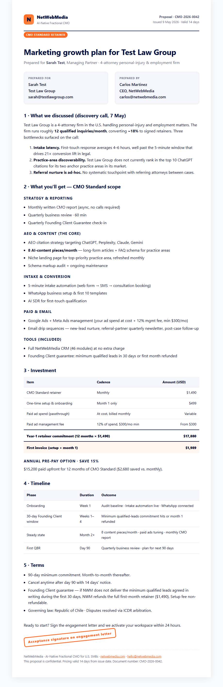

4-page proposal. Pulls discovery-call pain points into "What we discussed." Locks pricing and Founding Client guarantee. Source: [`artifacts/proposal.html`](./artifacts/proposal.html).

### Artifact 2 — Engagement Letter ENG-2026-0042

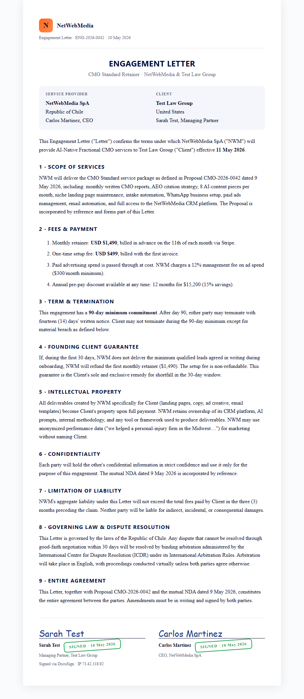

9 sections · mutually signed via DocuSign · governing law = Republic of Chile · ICDR arbitration. Source: [`artifacts/engagement-letter.html`](./artifacts/engagement-letter.html).

### Artifact 3 — Invoice NWM-2026-0042

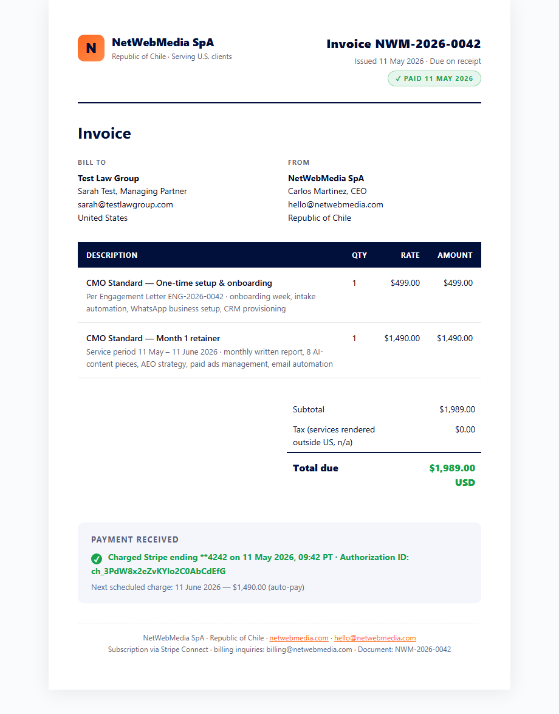

Issued same minute engagement letter is signed · $1,498 · Stripe Connect · subscription SUB-NWM-0042 ($999/mo) active. Source: [`artifacts/invoice.html`](./artifacts/invoice.html).

---

## Ownership matrix

| Stage | Owner | SLA | Time | Tool | Artifact |
|---|---|---|---|---|---|
| 1 New Lead | System | welcome-1 in 2 min | 0 | Workflow engine | Contact + Deal |
| 2 Qualified | Carlos | Reply < 1h | 5 min | Conversations / WhatsApp | — |
| 3 Discovery Sched | Carlos | Calendly in 30 min | 2 min | Booking / Calendly | Calendar invite |
| 4 Discovery Done | Carlos | Pain pts in 24h | 42 min | AI Copilot · Notes | Discovery notes |
| 5 Proposal Sent | Carlos | Send < 48h after disco | 15 min | Documents | Proposal PDF |
| 6 Negotiation | Carlos | Reply < 4h | 20–30 min | Email Builder | Revised eng. letter |
| 7 Won | System + Carlos | Charge on signature | 0 | Stripe + Documents | Eng. letter + NDA + Invoice + Subscription |
| 8 Active Client | PM → CS | Kickoff < 7 days | Week 1 onboarding | Tasks + Automation | 6 onboarding tasks |

## Roles, in order of involvement

| Role | Where they take over | What they own |
|---|---|---|
| Carlos (CEO) | Stages 2–6 | Discovery, proposal, close |
| sales-director (agent) | Stage 1 triage | Lead scoring, batch outbound, pre-call brief |
| engineering-lead | Stage 8 day 1–2 | Sub-account provision, intake automation |
| cmo (agent) | Stage 8 day 1+ | AEO baseline, content strategy, paid ads setup |
| content-strategist | Stage 8 day 5+ | 8 content pieces/month |
| project-manager | Stage 8 entire | 6 onboarding tasks, timeline |
| customer-success | Stage 8 day 28+ | 30-day check-in, QBR, renewal |
| finance-controller | Stage 7+ | Invoicing, AR, refund handling |

## Failure modes & escalation

| Failure | Trigger | Action |
|---|---|---|
| Lead goes cold (1→2 stall) | No reply 7 days after welcome-1 | re_engagement sequence fires automatically; stays in Stage 1 |
| Discovery no-show | Calendar event passes without join | Auto-DM + reschedule; 2nd no-show = closed-lost |
| Proposal goes silent (5→6 stall) | No reply 5 days after proposal | Carlos personal follow-up; 14 days silent = closed-lost, contact to nurture |
| Negotiation deadlock | Same objection raised 3× | Offer Founding Client guarantee; if still no, decline gracefully |
| Payment fails at close | Stripe declines on Won fire | Workflow pauses, finance-controller notified, 24h retry; still failing = revert to Negotiation |
| Founding Client guarantee triggers | 30-day check-in shows leads < commitment | customer-success initiates month-1 refund (setup fee non-refundable) |

---

## How to regenerate

```bash
# Terminal 1
npx http-server . -p 8083 -c-1

# Terminal 2
node docs/sales-management-simulation/capture.js            # 12 CRM screens
node docs/sales-management-simulation/render-artifacts.js   # 3 artifact previews
start docs/sales-management-simulation/index.html           # open the playbook
```

---

*Generated 2026-05-11 · Buyer: Sarah Test (sarah@testlawgroup.com) · Test Law Group · CMO Growth · $11,988 year-1 · Owner: Carlos Martinez*
