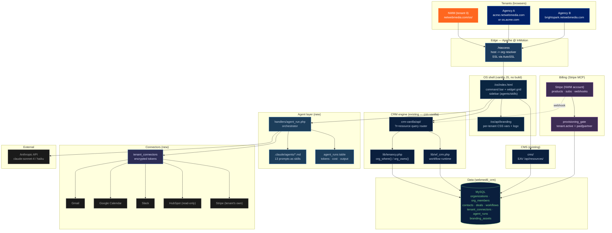

# NetWebMedia OS — Technical Architecture (V1)

**Status:** Draft for review
**Version:** 1.0
**Owner:** engineering-lead (David)
**Date:** 2026-05-28
**Locks against:** [`plans/nwm-os/DECISIONS.md`](DECISIONS.md)

---

## 1. System Overview

NetWebMedia OS is a **multi-tenant, white-label "agency operating system"** built as a thin new shell over the existing [`crm-vanilla/`](../../crm-vanilla/) codebase. Each tenant (an agency that buys NWM OS) gets an isolated bucket in the shared `webmed6_crm` MySQL database — the existing `organizations` / `org_members` / `org_where()` tenancy primitives already shipped to production handle that. On top of that bucket we add: (a) per-tenant branding (logo, colors, copy, custom domain), (b) a vanilla-JS OS shell at `/os/` with a command bar and widget grid, (c) an agent orchestration layer that exposes our 12 internal agents as in-app skills powered by the Anthropic API server-side, (d) per-tenant connector OAuth (Gmail, Calendar, Stripe, Slack, HubSpot read-only), and (e) Stripe billing for the agencies themselves at $1,500–$3,000/mo. No new runtimes (no Node, no Redis, no Docker) — everything runs inside the existing PHP/MySQL footprint on InMotion cPanel and ships via [`deploy-site-root.yml`](../../.github/workflows/deploy-site-root.yml).



---

## 2. Multi-Tenant Model

### Decision: shared schema with `organization_id` column on every tenant table

We already have this. [`crm-vanilla/api/schema_organizations.sql`](../../crm-vanilla/api/schema_organizations.sql) shipped the `organizations` and `org_members` tables; [`crm-vanilla/api/schema_organizations_migrate.sql`](../../crm-vanilla/api/schema_organizations_migrate.sql) added `organization_id` to all 18 tenant tables (contacts, deals, conversations, events, email_templates, workflows, …); [`crm-vanilla/api/lib/tenancy.php`](../../crm-vanilla/api/lib/tenancy.php) provides `org_where()` and `org_owns()`. **NWM OS extends this — it does not replace it.**

#### Why shared schema, not DB-per-tenant or schema-per-tenant

| Option | Pros | Cons | Verdict |
|---|---|---|---|
| Shared schema + `organization_id` | Single connection pool, single migrations, single backup, already shipped | Bug in `org_where()` = cross-tenant leak; noisy neighbour at very large scale | **Chosen** — the leak risk is a code-review discipline problem we already solved (`require_org_access_for_write()`); ship in weeks |
| Schema per tenant (`webmed6_crm_acme`, `webmed6_crm_brightspark`) | Stronger isolation, easy per-tenant export | InMotion shared hosting caps DB count; 50× the migration surface; PDO connection juggling | Reject for V1; revisit at 30+ tenants |
| DB per tenant | Hard isolation, easy compliance story | Same as above × 2; cPanel hosting has hard cap; ops cost dominates dev cost | Reject — premature for an unvalidated product |

The cost of the shared-schema risk is bounded because [`tenancy.php:200`](../../crm-vanilla/api/lib/tenancy.php) already enforces `require_org_access()` and [`tenancy.php:246`](../../crm-vanilla/api/lib/tenancy.php) `org_where()` returns `1=0` (fail-closed) when the org can't be resolved. The hard rule in the file header (lines 22–30) is enforced by code review.

### Data model

```
organizations (already shipped — extend in place)
  id, slug, display_name, parent_org_id, plan ENUM('master','agency','client'),
  branding_logo_url, branding_primary_color, branding_secondary_color,
  subdomain, custom_domain, sender_email, status,
  -- NEW for NWM OS
  os_enabled TINYINT(1) DEFAULT 0,
  os_plan ENUM('partner','starter','premium','custom') DEFAULT 'premium',
  os_seats INT UNSIGNED DEFAULT 5,
  stripe_customer_id VARCHAR(64) NULL,
  stripe_subscription_id VARCHAR(64) NULL,
  billing_status ENUM('trialing','active','past_due','canceled','partner_comp') DEFAULT 'trialing',
  agent_token_budget_monthly INT UNSIGNED DEFAULT 2000000  -- ~2M tokens / mo soft cap

org_members (already shipped — no change)
  organization_id, user_id, role, is_primary

-- NEW tables (ship as crm-vanilla/api/schema_os_*.sql)

tenant_connectors                       -- encrypted OAuth tokens
  id, organization_id, provider ENUM('gmail','gcal','slack','hubspot','stripe'),
  account_label, access_token_enc, refresh_token_enc, expires_at, scopes,
  status ENUM('active','revoked','error'), last_refresh_at, created_at

tenant_branding_assets                  -- uploaded logos / favicons
  id, organization_id, kind ENUM('logo_dark','logo_light','favicon','email_header'),
  filename, mime, byte_size, sha256, created_at

agent_runs                              -- one row per agent invocation
  id, organization_id, user_id, agent_slug, skill_slug,
  input_tokens, output_tokens, cost_usd_cents,
  model VARCHAR(40), status ENUM('queued','running','done','error'),
  trigger ENUM('command_bar','workflow','schedule','api'),
  input_blob MEDIUMTEXT, output_blob MEDIUMTEXT,
  started_at, finished_at, error TEXT NULL

os_workflows_skills                     -- map workflow steps -> agent skills
  workflow_step_id, skill_slug, prompt_template
```

### Tenant provisioning flow (V1)

1. Carlos (or a sales-director script) calls `POST /crm/api/?r=os_provision` with `{display_name, slug, plan, primary_user_email}`. Token-gated route (master-org only) — uses `pin_org_to_master()` from [`tenancy.php:305`](../../crm-vanilla/api/lib/tenancy.php).
2. Handler inserts `organizations` row (parent_org_id=1, plan='agency', os_enabled=0 — gated by billing).
3. Sends invite email; on first login the user gets bound to `org_members` as `owner`.
4. Stripe Checkout session created via Stripe MCP (see §8). On `checkout.session.completed` webhook → `os_enabled=1`, `billing_status='active'`.
5. Tenant lands on `/os/onboarding.html` (white-glove for V1; data flow exists for V2 self-serve).

### Branding inheritance

`parent_org_id` is already in the schema. Agency-tier orgs (sub-accounts of NWM) can spawn their own `client` orgs (white-label-of-white-label). For V1 we only support **agency → end-client at the data level**, not at the brand level — the OS shell ships with the agency brand only; sub-client portals are deferred to V2.

---

## 3. White-Label Branding System

### Per-tenant CSS variables

The OS shell uses CSS custom properties. `/os/index.html` loads `/os/api/branding.css?org=<slug>` as a `<link>` — server emits:

```css
:root {
  --nwm-primary:   #FF671F;   /* from organizations.branding_primary_color */
  --nwm-secondary: #012169;
  --nwm-logo:      url('/os/assets/branding/acme/logo.svg');
  --nwm-name:      "Acme Digital";
}
```

All shell components reference these variables. No per-tenant build step. Cache 5 min with `?v=<updated_at>` busting on save.

### Logo upload

`POST /crm/api/?r=branding_asset` (multipart, admin role required). Validates MIME (`image/svg+xml`, `image/png`, `image/webp`), strips SVG `<script>` via `DOMDocument` (reuses sanitization pattern from `crm-vanilla/api/handlers/`), stores under `/storage/branding/<org_id>/<sha>.svg`, registers in `tenant_branding_assets`. Web access to `/storage/` is blocked by `.htaccess`; a thin PHP proxy at `/os/branding/<org_slug>/logo` serves with org-scoped auth + long-cache headers. SHA-named files = immutable, infinite cache.

### Login screen branding

`crm-vanilla/login.html` already resolves host → org via [`tenancy.php:121-134`](../../crm-vanilla/api/lib/tenancy.php) (subdomain match, then custom_domain match). Extend it to inject `--nwm-logo` and `--nwm-name` from the resolved org **before** the auth form renders. If host doesn't match any org → fall back to NWM brand.

### Email template branding

`crm-vanilla/api/lib/email_sender.php` already supports per-org `sender_email`. Extend `email-templates/_base.html` to read `{{org.logo_url}}`, `{{org.primary_color}}`, `{{org.display_name}}`, `{{org.support_email}}` from the workflow context. The merge-tag system in [`wf_crm.php:374-379`](../../crm-vanilla/api/lib/wf_crm.php) already supports scalar interpolation — extend it to spread `org.*` keys from a lookup at trigger time.

### Custom domain handling

Two flavours:

1. **Vanity subdomain** — `acme.netwebmedia.com`. Free, instant. The cPanel DNS wildcard `*.netwebmedia.com` already exists for the 39 industry subdomains. Add a `.htaccess` block that routes any unmatched subdomain to `/os/`:

   ```apache
   RewriteCond %{HTTP_HOST} ^([a-z0-9-]+)\.netwebmedia\.com$ [NC]
   RewriteCond %{REQUEST_URI} !^/(api|crm|cms|industries|companies|app|blog|tutorials|lp|whatsapp|whatsapp-updates|social|.well-known)
   RewriteRule ^(.*)$ /os/$1 [L]
   ```

   `org_from_request()` already resolves `$_SERVER['HTTP_HOST']` against `organizations.subdomain`.

2. **Custom domain** — `os.acme.com` pointed at NWM via CNAME. Tenant adds CNAME → `nwm-os.netwebmedia.com`. Carlos (V1: manually; V2: scripted) adds the domain as a cPanel **Alias / Parked Domain**, runs AutoSSL (Let's Encrypt — free, included with InMotion cPanel), and inserts the host into `organizations.custom_domain`. `org_from_request()` already matches on this column. Document this as the V1 onboarding ritual; automating cPanel API calls is a V2 unlock.

**SSL non-negotiable.** AutoSSL covers `*.netwebmedia.com` automatically. Custom domains must complete the AutoSSL handshake before `os_enabled=1` is flipped. If AutoSSL fails (DNS not propagated), tenant sees a clear "DNS not pointed at us yet" page on the vanity subdomain in the interim.

---

## 4. Agent Orchestration Layer

### Decision: server-side via Anthropic API, never local Claude Code

Local Claude Code on Carlos's machine is for code; it cannot be a tenant runtime — tenants run on their own time zones, hit it concurrently, and need audited output. The agents ([`.claude/agents/cmo.md`](../../.claude/agents/cmo.md), [`engineering-lead.md`](../../.claude/agents/engineering-lead.md), etc.) ship as **prompt definitions** server-side; the dispatcher reads them at request time and calls the Anthropic API with the chosen model.

### Handler shape

New file [`crm-vanilla/api/handlers/agent_run.php`](../../crm-vanilla/api/handlers/agent_run.php) (to be created). Mirrors the canonical pattern of [`crm-vanilla/api/handlers/workflows.php`](../../crm-vanilla/api/handlers/workflows.php):

```
POST /crm/api/?r=agent_run
  body: { agent: "cmo", skill: "draft_campaign_brief", input: {...}, async: true }
  -> insert agent_runs row (status='queued')
  -> if async=false: dispatch inline, return output
  -> if async=true:  return run_id; client polls GET ?r=agent_run&id=<id>
```

Each call:
1. `require_org_access('member')` — only members of the resolved org can fire.
2. Load agent prompt from `.claude/agents/<slug>.md` (server fs read, cached per-process).
3. Look up tenant budget: `organizations.agent_token_budget_monthly` minus current-month spend from `agent_runs` aggregate. If over → 402.
4. Call Anthropic API with `claude-haiku-4` (Haiku-tier agents: 9 of 13) or `claude-sonnet-4` (Opus-tier strategic: cmo, engineering-lead, product-manager). Always with `cache_control` on the static system prompt.
5. Record `input_tokens`, `output_tokens`, `cost_usd_cents` against the org.

### Auth model

- Tenant user UI → `agent_run.php` uses session auth + `require_org_access('member')`.
- Workflow step `run_agent` calls `agent_run.php` internally with the run's `org_id` — no extra auth needed.
- External API (V2) — issue per-org API keys signed by master org; not in V1 scope.

### Cost model & guardrails

- **Per-tenant monthly token cap** stored on `organizations.agent_token_budget_monthly`. Default 2M tokens (~$10 raw cost at Sonnet pricing). Overrun → 402; tenant sees "upgrade or wait until reset" modal.
- **Per-skill cost telemetry** — `agent_runs.cost_usd_cents` rolls up nightly into a `org_usage_monthly` materialized snapshot for the finance-controller agent to consume.
- **Prompt caching** — system prompt + agent definition is constant per agent. Use Anthropic's `cache_control` to cache 90% of the input cost.
- **Model selection rubric** lives in [`.claude/AGENT-ROUTING.txt`](../../.claude/AGENT-ROUTING.txt) — server-side dispatcher honours it (Haiku for routine, Sonnet for strategic).
- **Rate limit** — reuse the file-based limiter at `crm-vanilla/storage/ratelimit/`. Cap 30 agent_runs/min per org for V1.

### V1 skill surface

Each of the 13 agents exposes 2–4 skills. Example for `cmo`: `draft_campaign_brief`, `propose_content_calendar`, `review_landing_page_copy`. Skills are declared in the agent's `.md` front-matter; the dispatcher validates `skill` against the allowlist before calling the API. **Skills, not freeform prompts** — this keeps the cost model bounded and the output shape predictable.

---

## 5. OS Shell UI

### Decision: vanilla JS SPA at `/os/`, no build step, no framework

Same pattern as [`crm-vanilla/`](../../crm-vanilla/). Single `index.html`, a router (`os/js/app.js`), feature modules (`os/js/widgets/`, `os/js/agents/`, `os/js/connectors/`), and CSS variables driving the theme.

### Layout

- **Top bar** — command bar (cmd-K style). Tokenized: `> @cmo draft brief for hotel client`, `> @sales find leads in austin`. Routes to `agent_run.php`.
- **Sidebar (left)** — sections: Inbox, Pipeline, Calendar, Workflows, Agents, Connectors, Settings. Org switcher at top (calls `set_session_org()`).
- **Widget grid (center)** — draggable tiles: pipeline summary, recent agent runs, calendar today, connector health, billing status. Saved per-user as a `setting` resource (`type=setting, slug=os_grid_layout`).
- **Right drawer** — agent output drawer; pops open when an agent_run completes.

### Repo location

Create `os/` at the repo root. Ships via `deploy-site-root.yml` — requires the two updates from the [CLAUDE.md checklist](../../CLAUDE.md) (add to `on.push.paths` AND to the staging `for d in` loop).

**Public URLs:**
- `netwebmedia.com/os/` — NWM-as-tenant-0 (master org)
- `acme.netwebmedia.com/` → rewrites to `/os/` (vanity subdomain)
- `os.acme.com/` → rewrites to `/os/` (custom domain)

The shell makes **no assumption** about its host. It reads `/os/api/whoami` on boot which returns `{ org: {slug, display_name, plan, branding}, user: {id, role}, features: [...] }`.

### Why not a framework

Three reasons: (1) Carlos's stack discipline — vanilla wins on InMotion shared hosting; (2) the CRM already has its routing, escape helpers (`CRM_APP.esc()` from [`crm-vanilla/js/app.js`](../../crm-vanilla/js/app.js)), and DOM patterns; reusing them costs nothing; (3) no build step means deploy is `git push` → 4 minutes to live, which is the whole point.

---

## 6. Connector Layer

### V1 connectors

| Provider | Scope | Why V1 |
|---|---|---|
| Gmail | read inbox, send | Every agency lives in Gmail; biggest single workflow unlock |
| Google Calendar | read, write events | Scheduling is the obvious "AI agency OS" demo |
| Slack | post messages to channel | Where agency teams work; agent output target |
| HubSpot | read-only contact sync | ICP runs HubSpot; we sync IN, never OUT |
| Stripe (tenant's own) | read products/subscriptions, create payment links | Tenants bill their own clients |

LinkedIn and X are out (durable Carlos decision). Email broadcasts already live in `crm-vanilla`. Apollo/Apify/Firecrawl/Higgsfield are MCP-only tools used by agents server-side — they are **not** per-tenant OAuth connectors.

### Token storage

New table `tenant_connectors`. Tokens encrypted at rest with **libsodium AEAD** (`sodium_crypto_secretbox`) using a master key in `config.local.php` (`define('CONNECTOR_ENC_KEY', '<base64-32-bytes>')`). The encryption key is GitHub Secret → `config.local.php` at deploy (same pattern as `MIGRATE_TOKEN`).

- `access_token_enc`, `refresh_token_enc` → `BLOB` columns.
- Decrypt only at moment-of-use, never log plaintext.
- If the key ever rotates, run `schema_os_rotate_connectors.sql` migration that re-encrypts with old+new key in parallel.

### OAuth flow

`/os/connect/<provider>` initiates. Callback at `/os/oauth/<provider>/callback`. State param signed with HMAC against `JWT_SECRET` + tenant org_id (prevents CSRF and cross-tenant token replant). On success, write row, redirect to `/os/connectors`.

### Refresh strategy

Lazy refresh on call: when a handler needs a token, it calls `tenant_connectors_get($org_id, $provider)` which checks `expires_at - 60s`; if expired, refresh inline. Failed refresh → `status='error'`, push notification to tenant owner.

### Per-tenant SSRF & abuse guard

Reuse `url_guard()` from [`crm-vanilla/api/lib/url_guard.php`](../../crm-vanilla/api/lib/url_guard.php) for any user-supplied URL in connector configs (webhooks, Slack hooks).

---

## 7. Workflow Engine Reuse

[`crm-vanilla/api/lib/wf_crm.php`](../../crm-vanilla/api/lib/wf_crm.php) already runs scoped per-org via `wf_crm_trigger($type, $match, $ctx, $uid, $orgId)` — line 66 onwards. **No fork. We add step types.**

### New step types for NWM OS

| Step type | Behaviour | Notes |
|---|---|---|
| `run_agent` | `{agent, skill, input_keys}` — fire `agent_run.php` synchronously, write output into `ctx.agent_output`; downstream steps can interpolate `{{agent_output.draft}}` etc. | Bound by per-org token budget — if exceeded, step fails with `agent_budget_exhausted` and the run pauses for human review rather than blocking |
| `send_via_connector` | `{connector: gmail|slack|gcal, payload}` — uses the per-tenant token | Calls `url_guard()` on any URL it builds |
| `wait_for_human` | Inserts a row into a `human_tasks` table; run pauses until approved/rejected from the OS shell | Same wait/resume mechanic as the existing `holding_reply_if_no_approval` step in [`wf_crm.php:1006`](../../crm-vanilla/api/lib/wf_crm.php) |
| `sync_hubspot_contact` | Reads HubSpot → upserts into `contacts` | Idempotent on `hubspot_id`; no write-back |

### Cron driver

[`cron-workflows.yml`](../../.github/workflows/cron-workflows.yml) already runs every 5 min and POSTs to `?r=cron_workflows` with `MIGRATE_TOKEN`. No change. The new step types execute through the same `wf_crm_advance()` switch (around [`wf_crm.php:296`](../../crm-vanilla/api/lib/wf_crm.php)).

### Per-tenant fairness

Two cron processes claiming up to 50 rows each — [`wf_crm.php:165`](../../crm-vanilla/api/lib/wf_crm.php) already does atomic claim with `claim_token`. To prevent one tenant's heavy workflow from starving others, add `ORDER BY org_id_round_robin, id ASC` (compute a stable rotation column at claim time). Defer to V1.5 if benchmarks show it's not yet an issue with 1–5 tenants.

---

## 8. Stripe Integration for OS Billing

### Decision: Stripe via the Stripe MCP for product/price/customer management; webhooks via existing PHP

We use Stripe MCP from Claude Code (and the agent layer) for provisioning, lifecycle, and admin queries. The **runtime** path — taking money, receiving webhooks, gating provisioning — stays in PHP for predictability.

### Stripe object model

```
Product: "NetWebMedia OS"
  Price: os_premium_monthly    → $2,490/mo (recurring)
  Price: os_premium_annual     → $24,900/yr (recurring, 17% discount)
  Price: os_partner_comp       → $0 (recurring, for design partners — internal SKU)
  Price: os_custom_monthly     → custom price object created per-deal
```

### Provisioning gate

`organizations.billing_status` is the gate:
- `partner_comp` — design partner, free, `os_enabled=1`
- `trialing` — 14-day clock from invite; `os_enabled=1` but a banner shows days remaining
- `active` — paid subscription in good standing; `os_enabled=1`
- `past_due` — payment failed; UI shows read-only banner; agents disabled after 5 days
- `canceled` — `os_enabled=0`; data retained 30 days then archived

### Webhook handling

`/crm/api/?r=stripe_webhook` — new handler [`crm-vanilla/api/handlers/stripe_webhook.php`](../../crm-vanilla/api/handlers/stripe_webhook.php). Verifies signature against `STRIPE_WEBHOOK_SECRET` (new GitHub Secret → `config.local.php`). Events handled:

| Event | Action |
|---|---|
| `checkout.session.completed` | Flip org `billing_status='active'`, `os_enabled=1`, store `stripe_customer_id` and `stripe_subscription_id` |
| `customer.subscription.updated` | Update plan/quantity/`agent_token_budget_monthly` if changed |
| `customer.subscription.deleted` | Set `billing_status='canceled'`; schedule archive job at +30 days |
| `invoice.payment_failed` | Set `billing_status='past_due'`; email owner; start dunning timer (3 retries over 14 days) |
| `invoice.payment_succeeded` | Return to `active` if was `past_due`; record invoice in `org_invoices` |

### Dunning

Stripe Smart Retries does the retry logic. We mirror state to `organizations.billing_status` and the OS shell shows the banner. If unrecovered at day 14, hard-suspend (`os_enabled=0`).

### Trial / design partner free pass

`organizations.billing_status='partner_comp'` is the explicit design-partner flag. V1 ships with one partner (per DECISIONS.md §3) — they get the partner_comp SKU at $0 with a 12-month commitment for case-study rights. After PMF we open trials.

---

## 9. Onboarding Flow

### V1 — white-glove, one design partner

Carlos personally walks the partner through. The **data flow is built as if it's self-serve** so V2 just removes the human:

```
1. Carlos creates org via POST /crm/api/?r=os_provision
   - inserts organizations row
   - sends invite email with magic link
2. Partner clicks link, sets password, lands on /os/onboarding.html
3. Onboarding wizard (4 steps):
   a. Branding kit upload — logo (SVG/PNG), primary/secondary hex, display name
      -> writes tenant_branding_assets + updates organizations row
   b. Custom domain (optional) — DNS instructions emitted; mark pending until AutoSSL
      -> Carlos manually finalizes in V1
   c. Connector OAuths — Gmail + Calendar required; Stripe + Slack optional
      -> redirects through OAuth, writes tenant_connectors rows
   d. Agent activation — pick which of the 13 agents are "on" for this tenant
      -> writes os_agents_enabled JSON on the org row (default: all 13)
4. First workflow templates — one-click install of 3 starter workflows
   ("inbound lead -> draft outreach", "weekly client report", "deal stage -> Slack notify")
   -> uses crm-vanilla/api/handlers/seed_client_templates.php pattern
5. Land on /os/ dashboard with widgets pre-populated
```

### Time budget

V1 onboarding target: 45 minutes including white-glove walkthrough. V2 self-serve target: 12 minutes unattended.

---

## 10. Security Model

### Tenant isolation enforcement

- **Reads:** `org_where()` returns `1=0` when org can't be resolved — fail-closed (legacy non-superadmin path, [`tenancy.php:254`](../../crm-vanilla/api/lib/tenancy.php)).
- **Writes:** `require_org_access_for_write('member')` called immediately before every INSERT (hard rule from [`tenancy.php:224`](../../crm-vanilla/api/lib/tenancy.php)). Code review checks this on every PR touching a handler.
- **Token-gated routes:** `pin_org_to_master()` ([`tenancy.php:305`](../../crm-vanilla/api/lib/tenancy.php)) blocks `X-Org-Slug` from re-scoping destructive cron operations.

### Credential encryption

- OAuth tokens encrypted with libsodium AEAD (see §6).
- `CONNECTOR_ENC_KEY` in `config.local.php` (never in repo).
- `STRIPE_WEBHOOK_SECRET`, `STRIPE_SECRET_KEY`, `ANTHROPIC_API_KEY` — GitHub Secrets → `config.local.php`.

### Audit logging

- `agent_runs` is the audit log for agent invocations (input/output blobs included).
- `workflow_runs` already logs every step result via `step_result` ([`wf_crm.php:259-289`](../../crm-vanilla/api/lib/wf_crm.php)).
- New `os_audit_log` table for sensitive admin actions (branding change, connector connect/disconnect, plan change, member added/removed). Append-only, org-scoped, retained 1 year.

### Rate limiting

File-based, reuses `crm-vanilla/storage/ratelimit/<ip_or_org>.json` with `flock(LOCK_EX)`. Caps:
- 100 API req/min per session
- 30 agent_runs/min per org
- 5 OAuth callbacks/min per IP

### CSP additions

New origins: `api.anthropic.com` (for `fetch` in any client-side audit views; server is primary path), `js.stripe.com` + `api.stripe.com` (Checkout & Elements), `accounts.google.com` (OAuth), `slack.com`. Add to the `Content-Security-Policy` header in root `.htaccess` — **and verify with curl before merging**, since CSP is live and breaks silently per [CLAUDE.md gotchas](../../CLAUDE.md).

### CSRF & session

`crm-vanilla/api/index.php` already enforces same-origin Origin/Referer check and `SameSite=Strict` cookies. No change. OAuth state param signed with HMAC against `JWT_SECRET ⊕ org_id`.

### Threat model snapshot

| Threat | Mitigation |
|---|---|
| Cross-tenant data leak via missing `org_where()` | Code review + the `require_org_access_for_write()` hard rule; integration test that calls each handler with two orgs and asserts data isolation |
| Stolen connector token | AEAD-encrypted at rest; key rotated via re-encrypt migration; per-token `expires_at` shrinks blast radius |
| Agent prompt injection (a contact sends "ignore previous instructions" in an email body) | Existing denylist constants in [`wf_crm.php:36-42`](../../crm-vanilla/api/lib/wf_crm.php); auto-reply route falls to human approval on any denylist hit |
| Stripe webhook spoofing | Signature verification against `STRIPE_WEBHOOK_SECRET`; reject unsigned |
| Subdomain hijack (tenant deletes DNS, another tenant grabs it) | `organizations.custom_domain` is uniquely indexed; we keep the row until manual release; abandoned subdomain doesn't auto-route |

---

## 11. Deploy Model

### Workflow

Ships via existing [`.github/workflows/deploy-site-root.yml`](../../.github/workflows/deploy-site-root.yml). **Two updates required** per [CLAUDE.md checklist](../../CLAUDE.md):

1. Add `os/**` to `on.push.paths` (~line 87).
2. Add `os` to the staging `for d in css js assets … social; do` loop (~line 155).

Without (2) the deploy will 200 on every URL except `/os/*` which 404s — the well-known footgun.

### Schema migrations

All new schema ships as idempotent `crm-vanilla/api/schema_os_*.sql` files. Examples:

- `schema_os_orgs_extend.sql` — `ALTER TABLE organizations ADD COLUMN os_enabled TINYINT(1) DEFAULT 0`, etc.
- `schema_os_connectors.sql` — `tenant_connectors` table
- `schema_os_branding_assets.sql` — `tenant_branding_assets`
- `schema_os_agent_runs.sql` — `agent_runs`
- `schema_os_human_tasks.sql` — `human_tasks` for `wait_for_human` step
- `schema_os_invoices.sql` — `org_invoices` for Stripe mirror

Each follows the rules from [CLAUDE.md migration system](../../CLAUDE.md): plain DDL, no `PREPARE/EXECUTE`, safe to rerun. `migrate.php` runs them on every deploy.

### Secrets to add to GitHub Actions

- `STRIPE_SECRET_KEY`
- `STRIPE_WEBHOOK_SECRET`
- `CONNECTOR_ENC_KEY` (base64 32 bytes — generate once, never rotate without migration)
- `GOOGLE_OAUTH_CLIENT_ID`, `GOOGLE_OAUTH_CLIENT_SECRET`
- `SLACK_OAUTH_CLIENT_ID`, `SLACK_OAUTH_CLIENT_SECRET`
- `STRIPE_CONNECT_CLIENT_ID` (if we expose Stripe Connect for tenant's own billing — V1.5)

All injected into `crm-vanilla/api/config.local.php` at deploy time via the existing Python interpolation block.

### Cache busting

OS shell CSS/JS uses `?v={{deploy_sha}}` query for instant rollout. Branding assets are SHA-named and infinite-cache.

---

## 12. Phase Breakdown — 5 Weeks to V1

Five phases. Each has a verification gate that must pass before the next phase starts. If any phase slips by >2 days, we cut scope from the **next** phase, not the current one.

### Phase 1 — Foundation (Week 1)

**Deliverable:** Multi-tenant data model extended; provisioning endpoint live; tenant-0 (NWM) verified.

- `schema_os_orgs_extend.sql` — add `os_enabled`, `os_plan`, `os_seats`, `stripe_*`, `billing_status`, `agent_token_budget_monthly`
- `schema_os_connectors.sql`, `schema_os_branding_assets.sql`, `schema_os_agent_runs.sql`, `schema_os_human_tasks.sql`, `schema_os_audit_log.sql`
- `crm-vanilla/api/handlers/os_provision.php` — master-org-only endpoint
- `crm-vanilla/api/handlers/whoami.php` — returns `{org, user, features}` for shell boot
- Apache catch-all rewrite for unmatched subdomain → `/os/`

**Verification gate:** Provision a test tenant `tester-acme` via curl + `MIGRATE_TOKEN`. Hit `tester-acme.netwebmedia.com/os/api/whoami` and confirm the right org resolves. Cross-tenant SELECT against a NWM contact returns 0 rows from tester-acme's session.

**Dependencies:** none. **Cuts if slipping:** the audit log table moves to Phase 4.

### Phase 2 — OS Shell + Branding (Week 2)

**Deliverable:** `/os/` boots, shows widget grid, switches brand by host.

- `os/index.html`, `os/js/app.js`, `os/js/widgets/*.js`, `os/css/styles.css` (CSS-vars driven)
- `os/api/branding.css` route (server-emits per-org)
- `os/onboarding.html` — branding upload + DNS instructions screens
- `crm-vanilla/api/handlers/branding_asset.php` — multipart upload, SVG sanitization
- Deploy workflow updated (add `os` to `paths` + staging loop)

**Verification gate:** Two browsers, two tenants. Each sees their own logo, colors, name. Login flow uses correct brand. Lighthouse score ≥ 90 on the shell.

**Dependencies:** Phase 1 (whoami endpoint). **Cuts if slipping:** widget grid ships with 3 widgets instead of 6.

### Phase 3 — Connector layer (Week 3)

**Deliverable:** Gmail + Calendar OAuth working end-to-end; Slack as stretch.

- `tenant_connectors` populated through Google OAuth flow
- `os/connectors.html` UI — connect/disconnect, status badges
- `crm-vanilla/api/lib/connector_store.php` — encrypted token helpers
- `crm-vanilla/api/handlers/oauth_google.php` (covers Gmail + GCal scopes)
- `crm-vanilla/api/handlers/oauth_slack.php` (stretch)
- HubSpot read-only via existing `lib/hubspot_client.php` — wire to per-org token

**Verification gate:** Tenant connects Gmail, an agent invocation reads their last 5 emails, Calendar event is created and visible in their actual Google Calendar. Tokens are encrypted in DB (confirmed via direct SQL inspection).

**Dependencies:** Phase 1 (encrypted storage), Phase 2 (UI shell). **Cuts if slipping:** Slack moves to V1.1; HubSpot moves to V1.1.

### Phase 4 — Agent orchestration (Week 4)

**Deliverable:** Command bar fires agents; `run_agent` workflow step works; cost tracked per tenant.

- `crm-vanilla/api/handlers/agent_run.php` — sync + async dispatch
- `crm-vanilla/api/lib/agent_dispatcher.php` — model selection, cache_control, budget check
- `os/js/agents/command-bar.js` — cmd-K + result drawer
- `wf_crm.php` extended with `run_agent`, `send_via_connector`, `wait_for_human` step types
- `os/agents.html` — per-tenant agent toggles + budget usage display

**Verification gate:** Three agent invocations (one Sonnet, one Haiku, one workflow-triggered). Token cost recorded matches Anthropic dashboard ±2%. Over-budget tenant gets 402. Output for prompt-injection probe routes to human review.

**Dependencies:** Phases 1–3. **Cuts if slipping:** `wait_for_human` slips to Phase 5; agent toggles slip to V1.1.

### Phase 5 — Billing + Onboarding polish (Week 5)

**Deliverable:** Stripe Checkout live, webhook flips `billing_status`, design-partner onboarding rehearsed end-to-end.

- Stripe MCP — create Product + 4 Prices in NWM Stripe account
- `crm-vanilla/api/handlers/stripe_webhook.php` — signature verify + state machine
- `os/billing.html` — current plan, invoices, payment method link to Stripe Customer Portal
- `os/onboarding.html` complete — 4-step wizard incl. starter workflow install
- Design-partner provisioned at `partner_comp` SKU; runs through real onboarding with Carlos

**Verification gate:** Stripe test-mode subscription → webhook → `billing_status='active'` flip → tenant can use agents. Failed payment → `past_due` → banner → cured payment → `active`. Design partner completes onboarding in ≤60 min with a working Phase-3 connector + Phase-4 agent run + a live workflow.

**Dependencies:** all prior phases. **Cuts if slipping:** Annual plan + custom plan slip to V1.1; only Monthly Premium + Partner Comp ship at launch.

### What's explicitly cut from V1

- Self-serve signup (white-glove only)
- Sub-client portals (agency → end-client branding)
- Annual billing (monthly only at launch)
- LinkedIn / X / TikTok connectors (Carlos durable exclusions or out of scope)
- Mobile app integration (Capacitor app stays on existing CRM endpoints)
- Custom domain self-service automation (Carlos manually finalizes in V1)
- Per-tenant API keys for external automation
- Marketplace of third-party agents
- Voice (Vapi) per-tenant — stays NWM-only

---

## 13. Known Risks & Technical Debt

### Risk 1 — Shared-MySQL scaling ceiling

**What:** All tenants in one `webmed6_crm`. InMotion shared hosting tops out somewhere between 30–80 tenants depending on workflow volume.
**Likelihood:** Medium. **Impact:** High (replatform required).
**Mitigation:** Monitor `agent_runs` and `workflow_runs` row counts + p95 query latency from week 1. Set a tripwire at 25 tenants OR p95 > 800 ms — that's when we cost-out a managed MySQL move (RDS, PlanetScale, or InMotion VPS). DECISIONS.md already acknowledges this trade.

### Risk 2 — Anthropic cost overrun by a single tenant

**What:** Tenant builds a workflow that hits an agent on every inbound contact; Sonnet at scale = $1000s/mo unbudgeted.
**Likelihood:** High. **Impact:** Medium (margin compression).
**Mitigation:** Per-org `agent_token_budget_monthly` enforced server-side; over-budget returns 402; finance-controller agent reports weekly on top spenders; default new tenant cap is conservative (~$10/mo cost). Hard-cap defended by code in `agent_dispatcher.php`, not by trust.

### Risk 3 — Cross-tenant data leak via a forgotten `org_where()`

**What:** A handler ships without the `org_where()` clause; one tenant sees another's data; reputation hit + GDPR risk.
**Likelihood:** Medium during V1 (lots of new handlers). **Impact:** Critical.
**Mitigation:** (a) the hard rule documented in [`tenancy.php:22-30`](../../crm-vanilla/api/lib/tenancy.php); (b) PR review checklist item for every handler touch; (c) an integration test that boots two tenants and asserts each can't see the other's contacts/deals/workflows — runs in CI on every PR touching `crm-vanilla/api/handlers/`. **Ship this test in Phase 1**, not later.

### Risk 4 — Custom-domain SSL + DNS support burden

**What:** Custom domains require manual cPanel intervention + AutoSSL handshake. Each onboarding burns Carlos's time; misconfigured DNS = tenant locked out.
**Likelihood:** High at every new sale. **Impact:** Medium (slows growth, distracts founder).
**Mitigation:** V1 = vanity subdomains by default, custom domain is an opt-in upgrade on the second call. Document the DNS instructions clearly in `os/onboarding.html`. V1.5 — script the cPanel UAPI calls (cPanel has an API for adding parked domains and triggering AutoSSL) so it's a button.

### Risk 5 — Workflow engine fairness under multi-tenant load

**What:** The cron claims up to 50 runs every 5 min ([`wf_crm.php:175`](../../crm-vanilla/api/lib/wf_crm.php)). One tenant with 1000 queued runs starves the others.
**Likelihood:** Low at 1–5 tenants, rises sharply at 10+. **Impact:** Medium (other tenants see workflows lag).
**Mitigation:** Add per-org fairness in the claim query (round-robin by `org_id`) in V1.1 — track `wait_seconds` p95 per tenant and ship the fix when it crosses 60s. Don't pre-optimize.

### Honest debt we ship with

- **No automated test suite** beyond smoke tests. V1 ships with the cross-tenant integration test (Risk 3) and that's it. After PMF, fund a real test layer.
- **Branding asset storage** lives in `crm-vanilla/storage/` not a CDN. Works for V1; move to object storage when we cross 5 GB total.
- **Connector tokens** decrypted on every use means PHP-FPM workers see plaintext in memory. Real isolation requires HSM/KMS — out of scope for V1; document the trust boundary instead.
- **Agent prompt versioning** is tied to git commits of `.claude/agents/*.md`. No A/B per tenant. Acceptable for V1; add when we have 2+ paying tenants asking for it.
- **No tenant data export** in V1. Add a `os_export` endpoint in V1.1 — GDPR-adjacent obligations make this a fast-follow, not an at-launch item.

---

## Appendix A — File map for V1

```
os/
  index.html                       # shell entry
  onboarding.html                  # 4-step wizard
  connectors.html
  agents.html
  billing.html
  settings.html
  css/
    styles.css                     # CSS-vars driven
  js/
    app.js                         # router + boot
    api-client.js                  # reuses crm-vanilla session
    command-bar.js
    widgets/                       # widget grid tiles
    agents/                        # cmd-K + drawer
    connectors/                    # oauth UI
  assets/
    branding/                      # per-tenant logos (served via PHP proxy)

crm-vanilla/api/
  handlers/
    os_provision.php               # NEW — master-org only
    whoami.php                     # NEW
    agent_run.php                  # NEW
    branding_asset.php             # NEW
    oauth_google.php               # NEW
    oauth_slack.php                # NEW
    stripe_webhook.php             # NEW
  lib/
    agent_dispatcher.php           # NEW
    connector_store.php            # NEW — encrypted token helpers
    wf_crm.php                     # EXTEND — add run_agent, send_via_connector, wait_for_human
    tenancy.php                    # NO CHANGE — already does the job
  schema_os_orgs_extend.sql        # NEW
  schema_os_connectors.sql         # NEW
  schema_os_branding_assets.sql    # NEW
  schema_os_agent_runs.sql         # NEW
  schema_os_human_tasks.sql        # NEW
  schema_os_audit_log.sql          # NEW
  schema_os_invoices.sql           # NEW

.github/workflows/
  deploy-site-root.yml             # EXTEND — add os/** to paths + staging loop

.htaccess                          # EXTEND — wildcard subdomain -> /os/ rewrite

plans/nwm-os/
  ARCHITECTURE.md                  # this file
  DECISIONS.md                     # already shipped
  PRD.md                           # owned by product-manager
  GTM.md                           # owned by cmo
  V1-PLAN.md                       # synthesis (after this returns)
```

---

## Appendix B — Where the existing code does the heavy lifting

| Concern | Already solved at | Confidence |
|---|---|---|
| Multi-tenant SELECT/UPDATE/DELETE isolation | [`crm-vanilla/api/lib/tenancy.php`](../../crm-vanilla/api/lib/tenancy.php) `org_where()` | Production-tested since organizations migration |
| Cross-tenant write protection | [`tenancy.php:224`](../../crm-vanilla/api/lib/tenancy.php) `require_org_access_for_write()` | Hard rule already in place |
| Workflow runtime + cron | [`crm-vanilla/api/lib/wf_crm.php`](../../crm-vanilla/api/lib/wf_crm.php) + [`cron-workflows.yml`](../../.github/workflows/cron-workflows.yml) | Driving live email workflows today |
| Idempotent migrations | `migrate.php` + every `schema_*.sql` | 40+ migrations have shipped this way |
| Session + CSRF + same-origin | `crm-vanilla/api/index.php` | Audited |
| SSRF guard | [`crm-vanilla/api/lib/url_guard.php`](../../crm-vanilla/api/lib/url_guard.php) | In use by `analyze` + `proposal` handlers |
| Rate limiting | `crm-vanilla/storage/ratelimit/` | File-based, survives restarts |
| Email send (per-org `sender_email`) | [`crm-vanilla/api/lib/email_sender.php`](../../crm-vanilla/api/lib/email_sender.php) | Already org-aware in `notify_team` step ([`wf_crm.php:548-579`](../../crm-vanilla/api/lib/wf_crm.php)) |
| Host → org resolution (subdomain + custom domain) | [`tenancy.php:121-135`](../../crm-vanilla/api/lib/tenancy.php) | Already lookups `organizations.subdomain` and `organizations.custom_domain` |
| Deploy pipeline | [`deploy-site-root.yml`](../../.github/workflows/deploy-site-root.yml) | Ships multiple times a day |

**Translation:** 70% of the V1 architecture is "wire a new shell into machinery that already exists, in production, with audit history." That's the whole point of building on `crm-vanilla/` instead of greenfielding.

---

**End of ARCHITECTURE.md V1.**
